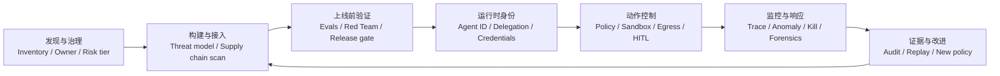

# Agent Security 赛道：保护对象、核心逻辑与价值链

> 生成时间：2026-07-21
> 查询：Agent 安全到底保护什么？为什么形成一个赛道？赛道的核心商业逻辑是什么？

## 摘要

**Agent 安全保护的不是一个抽象的“模型不作恶”，而是企业把行动权委托给概率模型之后，用户意图、身份、权限、数据、资金、生产系统和责任链条仍然可控。** Chatbot 的主要风险是“说错”；Agent 的风险是拿着合法 credential“做错”，而且可以跨系统、连续、多步、机器速度地做错。

这个赛道成立的根本原因是：自然语言既是数据又可能被模型解释为指令；Agent 会主动读取不可信环境、动态选择工具并代表用户执行动作；传统软件依赖的确定性 control flow 与静态权限边界因此被打穿。Prompt injection 只是最显眼的攻击入口，真正的问题是 **不可信语义输入可以影响拥有真实权限的执行主体**。

赛道的长期价值不在“再训练一个更会识别攻击文本的模型”，而在建立 Agent 时代的 control plane：给每个 Agent 和 task 独立身份，把权限绑定到具体任务和时限，在动作执行前进行确定性授权，用 sandbox、egress、limits 和 human approval 限制 blast radius，并把意图、决策、工具调用和结果记录成可审计证据。

从投资角度看，最重要的判断是：安全预算不会简单随 token 使用量增长，而会随 **delegated authority（被交出去的权限）** 增长。真正高价值的公司应该处在生产 action path 上，用可复制的软件扩大 safe autonomy，而不是只提供一次性红队报告或通用内容过滤。

## 一、先区分四个常被混在一起的概念

| 概念 | 核心问题 | 典型失败 | 典型控制 |
|---|---|---|---|
| AI Safety | 系统是否造成不期望的伤害 | 目标偏离、危险能力、社会性风险 | 对齐、能力评估、行为约束 |
| AI Security | 谁能利用系统、篡改系统或借它做什么 | Prompt injection、数据窃取、权限滥用 | 身份、授权、隔离、检测、响应 |
| Reliability | 系统能否稳定完成预期任务 | 幻觉、漏步骤、崩溃、重复执行 | 验证、重试、幂等、恢复 |
| Governance | 谁负责、依据什么规则、如何证明 | 无 owner、无审计、违规部署 | inventory、审批、证据、生命周期 |

在传统系统里这四者可以相对分开；在 Agent 中会高度重叠。一个 Agent 因误解用户而转错账属于 safety/reliability；被邮件里的恶意指令劫持后转账属于 security；但两者最终都需要权限限制、金额上限、审批和审计。因此真正的 Agent Security 产品往往必须同时处理部分 safety、reliability 和 governance。

## 二、Agent 安全到底保护什么？

可以把保护对象分成七层。

### 1. 保护 Principal Intent：谁的意图才是真正命令

Agent 同时接收：

- 用户的原始目标；
- 系统/开发者 policy；
- 网页、邮件、文件、数据库和 RAG 内容；
- Tool/MCP 返回；
- 其他 Agent 的消息；
- 长期 memory 中的历史内容。

这些信息常以同一种自然语言进入模型。传统程序能把 code 和 data 分开，LLM 却可能把 data 中的一句话当作新 instruction。Agent 安全首先要保护的是：**环境中的第三方内容不能无授权地改写用户目标。**

这也是 indirect prompt injection 的本质。攻击者不必直接控制用户或 Agent，只要控制 Agent 将要读取的一段内容，就可能劫持后续行为。NIST 的 Agent hijacking 研究以邮件、网页、代码仓库中的恶意指令导致数据外泄、远程代码执行和自动 phishing 为典型风险。

### 2. 保护 Delegated Authority：Agent 代表谁、被允许做什么

企业不是简单给 Agent 一个 API，而是在进行权力委托：

```text
人 / 组织
  ↓ 委托某个目标
Agent identity
  ↓ 获得任务范围内权限
Tool / API / Data / Money / Production System
```

要回答：

- 这个动作是用户本人做的、Agent 自主做的，还是 Agent 代表用户做的？
- Agent 是否有独立身份，还是盗用了用户的全量 credential？
- 权限绑定到 Agent、session、task 还是单次 action？
- 委托能否过期、撤销、转委托？
- Agent 如何证明它有权执行这一次具体动作？

NIST 2026 年关于 Agent Identity and Authorization 的 concept paper，把 identification、authentication、authorization、delegation、auditing 和 non-repudiation 明确列为 Agent 落地的核心问题。这个方向说明 Agent Security 正在从“内容过滤”转向 **non-human identity + dynamic authorization**。

### 3. 保护 Enterprise Assets：数据、资金、代码与生产系统

真正受保护的资产包括：

- 客户数据、个人信息、商业秘密；
- 邮件、文档、知识库和内部通信；
- 资金、采购额度、支付账户；
- 源码、软件供应链、云资源；
- CRM、ERP、数据库、生产环境；
- 品牌、外部传播和法律责任；
- Physical AI 能影响的设备、人和物理环境。

模型输出一句错误文本通常可撤回；Agent 删除数据、发送邮件、合并代码、改变权限、下单或转账，会产生 side effect。Agent Security 的商业价值最终必须落在减少这些资产的预期损失上。

### 4. 保护 Execution Integrity：计划与动作链没有被劫持

Agent 风险不是一个请求对应一个响应，而是一个目标触发连续循环：

```text
理解目标 → 制定计划 → 读取环境 → 调用工具 → 观察结果
       ↑                                    ↓
       └────────── 更新计划并继续 ──────────┘
```

攻击可能发生在任意一步：goal hijacking、tool selection manipulation、参数注入、结果欺骗、memory poisoning、agent-to-agent spoofing、cascading failure。保护 execution integrity，意味着每一步的输入来源、授权条件、结果和状态变化都能被验证，不能只在第一轮 prompt 做一次内容审核。

### 5. 保护 Supply Chain：模型、Skill、MCP、数据源和依赖

Agent 是动态拼装系统。其安全边界包含：

- 基础模型及版本；
- system prompt、policy 和 memory；
- tools、plugins、Skills、MCP servers；
- RAG 数据源与 external content；
- agent framework、runtime 和 sandbox；
- 第三方 API、身份和 secret；
- 其他 Agent。

任何组件升级都可能改变行为。恶意 MCP server 可以虚报 tool description、索取过宽权限、在返回中植入指令或运行危险代码。因此供应链治理需要 inventory、manifest、版本固定、签名/attestation、权限声明、静态/动态扫描与隔离。

### 6. 保护 Accountability：动作最终能追溯到责任主体

出事后企业必须回答：

- 哪个 Agent、哪个版本、代表哪个用户执行？
- 当时目标和上下文是什么？
- 使用了什么 credential 和 policy 版本？
- 哪个 tool 被调用、参数和返回是什么？
- 是否经过人工审批？
- 哪一层控制失效？
- 能否证明日志没有被篡改？

所以 Agent observability 不应只是开发 tracing，而要逐步变成安全 evidence：provenance、tamper resistance、policy decision、human approval 和 non-repudiation。

### 7. 保护 Safe Autonomy：在不牺牲生产力的情况下扩大自治

安全的目的不是让所有动作都人工审批，那会消灭 Agent 的价值。真正要保护的是企业能够安全交出去的自治空间：

> 在可接受损失范围内，让 Agent 完成尽可能多的工作，并在不确定、高风险或不可逆动作上自动降权、暂停或升级给人。

因此 Agent Security 最终优化的不是“拦截率最大”，而是 **safe autonomy frontier**：在相同风险水平下让 Agent 做更多事，或在相同自动化水平下降低风险。

## 三、为什么传统安全还不够？

Agent Security 不是推翻传统网络安全。IAM、PAM、DLP、EDR、SAST/DAST、sandbox、SIEM、Zero Trust、API security 等仍然是底座。新问题在于它们通常假设：

- software identity 对应相对稳定的应用；
- control flow 由开发者提前写好；
- 权限需求可以在部署前枚举；
- 输入是数据，不会动态改变程序目标；
- 一个 API 调用的业务意图由上层应用保证；
- 人类在关键步骤中持续监督。

Agent 打破这些假设：它根据自然语言即时规划；任务过程中动态选择工具；上下文和权限需求变化；同一个 tool call 表面合法但业务意图可能已被劫持；一个 Agent 还会创建或委托其他 Agent。

所以传统安全能回答：

> “这个 credential 是否有权调用这个 API？”

Agent Security 还要回答：

> “这个 Agent 是否在这个用户授权的这个任务中、基于未被污染的意图、在当前业务状态下，有权以这些参数调用这个 API？”

新增的是 **intent-aware、task-bound、contextual、continuous authorization**。但最终执行仍应由确定性 policy 和传统安全控制完成，而不是让另一个 LLM单独决定。

## 四、赛道为什么现在成立？

### 逻辑一：AI 从信息产品变成行动主体

Chatbot 主要生成信息，风险集中在内容、隐私和品牌；Agent 连接工具后开始修改现实状态。安全预算通常在系统接触高价值资产、获得 write permission 和承担业务责任时出现。

所以 Agent Security 的需求曲线不应只看：

- 模型调用量；
- Agent 项目数量；
- AI 创业公司数量。

更应该看：

- 有多少 Agent 进入生产；
- 有多少 Agent 获得 write/execute/admin/payment 权限；
- 每个 Agent 连接多少内部系统和外部工具；
- 有多少动作不再逐次人工确认；
- 企业是否为 Agent 设置独立 identity 和 owner；
- Agent 事故是否开始进入 CISO、保险和审计范围。

### 逻辑二：能力越强，攻击后的 blast radius 越大

模型更聪明可能降低普通错误，但不会自动消除权限滥用、供应链和 prompt injection。一个更强的 Agent 被劫持后，也更会规划、绕过障碍和连续使用工具。Anthropic 公开强调：环境越开放，攻击入口越多；工具越多，一旦被控制可造成的事情越多；任何单层防御都无法保证消除 prompt injection。

可以用一个非定量的启发式理解风险：

```text
Agent exposure
≈ Reach（能接触多少系统）
× Authority（权限多大）
× Autonomy（多大程度无需人确认）
× Persistence（运行多久、记忆多久）
× Uncertainty（意图和环境多不确定）
```

这不是统计公式，而是投资和产品判断框架。模型变强通常会提高 reach、authority、autonomy 和 persistence；因此即使单步错误率下降，总 exposure 仍可能上升。

### 逻辑三：Agent 会形成新的 non-human identity sprawl

企业未来可能有大量临时、专用、跨系统 Agent。若它们共用用户账号或长期 service account，就会出现：

- 无法区分人和 Agent；
- 权限继承过宽；
- owner 不清；
- 创建后不回收；
- credential 长期有效；
- 日志只能看到“系统调用”，无法追责。

Microsoft 已把 agent identity、agent lifecycle、least privilege 和 agent sprawl 纳入 Entra 产品；这既验证需求，也说明 IAM incumbents 会强势进入这一层。

### 逻辑四：Agent 供应链扩张速度快于传统软件治理

MCP、Skills、plugins 和 agent-to-agent 协议让能力接入更容易，也让未审核第三方代码、描述和数据更容易进入企业。每个连接同时扩大功能和攻击面。因此 scan-before-connect、permission manifest、runtime containment 和 continuous inventory 会形成新需求。

### 逻辑五：安全正在成为 Agent adoption gate

NIST 2026 年对 Agent Security RFI 的汇总指出，受访者普遍认为 Agent 有新的安全风险，且安全顾虑已经构成 adoption barrier；同时传统 cybersecurity 原则仍适用，但需要适配。赛道的商业驱动力因此不是恐吓，而是：**没有可解释的身份、权限、边界和审计，企业不敢把 Agent 从 demo 推进生产。**

## 五、赛道的核心产品栈

Agent Security 不是一个产品，而是一组覆盖生命周期的控制。



### 1. Discovery / Posture Management

发现企业里有哪些 Agent、模型、MCP、数据源、owner、权限和版本；解决 shadow AI、agent sprawl 和资产不清。类似 AI-SPM / CSPM 的入口。

商业特点：容易切入治理预算，但若只有 inventory 容易被云、安全平台或 CMDB 吸收。

### 2. Evals / Red Team / Adversarial Testing

在上线前或持续回归中测试 jailbreak、indirect injection、tool misuse、data exfiltration、memory poisoning、权限边界和业务逻辑。

商业特点：需求明确、易成为首次采购和标准/认证入口；但容易项目制。要形成软件价值，需要持续 replay、CI release gate、客户自定义 threat model 和修复闭环。

### 3. Input/Output Guardrails

检测 prompt injection、越狱、敏感数据、有害内容和恶意 URL，部署在模型或 Agent interaction 的 inline path。

商业特点：API 化、可按调用收费，但模型/云厂商容易内建；单纯 classifier 会竞争激烈、价格下降。必须结合客户 policy、低延迟、低误报和多语言/行业数据。

### 4. Agent Identity / Authorization / Delegation

为 Agent 建立独立身份、owner、生命周期、task-bound token、just-in-time permission、delegation chain、revocation 和 non-repudiation。

商业特点：是核心控制点，但与 IAM/PAM 巨头高度重叠。创业公司机会可能在跨云、跨 Agent runtime 的 policy broker、细粒度 task/action authorization 和 agent-native context；最终也可能被传统 IAM 收购或吸收。

### 5. Runtime Policy Enforcement

在 tool call 或 side effect 发生前检查 identity、resource、scope、业务状态、数据级别、金额、频率、recipient 和审批条件；执行 allow、deny、downgrade、sandbox、ask-human 或 kill。

商业特点：理论上价值最高、粘性最强，因为处在生产 action path；同时集成、延迟、可用性和责任最大。最有机会成为独立 Agent Security control plane。

### 6. Sandbox / Capability / Egress Control

限制文件、进程、网络、secret、工具和资源；用短期 scoped credential、allowlist、rate/transaction limit 限制 blast radius。

商业特点：强基础设施价值，但云、runtime、endpoint 和 browser 厂商有天然分发。独立厂商需跨环境一致 policy 或特殊高安全场景。

### 7. Tool / MCP / Skill Supply-chain Security

对第三方能力做 manifest、permission、code、dependency、hidden instruction、network behavior 和更新扫描；配合版本固定、签名和 runtime isolation。

商业特点：新入口明确，适合“接入前必扫”；但长期价值取决于是否占住 registry、企业 gateway 或 runtime distribution，而不只是生成扫描报告。

### 8. Observability / Detection / Incident Response

记录模型、memory、tool、permission、policy 和 side effect；检测异常目标漂移、未知通信对象、权限提升、重复失败和多 Agent cascade；支持 shutdown、replay 和 forensics。

商业特点：只有 tracing 容易成为 Agent platform feature；与 enforcement、SIEM/SOC、tamper-proof evidence 和 incident workflow 结合后价值更高。

### 9. Governance / Compliance / Assurance

风险分级、审批、模型卡/Agent card、控制映射、审计报告、认证和监管接口。

商业特点：政策可以快速创造需求，但可能落入低频、项目制和资质生意。好的产品会从合规入口向持续 runtime control 和 evidence 扩张。

## 六、这个赛道最核心的商业逻辑

### 1. 安全预算随“被委托的权力”增长

Agent 调用一百万次但只有只读公开搜索，安全价值有限；一个低频 Agent 如果可以付款、改生产数据库或控制设备，安全价值很高。因此 TAM 应按被 Agent 管理的资产、身份、权限和动作价值估算，而不是按 token 或 Agent 数量粗算。

### 2. 买家购买的不是“更安全”，而是“允许上线和扩大自治”

安全产品要回答可量化业务价值：

- 原本因风险不能上线的 Agent 可以上线；
- 原本每一步人工确认，变为只审批高风险动作；
- Agent 获得更多系统访问但 blast radius 可控；
- 安全审查和审计周期缩短；
- 事故发生率、损失或响应时间下降。

最强的 ROI 不是拦了多少攻击文本，而是帮助客户把自动化率从 X 提升到 Y，同时风险不增加。

### 3. 真正的控制点在 action path，不只在 model path

只看 prompt 和 response，保护的是模型交互；检查 tool call、credential、resource 和 business state，才保护现实动作。越靠近不可逆 side effect，价值越大，也越要求确定性、低延迟和高可用。

因此价值密度大致从低到高是：

```text
内容分类
< 上线前扫描/评测
< 持续行为观测
< 身份与权限
< 动作执行前的 policy enforcement
< 跨组织、跨系统的可信授权与证据网络
```

这不是绝对收入排序，而是控制权和粘性的排序。

### 4. 概率检测发现风险，确定性系统承担授权

LLM classifier 可以识别“这个动作看起来偏离用户目标”，但 critical action 不能只由概率判断授权。理想架构是：

```text
模型/检测器：发现语义风险、异常和未知情况
            ↓ risk signal
确定性 policy：identity + scope + resource + state + limit + approval
            ↓ allow / deny / escalate
执行环境：sandbox + credential + egress + audit
```

如果产品最终只通过“再问一个模型是否安全”来保护另一个模型，它的安全边界和商业护城河都比较弱。

### 5. 红队价值取决于是否转化为持续控制

一次发现 jailbreak 不是终局。高价值闭环是：

```text
发现 failure → 可复现 trace → 修复 → 回归测试
→ 转成 policy / permission / sandbox control → 生产监控
```

若修复永远只是增加 prompt，攻击和防御会停留在猫鼠游戏；若 finding 能转化为确定性的权限、工具和业务规则，红队数据才会沉淀为平台资产。

### 6. 第三方价值来自跨栈中立，但第三方本身也是高权限风险

独立厂商的机会是跨模型、跨云、跨 Agent framework 提供统一 policy、evaluation 和 evidence，避免平台自评。但它若进入全部 prompt、tool call 和 credential 的关键路径，本身会成为极高价值攻击目标。

所以“独立第三方”只有在以下条件下才是优势：

- 数据隔离和部署模式可接受；
- policy 决策可解释、可导出、可审计；
- 客户不被锁死在黑盒判断；
- 厂商自身安全、可用性和责任达到基础设施级；
- 确实支持多栈，而不是名义中立、实质依赖单一模型或云。

### 7. 赛道不会由一家全吃，更可能被现有安全市场重新切分

最可能的竞争结构是：

| 层 | 更有优势的参与者 |
|---|---|
| Model behavior / Guardrails | 模型厂、云厂、专用 AI Security 公司 |
| Agent identity / lifecycle | IAM/PAM incumbents、云身份平台 |
| Sandbox / execution | 云、Agent runtime、endpoint/browser infra |
| Tool/MCP supply chain | AppSec/SCA、新 registry/gateway 公司 |
| Observability / detection | Agent platform、SIEM、AI observability 公司 |
| Cross-stack red team / assurance | 独立 AI Security 公司、专业服务/认证机构 |
| Contextual runtime policy | 新创业公司的重要窗口，也会与 IAM/API security 交叉 |

因此“Agent Security 是大赛道”不等于“独立全栈 Agent Security 平台必然产生”。不少能力会被吸收为 IAM、PAM、AppSec、SIEM、cloud security 和 Agent runtime 的新模块。

## 七、哪些地方容易成为伪需求或被商品化？

### 1. 只有通用 Prompt Injection 分类

模型和云厂商会持续提高基础防护，开源数据和 classifier 也会增加。若没有客户 policy、生产闭环、低误报和 action context，容易成为低价 API feature。

### 2. 只有一次性红队报告

可以形成服务收入和品牌，但难形成高毛利、高续费的软件公司。除非它拥有认证/监管入口，或能自然导流到持续产品。

### 3. 把传统安全能力重新命名

简单把 API gateway、日志平台、SAST 或 IAM 加上 Agent 标签，不代表解决了 task-bound delegation、semantic intent、memory/tool supply chain 和动态 action policy。

### 4. 只讲攻击数量和 benchmark，不讲客户防御效果

攻击成功率证明攻击能力；策略数量不等于覆盖率；自建 F1 不等于客户误报/漏报。应看 production holdout、unique valid findings、修复闭环、业务摩擦和事故减少。

### 5. 过早讲 Physical AI 全栈

Physical AI 把风险升级到人身和设备，但功能安全、实时控制、硬件在环、行业认证和责任体系与 LLM security 并不相同。它可以是长期方向，但不能用同一套 Guardrails 产品直接外推。

## 八、判断赛道进入拐点应看什么？

不要只看融资新闻和安全事故数量。更重要的领先指标是：

1. 企业生产 Agent 中 write/execute 权限占比上升；
2. Agent 从共享用户 credential 转向独立 identity；
3. CISO/PAM/IAM 团队而非创新部门成为 budget owner；
4. 安全审查从上线前一次性评测变成持续 runtime control；
5. 客户愿意为减少人工审批和扩大自治付费；
6. Agent/MCP inventory、policy 和 audit 被纳入现有 SIEM/GRC；
7. 出现可核验的续费、跨 Agent 扩张和 usage growth；
8. 保险、审计、监管或行业标准开始要求 agent identity、delegation 和 evidence；
9. 多云、多模型客户需要独立统一控制面；
10. 安全产品能披露生产误报、漏报、延迟和 fail behavior。

## 九、对方寸跃迁的重新定位

从这个赛道框架看，方寸跃迁讲的产品可以分为三种价值：

### 入口产品

- RedTeam、自动化评测；
- SkillWard / MCP 扫描；
- Guard prompt injection detection。

这些产品容易 demo、容易进入 PoC，也适合利用团队研究优势和标准影响力。但单独看，可能项目制或被平台商品化。

### 核心控制产品

- Agent IAM；
- Observer；
- Runtime Guard / policy enforcement。

如果它们共享 identity、event、policy 和 evidence schema，并真正位于客户生产 action path，才可能形成独立基础设施公司的核心。

### 远期 option

- Steward Agent / multi-agent governance；
- Physical AI security。

这些方向逻辑上存在，但不应在缺少当前生产客户时承担主要估值。

所以对方寸最关键的问题不是“是否覆盖完整 AI Safety”，而是：

> 它能否用 RedTeam/Scanner 低摩擦进入客户，再把客户转化为 Agent Identity + Runtime Enforcement + Audit 的持续付费用户？

需要寻找的真实闭环是：

```text
评测发现风险
→ 客户购买持续 runtime control
→ 更多 Agent / Tool / Permission 接入
→ 产生独有 attack + behavior data
→ policy 与测试变强
→ 客户更难替换
```

如果没有这条迁移，产品矩阵只是多个相关安全工具；如果迁移成立，它才有可能成为 control plane。

## 十、VC 应形成的最终赛道判断

### 赛道为何成立

- Agent 正从信息生成转向真实行动；
- 权限、工具和不可信语义输入发生组合；
- 传统安全控制仍需要，但缺少 Agent identity、intent、delegation 和 continuous action context；
- 安全已成为企业把 Agent 推入生产的 gate。

### 赛道最大机会

建立跨模型、跨云、跨 runtime 的 Agent control plane，把：

> identity + task + permission + policy + action + evidence

绑定在一起，在扩大自治的同时限制 blast radius。

### 赛道最大风险

- 大部分能力被云、IAM、PAM、SIEM、AppSec 和 Agent runtime 内建；
- 客户长期停留在 PoC，Agent 没有获得足够高的生产权限；
- 收入集中在评测、咨询、合规和私有化项目；
- 安全产品增加的延迟、误报和部署成本超过其释放的自动化价值；
- 独立厂商成为新的高权限单点风险，却没有足够信任和分发。

### 一句话结论

> Agent Security 的核心不是“让模型永远不被骗”，而是“假设模型可能被骗、可能犯错、组件可能失效时，系统仍然只允许经过授权、范围有限、可审计、可恢复的动作发生”。

这也是赛道最可靠的投资筛选标准：**谁把概率智能关进确定性的权力边界，谁才真正拥有 Agent 安全的核心控制点。**

## 数据来源

- [NIST：Software and AI Agent Identity and Authorization Concept Paper](https://www.nccoe.nist.gov/sites/default/files/2026-02/accelerating-the-adoption-of-software-and-ai-agent-identity-and-authorization-concept-paper.pdf)
- [NIST：AI Agent Security RFI Responses Summary](https://www.nist.gov/publications/summary-analysis-responses-request-information-regarding-security-considerations-ai)
- [NIST：Agent Hijacking Red-Team Research](https://www.nist.gov/blogs/caisi-research-blog/insights-ai-agent-security-large-scale-red-teaming-competition)
- [OWASP：Top 10 for Agentic Applications 2026](https://genai.owasp.org/2025/12/09/owasp-genai-security-project-releases-top-10-risks-and-mitigations-for-agentic-ai-security/)
- [OWASP：Agentic Security Initiative](https://genai.owasp.org/initiatives/agentic-security-initiative/)
- [OWASP：Agentic AI Security Solutions Landscape Q2 2026](https://genai.owasp.org/resource/ai-security-solutions-landscape-for-agentic-ai-q2-2026/)
- [Microsoft：Reduce Autonomous Agentic AI Risk](https://learn.microsoft.com/en-us/security/zero-trust/sfi/manage-agentic-risk)
- [Microsoft：Defense in Depth for Autonomous AI Agents](https://www.microsoft.com/en-us/security/blog/2026/05/14/defense-in-depth-autonomous-ai-agents/)
- [Anthropic：Trustworthy Agents in Practice](https://www.anthropic.com/research/trustworthy-agents)
- [safe-autonomy](/wiki/concepts/safe-autonomy/)
- [agent-runtime](/wiki/concepts/agent-runtime/)
- [fabraix-ai-security-solution-assessment-2026-07-21](/output/reports/fabraix-ai-security-solution-assessment-2026-07-21/)
- [agentharm-benchmark-overview-2026-07-21](/output/reports/agentharm-benchmark-overview-2026-07-21/)

---
*由 LLM 从知识库查询生成*
