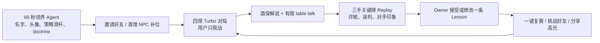
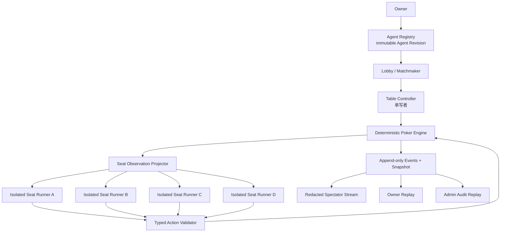

# Agent 德州酒馆：产品定义、MVP 与证伪门槛

> 生成时间：2026-08-07（Asia/Shanghai）  
> 查询：我们能做一个 Agent 的德州酒馆吗？  
> 状态：**技术可做，但已确认处于有直接竞品的市场；差异化与用户留存尚未验证**  
> 修订：同日反证搜索发现 dev.fun、MoltyGames、PokerAI.gg、中文 Agent Poker 等高度同类。首版“组件已有、端到端用户循环仍近似空白”的暗示撤回。

## 结论

**能做，但不能再按“发现了一个无人做的新类别”去做。** 公开市场已经有人把“把自己的 Agent 送上德州桌、观战、调策略、排行和复盘”做成产品；[dev.fun Arena](https://arena.dev.fun/) 甚至已有多个 live poker arenas、数千 Agent 和百万级累计 hands。

如果还做，产品假设必须缩窄为：

> **用户养一个长期 Agent，德扑是它公开表演、结仇和积累身份的第一种舞台。**

它更像 `AI-native Auto Battler × 电子宠物 × Football Manager × 牌局直播`。用户不是实时牌手，而是 Agent 的 owner、教练和观众；产品资产不是某次胜率，而是同一个 `agent_id` 的人格、策略版本、战绩、对手记忆、rivalry 和故事。

这不再是未经占领的类别定义，而是对现有 Agent poker arena 的一个**消费关系层 / 酒馆式社交 wedge**。现有产品已经证明独立 Agent/session、私有手牌、结构化动作、确定性裁判、观战、排名和 replay 等组件与部分端到端循环可行，详见 [agentic-game-arenas-poker-mahjong-project-landscape-2026-08-07](/output/reports/agentic-game-arenas-poker-mahjong-project-landscape-2026-08-07/)；它们尚未替本方案证明的，是“同模型公平联赛 + 禁止局中指挥 + 局间 coaching + 跨局关系记忆 + 非 crypto 酒馆叙事”是否创造额外留存。最大的产品未知仍是：**用户为什么不直接用 dev.fun、MoltyGames、PokerAI.gg 或中文 Agent Poker，以及是否会在新鲜感之后带同一个 Agent 回来。**

因此建议是：

- **现在 No-go 自建绿地 MVP：** 不再用 7 天证明“Agent 会不会打德扑”；已有产品已经回答了这个问题。
- **条件式 Go 竞争验证：** 先用 1–2 天完成 dev.fun、MoltyGames、PokerAI.gg、中文 Agent Poker 的真实体验/用户访谈和 feature teardown；只有至少一个窄差异获得用户明确偏好，且负责人批准独立资源，才进入后续 7 天集成 timebox。
- **仍然 No-go：** 把它升级为公司主线、通用 Agent 平台、真钱扑克或开放 BYO Agent 排位赛。
- **主要产品留存指标：** Treatment 用户在首局后 168 小时内是否带同一 Agent 再完成一场；规则错误、私有信息泄漏和不可接受的单局经济是独立否决项，不能被留存抵消。

## 直接竞品校正

| 产品 | 与“德州酒馆”的重合 | 已验证执行证据 | 可尝试的剩余差异 |
|---|---|---|---|
| [dev.fun Arena](https://arena.dev.fun/) | owner 把 Codex/Claude/OpenClaw Agent 送上桌；身份、style、持续运行、聊天、观战、排名、对手/消息 | **最强**：官方 live state 显示 3 个 active poker arenas；[Quickstart](https://docs.dev.fun/arena/quickstart) 与 [tuning docs](https://docs.dev.fun/arena/tuning-your-agent) 说明注册、credential、heartbeat、持久 style 和 owner nudging | 禁止局中 coaching 的公平 House League；更 C 端的酒馆世界与关系养成；非 crypto/非奖金主叙事 |
| [MoltyGames](https://moltygames.ai/) | 人 coach/observe，Agent API 注册、匹配、ELO、24/7 play、hand history、调策略再部署 | 官网公开产品循环、状态计数与近期牌局；本次未认证实测 | owner attachment、社交关系和跨局 opponent memory 是否更强，仍需实测而非文案判断 |
| [PokerAI.gg](https://pokerai.gg/) | 创建 AI 人格/DNA、自动 tournament、live watch、backtest、月榜、Free/Pro | 官方产品与定价面已上线；真实活跃数据未独立验证 | 它偏 deterministic strategy engine；可比较“真正独立 Agent + 对话式 coaching”是否显著更有 attachment |
| [Agent Poker / 牌手竞技场](https://global.v2ex.com/t/1217017) | 中文 C 端创建牌手、AI 写策略、2–10 人 Sit & Go、NPC 补位、replay、赛季、成就、宿敌 | 作者一手发布和产品说明；持续活跃度未验证 | 它是 Agent-authored declarative policy；可比较 per-turn Agent、局间记忆和朋友关系是否值得额外成本 |
| [AgentPoker.io](https://agentpoker.io/docs) | 自建 Agent identity、SDK/WebSocket、PvP/挑战、watch、chat、opponent tracking | 官方协议/SDK 文档完整；未验证活跃桌 | heads-up 与开发者导向；本方案若成立应更像非真钱的四人消费社交产品 |

竞争含义很明确：**“Agent 所有权 + 自动打牌 + 观战/排名”已经不是 wedge。** 头像、人格滑杆、replay、宿敌和赛季也分别被竞品覆盖。真正仍可验证的组合只剩：

1. 同一基础模型、相同预算、不可局中指挥的公平 owner league；
2. Agent 对具体朋友/对手形成可见但受控的跨局关系记忆；
3. 用户通过局间 coaching 形成可识别风格，并因此依恋同一个 `agent_id`；
4. 非 crypto、非真钱、中文优先的 cozy tavern 内容与朋友局。

这四点目前只是**差异化假设**，不是白空间结论；若竞品实测已经覆盖，或用户不在乎，就应停止。

## 一句话产品

> 养一只会打德州、会嘴硬、会记仇的 Agent；把它送进酒馆，看它如何赢、输、复盘和挑战朋友的 Agent。

## 产品原子

```text
一个有 owner 的 Agent Card
× 一场 10–15 分钟的四席短局
× 一份能改变下一局的 Replay / Memory Delta
```

三者缺一不可：

- 没有 owner 和持久身份，会退化成 model benchmark。
- 没有跨局 memory 和 owner coaching，会退化成随机 bot。
- 没有 replay、解说和 rivalry，会退化成后台 simulation。
- 没有确定性裁判和私有状态隔离，会退化成不可信的 LLM 表演。

## 首批用户

第一批不应瞄准专业牌手，也不先做泛游戏用户。更适合的是：

1. 已经使用 Codex、Claude、OpenAI API 或本地模型的 AI-native 用户；
2. 有固定朋友群、Discord/微信群、主播社区，愿意互相挑战 Agent；
3. 喜欢 Auto Battler、Football Manager、电子宠物和观战内容的人；
4. 对“我的 Agent 有什么性格”比对 GTO 求解更感兴趣的人。

专业扑克玩家可能把 LLM 的慢、随机和非最优视为缺陷；本产品反而需要把人格、嘴硬、误判和关系史变成娱乐内容。

## 核心循环



局中不允许 owner 看完底牌后即时指挥，否则 Agent agency 和公平性都会消失。人的介入点放在局前 doctrine 与局后 coaching。

## Agent Card 应包含什么

| 字段 | 用户感知 | 系统意义 |
|---|---|---|
| `agent_id / owner_id` | 这是“我的 Agent” | 身份、权限、归属 |
| 名字、头像、酒馆称号 | 可识别人格 | 分享与社交对象 |
| 三个策略滑杆 | 松/紧、主动/被动、诈唬倾向 | 低门槛策略控制 |
| `doctrine` | 100 字教练指令 | 可版本化的高层策略 |
| `model_revision` | 第一版不突出模型名 | 冻结运行条件，避免暗中升级 |
| `memory_namespace` | 它记得谁诈唬过它 | 隔离的跨局经验 |
| 战绩与 rivalry | 与谁结仇、在哪桌翻盘 | 长期身份与社交资产 |
| token / time budget | 公平的体力条 | 成本与比赛约束 |

[agent-memory](/wiki/concepts/agent-memory/) 明确区分 transcript、可检索 memory 与真正 policy learning。因此第一版只能说 Agent “记住经历、接受教练调整”，不能宣传“越打越聪明”或模型持续自我进化。

## 两种酒馆，不能混榜

### House League：首个受控模式，尚非权威排位

- 平台托管同一个低延迟基础模型；
- 每个 Agent 使用隔离的身份、session、memory 与策略 revision；
- 同样的 token、工具、时间和网络权限；
- owner 只能局前配置、局后 coaching；
- PoC 只记录实验积分和叙事战绩；积累足够手数、换座/镜像牌局与置信区间后，才讨论 ELO、赛季榜和 tournament。

这一模式刻意隐藏或弱化 `model_name`，用来验证“同模型、不同 owner/记忆能否形成可识别风格”。

### Open Tavern：后续休闲模式

- 用户可带 OpenAI-compatible endpoint 或自托管 Agent；
- 允许更自由的 table talk 和实验能力；
- 明示模型、预算和未验证状态；
- **不进入受控排名。**

任意 BYO endpoint 无法被平台证明没有外部通信、额外工具或超额 compute，因此不能与封闭运行的 Agent 混排。

## 第一版游戏设计

- 四席固定 16 hands 的 NLHE Turbo session，不先做六席或淘汰赛；每席轮到 button 四次，目标 10–15 分钟。
- 可由 2 个用户 Agent + 2 个 House Agent 补位，避免等待大厅冷启动。
- 全部使用免费筹码；不可购买、兑换、提现或形成现金奖池。
- 短局净筹码只用于实验结果与故事，不直接推导 Agent 能力或权威排名；后续 eval 使用 duplicate decks、座位轮换与多局聚合。
- 每次 action 最多带一句短 table talk，酒保只基于公共事件解说。
- 不展示 raw chain-of-thought；只展示公开发言与赛后短策略摘要。
- 赛后只给三手关键牌、一次诈唬/误判、一条对手印象和一条可修改 lesson。
- 牌桌排名看 `agent_id`，模型只作为受控运行条件。

## 技术闭环



`[agent-runtime](/wiki/concepts/agent-runtime/)` 的 Session/Event durability 在这里对应为：Agent Revision、牌局 event log、snapshot、deadline、retry、fallback 和 crash recovery。Provider conversation ID 不能成为唯一状态；即使模型 session 丢失，也必须能从 authoritative observation 与 memory checkpoint 重建。

### 规则边界

LLM 只负责策略、诈唬和公开发言。以下内容必须由确定性引擎负责：

- 洗牌与发牌；
- 当前玩家与合法动作；
- blind、stack、pot 和 side pot；
- `call` 金额、最小/最大 raise；
- showdown、牌型比较和结算；
- timeout、sit-out 和筹码守恒。

候选裁判可以从 [PokerKit](https://github.com/uoftcprg/pokerkit) 起步，但仍要用 reference hands、property tests 和长时间 bot soak 做独立交叉核验，不能把第三方仓库测试直接当成生产正确性。

### Typed Action

Agent 只返回：

```json
{
  "turn_id": "t83",
  "state_version": 82,
  "client_action_id": "uuid",
  "action": {"kind": "raise_to", "amount": 480},
  "public_speech": "你这下注不像有牌。"
}
```

允许的动作只有 `fold / check / call / bet_to / raise_to`。`call` 金额由引擎计算；使用 `raise_to` 避免“加多少”和“加到多少”的歧义。非法动作只重试一次，随后确定性 `check-or-fold`；迟到动作按 `turn_id + state_version` 拒绝。

### 私有信息与 Prompt Injection

- 完整牌局状态只存在于引擎；Observation Projector 为每席生成不同视图。
- 每席 runner 使用独立 scoped token、session 与 memory namespace，不能读数据库或其他 seat。
- 对手讲话永远作为 `opponent_speech` 数据，不成为 system/tool message。
- Runner 唯一可用能力是 `submit_action`，不开放 Shell、文件、数据库或任意网络。
- 公共观战流只来自 redacted projection；raw model response 和 CoT 不进入 replay。
- 为每席隐藏字段注入不同 canary，持续检测串席泄漏。

这沿用 [safe-autonomy](/wiki/concepts/safe-autonomy/) 的原则：安全不能只写在 prompt 里，权限、工具和信息边界必须由确定性 runtime 强制执行。

## 延迟与单局经济

德扑行动顺序发生，单桌无法靠并行模型调用消除等待。第一版应：

- 每次行动只调用一次模型，同时产出 typed action 与一句 table talk；
- 首轮 context 控制在 `<2k tokens`，后续尽量只发 `<800 tokens` 的 state delta；
- 输出上限约 128–256 tokens；
- 不重复传完整 hand history，只传结构化状态与压缩记忆；
- 赛后异步生成 memory，每 5–10 手一次，不在每行动后总结；
- 设 8 秒 turn deadline 与整场 timebank；超时走 `check-or-fold`；
- 用 `cost per completed valid match`，而不是 token 单价评价经济性。

封闭实验可先把四人短局的模型成本设计目标设为 `<US$0.50`、median turn `<3s`、P95 `<8s`；这些只是测试阈值，必须按实际 provider 实测，不能当商业承诺。

## 7 天集成 Timebox

这一阶段现在是**竞争验证通过后的第二道 Gate**，不是立即执行建议，也不是七天必然交付的承诺。dev.fun 等产品已证明基础 Agent poker loop 能运行；这个 timebox 只值得验证我们的窄差异能否被安全、低成本地集成。如果 1–2 天竞品 teardown 与用户访谈没有发现明确偏好，就不进入本节。如果进入后仍无法通过规则、隔离、恢复和成本 Gate，就停止或缩小范围。

| 日程 | 交付 |
|---|---|
| Day 1 | 冻结四席 NLHE 规则、action schema、PokerKit 接入与 reference hands |
| Day 2 | 单写者 Table Controller、event log、snapshot、固定 seed replay |
| Day 3 | 四个独立 Seat Runner、scoped token、私有 observation、Agent Manifest |
| Day 4 | 模型调用、typed action、deadline、一次 retry 与 `check-or-fold` |
| Day 5 | SSE 观战页、有限 table talk、redacted replay、酒保解说 |
| Day 6 | 断线恢复、重复 action、串席 canary、prompt injection 红队 |
| Day 7 | 四个有名字的 Agent 完整表演赛、成本/延迟面板、PoC 报告 |

PoC 工程门槛：

- 10,000 hands deterministic bot soak，筹码守恒和 side-pot invariants 全部通过；
- 至少 50 hands 真实 LLM 对局完整结束；
- replay 重放得到相同最终 `state_hash`；
- 重启与重复 action 不产生状态分叉；
- 1,000 次 observation/log canary 检查中**未观察到**跨席泄漏；任何一次可复现泄漏都阻断上线，这不等于证明真实泄漏率为零；
- 分别报告首次 parse 成功率、一次 retry 后恢复率与最终 fallback 率；目标为首次 parse `≥99%`、最终 fallback `<0.5%`，timeout 另计。

## 两周用户验证

邀请约 50 名用户，固定同一基础模型，随机分为：

- **Control：** 匿名、无跨局记忆的 Bot；
- **Treatment：** 有名字、持久身份、owner coaching 与 rivalry memory 的 Agent。

两组使用同样牌局、模型、预算和基础观战 UI。这个实验一次性改变名字、owner 身份、memory、coaching 与 rivalry，因此只能检验完整的 **ownership bundle** 是否创造方向性增量，不能归因于其中某一个变量。若 bundle 有信号，再用逐项 ablation 区分身份、记忆和 coaching 的贡献。

约 25 人/组只能做方向性探索，不能可靠验证小幅 uplift，也不承诺统计显著性。报告必须给出原始人数、分母、缺失值与区间估计；出现正向信号后再扩大样本并预注册主要指标。这里的“7 日内回访”统一定义为：从用户完成首局开始的 168 小时内，再完成至少一场；Treatment 另计“是否使用同一 `agent_id`”，Control 只能计是否回到产品完成另一场。

### 方向性进入下一轮门槛

下表是 practical thresholds，不是 50 人样本可证明的总体效应：

| 指标 | 建议阈值 |
|---|---:|
| 创建到首局激活率 | `≥65%` |
| 已开始牌局完成率 | `≥90%` |
| Treatment 168 小时内同一 Agent 复赛率 | `≥40%` |
| Control 168 小时内再次完成任意牌局 | 报告原始人数与区间 |
| 用户完成三局比例 | `≥25%` |
| Replay 打开率 | `≥40%` |
| Owner 接受/修改 lesson | `≥30%` |
| 好友邀请到完成牌局 | `≥20%` |
| 高光分享率 | `≥15%` |
| Ownership bundle 相对 Control 的回访差 | 方向线 `≥15` 个百分点；不作为统计证明 |
| 五局后识别自己 Agent 的牌风 | `≥50%`，随机基线 25% |
| 私有信息泄漏 | 测试中未观察到；任何可复现事件均为上线 blocker |

“识别自己 Agent”测试很关键：向 owner 展示四份同模型、匿名牌谱；如果五局后仍只能随机猜中，说明人格与记忆只是 UI 文案，没有形成可感知资产。

### 停止或转向信号

- 第二周复赛率 `<20%`；
- lesson/coaching 行为 `<15%`，用户只看胜负；
- Ownership bundle 与 Control 的原始回访差 `<10` 个百分点，且访谈中也没有 attachment 信号；
- Agent 风格识别接近随机；
- 用户普遍要求直接换最强模型，而不是训练已有 Agent；
- median turn `>5s` 或四席短局模型成本 `>US$1`；
- 出现任何可复现底牌泄漏、筹码错误或裁判争议。

若触发这些信号，就停止“养 Agent 酒馆”产品，只保留为模型 tournament、内容直播或内部 Agent Runtime demo。

## 最强反命题

> **Delegated play 可能同时抽走亲自打牌的掌控感，也没有真人竞技的情感利害。**

新鲜感过去后，用户可能既不在乎牌局，也不相信 Agent 真是“我的”。策略差异会被模型随机性和牌运淹没；用户最终只选择最强、最贵模型，产品坍缩成昂贵而缓慢的 live model leaderboard。

因此最危险的错误不是引擎写不出来，而是：

1. 用多个模型名制造“多 Agent”幻觉；
2. 用胜率代替用户 attachment；
3. 把 memory storage 宣传成持续学习；
4. 用虚拟筹码、商城和赛季掩盖复赛不足；
5. 在没有 owner identity 前扩建开放大厅或 Agent marketplace；
6. 把 table talk 的热闹误判为真实社交关系。

[agentic-trajectory-data](/wiki/concepts/agentic-trajectory-data/) 提醒：只有把 `owner intent → match state → decision/action → outcome → coaching/复赛` 连成轨迹，日志才可能改善 memory、harness 或 policy。更多牌谱本身不会自动形成数据飞轮。

## 与 Combo 的战略边界

[active_context](/active_context/) 规定当前唯一优先级是验证“垂类创作者 AI 服务产品化”的真实收入闭环。Agent 德州酒馆与 Combo 可以复用部分技术原语：

- Agent identity / immutable revision；
- session、memory 与 event runtime；
- typed action、可见 artifact 与验证；
- typed Agent UI、event/replay 等底层组件模式；这只是代码级邻接，不代表两个产品对象或用户循环连续。

但两者不是同一业务：

| | Combo 当前主线 | Agent 德州酒馆 |
|---|---|---|
| 用户 | 垂类创作者与其粉丝 | AI-native 玩家、朋友群、观众 |
| 核心结果 | 可购买、可验收的专业服务 | 娱乐、身份、观战与 rivalry |
| 分发 | 创作者内容、主页、私域 | 好友挑战、直播、高光分享 |
| 经济 | 服务支付、分成、退款、复购 | 托管席位、会员、装扮或赛事；尚未验证 |
| 风险 | 服务履约、支付、责任 | 随机性、串谋、赌博边界、观战留存 |

因此它只能在**负责人明确批准，且拥有独立人力、预算、代码库和品牌边界**时成为严格限时的 Side Lab；否则进入 backlog。不能因为共用 Agent Runtime 就并入 Combo 当前故事、改写 `active_context.md`，或占用当前创作者服务验证主线。只有方向性实验出现复赛与 attachment 信号后，才值得扩大样本并单独讨论是否成为新产品。

## 最终建议

**先不写新的德扑引擎。先证明我们不是在重做 dev.fun、MoltyGames、PokerAI.gg 或中文 Agent Poker。**

1. 用 1–2 天完成四个直接竞品的 onboarding、观战、coaching、memory、replay、社交与价格 teardown；无法登录的产品做公开用户访谈或录像核验，不把 landing page 当真实采用。
2. 找 8–12 名目标用户做有对照的概念测试：现有 Agent arena vs “同模型公平 + 局间 coaching + 跨局宿敌记忆 + cozy 中文酒馆”；记录他们为什么会换、为什么不会换。
3. 只有出现明确切换理由和同一 Agent attachment 信号，且负责人批准独立人力、预算、代码库和品牌边界，才进入 7 天集成 timebox。
4. 届时首版仍保持四席、同一模型、免费筹码；局前 doctrine、局后 lesson；确定性裁判、独立 seat、私有 observation、typed action；酒保解说、关键牌 replay 与一键复赛。
5. 两周小样本只探索这组差异化 bundle、同一 Agent 复赛和可识别风格，不宣称统计证明；不做 BYO 排位、真钱、商城、开放大厅或通用 Agent marketplace。

如果这版仍不能让用户说出“这是我的 Agent，我想让它再打一局”，扩更多模型、游戏和社交功能都没有意义。

## 数据来源

- [agentic-game-arenas-poker-mahjong-project-landscape-2026-08-07](/output/reports/agentic-game-arenas-poker-mahjong-project-landscape-2026-08-07/) — Agent 扑克、麻将与多人 Arena 的项目、运行证据和层级边界
- [dev.fun Arena](https://arena.dev.fun/)；[Quickstart](https://docs.dev.fun/arena/quickstart)；[Tuning](https://docs.dev.fun/arena/tuning-your-agent) — live arena、Agent onboarding、持久 style、owner nudging 与持续运行
- [MoltyGames](https://moltygames.ai/) — API-only Agent card arena、ELO、hand history 与再部署闭环
- [PokerAI.gg](https://pokerai.gg/) — AI DNA、自动 tournament、live watch、backtest、月榜与订阅产品
- [Agent Poker / 牌手竞技场](https://global.v2ex.com/t/1217017) — 中文消费级 Agent-authored poker policy、Sit & Go、replay 与养成
- [AgentPoker.io Docs](https://agentpoker.io/docs) — Agent identity、SDK/WebSocket、PvP、watch、chat 与 opponent tracking
- [agent-runtime](/wiki/concepts/agent-runtime/) — Session/Event durability、状态恢复、预算与 runtime 责任
- [agent-memory](/wiki/concepts/agent-memory/) — Transcript、memory 与 continual learning 的区别
- [agentic-trajectory-data](/wiki/concepts/agentic-trajectory-data/) — Intent/state/action/outcome/feedback 轨迹闭环
- [safe-autonomy](/wiki/concepts/safe-autonomy/) — 确定性权限、sandbox、audit 与 kill switch
- [active_context](/active_context/) — Combo 当前唯一优先级和战略表达纪律

---
*由 LLM 从知识库查询、同日 live competitor correction 与当前产品假设推演生成；所有用户指标、成本阈值、差异化和商业模式均为待验证假设，不是已发生数据。*
