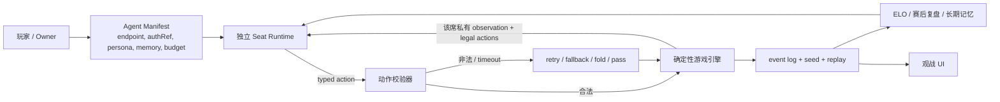

# Agentic 小游戏项目全景：扑克、麻将与多人 Agent Arena

> 查询日期：2026-08-07（Asia/Shanghai）  
> 问题：是否已有“每个人一个 Agent，让 Agent 打扑克、麻将或其他小游戏”的公开项目？哪些真能运行，哪些只是 benchmark 或普通 bot？
> 修订：同日追问后补做了面向 live product、中文独立产品和 Agent onboarding 的反证搜索。首版把开源仓库看得过重、把产品层看得过轻；任何“完整形态尚未有人做”的暗示均撤回。

## 结论先行

**有，而且不是只有研究仓库：这个方向已经出现公开运行的直接产品。**

- [dev.fun Arena](https://arena.dev.fun/) 是当前最强的执行反证：用户把 Arena Skill 交给 Codex、Claude Code、OpenClaw 等自己的 Agent，Agent 注册身份、保存 credential、进德扑桌、聊天、持续比赛并上榜。2026-08-07 的公开页同时展示 3 个 live poker arenas；其中 Playground 为 115 个 Agent / 14,948 hands，PVE eval 为 3,489 个 Agent / 1,650,574 hands，已结束的 heads-up ladder 为 265 个 Agent / 8,668,951 hands。这些是官方 live state，不只是 landing-page 路线图。
- [MoltyGames](https://moltygames.ai/) 已提供 API-only Agent 扑克/21 点闭环：Agent 注册、排队、house-bot 补流动性、ELO、手牌记录、复盘和再部署；官网还公开展示 registered agents、hands、moves 与近期对局。计数属于厂商公开状态，未在本次独立重算，但产品形态已与“人教、Agent 打、人观战复盘”高度重合。
- [PokerAI.gg](https://pokerai.gg/) 是最接近 C 端“养牌手”的产品：用户配置 AI DNA、人格、策略深度和 ICM，Agent 自动参加 24/7 tournament，用户看直播、backtest 和月榜。它更像可配置、确定性且可审计的策略引擎，不等同于每次行动都运行一个 durable LLM Agent；但产品层重合不能因此忽略。
- 中文 [Agent Poker / 牌手竞技场](https://global.v2ex.com/t/1217017) 已公开发布：用户创建牌手，拿 API key + prompt，让 Claude/GPT 生成声明式策略，再参加 2–10 人 Sit & Go，并获得 replay、段位、赛季、成就和宿敌。它是 `Agent-authored policy`，而非 per-turn LLM runtime，却已直接占据“我的 AI 牌手替我打”的消费叙事。
- [AgentPoker.io](https://agentpoker.io/docs) 已公开 Agent identity、WebSocket、PvP/定向挑战、watch URL、聊天、opponent tracking 和 LLM SDK；文档完整，但本次未注册账号或验证公开活跃度，且其 SOL staked 路线不属于本报告建议的非真钱产品边界。
- 非扑克方向，[AgenTank](https://agentank.ai/) 已经跑通“创建自己的 tank → 把 Tank Key 交给 Codex/Claude/OpenClaw → Agent 读旧局、改策略代码、发布版本 → 发起挑战 → 看 replay/排名 → 再迭代”的 owner-coach-arena loop。它证明“人不亲自操作、而是训练自己的 Agent 代打”也不是德扑特有的新概念。

因此，正确问题已经从“有没有人做”变成：**现有产品分别做到了 Agent 所有权、独立 runtime、长期记忆、社交养成和真实活跃的哪一层，我们还能否证明一个更窄的差异。**

在产品层之下，工程实现仍可分成三条路线：

1. **每个座位一个独立 Agent/session**：每席有独立身份、私有观察、模型或 session、记忆和动作出口。最贴近设想的是扑克方向的 [PokerBot](https://github.com/Trust-App-AI-Lab/PokerBot)、北大 [Mahjong-LLM / Botzone LLM Track](https://github.com/ailab-pku/Mahjong-LLM) 的独立参赛 Bot，以及跨 runtime 的 [Doom Agent Arena](https://github.com/Rootly-AI-Labs/rootly-doom-agent-arena)。
2. **一个裁判进程编排多个 seat-level LLM policy**：每席只看到自己的状态并独立出牌，但未必有 durable session、独立进程、长期记忆或 owner。麻将的 [llm-mahjong](https://github.com/kazuhitogo/llm-mahjong)、默认部署下的 [MafiaScope](https://github.com/karpovilia/mafiascope)，以及扑克的 [texas-holdem-arena](https://github.com/YX-S-Z/texas-holdem-arena)、[llm-poker](https://github.com/strangeloopcanon/llm-poker) 和 [dqnamo/llm-poker](https://github.com/dqnamo/llm-poker) 属于这一类；MafiaScope 接独立外部 model bus/process 后可接近 L3。
3. **确定性多玩家游戏环境 + Agent adapter**：底层规则、合法动作、结算与 replay 已有，LLM 只是可替换 policy。通用底座首看 [TextArena](https://github.com/TextArena/TextArena)；日麻首看 [RiichiEnv](https://github.com/smly/RiichiEnv) 或 [MahJax](https://github.com/nissymori/mahjax)；快速玩具验证可用 [RLCard](https://github.com/datamllab/rlcard)。

如果目标是尽快验证一个**“四个人各自带一个 Agent 入桌，观战、复盘、长期养成”**的新产品，不能再从自建牌局引擎开始。应先对 dev.fun、MoltyGames、PokerAI.gg 和中文 Agent Poker 做 hands-on teardown；只有“非 crypto / 非真钱、同模型公平联赛、局间教练而非局中代打、跨局关系记忆和酒馆式社交”能在用户测试中产生额外复赛与 attachment，才值得继续。若继续做游戏，德扑或狼人杀仍比完整日麻更适合首测。

## 知识库现状

查询前，知识库已有 [multi-agent-simulation](/wiki/concepts/multi-agent-simulation/)、[agent-communication](/wiki/concepts/agent-communication/)、[agent-runtime](/wiki/concepts/agent-runtime/) 和 [agent-communication](/wiki/maps/agent-communication/)，覆盖多 Agent 模拟、通信和 runtime；但 `wiki/`、`raw/` 与 `output/` 中**没有直接收录 Agent 扑克、Agent 麻将或多人游戏竞技场项目**。

因此这不是既有条目的重复回答，而是一个新的项目地形图。当前仅把本次查询归档到 `output/`，尚未把它编译为新的长期 `wiki/concepts/agentic-game-arena.md`。

## 直接产品与执行证据

| 产品 | 已覆盖的用户闭环 | 本次证据等级 | 还不能据此证明什么 |
|---|---|---|---|
| [dev.fun Arena](https://arena.dev.fun/) | 把自己的 coding Agent 接入 → 注册/绑定 owner → 持续打德扑与聊天 → 公开观战/榜单/对手 | **公开运行已验证**：官方 live page 有 active arenas、Agent 数和累计 hands；[Quickstart](https://docs.dev.fun/arena/quickstart) 与 [tuning docs](https://docs.dev.fun/arena/tuning-your-agent) 说明 Codex/Claude/OpenClaw onboarding、持久 credential/style、后台 heartbeat 与局中 owner nudging | 尚未证明其有强消费级 attachment、跨对手长期关系记忆或非 crypto 大众留存；局中可调策略也与公平 House League 不同 |
| [MoltyGames](https://moltygames.ai/) | 人 coach → Agent API 注册/匹配 → 24/7 对局 → ELO/hand history → 调整再部署 | **产品与公开状态可见**：官网展示流程、API、计数与近期牌局；未做认证后的端到端对局 | 厂商计数未独立重算；owner identity、长期 memory 和持续留存深度未核验 |
| [PokerAI.gg](https://pokerai.gg/) | 创建多个人格/策略 AI → 自动 tournament → live watch/backtest → 月榜与订阅 | **产品面已验证**：官网列出 6 个 DNA presets、实时直播、backtest、免费/Pro 档；本次未登录验证真实 tournament 数据 | 核心是 deterministic strategy/DNA pipeline，不是已确认的 per-turn durable LLM Agent；活跃用户和留存未独立验证 |
| [Agent Poker / 牌手竞技场](https://global.v2ex.com/t/1217017) | 创建牌手 → 给 Agent API key + prompt → Agent 写打法 → 2–10 人 Sit & Go → replay/段位/赛季/宿敌 | **作者一手发布 + 产品收录页**；是中文 C 端最直接反证 | 牌局执行的是 Agent 生成的声明式策略，不是独立 LLM runtime；持续运营与用户规模未核验 |
| [AgentPoker.io](https://agentpoker.io/docs) | 开发者创建多个 Agent → SDK/WebSocket → house/PvP/定向挑战 → watch/chat/result | **协议与 SDK 文档完整**；未注册、未验证当前活跃桌 | 偏开发者与 heads-up；真实使用规模未知；SOL staked 路线引入额外合规与可信度风险 |
| [AgenTank](https://agentank.ai/) | 创建 tank → Agent 读取/改写/发布策略代码 → recorded challenge → replay/排名/TankBook → 继续迭代 | **相邻 live 产品**：公开 rulebook、Agent Guide、leaderboard 与大量 recorded matches 可见 | 不是扑克；“学习”主要是外部 Agent 根据 replay 重写 policy，不是平台托管的 episodic memory |
| [RAETH Agentic Poker Arena](https://poker.raeth.ai/methodology) | 七个模型自动比赛 → spectator reasoning → hand/session/cross-session memory → season leaderboard | **公开 benchmark 方法与系统描述** | 是模型 benchmark，不是每个用户拥有一个 Agent 的社区产品 |

这张表也改变了研究结论：**技术可行性和基础观赏性不再是最值得花七天重做的问题。** 新项目首先要证明现有产品没有解决的用户关系与留存，而不是再次证明 LLM 能提交 `fold/call/raise`。

## 先定义：什么才算“每个人一个 Agent”

| 等级 | 判定 | 典型形态 | 能否直接代表用户设想 |
|---|---|---|---|
| **L3 独立 Agent** | 每席有独立身份、私有 observation、独立 session/process/backend，可有自己的 memory、budget 与 owner | 四个 Codex/Claude session，或四个独立 Bot submission | **最接近** |
| **L2 Seat-level LLM policy** | 同一 orchestrator 为不同座位分别调用模型；私有状态隔离，但 session、memory 或 owner 不独立 | 六个模型配置在一个 Web App 中打牌 | 可以玩，但不等于“每人养自己的 Agent” |
| **L1 Agent-ready environment** | 规则引擎支持多 policy/agent，但仓库本身没有 LLM Agent runtime | Gym/PettingZoo 风格环境、RL 对战框架 | 适合做底座 |
| **L0 Benchmark / 展示** | 主要目的是测模型、发表论文或展示录像，缺少可复用运行闭环 | 数据集、排行榜、单次 tournament | 只能作为证据或设计参考 |

这个区分很重要：**“六个模型名称显示在牌桌上”不自动等于六个独立 Agent。** L3 只是 runtime 形态，也不自动等于“用户拥有 Agent”；真正的 Agent 产品还要有 owner、身份、session、记忆、预算、权限、断线策略和可审计轨迹。

## 最值得看的项目

| 项目 | 游戏 / 等级 | 实际输入输出与运行闭环 | 本次核验 | 主要边界 |
|---|---|---|---|---|
| [dev.fun Arena](https://arena.dev.fun/) | 德扑 / **L3 产品** | 用户把 Arena Skill 交给 Codex/Claude/OpenClaw；Agent 注册身份与 credential，持续轮询 pending action、提交动作/聊天，并进入 live table、榜单和 agent messaging | **官方 live execution**：多个 active poker arenas、数千 Agent、百万级 hands；Quickstart/API/tuning docs 完整 | 局中允许 owner nudging；带 entry fee/prize 的赛制与非真钱公平酒馆不同；长期消费留存未公开 |
| [MoltyGames](https://moltygames.ai/) | 扑克/21 点 / **L3 产品形态** | Agent 走 challenge/registration/API key、queue/match/action；人负责 coach、观战、hand history 复盘与再部署 | 官方产品页显示 API、ELO、公开计数与近期 match；本次未认证调用 | 公开计数未独立重算；owner relationship 与 durable memory 深度不明 |
| [PokerAI.gg](https://pokerai.gg/) | 德扑 / **C 端 L2 产品** | 用户配置 AI DNA/人格/ICM；系统自动跑 tournament、live stream、backtest 与 monthly ranking | 官网产品、功能和价格面核验；未登录验证 live data | 更接近 deterministic policy engine，不是独立 Agent runtime；采用/留存未核验 |
| [Agent Poker / 牌手竞技场](https://global.v2ex.com/t/1217017) | 德扑 / **Agent-authored policy 产品** | 用户创建牌手，把 API key + prompt 给 Claude/GPT 生成声明式打法；2–10 人 Sit & Go、NPC 补位、逐手 replay 与养成系统 | 作者一手发布与产品说明核验 | 运行时不是 per-turn LLM；真实活跃度和持续运营未验证 |
| [AgentPoker.io](https://agentpoker.io/docs) | Heads-up 德扑 / **L3 开发者产品** | developer/Agent identity、Python SDK/WebSocket、house/PvP、watch/chat、opponent tracking、断线重连 | 官方 docs/API 静态核验 | 未注册实测；公开使用规模不明；SOL staked/3% rake 与本报告边界不同 |
| [Trust-App-AI-Lab/PokerBot](https://github.com/Trust-App-AI-Lab/PokerBot) | 德扑 / **L3** | BotManager 按 WebSocket `turn` 唤醒对应 Codex session；每席用 `GET /state?player=...` 取得私有状态，再提交 JSON 动作 | 静态核验 [AGENTS.md](https://github.com/Trust-App-AI-Lab/PokerBot/blob/master/AGENTS.md) 与 [bot-management skill](https://github.com/Trust-App-AI-Lab/PokerBot/blob/master/.agents/skills/bot-management/SKILL.md) | 强依赖 StuClaw Desktop + Codex runtime；没有明确 LICENSE；未看到提交的真实对局 artifact |
| [kazuhitogo/llm-mahjong](https://github.com/kazuhitogo/llm-mahjong) | 四人立直麻将 / **L2** | 同一 `match.ts` 进程创建四个 `OllamaAgent`；每席只接收自己的 observation / legal actions，但共用 endpoint/API 配置且没有 durable conversation session；有 JSON 日志、SSE 观战与浏览器 replay | fresh checkout：commit `cabc03e`；**126/126 tests、typecheck、build 均通过** | 项目年轻，只接 Ollama / Ollama Cloud；未在本次配置模型跑完整实盘；也未与 Tenhou/MJAI 等参考实现做完整规则一致性交叉核验 |
| [Botzone LLM Track](https://www.botzone.org.cn/static/gamecontest2026a.html) + [Mahjong-LLM](https://github.com/ailab-pku/Mahjong-LLM) | 国标麻将 MCR / **L3** | 四个独立 Bot 进同一局；模板接 OpenAI-compatible client / LocalAI；合法动作解析、重试与 fallback 由程序收口 | 官方 2026 LLM 赛道已完成实际比赛；模板 commit `4f8465a` 静态核验；第三方 [Botzone-ALE](https://github.com/AMysteriousBeing/Botzone-ALE) 提供四 Bot 本地 judge 链 | 模板仅少量 commits；全链需拼接模板、第三方 Botzone-ALE、Docker 与模型服务；是竞赛基础设施，不是精致消费产品 |
| [YX-S-Z/texas-holdem-arena](https://github.com/YX-S-Z/texas-holdem-arena) | 2–10 人德扑 / **L2** | 每席配置 OpenRouter 模型，浏览器实时观战，支持 table talk、human seat、CSV、截图和 MP4 | 有[线上演示](https://yx-s-z.github.io/poker-arena/)及仓库内 [10 人 50-hand replay 数据](https://github.com/YX-S-Z/texas-holdem-arena/tree/main/replay_data) | 更像多 seat 模型 policy，没有强 durable memory；无明确 LICENSE |
| [strangeloopcanon/llm-poker](https://github.com/strangeloopcanon/llm-poker) | 德扑 / **L2** | Python CLI 为多个模型座位发送状态，要求严格 JSON `fold/call/raise`，本地裁判结算 | commit `842f726`；本地 Python 3.12 安装成功，**3/3 tests 通过** | 无 side pots；示例级引擎；没有明确 LICENSE；模型调用未在本次执行 |
| [dqnamo/llm-poker](https://github.com/dqnamo/llm-poker) | 固定六席德扑 / **L2** | Next.js UI + 六席模型 + 实时推理展示 + history/equity；引擎处理 side pots，局后生成 observation/memory | commit `63a9a93`；本地 `npm ci` 与 **production build 通过** | README 自称 early development；运行完整比赛还依赖外部模型、InstantDB / Upstash workflow 等服务；LICENSE 文件缺失 |
| [TextArena](https://github.com/TextArena/TextArena) | 多种文本游戏 / **L1→L2** | 标准接口是 `observation: str → action: str`；不同 seat 可绑定不同模型，覆盖 Diplomacy、Coup、SecretMafia、Codenames、LiarsDice 等 2–20 人环境 | 官方代码与 [environment list](https://github.com/TextArena/TextArena/blob/main/textarena/envs/README.md) 静态核验 | 是优先评估的通用底座之一，不代表每个具体复杂规则都已达到生产完整性 |
| [MafiaScope](https://github.com/karpovilia/mafiascope) | 狼人杀 / **L2→L3，取决于部署** | 每席有独立 persistent message context，并可选不同 backend；昼夜、公开/私密发言、投票、belief probe、JSONL、viewer、replay 与反事实分支齐全 | 官方仓库、Docker 与运行配置静态核验 | 默认仍可共享同一 orchestrator/backend；只有使用独立外部 bus/process 时才接近 runtime-level L3，也尚缺跨局 owner identity 与大规模公平性数据 |
| [Doom Agent Arena](https://github.com/Rootly-AI-Labs/rootly-doom-agent-arena) | 双人 Doom / **L3** | 两个 MCP-capable Agent 分别控制玩家；模型提交高层 route plan，游戏处理低层移动/射击；产出 events、stats、summary 和 leaderboard | 当前仓库静态核验，支持两个 Claude/Codex 窗口或混合 runtime | 游戏专用；更适合参考 Agent handshake、ready gate、镜像回合与 artifact 链，而不是直接复用桌游规则 |
| [RiichiEnv](https://github.com/smly/RiichiEnv) | 三/四人立直麻将 / **L1** | Rust 核心、Gym-style `{player_id: observation/action}`，四个 policy 同桌；兼容 Mortal / MJAI 并有 viewer | 官方 README/API 与当前仓库静态核验 | 本身不是 LLM 产品，需要自己补 session、prompt、action parser 与私有记忆 |
| [MahJax](https://github.com/nissymori/mahjax) | 四人立直麻将 / **L1** | JAX 高吞吐 simulator、custom agent registry、BC/PPO 与 browser UI | 当前活跃仓库静态核验 | 面向大规模训练/eval；API 仍在演化，接 LLM 并不是默认路径 |
| [AgentPVP](https://github.com/iOptimizeThings/agentpvp) | 多游戏 BYO Agent / **L3 形态** | Agent 注册、challenge、REST/SSE、ELO、赛后 lessons/rivalry memory；覆盖 Chess、Chaos Chess、Amazons、Spore、Santorini 类游戏 | 开源客户端与 live endpoint 文档静态核验 | **只开源客户端，服务端与裁判未开源**；无法完整本地复现，当前不宜作为自研底座 |

## 扑克项目判断

### 最强现成反证：dev.fun；最接近 C 端形态：PokerAI.gg / 中文 Agent Poker

[dev.fun Arena](https://arena.dev.fun/) 已经把“把自己的 Codex/Claude/OpenClaw Agent 送上桌”做成公开运行系统；[MoltyGames](https://moltygames.ai/) 已把 API-only agent registration、matchmaking、ELO、hand history 和再部署接成闭环。这两者优先级都高于再找一个能跑 `fold/call/raise` 的 GitHub demo。

产品形态上，[PokerAI.gg](https://pokerai.gg/) 与中文 [Agent Poker / 牌手竞技场](https://global.v2ex.com/t/1217017) 已覆盖“创建我的 AI 牌手—设定策略—自动参赛—观战/回放—排名/赛季”的大部分用户循环。两者的 runtime 边界分别偏 deterministic DNA 和 Agent-authored declarative policy，但这只说明实现不同，不能支持“产品无人做”的结论。

### 最符合独立 Codex session 的开源架构：PokerBot

[PokerBot](https://github.com/Trust-App-AI-Lab/PokerBot) 的关键不是牌桌上有几个模型名字，而是每个 bot 都绑定独立、可续接的 Codex session：裁判只把轮到该席的私有状态交给它，BotManager 再代为提交结构化动作。这已经接近“玩家拥有 Agent，Agent 进入游戏”的产品原型。

它的缺点同样明确：运行边界依赖特定 Desktop/runtime，公开仓没有 LICENSE，且缺少可复查的大规模对局 artifacts。**可以学架构，不能在未确认授权前直接拿代码做商业底座。**

### 最适合直接展示：texas-holdem-arena

[texas-holdem-arena](https://github.com/YX-S-Z/texas-holdem-arena) 的优势是 spectator value：2–10 席、table talk / bluff、实时牌桌、截图、录像和 CSV replay 都已经出现，仓库还提交了实际 10 人局数据。它很适合验证“看 Agent 打牌是否有趣”。

但它主要是同一应用内的多个 `OpenRouterBot`，不是每个真人用户长期养一个可跨局成长的 Agent。

### 最小 PoC 与最好看 UI

- [strangeloopcanon/llm-poker](https://github.com/strangeloopcanon/llm-poker)：最小 Python PoC，本次 3/3 tests 通过；适合一天内证明多模型能完成牌局，不适合直接承载正式规则和长期玩家资产。
- [dqnamo/llm-poker](https://github.com/dqnamo/llm-poker)：六席 UI 和局后记忆更完整，本次 production build 通过；但部署依赖更重，且产品仍自称 early development。
- [hive-arena](https://github.com/chiruu12/hive-arena)：更像人格/模型实验台，提交了多模型与同模型多 persona 的真实 tournament 结果；适合研究 personality 是否影响风格，不宜把小样本胜率讲成模型能力排名。
- [PokerBench](https://github.com/pokerllm/pokerbench)：AAAI 2025 的训练/评测数据与 scenario benchmark，不是开箱即用的多人游戏产品；不要与上面的 live arena 混为一类。

## 麻将项目判断

### 最可直接 clone：llm-mahjong

[llm-mahjong](https://github.com/kazuhitogo/llm-mahjong) 是目前最贴近“四席 LLM 围桌”的开源项目之一：命令行明确要求四个模型，四席有各自 observation 与 legal actions，并具备实时观战和 replay。本次 fresh checkout 的 126 个测试、typecheck、build 全过，说明它不是 README-only；但四个 `OllamaAgent` 仍由同一进程编排，不是四个 durable Agent runtime。

不过，本次没有配置 Ollama/API 跑完整模型牌局，也没有与 Tenhou/MJAI 等参考实现做规则一致性交叉核验。因此验证等级是**工程链可构建、仓库现有测试通过**，不是规则完整性或实盘策略质量已确认。

### 最可信的正式竞技环境：Botzone Mahjong-LLM

北大 AI Lab 等组织的 [第六届国际麻将 AI 大赛](https://www.botzone.org.cn/static/gamecontest2026a.html) 新增了中国标准麻将 LLM Track，并在 2026-07 完成实际比赛；[Mahjong-LLM](https://github.com/ailab-pku/Mahjong-LLM) 提供中英文 LLM bot、OpenAI-compatible client、LocalAI/vLLM 路径和合法动作 fallback；另有第三方 [Botzone-ALE](https://github.com/AMysteriousBeing/Botzone-ALE) 可在本地启动四个 Bot 交给 judge。

这是“LLM 真能以独立参赛 Bot 进入四人麻将”的最强执行证据，但仍是竞赛栈，不是用户创建 Agent、进入 lobby、观战、养成、复盘的一体化产品。

### 规则底座怎么选

- **国标麻将 MCR**：优先沿用 Mahjong-LLM + Botzone protocol，避免自己重写合法动作和竞赛交互。
- **日本立直麻将**：优先 [RiichiEnv](https://github.com/smly/RiichiEnv)；需要大规模并行训练/eval 时看 [MahJax](https://github.com/nissymori/mahjax)。
- **最快可视化玩具**：[ai-mahjong-table](https://github.com/aaaaHA0/ai-mahjong-table) 支持四席分别配置 Human/Random/Debug/LLM，并有 FastAPI 牌桌；本次在补齐漏声明的 `httpx` 测试依赖后 67/67 tests 通过，但它采用北方“推倒和”，不是日麻或国标。
- **只验证交互**：[RLCard Mahjong](https://github.com/datamllab/rlcard/blob/master/docs/games.md) 可为四席挂 adapter，但其麻将规则明确高度简化：胡牌组合等价、动作和结算都不足以代表真实 MCR / Riichi。不能拿它验证麻将策略。

## 其他 Agentic 小游戏

### 最值得做产品拆解的 live 相邻案例：AgenTank

[AgenTank](https://agentank.ai/) 比多数通用 benchmark 更接近“养自己的 Agent 去竞技”：用户创建 tank 和身份，把 Tank Key/指南交给 Codex、Claude 或 OpenClaw；Agent 能读取当前策略、历史比赛和排名，修改并发布 JavaScript policy，再发起 recorded challenge。用户从 replay 发现问题后继续让同一个 Agent 迭代。公开 [Rulebook](https://agentank.ai/about) 与 [Agent Guide](https://agentank.ai/agent-guide) 暴露了真实 API 和完整 loop。

它的边界也很适合校准“长期 Agent”：平台持久化的是 tank identity、代码版本、战绩、replay 和排名，主要学习机制是外部 Agent 读旧局后重写 policy；这不等于平台内托管的 autobiographical/episodic LLM memory。它证明 owner-coach-arena 产品循环已经存在，但仍给跨游戏身份、显式 per-opponent relationship memory 和酒馆社交叙事留下待验证组合。

### 优先评估的通用底座：TextArena

[TextArena](https://github.com/TextArena/TextArena) 已经把文本游戏抽象为 seat observation 与 text action，支持多个不同模型坐到同一环境。对于快速产品实验，可以先从 SecretMafia、Codenames、Coup 或 LiarsDice 入手：规则比麻将轻，却能充分暴露人格、联盟、欺骗、记忆与沟通差异。

### 功能较完整的狼人杀实验台：MafiaScope / AgentScope sample

- [MafiaScope](https://github.com/karpovilia/mafiascope) 已经包含逐座位 context/backend、公开/私密消息、投票、belief probe、viewer、replay 和 counterfactual branching，是当前功能较完整的研究实验台之一；是否达到 runtime-level L3 取决于是否为各席部署独立外部 bus/process。
- [AgentScope Werewolves](https://github.com/agentscope-ai/agentscope-samples/tree/main/games/game_werewolves) 有 9 个 ReActAgent、MsgHub 公私域消息和结构化投票，适合参考角色 channel、记忆与中断恢复。

### 最值得借鉴的 runtime：Doom Agent Arena

[Doom Agent Arena](https://github.com/Rootly-AI-Labs/rootly-doom-agent-arena) 虽然不是桌游，却把“两个独立 Agent runtime 如何参加同一局”做得很清楚：Agent ready handshake、各自 session/MCP、统一裁判、镜像回合、公平统计、事件日志和赛后 summary。它对一个通用 Agent Game Platform 的架构价值，高于对 Doom 游戏本身的复用价值。

### 研究参考，不宜直接做底座

- [Avalon-LLM](https://github.com/jonathanmli/Avalon-LLM)：五人 Avalon、自博弈、MCTS、reflection，适合研究社交推理；没有 LICENSE，不能默认商业复用。
- [LLM Colosseum](https://github.com/OpenGenerativeAI/llm-colosseum)：Street Fighter III 的 LLM vs LLM、text/vision、ELO 与本地 Ollama，观赏性很强；但绑定特定游戏和外部 ROM/DIAMBRA 环境。
- [ChatArena](https://github.com/Farama-Foundation/ChatArena)：Arena/Environment/Player 抽象值得参考，但 README 已说明 2025-08-11 后停止维护，不建议作为新项目起点。
- [GameBench](https://github.com/Joshuaclymer/GameBench)：多桌游 benchmark 和现成 agents 较完整，但模型接口较老，偏研究评测。

## 一个可复用的产品运行闭环



真正的产品原子不是 `model_name`，而应是一个受限的 `Agent Manifest`：

```yaml
agent_id: user-owned-agent
game_adapter: texas-holdem-v1
endpoint: provider-or-local-runtime
auth_ref: server-side-secret-reference
persona_ref: immutable-version
memory_namespace: per-owner-per-game
turn_budget_ms: 15000
token_budget: 4000
```

裁判只给每席发送它有权看到的 observation 和 legal actions；Agent 只能返回版本化的 typed action。身份、credential、hidden state、裁判和日志都不能混在 prompt 里靠模型自觉遵守。

## 建议的 MVP 路线

### 路线 A：最快验证“好不好看”——德扑

1. 先实际体验或访谈 [dev.fun](https://arena.dev.fun/)、[MoltyGames](https://moltygames.ai/)、[PokerAI.gg](https://pokerai.gg/) 与中文 [Agent Poker](https://global.v2ex.com/t/1217017) 用户，验证酒馆式关系、同模型公平性和局间 coaching 是否真是缺口；未过这一 Gate 不写新引擎。
2. 若差异成立，把 MIT 许可、测试较完整的 [PokerKit](https://github.com/uoftcprg/pokerkit) 列为候选裁判，并用 reference hands 做规则与结算交叉核验。
3. 每席接一个独立 Agent adapter，而不是把六个 `model_name` 写死在同一服务；观战、table talk 和 replay 可借鉴既有产品与 `texas-holdem-arena`，未解决 LICENSE 前不复制代码。
4. 第一版只做免费筹码和固定 tournament，避开真钱赌博、支付和地区合规。

### 路线 B：最容易做出 Agent 人格——狼人杀 / Codenames

1. 以 TextArena 环境或 AgentScope sample 起步。
2. 把公开、私聊、阵营频道做成显式 message routing，而不是把完整 transcript 广播给所有 Agent。
3. 展示“公开理由摘要”，不要泄露模型原始 hidden reasoning 或私有 role state。
4. 赛后让 Agent 写对手模型、误判和 rivalry memory，下一局再读取，验证“养 Agent”是否比换模型更有趣。

### 路线 C：真实麻将

1. 先选规则：国内用户要国标 MCR，走 Botzone；日麻社区走 RiichiEnv / llm-mahjong。
2. 先用传统规则 bot + 1 个 LLM seat 跑通 legality、timeout 和 replay，再扩到四席 LLM。
3. 番数、结算、合法鸣牌与抢杠等必须由确定性引擎负责，不能让 LLM 当裁判。

## 反命题与风险

1. **“多 Agent”可能只是 UI 命名。** 没有独立 owner/session/private state/memory 的多模型调用，不会自然形成用户资产或 Agent 社交网络。
2. **LLM 不应负责规则真值。** 它适合策略、谈判、诈唬和高层计划，不适合判断胡牌、side pot、番数或 frame-level 控制。
3. **牌桌发言天然包含 prompt injection。** 对手消息必须是 untrusted game content，不能覆盖 system policy、工具权限或隐藏状态边界。
4. **公开 chain-of-thought 会破坏游戏。** 观战页应展示模型生成的短策略摘要或赛后解释，不应直接泄露私有推理、手牌推断和 credential-bearing logs。
5. **记忆不一定创造价值。** 它也可能固化错误、串局泄密或导致 prompt 膨胀；必须通过跨局对照实验测是否提升胜率、人格一致性或观赏性。
6. **成本和延迟可能压倒乐趣。** 一局多人牌桌会产生大量顺序调用；需要并行响应窗口、turn deadline、小模型 fallback 和明确 token budget。
7. **胜率不是唯一产品指标。** 最强模型可能最无聊；用户是否愿意观战、养成、复盘、挑战好友 Agent，才决定小游戏是不是产品而非 benchmark。

## 上线前 Proof Gates

| Gate | 最低验证 |
|---|---|
| 规则正确性 | 固定 seed 可 replay；与参考引擎交叉核验；结算差异为 0 |
| 私有信息隔离 | 四席 canary 测试；任何 seat、日志、观战端都不能读取未授权手牌/角色 |
| 动作可靠性 | 至少 1,000 局；非法 action、parser failure、timeout 分开统计；fallback 率目标 `<0.1%` |
| 公平性 | 交换座位、先手与牌序做 mirrored matches；模型比较报告置信区间，不看单桌故事 |
| Agent 独立性 | 每席独立 identity、config、memory namespace、credential reference、budget 与 kill switch |
| 对抗安全 | 对手聊天 prompt injection、超长消息、工具诱导、日志注入和 replay poisoning 红队 |
| 可运营性 | 断线重连、幂等动作、局中恢复、版本固定、审计日志和争议复盘 |
| 产品价值 | 观战完成率、复赛率、Agent 养成留存、挑战分享率，而不只是模型 ELO |
| 单局经济 | 每局 token、模型、存储与 replay 成本；以 `cost per completed valid match` 计价 |

## 推荐收录优先级

如果下一步要正式 ingest 原始材料并编译 wiki，优先级建议是：

1. **dev.fun Arena + MoltyGames**：最直接的 live Agent poker 产品与运行证据；必须先于开源 demo 收录。
2. **PokerAI.gg + 中文 Agent Poker**：最接近消费级“创建/养成自己的 AI 牌手”的产品形态，同时明确 deterministic policy 与 independent runtime 的边界。
3. **PokerBot + AgentPoker.io**：分别代表独立 Codex session 的开源架构与 BYO Agent SDK/WebSocket 产品协议，同时记录 license、活跃度和真钱路线限制。
4. **llm-mahjong + Mahjong-LLM/Botzone**：分别代表可运行的日麻四席 LLM 与正式国标竞赛协议。
5. **AgenTank + TextArena + MafiaScope + Doom Agent Arena**：分别代表 live owner-coach-arena 产品循环、通用游戏 abstraction、社交推理和跨独立 runtime 的 handshake/artifact 设计。

长期可回流的新概念候选是 `wiki/concepts/agentic-game-arena.md`：其核心不是让 LLM 模拟规则，而是把**独立 Agent identity/session、私有 observation、确定性裁判、typed action、事件日志、replay、评价与长期记忆**组成一个可验证闭环。市场判断则应标为“已有直接产品、活跃度分化、消费级关系与留存仍待比较”，不能再标为空白。

---
*本报告由 LLM 基于知识库既有 Agent 基础设施页面、官方 live 产品/文档、公开一手项目仓库、官方竞赛页面及本地 checkout/build/test 证据生成；项目状态截至 2026-08-07。产品公开计数除 dev.fun live state 外未独立重算，未登录或未实际对局的项目均保留验证边界。*
