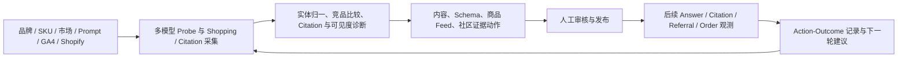
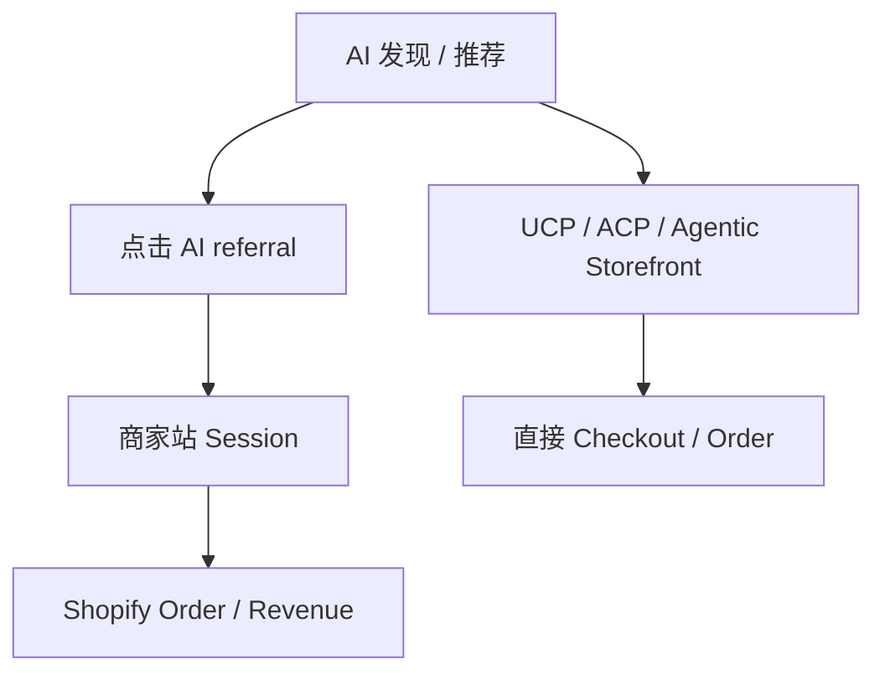

# Alignment AI 项目与融资 Deck 尽调分析

> 生成时间：2026-08-03（Asia/Shanghai）
> 查询：分析 Alignment AI 项目
> 主材料：`Alignment AI(融资Deck）.pdf`，20 页，2026-07-23 生成
> 文件 SHA-256：`bbfcbf09e03ee3321f760891dec15f1022c9b8ddc704cd3af848e26e92eb6006`
> 证据边界：Deck 是公司自述；官网、公开 API、Shopify App Store、公司/团队页面和竞品官网用于交叉核验；没有登录客户后台，也没有获得合同、发票、银行流水、cap table 或数据室

## 摘要

**Alignment AI 抓到的是一个真实且正在增长的问题，也已经做出了可公开访问和安装的产品表面；但当前融资叙事比已证实事实领先约两层。** 今天最准确的分类不是“已经闭环的 AI 货架收入归因系统”，而是：

> **Shopify / DTC 优先的 GEO 与 AI Shopping Intelligence 工具 + Managed Growth 服务，并尝试把监测、内容修复和 AI referral 收入相关性沉淀为 Agent Workflow。**

项目的最强点是市场时点、明确的 `Monitor → Analyze → Optimize → Attribute` 产品循环，以及一批可以部分回读的公开类目、商品与引用数据。项目的最大问题不是产品完全不存在，而是三个核心命题尚未被证明：

1. **竞争差异不成立**：Profound、Scrunch、Goodie 与 Adobe 已经不同程度覆盖监测、执行和 GA4 / CRM 收入链路；Deck 第 15 页的“独特象限”已过时。
2. **归因不等于因果**：当前基础设施最多可以稳定证明部分 `AI referral → session → order / revenue`；不能只靠 GA4 + Shopify 证明具体 Prompt、Answer、Citation 或某个优化动作创造了增量订单。
3. **SaaS 化尚未被经营证据支持**：Deck 目标是 25–30 个付费品牌和 US$1M ARR。这个组合要求平均每品牌约 US$2,778–3,333 MRR，落在其 US$2K–6K/月 Managed Growth 区间，而不是 US$99–399/月 SaaS 区间。即使达标，公司届时仍主要是服务收入，除非 Agency partner 贡献的终端品牌另计且被清楚披露。

因此当前建议是：**黄灯，进入下一轮产品、数据、客户、公司治理与安全尽调；不建议仅凭这版 Deck 直接形成投资 conviction。** 如果核心证据能在 90 天内通过，应把项目看成一个有机会从 DTC GEO managed service 走向 AI merchandising / measurement software 的早期公司；如果不能，应按小型 GEO agency + 工具来估值，而不是按 Outcome Data / Intelligence Layer 预付溢价。

## 0. AI 应用项目投资判断框架 V1 评分

> **暂评分 50/100，合理区间 20–75；S0 探索期；证据覆盖率约 40%，置信度低；五项门槛中 0 项通过、3 项有条件通过、2 项待验证、0 项否决。当前建议：继续尽调。**

这里的 `50` 不是投资成功概率，也不是交易价格判断。它表示：Alignment 的行业命题和产品表面已经超过纯 BP，但核心收入结果、续费、单位经济、规模复制和护城河仍没有达到同阶段的完整证明。由于未提供估值、SAFE cap / discount、持股、清算权与退出假设，本评分不包含交易吸引力。

### 0.1 十维暂评分

按 S0 权重计算，3 分代表达到探索期合理标准；缺失项按框架用 2.5 中性占位，并通过证据等级扩大区间。

| 维度 | S0 权重 | 质量分 0–5 | 证据 | 加权贡献 | 判断 |
|---|---:|---:|---:|---:|---|
| 客户需求与价值真实性 | 20 | 2.5 | E1 | 10.0 | GEO / AI shopping 可见性是合理新预算方向，但 Alignment 的客户痛点、任务频率、已有支出与独立付款只有 Deck 汇总 |
| 市场空间与行业结构 | 12 | 3.0 | E2 | 7.2 | 市场与预算迁移真实，成熟竞品也证明类别存在；但 US$3–5T 不是软件 TAM，市场已快速拥挤 |
| 产品与工作流嵌入 | 10 | 3.0 | E2 | 6.0 | Shopify App、公开 Web 模块和部分 API 数据可以独立访问；完整 `Monitor → Optimize → Attribute` 客户闭环未验证 |
| AI 效果与可托付性 | 12 | 2.0 | E1 | 4.8 | Harness 与人工审批设计合理，但没有真实 eval、严重错误、人工接管、action lift 或归因覆盖率 |
| 留存、PMF 与扩张 | 4 | 2.5（U） | E0 | 2.0 | 没有续费、扩容、活跃或 cohort，按框架中性占位 |
| GTM 可复制性 | 4 | 2.0 | E1 | 访谈、Founder 社群、Managed Growth 和 Agency 是冷启动路径，不是非创始人可复现漏斗 |
| 收入质量与单位经济 | 4 | 2.5（U） | E1 | 2.0 | 有定价和目标，没有现金收入结构、折扣、退款、人工、数据/API 与交付成本，暂不把未知直接判负 |
| 标准化与规模复制 | 3 | 2.0 | E1 | 融资本身要把交付从人转给 Agent，说明当前尚未证明收入快于人工增长 |
| 护城河与外部依赖 | 11 | 1.5 | E2 | 公开数据可重建，竞品已覆盖 Action → Revenue，相同链路依赖模型、Shopify、GA4、CRM 与渠道可观测性 |
| 团队与组织执行力 | 20 | 2.5 | E2 | 团队已快速做出公开产品且技术履历部分可核验；商业化、全职状态、角色覆盖、IP 和公司关系仍有缺口 |
| **合计** | **100** |  |  | **48.1 → 展示为 50/100** | **好坏混合，核心假设尚未成立** |

证据覆盖率按 `E2=55%`、`E1=25%`、`E0=0%` 加权约为 **39.9%**。需求、效果、留存和单位经济均只有 E0 / E1，因此按照框架的决策上限，不能高于“继续尽调 / 等待验证”。形式化不确定区间很宽，不代表真实质量会在两端随机分布，而是说明少量合同、客户日志和公司文件就可能显著改变评分。

### 0.2 五项核心门槛

| 核心门槛 | 状态 | 证据 | 当前裁决 |
|---|---|---:|---|
| 需求与付费真实性 | **待验证** | E1 | 2 个付费、3 个 pilot 与 5 个在谈均为 Deck 自述；需合同、发票、到账、客户回访与重复任务 |
| 核心技术与生产可托付性 | **有条件通过** | E2 | 公开产品存在，但 prompt/action-level 结果、生产日志、错误与恢复未证明，且未授权集成元数据接口需作为安全 P0 关闭 |
| 完整单位经济 | **待验证** | E1 | US$1M ARR 数学更像服务收入；没有逐客户毛利、人工分钟、退款、模型、数据和支持成本 |
| 合法运营、数据权利与责任 | **有条件通过** | E2 | Terms、Privacy 和 Shopify 权限说明表明存在运营路径；采集权、跨客户学习、删除、Reddit 发布责任和租户治理待文件核验 |
| 诚信与数据真实性 | **有条件通过，偏红** | E2 | 数据量、价格、API、联创身份与其他公司关系存在可见口径冲突；尚无 E3 证据证明故意造假，不能判否决，但必须作为投资前条件 |

### 0.3 什么会改变分数

**上调至 65–70、进入条件性推进**，至少需要同时出现：

1. 3–5 家非关联品牌的合同、发票、到账和生产日志，并出现至少一个自然续费 cohort；
2. 三组预登记 treatment-control，证明标准动作不仅提高 mention / citation，还带来可区分的净订单增量；
3. 脱敏行级 trace 明确标出 `prompt / answer / citation / action → click or protocol → session / checkout → order → payment / refund` 的可连接与不可连接比例；
4. 计入人工、数据、模型、内容、客服、退款和 CAC 后贡献毛利为正，同 cohort 每客户人工分钟下降；
5. 两个客户可由非创始人上线和交付；团队全职/IP、公司文件、数据权利与安全 P0 闭环。

**下调至 35–40 或停止当前方向**，包括：付费实为熟人或一次性咨询且不续费；优化相对 holdout 没有稳定增量；Prompt-to-Revenue 始终只能做时间相关性；人工随收入线性增长；成熟竞品或平台原生能力在同客户 bake-off 中持续胜出；或公司、数据、安全、IP 的冲突被 E3 / E4 证据证实。

## 1. 它到底在做什么

### 1.1 客户、输入、处理与输出

| 项目 | 当前真实含义 |
|---|---|
| 目标客户 | Shopify / DTC 品牌、跨境品牌、GEO / SEO agency；Deck 第一垂类为宠物品牌 |
| 客户输入 | 品牌与 SKU、产品页、市场和竞品、Prompt 库、网站与结构化数据、GA4 / Shopify / CRM 连接、品牌审核与发布权限 |
| 系统采集 | 自有 benchmark Prompt 在 ChatGPT、Perplexity、Gemini、Claude 等的 Answer、Citation、Shopping Card、品牌/竞品出现情况，以及可见的 AI referral / bot visit |
| 系统处理 | 实体归一、品牌/SKU 去重、Prompt 与类目聚类、Citation 来源分析、可见度与竞品评分、内容/Schema/社区动作建议 |
| 当前输出 | Dashboard、AI visibility / shopping benchmark、竞品与 Citation gap、GEO Audit、修复建议、内容草稿、Reddit 辅助增长任务、GA4 / Shopify 渠道级收入报告 |
| 远期输出 | 可复用 Agent Workflow、Agency Workspace、Prompt / Action / Outcome / Revenue 的长期 Brand Graph 与 API |

Deck 的产品截图、官网 Dashboard 路由、公开 Shopify App 和公开 API 共同说明它不只是概念页。官网当前暴露 AI Research、Explore、Shopping、Prompt、Analysis、Audit、Brand Hub 与 GA4 等模块；Shopify App 可公开安装，并提供 Agentic Profile、`llms.txt`、`agent.json`、JSON-LD、crawler/referral analytics 等能力。[Alignment 官网](https://alignmenttech.ai/)、[Technology](https://alignmenttech.ai/technology/)、[Shopify App Store](https://apps.shopify.com/alignment-geo)、[Terms](https://alignmenttech.ai/terms/)

### 1.2 实际 operating loop

这个循环的战略价值取决于最后一段是否真实：如果系统只记录“采取动作后指标变化”，它是相关性报表；如果能留下 action ID、发布 URL、曝光/点击/protocol ID、订单、退款、对照组和置信区间，它才可能成为可学习的 Outcome Data。知识库已有结论同样适用：原始日志不会自动成为 moat，必须同时有清晰 outcome、lineage、consent 与可复现 eval。见 [agentic-trajectory-data](/wiki/concepts/agentic-trajectory-data/)、[self-verification](/wiki/concepts/self-verification/)、[harness-engineering](/wiki/concepts/harness-engineering/)。

### 1.3 当前产品与远期叙事要分开

| 层级 | 当前证据 | 判断 |
|---|---|---|
| AI Shelf / GEO Monitor | 官网、Dashboard、Shopify App、公开类目 API 与截图均存在 | **已形成早期产品** |
| Audit / Gap / Recommendation | 官网、前端模块与 App 功能可见 | **已形成早期产品** |
| Content / Reddit Assisted Growth | Deck 标 Beta，流程含人工审核与发布 | **人机协作 Beta / managed service** |
| GA4 / Shopify referral attribution | 官网代码与接口、Terms / Privacy 描述存在；部分渠道级数据技术上可行 | **可做，但不等于 Prompt-level 因果** |
| Agent Harness | Deck 只给层级图与原则，未提供 eval、成功率、人工工时或客户 run | **架构方向，不是规模化证明** |
| Brand Graph / Outcome Memory moat | 没有公开 action trace、对照实验、客户 cohort 或跨客户泛化证据 | **未来假设** |
| Intelligence Layer / Agentic Commerce | UCP / ACP 是外部协议；Alignment 不控制入口、模型排名、checkout 或 MoR | **远期邻接，不是当前控制点** |

## 2. 证据审计：哪些是真的，哪些仍是 Deck 自述

### 2.1 已经可以确认

1. **产品公开存在。** Shopify App Store 的 Alignment GEO 于 2026-05-22 上线，公开页面可安装，描述了 Agentic Profile、结构化商品数据、AI mention / recommendation monitor 与 crawler/referral analytics。[Shopify App Store](https://apps.shopify.com/alignment-geo)
2. **公开 Web 产品面较完整。** 官网有市场图谱、AI Research、Shopping、Monitoring、Audit 和 Brand Hub 等路由；当前客户端也包含账号、订阅、prompt plan 与 GA4 模块。这证明团队做了产品工程，不证明生产可靠性或客户采用。[Alignment 官网](https://alignmenttech.ai/)
3. **Deck 的部分数据资产可以回读。** 2026-08-03 对官方公开 `GET /api/explore/categories` 的只读检查返回 217 个类目；聚合字段约 250,873 条 citation、74,807 个 brand-category 记录、325,502 个 category-product 记录。前两项与 Deck 的 `250K+` citations、`76K+` 品牌×类目关系接近。
4. **SaaS 标价真实存在。** 官网 Terms 列出 US$99 / 199 / 399 三档；Web 前端的公开定价页也对应 50 / 100 / 250 prompts 等套餐。[Alignment Terms](https://alignmenttech.ai/terms/)
5. **Why Now 的三组宏观数字有原始出处。** Adobe 的 693.4%、39% 调查和 McKinsey 的 US$3–5T 都有官方来源，但口径需降温，见下一节。

### 2.2 只能部分确认

| Deck 主张 | 交叉核验 | 当前结论 |
|---|---|---|
| 592K+ AI Shopping Cards | 官网实时 stats 未显示；旧公开 stats API 当前返回 404 | 未能独立复核 |
| 522K+ 已索引商品 | 当前类目 API 聚合约 325.5K category-product records；可能是不同去重或数据层，但材料未解释 | 口径不可对齐 |
| 60K+ 信任来源域名 | 当前公开类目 API 未给全局 unique domain 口径 | 未能独立复核 |
| “全部来自公开采集，无授权风险” | 未披露 API/浏览器采集比例、平台条款、原始 Prompt、地区、刷新、删除和去重 | “公开”不自动等于“无授权风险” |
| Monitor → Analyze → Optimize → Attribute 已形成 | 前三项有产品面；Attribute 只证明部分 referral / channel 相关性 | 完整闭环未证实 |
| 首批付费交付已经发生 | 无命名客户、合同、发票、银行回款、续费或客户回访 | Deck-only |
| 5 家在谈、3 个 Pilot、至少 2 个转付费 | 这些在 Deck 中同时是计划、目标和“已验证”的混合表述 | 需要 cohort ledger |
| Delaware C-Corp、历史天使与路径资本 | 未取得 incorporation certificate、file number、good standing、SAFE 或到账证明 | 未独立确认 |

### 2.3 产品采用仍非常早

Shopify App Store 当前显示 `0.0 / 0 reviews`，公开价为 US$1 / 49 / 99，而 Web 平台 Terms 与 Deck 是 US$99 / 199 / 399 或 US$99–399。两者可能是不同 SKU（轻量 Shopify App 与完整 Web 平台），也可能是 packaging 尚未统一；无论哪种，都要求公司给出产品矩阵、当前付费人数、每个 SKU 的 MRR、交叉销售和 churn，而不能把“可安装”当作“被采用”。[Shopify App Store](https://apps.shopify.com/alignment-geo)、[Alignment Terms](https://alignmenttech.ai/terms/)

## 3. 市场时点：趋势是真实的，但 Deck 放大了商业确定性

### 3.1 三个数字的正确读法

| Deck 数字 | 核验 | 不能推出什么 |
|---|---|---|
| `+693%` | Adobe 确认 2025 年 11–12 月美国零售站点的生成式 AI referral traffic 同比 +693.4% | 不是流量份额、订单或收入同比；Adobe也强调 AI 流量仍来自较小基数 |
| `39%` | Adobe 对 5,000+ 美国消费者的调查中，39% 自报曾用 AI 进行在线购物 | 不等于 39% 订单来自 AI，也不等于 Agent 自主完成购买 |
| `$3–5T` | McKinsey 估算到 2030 年 AI Agent 可能“中介/编排”的全球消费交易额 | 不是新增 GMV、软件 TAM，更不是 Alignment 可捕获收入 |

来源：[Adobe Holiday Shopping](https://business.adobe.com/resources/holiday-shopping-report.html?stream=science)、[Adobe AI traffic](https://business.adobe.com/blog/ai-driven-traffic-surges-across-industries)、[Adobe 39% survey](https://business.adobe.com/blog/ai-traffic-surge-retail-sites-not-machine-readable)、[McKinsey](https://www.mckinsey.com/capabilities/quantumblack/our-insights/the-agentic-commerce-opportunity-how-ai-agents-are-ushering-in-a-new-era-for-consumers-and-merchants)

最合理的市场结论是：**AI 正成为商品发现与比较的新入口，品牌需要新的监测与运营工作流；但尚不能从入口增长直接推出独立 GEO 软件能长期拥有预算、归因或高毛利。**

### 3.2 UCP / ACP 是机会，也会商品化基础能力

UCP 与 ACP 都是真实、仍在演化的 commerce protocol。UCP 明确商家保持 Merchant of Record，普通 checkout 需要用户在可信 UI 中最终确认；OpenAI 也在 2026-03 表示初版 Instant Checkout 的灵活性不足，当前重点转向商品发现与 merchant checkout。[UCP Checkout](https://ucp.dev/2026-04-08/specification/checkout/)、[Shopify UCP](https://www.shopify.com/uk/ucp/)、[OpenAI product discovery](https://openai.com/index/powering-product-discovery-in-chatgpt/)

这对 Alignment 有两面含义：

- 正面：品牌确实需要跨 ChatGPT、Gemini、Perplexity 等入口观察商品如何被理解、展示和推荐。
- 负面：Shopify、OpenAI、Google、Adobe 和 merchant platform 会原生提供 feed、catalog、checkout 与部分 attribution；单纯 `llms.txt / schema / machine-readable catalog` 很容易成为平台标配。

因此 Alignment 不能把 UCP / ACP 本身写成护城河。它最多可以成为跨平台的测量、实验与执行层，前提是比平台原生分析多出可验证的增量。

## 4. 收入归因：当前能做到什么，不能做到什么

### 4.1 实际有两条交易路径

Deck 把所有交易写成固定的 `Referral → Session → Order`，但 Agentic Commerce 的直接 checkout 可能没有商家站 session。产品数据模型必须同时支持两条路径，否则“统一归因”会在协议真正普及时失真。

### 4.2 七段链路的可观测性

| 节点 | 可观测性 | 边界 |
|---|---|---|
| Prompt | 部分 | 可保存 Alignment 自己运行的 benchmark Prompt；通常看不到真实消费者的私有 Prompt |
| Answer | 部分 | 可保存自有 probe Answer；不能证明购买者看到同一 Answer |
| Citation | 部分 | 可解析 probe 中的 Citation；不能证明真实消费者看到或点击 |
| Referral | 较强但不完整 | 可通过已知 referrer / UTM 识别部分 AI 点击；复制 URL、App、跨设备、隐私拦截与 Google AI surface 会漏失 |
| Session | 较强但不完整 | GA4 / Shopify 可记录站内 session；原生 AI checkout 可能没有 session |
| Order | 强 | Shopify 是订单事实源，但要区分下单、支付 capture、取消和退款 |
| Revenue | 强，但口径需定义 | gross order、net sales、refund-adjusted revenue、cash received 与 contribution margin 不是同一指标 |

参考：[GA4 ecommerce](https://developers.google.com/analytics/devguides/collection/ga4/ecommerce)、[GA4 channel definitions](https://support.google.com/analytics/answer/9756891?hl=en)、[Shopify Conversion Summary](https://help.shopify.com/en/manual/fulfillment/managing-orders/analytics/conversion-summary)、[Shopify Finance reports](https://help.shopify.com/en/manual/reports-and-analytics/shopify-reports/report-types/default-reports/finances-report)

### 4.3 最大缺口是 join key 与 counterfactual

Alignment 自有监测里的 `prompt_id / answer_id / citation_id / action_id` 与 GA4 `session / client_id`、Shopify `order_id` 没有天然共同主键。`utm_source=chatgpt.com` 最多识别渠道，通常不能定位具体 Prompt 或 Answer。即使优化动作之后 citation 与收入同时上升，也可能由促销、价格、库存、季节、广告、竞品下架、模型更新或索引刷新造成。

所以当前更准确的术语应是：

- `AI Channel Revenue Attribution`：可做；
- `Prompt / Source / Model Contribution`：可以作为分析标签，但需要明确置信度；
- `Action → Incremental Revenue Causality`：没有 holdout / randomization / join ID 前不能宣称已成立；
- `Outcome Memory`：必须在数据结构里区分 observation、attributed association 与 experimentally validated effect。

最低实验要求包括：SKU / 页面级 treatment-control、随机或交错发布时间、同步记录价格/促销/库存/模型版本、预先定义 outcome、样本量与置信区间。否则 Brand Graph 只是很有用的相关性图谱，不是因果 moat。

## 5. 数据资产与 Agent Harness

### 5.1 冷启动资产有价值，但不是护城河证明

217 个类目和大量公开商品/Citation 记录可以降低新客户的冷启动成本，帮助生成类目 benchmark、竞品集合、Prompt 和可信来源图谱。这是产品资产。

但它目前有四个边界：

1. 全部来自公开采集，竞争者可以重建，真正壁垒取决于刷新速度、覆盖、质量与单位成本。
2. Shopping Card、商品、品牌×类目和 Citation 的“记录数”口径不同；若未披露 unique / run / snapshot / duplicate，规模数字不可比较。
3. 模型 Answer 高度非平稳，旧数据会快速折旧；必须披露引擎、模型、地区、语言、账户状态、时间窗、prompt sampling 与版本。
4. 客户 Outcome Data 能否跨客户学习取决于合同授权、脱敏、tenant isolation 和可撤回机制；不能默认把每个客户的订单与策略汇总为共享训练资产。

### 5.2 Harness 的正确验收指标

Deck 的 Harness 层包含 Context、Memory、Tools、Orchestration、Evaluation、Observability 和 Human Approval，方向正确。但 Harness 不能用层级图验收，而要用经营指标验收：

- 每客户每周需要多少人工分钟；
- Agent 独立完成率与人工修改率；
- 内容/修复动作的接受、发布和回滚率；
- 错误发布、账号受限、品牌风险与补救次数；
- 每个 workflow 的 token / tool / data 成本；
- 同一结果质量下，相比人工 agency 的交付成本和周期下降多少；
- 失败 cluster 是否形成 canonical eval，并在后续版本中显著下降。

Reddit Assisted Growth 尤其需要约束。Reddit 当前允许促销内容但由各社区决定，禁止重复/未经请求的批量推广；AI 生成内容若表现得像人类原创，应透明披露。Alignment 应把人工审批、账号所有权、社区规则、AI disclosure、频率限制和撤回做成产品 gate，而不是只写“人工发布”。[Reddit Spam](https://support.reddithelp.com/hc/en-us/articles/360043504051-Spam)、[Reddit manipulated content](https://support.reddithelp.com/hc/en-us/articles/41180423371156-Manipulated-Content-and-Misleading-Behavior)

### 5.3 当前安全与运维必须进入 P0

2026-08-03 的只读检查发现：

- 官方文档仍宣传旧 Railway `/public/stats`、`/public/papers/top`、`/public/tools/top`，当前均返回 HTTP 404；但新的 `/api/explore/categories` 可以正常返回数据。说明产品仍在快速迁移，文档和数据验证入口漂移。
- 未登录访问 `/api/auth/me` 返回 401；但未登录 GET `/api/ga4/connections` 返回 200 并包含连接元数据。报告未继续探测、未保留或披露任何记录内容。公司需要立即确认这些记录是否只是 demo、是否存在 customer metadata、为何缺少 auth，以及其他 tenant-scoped endpoint 是否共享同一问题。

这不是“已经确认数据泄露”的结论，但足以否定 Deck 第 18 页的 tenant isolation 已被证明。融资前至少要完成 endpoint inventory、authorization tests、RLS / service-role audit、secret rotation、audit log、data retention 和独立 pentest。

## 6. 竞争：Deck 的独特象限已经失真

以下均为厂商官网/官方文档的现售声明，不等于独立客户实测。

| 产品 | Monitor | Optimize / Execute | Revenue / Outcome | 对 Alignment 的压力 |
|---|---|---|---|---|
| Profound | 强 | Agents 可发现 gap、生成、审核并发布 CMS | GA4 conversion / revenue，偏 direct referral | 同价位、融资与企业客户资源最强 |
| Scrunch / Sitecore | 强 | AXP 在 CDN / edge 交付 AI-ready 内容 | GA4 transactions、purchase revenue、conversion | 企业分发与边缘交付更深 |
| Peec AI | 强 | Actions 给优先级和建议，不自动代写/发布 | 需 MCP + Amplitude 等外部拼接 | 监测价格与 agency 市场压力 |
| OtterlyAI | 强、低价 | Recommendations + GEO Audit | Agent Analytics 主要到 crawl / citation | 压低纯监测价格 |
| Goodie | 强 | 内容、技术、外联、商品 Feed 等 Agents | GA / CRM、SKU、match-back、incrementality 声明 | **与 Deck 叙事最直接重合** |
| Adobe LLM Optimizer | 强 | AEM / CDN 一键部署 | Adobe Analytics / CJA | 封锁大型企业与既有 Adobe 客户 |

关键来源：

- Profound：[Features](https://www.tryprofound.com/features)、[GA4](https://www.tryprofound.com/blog/google-analytics)、[Pricing](https://www.tryprofound.com/pricing)、[$96M Series C](https://www.tryprofound.com/blog/profound-raises-96m-series-c)
- Scrunch：[AXP](https://helpcenter.scrunchai.com/en/articles/13656392-agent-experience-platform-axp)、[GA4 AI Referrals](https://helpcenter.scrunchai.com/en/articles/11826932-connecting-the-ai-referrals-tool-to-your-google-analytics-account)、[Sitecore acquisition](https://www.sitecore.com/company/newsroom/press-releases/2026/06/sitecore-acquires-scrunch-to-help-brands-influence-discovery--and-buying-decisions)
- Peec：[Actions](https://peec.ai/blog/introducing-actions)、[Revenue attribution via MCP](https://peec.ai/mcp-use-cases/ai-visibility-to-revenue-attribution)、[Pricing](https://peec.ai/ai-instructions)
- Otterly：[Agent Analytics](https://help.otterly.ai/agent-analytics)、[Pricing](https://otterly.ai/pricing)
- Goodie：[Pricing](https://higoodie.com/pricing/)、[AI Analytics & Attribution](https://higoodie.com/features/ai-analytics-attribution/)、[Agentic Commerce Suite](https://higoodie.com/features/agentic-commerce-suite/)
- Adobe：[LLM Optimizer](https://business.adobe.com/products/llm-optimizer.html)、[Pricing](https://business.adobe.com/products/llm-optimizer/pricing.html)

因此 Alignment 不能再把“有 Action → Revenue”作为差异化。真正可守、但尚未证明的命题只能更窄：

> **面向 DTC / Shopify SKU 的 action-level、可审计、能处理 direct referral 与 zero-click / assisted effect 的增量归因，并把结果写回跨模型 Brand Graph。**

最有信息量的竞争实验不是继续画象限，而是让 Alignment、Goodie 和 Profound 对同一品牌、同一 Prompt、同一 SKU 做 blind bake-off，比较：监测覆盖、诊断准确率、action 质量、上线时间、人工工时、增量效果与总成本。

## 7. 商业模式与融资数学

### 7.1 25–30 个品牌与 US$1M ARR 的含义

Deck 的 18 个月目标是 25–30 个付费品牌和 US$1M ARR run-rate：

- 25 个品牌：每品牌需约 `1,000,000 / 12 / 25 = US$3,333 MRR`；
- 30 个品牌：每品牌需约 `1,000,000 / 12 / 30 = US$2,778 MRR`。

这远高于 US$99–399/月 SaaS，正好落在 US$2K–6K/月 Managed Growth。若 30 个客户全部购买最高 US$399/月 SaaS，ARR 只有约 US$143,640。**所以当前融资目标的实质是用服务收入跑到 US$1M ARR，再争取把交付逐步软件化。** 这不是坏事，但必须诚实承销为 service-to-software，而不是把目标 ARR 全部称为 Agent 产品收入。

投资人应要求把收入拆成：

- Managed Growth MRR / gross margin；
- SaaS MRR / gross margin；
- Enterprise / Agency contract value；
- implementation / one-off fee；
- 软件之外的人工、内容、账号、数据和客户成功成本。

### 7.2 “服务训练软件”成立的四个 Gate

1. **任务重复**：至少 70% 高频步骤在不同客户间相同，而不是每个客户重做策略项目。
2. **人工下降**：同一 cohort 的每客户人工分钟随月份显著下降，同时质量、留存不下降。
3. **软件独立付费**：客户愿意在取消托管服务后继续为 Dashboard / Workflow 付费。
4. **结果可验证**：服务过程产生的是能改进规则、eval、memory 或 workflow 的结构化 trace，而不是散落的文档和顾问经验。

如果这四项不出现，Managed Growth 不是训练软件，而是在掩盖产品不自足。

### 7.3 GTM 的合理 wedge

先选宠物 / DTC 出海品牌是合理的：SKU 清晰、Shopify 集中、社区与评论重要、交易与退款可读、同类 prompt 可重复。Agency channel 也可能提高分发效率。

但团队应避免同时做 217 类目、Reddit agency、SaaS、Enterprise API、Agent Harness、Brand Graph 与 commerce protocol。最小 wedge 应是：

> 一个垂类、20–30 个购买 Prompt、一个 Shopify integration、三类标准 action、可回读订单与退款、一个对照实验。

90 天目标不应是“50 design partners”，而应是少量高质量、可审计样本：5 个真实付费客户、3 个完整 treatment-control、2 个无创始人交付、1 个续费 cohort。

## 8. 团队与公司治理

### 8.1 可以确认的部分

- Alignment AI 的公司 LinkedIn 页面存在，公开显示 2–10 人、3 名关联员工。[LinkedIn](https://www.linkedin.com/company/alignment-ai-tech-inc/)
- Leo Qiu 的公开资料支持数据工程与 Alignment AI 身份；一篇 2026 论文把 Alignment AI Tech, Inc. 列为其单位。[论文记录](https://ideas.repec.org/a/gam/jmathe/v14y2026i10p1626-d1939928.html)
- 满远斌的阿里达摩院 / AI Earth 与多模态论文履历大体可核验。

### 8.2 必须在投资前闭环的冲突

1. **满远斌的身份与投入冲突。** Sunbow AI 当前官网同时把 Yuanbin Man 列为 Co-founder，并写为 Ph.D. candidate；Alignment Deck 则列为联合创始人 / PhD，且 Alignment LinkedIn 的三名公开员工中没有他。必须核验双方股权、全职承诺、每周工时、竞业、IP assignment 与冲突授权。[Sunbow team](https://sunbow.ai/)
2. **Bing Li 身份未闭环。** 同名 PNNL / DOE / reviewer 资料不能独立证明 Deck 中的人就是同一人，也没有当前 Alignment 任职证据。需要机构主页、劳动/顾问协议与 IP assignment。
3. **CEO 商业履历仍是自述。** “前私募基金交易员、10,000+ 社群、全球项目评审”没有独立材料闭环；需要具体机构、时间、角色、客户与可回访引用。
4. **公司法务未闭环。** Deck 写 Delaware C-Corp、Post-Money SAFE、天使与路径资本；需要 incorporation certificate、file number、good standing、cap table、历史 SAFE、董事同意、银行到账与全体创始人 83(b) / vesting / IP 文件。

团队技术研究能力看起来不弱，但当前最缺的并不是另一位模型研究者，而是可核验的 DTC / Shopify 增长负责人、enterprise martech 销售、因果测量/analytics owner 与安全治理 owner。

## 9. 最强 Bull Case 与最强 Bear Case

### 最强 Bull Case

AI 已经进入商品发现与比较，品牌的搜索预算会逐步迁移到 AI visibility / recommendation / shopping measurement。Alignment 以低价 Shopify App 和 managed service 进入小品牌，利用公开类目数据降低冷启动，再把每次标准化动作与订单结果写回。若它能比 Profound / Goodie 更适合 DTC SKU、更快上线、更便宜，并真正建立 action-level incrementality，可能成长为跨 ChatGPT、Gemini、Perplexity 与 merchant backend 的 AI merchandising and measurement OS。Agency multi-brand workspace 可以成为分发杠杆，服务交付则为 workflow/eval 提供早期真实数据。

### 最强 Bear Case

AI visibility 监测迅速商品化，Profound / Goodie / Scrunch / Adobe 已经覆盖相同闭环；Shopify、OpenAI、Google 原生提供 product feed、AI channel analytics 与 checkout。Alignment 没有入口、模型排名或交易控制权，只能观察外部系统。所谓 Outcome Data 主要是 GA4 referral 相关性，无法连接真实 Prompt，也没有 counterfactual。Managed Growth 为了交付结果不断增加人工，数据跨客户又受合同和隐私限制，最终公司成为低毛利 GEO agency + commodity dashboard；团队与公司治理冲突、安全/tenant isolation 和数据采集授权进一步阻碍 enterprise 销售。

## 10. 投资前的 Proof Gates

按改变投资决定的优先级排序：

1. **公司与团队**：Delaware certificate、good standing、cap table、历史 SAFE/到账、三位创始人的全职/股权/IP assignment；满远斌与 Sunbow、Bing Li 身份必须书面闭环。
2. **现金客户**：3–5 份合同、脱敏发票、银行回款、当前订阅状态与客户联系人抽样回访；区分免费 design partner、paid pilot、retainer 与 SaaS。
3. **收入 cohort**：每客户 MRR、起止月、续费、churn、refund、gross margin、人工小时、数据/API/token成本。
4. **产品现场**：登录一个真实客户 Workspace，从 Prompt/Answer/Citation 到 action、发布和后续结果完整演示；禁止用 screenshot deck 代替。
5. **订单 trace**：给出脱敏的 `AI channel / click or protocol ID → GA4 / Shopify order → payment → refund`；如果无法连接具体 Prompt，必须明确降级为 channel attribution。
6. **因果实验**：同类 SKU / 页面 treatment-control，预先定义 outcome、样本量、时间窗和置信区间；报告同步价格、促销、库存、广告和模型版本。
7. **数据口径**：592K card / 522K product / 250K citation 的 unique、重复 run、引擎、地区、时间窗、采集方式、去重、刷新、删除与原始样本。
8. **采集与使用权**：各模型数据来自正式 API、用户界面还是代理采集；对应 Terms、rate limit、保存/再利用权和法律意见。
9. **竞争盲测**：同一客户、同一 Prompt 与 Goodie / Profound 做 bake-off，比较诊断正确性、action 质量、上线时间、人工和 incremental result。
10. **安全**：解释未授权 GA4 connection metadata endpoint；提交 endpoint auth matrix、RLS / tenant isolation tests、secret management、audit log、SOC 2 计划与独立 pentest。
11. **运维**：近 90 天 uptime、API failure log、模型供应商成本、重试率、数据 freshness 和 incident report；修复公开文档的失效 API。
12. **服务软件化**：连续三个月证明同一 cohort 的人工分钟下降、Agent first-pass acceptance 上升，同时 NRR / gross margin 不恶化。

## 11. 对这版融资 Deck 的修改建议

1. 把定位从“AI 货架 · 收入归因系统”改得更诚实：`DTC AI Shelf & Incrementality Operations`，直到 prompt-level 因果被证明。
2. 删除第 15 页 Profound / Scrunch “尚未闭合 Action → Revenue”的表述，补入 Goodie 与 Adobe。
3. 把数据页增加四列：unique unit、time window、engine/locale coverage、refresh rate；公开数据称“cold-start asset”，不要直接称 moat。
4. 把第 12–14 页的 `Attribution / Association / Causality` 分层；Brand Graph 边明确标注 evidence grade。
5. 把 traction 页改成 cohort 表：客户、开始时间、付费、MRR、是否续费、人工小时、动作、结果、证据链接。
6. 把 US$1M ARR 分解为 Managed / SaaS / Enterprise / Agency，解释 25–30 品牌口径以及 service-to-software 里程碑。
7. 团队页补全当前全职状态、公司冲突和已签 IP；不要只列研究履历。
8. 90 天计划从“50 design partners”改为“5 付费、3 对照实验、2 无创始人交付、1 续费 cohort”。

## 12. 最终判断

**项目值得继续谈，但当前值得尽调的不是“Outcome Data moat 已经成立”，而是团队能否在一个很窄的 DTC vertical 里，比成熟竞品更快地把 AI visibility 变成可验证的增量收入。**

下一轮如果只能展示更多 Dashboard、更多公开数据量和更多宏观市场数字，结论仍应是“工具 + agency”；只有同时出现真实现金客户、无创始人交付、对照实验、可审计 action trace、下降的人工成本和安全治理，才有资格按软件与数据飞轮承销。

## 数据来源

### 主材料

- `Alignment AI(融资Deck）.pdf`：本地原始路径 `/Users/benzema/Library/Containers/com.tencent.xinWeChat/Data/Documents/xwechat_files/wxid_9d5ud57p4t4h22_b623/msg/attach/5889a68fae3064d82486d92d870a17ac/2026-08/Rec/94a5469bbccf1fca/F/1/Alignment AI(融资Deck）.pdf`
- Deck 页码：产品与数据 p. 6–9；商业模式 p. 10；90 天 p. 11；Outcome / Attribution / Brand Graph p. 12–14；竞争 p. 15；团队 p. 16；融资 p. 17；Harness / 数据附录 p. 18–19

### Alignment 官方与团队

- [Alignment 官网](https://alignmenttech.ai/)
- [Alignment Technology](https://alignmenttech.ai/technology/)
- [Alignment System](https://alignmenttech.ai/system/)
- [Alignment Terms](https://alignmenttech.ai/terms/)
- [Alignment Privacy](https://alignmenttech.ai/privacy/)
- [Alignment Shopify App](https://apps.shopify.com/alignment-geo)
- [Alignment LinkedIn](https://www.linkedin.com/company/alignment-ai-tech-inc/)
- [Sunbow AI team](https://sunbow.ai/)
- [Leo Qiu / Alignment AI affiliation record](https://ideas.repec.org/a/gam/jmathe/v14y2026i10p1626-d1939928.html)

### 市场、协议、平台与竞品

- [Adobe 2025 Holiday Shopping](https://business.adobe.com/resources/holiday-shopping-report.html?stream=science)
- [McKinsey agentic commerce](https://www.mckinsey.com/capabilities/quantumblack/our-insights/the-agentic-commerce-opportunity-how-ai-agents-are-ushering-in-a-new-era-for-consumers-and-merchants)
- [UCP Checkout](https://ucp.dev/2026-04-08/specification/checkout/)
- [OpenAI product discovery / ACP update](https://openai.com/index/powering-product-discovery-in-chatgpt/)
- Profound、Scrunch、Peec、Otterly、Goodie 与 Adobe 官方页面，详见第 6 节
- [agentic-trajectory-data](/wiki/concepts/agentic-trajectory-data/)
- [growth-engineering](/wiki/concepts/growth-engineering/)
- [harness-engineering](/wiki/concepts/harness-engineering/)
- [self-verification](/wiki/concepts/self-verification/)
- [cartai-project-business-analysis-2026-07-22](/output/reports/cartai-project-business-analysis-2026-07-22/)
- [open-seo-project-analysis-2026-07-20](/output/reports/open-seo-project-analysis-2026-07-20/)

---
*由 LLM 从知识库、用户提供材料与公开来源查询生成*
