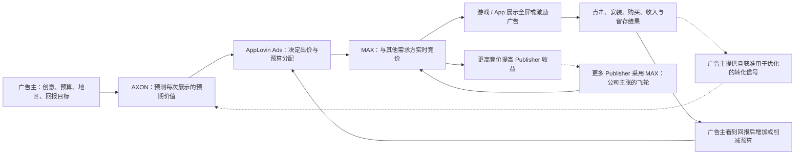

# AppLovin：从手游买量工具到效果广告操作系统

> 生成时间：2026-08-03
> 查询：AppLovin 是一个怎样的产品，它是如何崛起的
> 证据边界：以 SEC 文件、官方产品文档和投资者材料为主，以 AppsFlyer 等第三方数据作有限交叉验证；公司自报规模和因果解释均单独标注。2026 Q2 尚未披露。

## 摘要

AppLovin 不是一个面向消费者的 App，也不应再被理解成一家手游公司。它更准确的定义是：

> **一套垂直整合的实时效果广告系统：MAX 位于移动 App 广告供给和拍卖入口，AppLovin Ads 承接广告主预算，AXON 预测每次展示值多少钱，并用安装、购买和收入结果持续调整出价。**

它向广告主交付的不是“流量包”，而是在指定地区、预算和 ROAS / purchaser cost / lead value 目标下自动购买广告展示；向 App 开发者交付的则是更充分的竞价、广告填充和变现收益。当前主要库存仍来自移动 App，尤其是游戏中的全屏、插屏和激励视频。[2026 年开放公告](https://www.applovin.com/en/blog/applovin-ads-now-open)称平台触达超过 10 亿日活用户，但这是公司口径。

它的崛起也不是 2023 年突然出现一个“神奇 AI 模型”：

1. **2012–2017**：从手游开发者最痛的买量与变现问题切入，先证明 performance advertising 的现金流；
2. **2018–2022**：通过 MAX、自营游戏、Adjust、MoPub 和 Wurl，把供给、需求、测量和反馈链拼齐；
3. **2023–2024**：AXON 2 上线与经营拐点同期出现；公司将改善归因于价值预测和自动出价效率提升，但公开数据不能隔离模型、规模、价格和客户组合各自的贡献；
4. **2025–2026**：出售低利润游戏工作室，成为几乎纯广告平台，并把已在手游中验证的系统扩展到电商、订阅和 Leads。

最强的正面判断是：它已在移动游戏广告中形成真实、高利润、可自我强化的交易闭环。最强的反面判断是：最近增长越来越由“每次安装净收入”而非安装量驱动；归因是否等于增量、MAX 拍卖是否长期中立，以及电商广告主能否在补贴后长期留存，公开证据仍不足。

## 一、它到底是什么产品

### 1. 产品栈

| 组件 | 面向谁 | 消费的输入 | 核心处理 | 交付的结果 |
|---|---|---|---|---|
| **AppLovin Ads** | 游戏、电商、订阅和 Lead 广告主 | 商品或 App、创意、地区、预算、ROAS / purchaser cost / lead value 目标及转化信号 | 调用 AXON 自动寻找受众、估值、出价和分配预算 | 展示、点击、安装、购买或 Lead，以及对应的效果报告 |
| **AXON** | 不单独售卖，是广告系统底层引擎 | 广告互动、安装、转化、收入、重复购买及拍卖反馈 | 预测一次展示可能产生的未来价值，决定是否出价、出多少和把预算投向哪里 | 更符合广告主回报目标的实时竞价与资本配置 |
| **MAX** | App / 游戏开发者和广告网络 | 开发者 SDK 广告位、格式和规则，以及多个 bidder / network 的报价 | 在一次展示机会中进行实时统一竞价和收益优化 | 胜出广告、填充率、eCPM、开发者收入和广告质量数据 |
| **Adjust** | 移动营销团队 | 安装、事件、收入和渠道数据 | 归因、分析和反作弊 | 营销测量 SaaS；其数据默认与 AXON 隔离，除非客户明确指示共享 |
| **Wurl** | 流媒体内容方和 CTV 广告主 | 内容、频道和 CTV 需求 | 内容分发、广告和观众获取 | CTV 分发和变现 |

`AppDiscovery → Axon Ads Manager → AppLovin Ads` 是需求侧产品的命名演化；AXON 现在只指底层 AI 引擎，而不是整个广告平台。[2025 10-K](https://www.sec.gov/Archives/edgar/data/1751008/000175100826000010/app-20251231.htm)披露 Axon Ads Manager 贡献实质上全部收入，说明 MAX、Adjust、Wurl 的战略作用很重要，但公司并不是多个收入引擎均衡发展的 SaaS 集团。

### 2. 真正的 operating loop

这个循环解释了 AppLovin 的产品本质：它不是简单“把广告展示给很多人”，而是把每一次广告机会当成一个微型投资决策——先估计未来现金回报，再决定愿意为这次展示支付多少。

其中实线表示可直接观察的交易链，虚线表示有条件反馈或公司主张的飞轮。转化数据只有在广告主提供且授权使用时才会反馈优化；Adjust 数据默认不进入 AXON。

广告主可以设定目标，但平台并不保证结果。公司披露，大多数广告合同可以随时取消，因此广告主能否持续获得可接受回报，直接决定预算是否留下。[2025 10-K](https://www.sec.gov/Archives/edgar/data/1751008/000175100826000010/app-20251231.htm)

### 3. 商业模式与一个容易误读的会计点

广告主购买的是由 AXON 优化的广告交易；AppLovin 再向提供广告位的 Publisher 支付对价。由于公司在大部分交易中被认定为代理人、并不控制 Publisher 的库存，其 SEC 收入口径通常是**广告主交易价格扣除 Publisher 对价后的净额**，不是全市场经过平台的 gross ad spend。[2025 10-K](https://www.sec.gov/Archives/edgar/data/1751008/000175100826000010/app-20251231.htm)

因此：

- [公司宣称](https://www.applovin.com/en/blog/applovin-business-model)的年度广告主 media spend 超过 110 亿美元，不等于 GAAP 收入；
- 不能拿不同周期的 spend 与收入直接相除，推导一个可靠“抽成率”；
- 80% 以上的 Adjusted EBITDA margin 是建立在净收入分母上的软件经营杠杆，不能直接与按 gross revenue 记账的广告平台横比。

## 二、它是怎么崛起的

### 阶段一：2012–2017，从开发者自己的痛点切入

公司 2011 年注册，通常把 2012 年视作创立和开始运营。创始团队最初想做帮助用户发现游戏的产品，却发现自己也缺少高效推广工具，随后转向为移动开发者做用户获取和效果广告。

这个起点很关键。手游广告天然具备适合机器优化的条件：展示频率高，安装、首购、复购和 LTV 容易量化，广告主也愿意按回报持续调预算。2014 年，AppLovin 通过 TechCrunch 对外声称已达到约 1 亿美元 gross revenue run rate、只融资约 400 万美元；这是公司自报且不是 GAAP 净收入，但足以说明早期产品已找到强付费需求。[TechCrunch 2014 报道](https://techcrunch.com/2014/07/31/applovin-100-million/)

### 阶段二：2018–2020，自营游戏和 MAX 解决冷启动

2018 年，公司一面开始收购和投资游戏工作室，一面买下后来成为供给侧核心的 MAX。到 2024 年底，公司披露自 2018 年以来已在 33 项收购和战略合作上投入约 41 亿美元，其中包括 MAX、自营游戏、Adjust、MoPub 和 Wurl。[2024 10-K](https://investors.applovin.com/files/doc_financials/2024/q4/AppLovin-Corporation-10K-FY24_As-Filed.pdf)

自营游戏在当时不是单纯的内容业务，而是一个受控实验场：

- 它们提供稳定广告位，是供给；
- 它们需要买用户，是需求；
- 公司能直接观察安装、付费、留存和 LTV，是反馈；
- MAX 和 AppDiscovery 可以先在内部验证，再服务外部开发者。

这帮助一个双边广告市场跨过“没有供给就没有需求、没有需求就没有供给”的冷启动。2020 年 AXON 1 上线，算法开始把这套数据和交易关系系统化。这里“游戏是训练场”主要来自公司 IPO 文件的 flywheel 叙事，外部无法精确拆分它对模型提升的贡献。[2021 S-1](https://www.sec.gov/Archives/edgar/data/1751008/000119312521340630/d223514ds1.htm)

### 阶段三：2021–2022，补齐测量与市场流动性

2021 年 AppLovin IPO，并在当年收购 Adjust，补上移动归因、测量和反作弊能力。需要注意的是，[SEC 披露](https://www.sec.gov/Archives/edgar/data/1751008/000175100826000010/app-20251231.htm)和公司说明都强调 Adjust 数据默认独立存放；不能简单把 Adjust 的全部客户数据算作 AXON 的数据护城河。

2022 年，公司以 10.5 亿美元现金收购 Twitter 的 MoPub。[收购完成公告](https://investors.applovin.com/news/news-details/2022/AppLovin-Closes-Acquisition-of-Twitters-MoPub-Business/default.aspx)证明了交易和整合计划；随后公司在 [2022 Q1 股东信](https://www.sec.gov/Archives/edgar/data/1751008/000119312522147577/d318835dex992.htm)中称，超过 90% 的 MoPub 客户已迁至 MAX。这不是普通的功能收购，而是一次供给和买方关系向同一拍卖池的结构性迁移，使 MAX 更有条件形成竞价流动性。

这两年 Apple ATT 也重写了移动广告规则：跨 App 追踪需要用户授权，且平台禁止用其他标识符绕过授权或进行设备指纹识别。[Apple ATT 规则](https://developer.apple.com/app-store/user-privacy-and-data-use/)AppLovin 不能被描述为“不依赖身份信号”，ATT 也是其长期风险；更准确的说法是，它在 ATT 前已经积累 SDK、游戏场景、上下文信号、实时竞价和结果反馈，因此比只依赖 IDFA 的广告网络更有条件转向概率预测。

### 阶段四：2023，AXON 2 上线与财务拐点同期出现

AXON 2 于 2023 年 4 月开始推出。公司称新引擎能够同时预测互动、点击、购买概率、购买金额和重复行为，然后据此估算一次展示的未来价值。[AXON 2 官方公告](https://investors.applovin.com/news/news-details/2023/AppLovin-AI-Advancements-to-Accelerate-Partner-Growth/default.aspx)

财务变化几乎同步出现：

- 2023 Q2 Software Platform 收入 4.06 亿美元，同比增长 28%，分部 Adjusted EBITDA margin 67%；
- 2023 Q3 Software Platform 收入 5.04 亿美元，同比增长 65%，分部 Adjusted EBITDA margin 72%；
- 2023 全年持续经营广告收入约 18.42 亿美元。

[2023 Q2 股东信](https://investors.applovin.com/files/doc_financials/2023/q2/AppLovin-2Q23-Shareholder-Letter.pdf)把改善归因于 AXON 2 带来的安装量和每安装收入提升；[2023 Q3 业绩](https://investors.applovin.com/files/doc_financials/2023/q3/3Q23-AppLovin-Earnings-Press-Release.pdf)显示增速继续扩大。公开数据可以证明“模型升级与经营拐点高度相关”，但没有同客户随机对照、旧模型同期 A/B 或完整 cohort，因此不能证明 AXON 2 单独解释了所有增长；MAX/MoPub 规模、市场恢复、广告价格和客户组合也同时在变。

### 阶段五：2024–2025，从飞轮公司变成纯广告平台

持续经营广告业务的年度结果显示了非常强的经营杠杆：

| 时期 | 收入 | 同比 | Adjusted EBITDA | Margin | 持续经营净利润 |
|---|---:|---:|---:|---:|---:|
| 2023 | 18.42 亿美元 | — | 12.36 亿美元 | 67.1% | 4.58 亿美元 |
| 2024 | 32.24 亿美元 | +75% | 24.12 亿美元 | 74.8% | 15.90 亿美元 |
| 2025 | 54.81 亿美元 | +70% | 45.12 亿美元 | 82.3% | 34.33 亿美元 |
| 2026 Q1 | 18.42 亿美元 | +59% | 15.57 亿美元 | 84.5% | 12.06 亿美元 |

来源：[2025 10-K](https://www.sec.gov/Archives/edgar/data/1751008/000175100826000010/app-20251231.htm)、[2026 Q1 10-Q](https://www.sec.gov/Archives/edgar/data/1751008/000175100826000044/app-20260331.htm)。Adjusted EBITDA 是公司定义的 non-GAAP 指标。

2025 年 6 月 30 日，公司把 10 家游戏工作室出售给 Tripledot，以合同现金 4 亿美元加约 20% 股权为主要对价；计入交割调整和股权公允价值后的会计总对价约 7.156 亿美元。[出售公告](https://investors.applovin.com/news/news-details/2025/AppLovin-Completes-Sale-of-Mobile-Gaming-Business-to-Tripledot-Studios/default.aspx)

游戏业务后期只有约二成量级的分部利润率，远低于广告平台。出售使财务报表、资本和管理资源更聚焦广告；剥离后 2026 Q1 的业绩则提供了广告系统可独立经营的初步证据。代价是公司失去一部分完全可控的第一方试验场与供给，今后更依赖第三方开发者继续选择 MAX。

### 阶段六：2025–2026，从游戏广告扩到所有效果广告主

2024 年公司开始测试 web / e-commerce 广告；2025 年 10 月先以邀请或推荐方式开放自助产品；2026 年 6 月才正式以 AppLovin Ads 名称向所有广告主开放。当前支持 target ROAS、cost per purchaser 和 Lead 三类主要优化目标，并明确把自己定位为 performance marketing，而非品牌广告平台。[AppLovin Ads 开放公告](https://www.applovin.com/en/blog/applovin-ads-now-open)

因此应把两件事分开：

- **移动游戏效果广告**：已有多年经营规模、财务结果和第三方相对排名支持；
- **面向电商、订阅和所有企业的通用广告平台**：产品已开放，但长期留存、增量效果和与 Meta / Google 的预算替代关系仍处在较早验证期。

[AppsFlyer 2024 Performance Index](https://www.appsflyer.com/company/newsroom/pr/performance-index-17-released/)基于 2024 上半年 35,000 个 App、135 亿次非自然安装；在游戏广告媒体源中，AppLovin 位列 power ranking 第 2、volume ranking 第 3。这只是在 AppsFlyer 样本与口径内提供相对排名证据，不证明 AppLovin 的利润、全市场份额或每笔转化的因果增量。

## 三、为什么是它赢出来

### 1. 选中了最适合自动优化的广告场景

游戏里的安装、购买和 LTV 比品牌认知更快、更清晰；全屏和激励视频也比普通 banner 拥有更强注意力。结果信号越密集，模型就越容易在短时间内判断一类用户、创意和广告位是否值得继续投资。

### 2. MAX 占据供给决策层，而不只是做一个需求侧算法

很多广告技术公司只能去别人控制的交易所买流量。MAX 作为 Publisher SDK 和 mediation 层，能在展示发生的一刻看到哪些需求方参与、谁赢、谁输、怎样的报价能提高 Publisher 收益。Publisher 仍拥有库存，但 MAX 占据了非常关键的拍卖入口。

### 3. 自营游戏与收购组合解决双边市场的冷启动

自营游戏先提供可控的供给、需求和结果反馈；MAX 提供拍卖；Adjust 补测量；MoPub 一次性扩大供需流动性；Wurl 提供 CTV 邻接扩展。任何单件资产都不足以解释崛起，组合起来才构成闭环。

### 4. ATT 是相对优势放大器，不是单因果答案

ATT 让确定性跨 App 身份识别变弱，传统买量方式受损。AppLovin 已经拥有场景上下文、广告互动、拍卖胜负和转化结果，能够把“认出具体是谁”部分转为“预测这类机会值多少”。但 Apple / Google 再收紧 SDK、IP、概率匹配或归因政策，同样会伤害它。

### 5. AXON 2 的目标不是只提点击率，而是改善资本配置

按公司的机制解释，如果模型能更准地预测购买金额和重复行为，就能为高价值机会出更高价，同时避开低价值流量；广告主得到可接受 ROAS 后增加预算，竞价变强又可能提高 Publisher 收益并吸引更多供给。这是 AppLovin 主张的核心复利，而公开数据只能确认 AXON 2 上线与经营拐点同期，不能识别模型、MAX / MoPub 规模、价格和客户组合各自的贡献。

### 6. 达到规模后剥离低利润游戏业务

按公司早期文件的解释，自营游戏曾帮助供给、需求和实验闭环冷启动；到出售前，它又是相对低利润、重运营的资产。2025 年剥离使资源和管理注意力集中到广告系统，但并非无代价：公司也失去了部分可控第一方试验场和确定性供给。

## 四、战略边界与最强 anti-thesis

### 1. 增长越来越依赖每次安装的价值，而不是安装量

2024 年安装量增长约 50%、每安装净收入增长约 22%；2025 年安装量只增长约 3%、每安装净收入却增长约 72%；2026 Q1 安装量下降约 18%、每安装净收入增长约 93%。[2026 Q1 10-Q](https://www.sec.gov/Archives/edgar/data/1751008/000175100826000044/app-20260331.htm)

这既与 AXON 可能更有效一致，也是最大的可持续性问题：最近收入增量主要体现为**聚合净收入 / 安装**上升，而非安装量扩张。该比率也会受到广告主、地区、产品组合、竞价价格、归因口径和非安装业务影响，公开披露不能把它单独归因于模型效率；如果这些因素回归，收入可能比安装规模更快下修。

### 2. 归因不等于真正新增

平台可以说某次购买“归因于 AppLovin”，却不自动证明如果没有广告，这笔购买就不会发生。真正需要的是广告主总收入层面的 geo holdout、随机对照或 lift test，而不是平台内 ROAS 截图。公开材料没有披露足够的跨行业 cohort、自然转化拆分和独立增量实验。

### 3. MAX 同时是拍卖入口，AppLovin Ads 又是重要竞买方

垂直整合是护城河，也形成治理张力：同一公司一边组织拍卖，一边用自有需求参加拍卖。公司称 MAX 是 unbiased auction、合作伙伴获得同等标准竞价信号，Adjust 数据也默认隔离；但公开资料中没有足以独立验证长期拍卖中立性的完整审计。这里应提出审计问题，而不是在无裁决情况下推定存在自我优待。

### 4. 核心供给仍集中在移动 App 和游戏

AppLovin Ads 虽已面向所有企业开放，但触达场景主要仍是移动游戏库存。电商品牌是否愿意长期把预算从 Meta、Google、Amazon 迁来，取决于用户意图、创意供给、测量整合和增量性；游戏中的成功不能无条件外推。

### 5. 平台政策、隐私与监管是结构性风险

Apple 和 Google 控制广告标识符、SDK 权限、App Store 规则和归因框架，也同时拥有广告业务。监管和诉讼状态必须精确分层：SEC 在 2026 年 2 月的 FOIA 回复中称涉及 AppLovin 的调查仍为 `active and ongoing`，但没有公开指控或违法认定；[2026 Q1 10-Q](https://www.sec.gov/Archives/edgar/data/1751008/000175100826000044/app-20260331.htm)披露的证券集体诉讼仍在程序中，公司否认原告诉称；荷兰隐私集体诉讼于 2026 年 5 月登记，尚未裁判。调查、原告诉称和经裁判事实不能混为一谈。[SEC 调查状态报道](https://news.bloomberglaw.com/privacy-and-data-security/sec-says-probe-involving-applovin-still-active-and-ongoing-1)、[荷兰集体诉讼登记册](https://www.rechtspraak.nl/registers/centraal-register-voor-collectieve-vorderingen)

### 6. AXON 的技术细节仍是黑箱

公开资料能看到输入类别、业务输出和财务相关性，却看不到模型架构、训练数据边界、旧新模型 A/B、客户级留存或行业拆分。最稳妥的判断是“算法能力与交易闭环共同有效”，而不是把全部增长归功于无法外部检查的单一模型。

### 7. 模型优势可能商品化，竞争者掌握更强第一方关系

Meta、Google 和 Amazon 拥有登录身份、第一方消费信号和成熟广告主关系，模型能力本身也会扩散。加上 AppLovin 的广告合同大多可随时取消，真正需要验证的护城河应落在 MAX 供给分发、拍卖流动性和结果反馈速度，而不是未经独立审计的“模型永远领先”。

## 五、最终判断

AppLovin 的独特之处不是“AI 做广告”这句口号，而是它把**广告主利润目标、Publisher 广告位、实时拍卖和获准使用的转化反馈**接成了一个非常短的闭环。MAX 让它站在供给决策层，AppLovin Ads 带来预算，AXON 负责展示价值预测；自营游戏和并购帮助解决冷启动，AXON 2 上线则与更高单位经济的拐点同期出现。

因此，它的崛起可以概括为：

> **2012–2022 用十年搭出交易和反馈基础设施，2023 年 AXON 2 上线与经营拐点同期出现，2024–2026 以净收入、利润率和现金流释放积累，并尝试从手游广告扩张为通用效果广告平台。**

但它最强和最脆弱的地方是同一个闭环：广告主合同可随时取消，平台政策可以改变信号，归因可能高估增量，拍卖与竞买的垂直整合需要信任。移动游戏主战场已经成立；“成为跨行业通用效果广告平台”仍需要广告主长期留存、独立增量实验和拍卖中立审计来证明。

## 后续验证清单

- 电商 / 游戏广告主的分行业收入、留存和净支出扩张；
- 去除促销额度后的自助客户 cohort；
- 广告主级 geo holdout / lift，而非仅平台归因 ROAS；
- 安装量与每安装净收入的后续拆分；
- MAX 对自有需求与第三方需求的独立拍卖审计；
- Apple / Google 对 SDK、IP、概率匹配和归因政策的变化；
- SEC 调查和相关诉讼的最终结果，而非中途指控。
