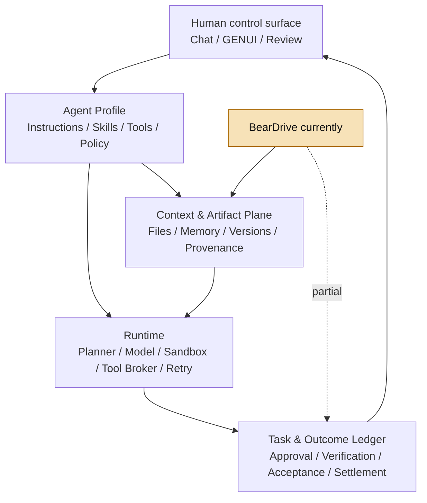

# BearDrive 产品机制、Agent Workspace 关系与 Combo 启发

> 生成时间：2026-08-14（Asia/Shanghai）
> 查询：研究 BearDrive，分析它与 Agent Workspace 的关系，以及对 Combo 的启发
> 结论状态：产品机制已由官网、官方 Docs、公开源码与本地测试交叉核验；市场采用、托管云 SLA 与合规仍缺独立证据

## 一、结论先行

BearDrive 不是完整的 Agent Workspace，也不是 memory / RAG、Agent Runtime 或普通网盘。它最准确的位置是：

> **Agent Workspace 的 Artifact / Context Data Plane——面向多人、多设备、多 Agent 的 filesystem-native 共享状态层。**

它把 Agent 已经在读写的普通本地文件变成团队共同工作对象：提问前同步、编辑后推送，保留版本、作者、设备、Agent session、内部/公开链接和 read heat。这个窄切口真实、工程完整，而且抓住了 Agent 产品从“回答”走向“工作”的一个基础缺口：**Agent 的产出不能只留在 chat 中，必须成为有稳定身份、可继续编辑、可交接、可追溯、可恢复的 Artifact。**

但 BearDrive 只拥有 **File State System of Record**，不拥有 **Task / Run / Outcome System of Record**。它能证明哪个文件被谁改过，不能证明一项任务成功、客户验收、外部副作用完成，或一笔钱应该结算。

对 Combo 的结论不是“转去做 Agent Drive”，而是：

1. 把 BearDrive 视为可接入的 `Context Source / Artifact Sink`，不要自建通用文件同步作为当前主线；
2. 把 `Run → ArtifactVersion` 变成一等产品对象；
3. 严格分开可持续修改的 **Live Workspace** 与用于交付、验收、退款、结算的 **Immutable Delivery Snapshot**；
4. 借鉴 turn-boundary hooks，将 Combo 每次运行做成 `pre-run context checkout → isolated execution → post-run artifact commit`；
5. Provider Workspace 只有持续承载 `Service / Customer / Order / Result / Exception / Economics`，才是 Practice OS；一个通用文件夹本身不是 Combo 的战略对象。

一句话压缩：

> **BearDrive 证明“共享文件层”是 Agent Workspace 缺失的 substrate；Combo 应拥有其上面的 Service Object、Verified Delivery 与交易闭环，而不是重新发明下面的 Drive。**

---

## 二、BearDrive 到底是什么

### 2.1 它解决的真实问题

BearDrive 的目标用户不是偶尔和 Chatbot 对话的人，而是已经让 Claude Code、Codex、Gemini CLI、Hermes 等 Agent 大量产生 HTML dashboard、Markdown、CSV、PDF、研究报告、PRD 与 launch material 的个人或小团队。

这些文件当前常散落在：

- 不同成员的 laptop；
- 不同 Agent 的 workspace；
- Slack attachment；
- `final-v2-FINAL.html` 式无法辨认的副本；
- Git、Notion、Drive 与本地目录之间的手工搬运链。

BearDrive 的产品承诺不是“帮 Agent 记住一句事实”，而是让**工作本体**留在 Agent 已经理解的普通路径中，并在所有团队成员与 Agent 之间保持最新。官方首页和 README 都将其定位为 shared folder / Google Drive for AI agents；官方团队案例则把它描述为内部 LLM wiki 与 Agent artifacts 的共同目录。[产品页](https://beardrive.ai/)、[官方 GitHub README](https://github.com/runbear-io/beardrive)、[官方团队案例](https://beardrive.ai/blog/how-our-team-works-with-ai-agents/)

### 2.2 用户工作流

一个典型流程是：

```text
用户明确选择要同步的 folder
  ↓
bdrive init 创建或加入 Project
  ↓
在每台机器的 Agent user config 中注册 hooks
  ↓
Turn 开始：blocking pull + 告知有哪些 teammate files 发生变化
  ↓
Agent 在普通本地路径读写真实文件
  ↓
文件编辑后：async push + session attribution + read-log
  ↓
Hub：浏览、History、restore、read heat、内部链接、公开分享
```

关键不是多一个“同步命令”，而是把同步移出人的记忆，嵌入 Agent 的自然工作边界。官方 setup 甚至要求安装 Agent 必须先问用户同步哪个文件夹，避免把整目录视为默认授权。[Agent setup](https://docs.beardrive.ai/start/setup/)、[Hooks in detail](https://docs.beardrive.ai/manual/hooks/)

### 2.3 实现机制

公开实现不是一个 landing page POC，而是一套完整的 CLI、daemon、sync protocol 与 hub：

- `bdrive init` 将任意目录变为 Project，文件仍是普通 local files；
- 每个设备只写自己的 append-only journal；
- 文件内容以 SHA-256 content-addressed blob 保存；
- 所有设备按 `(lamport, time, device, seq)` replay，最终收敛到相同状态；
- 同路径并发编辑采用 last-writer-wins，失败版本保留为 `.bdrive-conflict-*`；
- hub 负责 authentication、organizations、projects、ACL、history、share links、viewer 与 read analytics；
- hub 可使用 S3、GCS、R2、MinIO 或普通目录保存文件/历史，客户端仅通过 HTTPS hub 通信；
- 支持完整 history 的 export/import，可在 managed cloud 与 self-hosted hub 之间迁移。

来源：[同步原理](https://docs.beardrive.ai/concepts/how-it-works/)、[Project files](https://docs.beardrive.ai/reference/project-files/)、[Hub configuration](https://docs.beardrive.ai/reference/hub-config/)、[迁移](https://docs.beardrive.ai/reference/migration/)

### 2.4 Agent integration 的准确边界

“任何能读写文件的 Agent 都能使用”基本成立，但官网的自动新鲜度和 attribution 还依赖 platform hooks：

| 平台 | 典型 hook 边界 | 状态 |
|---|---|---|
| Claude Code | `UserPromptSubmit` / `PostToolUse` | 官方支持 |
| Codex | `UserPromptSubmit` / `PostToolUse` | experimental，需开启 `codex_hooks` |
| Gemini CLI | `BeforeAgent` / `AfterTool` | 官方支持 |
| Hermes | `pre_llm_call` / `post_tool_call` | 官方支持 |

三个 hook 分别负责：

1. 提问前 blocking pull；
2. 编辑后 async push；
3. 将 read events 排队，在后续 sync 中汇报。

没有 hooks 的 Agent 仍能读写同步目录，但不能保证 turn-boundary freshness、session attribution 和完整 read heat。[Hooks in detail](https://docs.beardrive.ai/manual/hooks/)

一个值得借鉴的安全边界是：

> **共享 Agent 读什么，不共享 Agent 自动运行什么。**

`AGENTS.md`、`CLAUDE.md`、skills、commands 可以作为普通文件同步；但 `.codex/hooks.json`、`.claude/settings*.json`、`.mcp.json`、`.git/` 被硬排除，因为这些文件可能让另一位成员在本机自动执行命令。[Project files](https://docs.beardrive.ai/reference/project-files/)

### 2.5 Read heat 是第二产品层

BearDrive 不只保存谁写了什么，还尝试记录哪些内容真的被使用：

- Human viewer read；
- public share read；
- Agent tool read；
- reads × staleness；
- hot path；
- per-agent folder coverage；
- 单个 session 读/写文件的关联。

这使它从“同步工具”向 **Context observability** 走了一步。不过 read heat 只是 usage evidence：文件被读过不等于内容正确，更不等于它改善了完成率、退款率或复购率。[What agents read](https://docs.beardrive.ai/guides/what-agents-read/)

---

## 三、它与 Memory、Git、Drive、Notion 的关系

BearDrive 官方最诚实的产品边界是“不替代”：

| 相邻产品 | 主要对象 | BearDrive 补的层 | 不能替代的部分 |
|---|---|---|---|
| Memory / RAG | 可召回事实、偏好、语义片段 | 完整 Artifact 与真实路径 | 检索排序、语义压缩、遗忘、learning |
| Git | 需要 branch / review / CI 的 code | 低 ceremony 的共享 context 与 artifacts | code review、merge、build、release |
| Drive / Dropbox | 面向人的 document library | project 内真实 local files + turn-boundary freshness | 企业文档生态与 office collaboration |
| Notion / Wiki | 人读写的 page / block | 非 prose 文件、Agent 直接 grep/edit 的工作集 | 结构化文档体验与组织知识治理 |

官方自己的表达是：code 走 pull request，context 走 sync；memory 负责 recall，folder 保存 artifact；Notion 继续做 wiki，BearDrive 位于下面。[官方 Compare](https://beardrive.ai/compare/)

这给出一个更普遍的产品判断：

> **Filesystem 不是完整知识系统，却是跨 Agent、跨工具、跨模型最便宜的 interoperability substrate。**

MCP / memory API 需要每个 Agent 接 schema；普通文件天然被 shell、editor、IDE、Agent、browser 与用户共同理解。它像 Agent 生态里的 ABI：能力不高级，但兼容性极强。

---

## 四、它与完整 Agent Workspace 的关系

### 4.1 定义

本知识库此前将 Workspace 理解为项目/任务级 Context Container，而完整 Agent 产品至少还要有 runtime、permission、verification 和 human control surface：[context-container](/wiki/concepts/context-container/)、[agent-runtime](/wiki/concepts/agent-runtime/)、[creative-cowork-product](/wiki/maps/creative-cowork-product/)。

因此一个完整 Agent Workspace 更像“办公室”，BearDrive 更像“跨办公室共享的文件柜 + 版本账本”。



### 4.2 机制级对照

| 维度 | BearDrive 已拥有 | 完整 Agent Workspace 还需拥有 |
|---|---|---|
| System of Record | 当前文件、版本、作者、设备、Agent session | Task、Run、Tool Call、权限决定、外部 effect、验收、结算 |
| Context | 文件、`AGENTS.md`、skills、grep、read heat | Context builder、相关性选择、scope/TTL、语义检索、冲突与遗忘治理 |
| Execution | 调用外部 Codex / Claude / Gemini / Hermes hooks | Model loop、Tool Router、Sandbox、Scheduler、Retry、Secret Broker、HITL |
| Collaboration | Org、Project RBAC、History、links、conflict copy | Task owner/lease、review、branch/fork/merge、approval、takeover |
| Artifact lifecycle | write → sync → link → history → restore | Artifact identity、review state、immutable delivery、deployment/release state |
| Portability | 真实文件、self-host、全历史 export/import | Agent definition、runtime policy、environment、task state、secret mapping |
| Permission | Project 级 `none/read/write/admin` | 每 Agent / Run / path / tool / external system 的 least privilege |
| Verification | 可证明文件变更与 read/write provenance | 可证明 outcome、side effect、customer acceptance 与 business finality |

因此：

> **BearDrive 可以成为 Agent Workspace 的 durable data plane，但不能单独成为 Agent Workspace 的 control plane 或 execution plane。**

### 4.3 它最强的战略位置

BearDrive 的最佳位置不是把所有上层都做掉，而是成为跨 Harness 的 Context Source / Artifact Sink：

```text
Claude / Codex / Gemini / Hermes
        ↕
BearDrive shared files + provenance
        ↕
不同 Agent Workspace / Runtime / business application
```

如果真实文件、自托管与 open source 逐渐商品化 shared context plane，通用 Agent Workspace 就很难只靠“文件持久化”形成护城河。价值会继续上移到：

- 领域对象与业务状态；
- 确定性权限与外部系统 finality；
- verified outcome；
- 异常补救；
- 交易、结算与责任；
- 多次任务后的结果驱动路由。

这恰好是 Combo 应该拥有、BearDrive 不拥有的层。

---

## 五、对 Combo 最重要的启发

### 5.1 不改变当前战略：不做通用 Agent Drive

Combo 当前唯一优先级仍是验证：一类垂直创作者能否把重复专业服务变成真实收费、可交付、可复购且贡献毛利为正的 AI Service Product。当前不是 Agent Marketplace，也不是通用 Workspace。依据：[active_context](/active_context/)、[combo-current-story-2026-07](/output/reports/combo/narrative/combo-current-story-2026-07/)。

BearDrive 证明“Agent artifacts 需要共享状态”，但没有证明 Provider 会为一个 generic shared folder 付费，更没有证明共享文件会带来 Combo 的真实交易。

所以近期应：

- **Buy / integrate below**：外部 folder、本地文件、BearDrive-like adapter 均可作为 Context input；
- **Build above**：Service definition、Context permission、Run、Artifact、verification、delivery、acceptance/refund、economics；
- 不把“workspace 文件数、Agent 数、read 数”当作业务成功指标。

### 5.2 分开 Live Workspace 与 Immutable Delivery

BearDrive 的 working link 默认跟随文件最新内容，这对团队协作很好，但不适合交易凭证：一次交付之后文件若继续变化，Buyer、Provider 与 Combo 会失去“当时交付了什么”的共同真值。

Combo 应显式建立两类对象：

```text
Provider Live Workspace
    └─ 持续修改的方法、素材、draft、working artifacts

        freeze approved state
                ↓

ServiceVersion + ContextSnapshot
                ↓
Isolated Run + Tool/Permission Policy
                ↓
ArtifactVersion + Verification Evidence
                ↓
Immutable Delivery Snapshot
                ↓
Accept / Revise / Refund / Settle
```

建议最小交付真值：

```text
Delivery =
  ServiceVersion
  + ContextSnapshot
  + RunReceipt
  + ArtifactVersion
  + VerificationVerdict
  + AcceptanceState
```

这与 Combo 当前“记录什么用户、什么任务、什么版本下得到什么结果”的机制连续，但将 Artifact 与 Delivery 从聊天附件升级为正式业务对象。

### 5.3 把 turn boundary 变成 run transaction boundary

BearDrive 最值得复制的不是 sync engine，而是边界设计：

- turn 前 pull；
- work 中正常读写；
- edit 后 push；
- 记录 session read/write。

Combo 可以对应成：

```text
Pre-run checkout
  - pin ServiceVersion
  - resolve authorized ContextRefs
  - 生成 ContextManifest（hash / scope / TTL / provenance）
  - 挂载 read-only input + copy-on-write workspace

Execution
  - isolated Runtime
  - tool / path / egress allowlist
  - side effects 走 approval / idempotency

Post-run commit
  - ArtifactVersions
  - exact read-set / write-set
  - verifier evidence
  - cost / latency / exception
  - delivery snapshot
  - optional approved write-back
```

这比“把所有聊天历史都塞回 Context”更可审计，也更容易计算单任务经济。

### 5.4 借鉴 read/write graph，但不提前叫 Context Network

BearDrive 已经拥有一个有趣 primitive：

```text
Agent session → read files → write artifacts → freshness / history
```

Combo 应最小化记录：

```text
ServiceVersion
  → authorized Context objects actually read
  → Run / tool effects
  → ArtifactVersions
  → verification
  → accept / revise / refund / repeat purchase
```

但必须守住证据边界：

- read heat ≠ relevance；
- relevance ≠ correctness；
- attributed artifact ≠ accepted outcome；
- accepted outcome ≠ incremental revenue；
- 多条 trace ≠ network effect。

只有当某类 Context 的使用在对照/holdout 中持续提高完成率、降低退款率或提升复购，才可以升级为 Context-Fit Routing 信号。现有平台门槛仍以 [combo-current-story-2026-07](/output/reports/combo/narrative/combo-current-story-2026-07/) 和 [active_context](/active_context/) 为准。

### 5.5 Provider Workspace 必须是 Practice OS，不是 folder UI

BearDrive 的对象是文件。Combo 远期 Provider Workspace 的对象必须是服务生意：

| Generic Agent Workspace | Combo Practice Workspace |
|---|---|
| Folder / file | Service / SKU / version |
| Read / write | Order / fulfillment / exception |
| History | Result / adoption / refund / remedy |
| Member | Provider / operator / Partner / Buyer authority |
| Usage | Revenue / model cost / human time / contribution margin |
| Share link | Delivery / acceptance / settlement state |

只有 Provider 在订单之间持续管理多项 Service Product、客户 Context、版本、异常、结果、复购和 economics，并产生 recurring WTP，Workspace 才连续升级为 Practice OS。这个定义与 [combo-platform-future-vision-and-evolution-2026-08-03](/output/reports/combo/narrative/combo-platform-future-vision-and-evolution-2026-08-03/) 一致。

### 5.6 “Data, not orders” 应成为 Runtime 原则

BearDrive 阻止同步 hooks、MCP config 和 `.git/`，说明共享文件不应自动获得执行权。Combo 应进一步强化：

- Provider content / uploaded context 默认是 data，不是 system instruction；
- 输入 Context 默认 read-only；
- 输出写到独立 Artifact area；
- executable config、Skills、hooks、MCP 与普通资料分层；
- 每 Run 绑定 tool/path/egress policy；
- publish、external write、share、write-back 都需显式 authority；
- 交易交付绑定 immutable version，不使用 latest link 作为 finality。

---

## 六、最强反命题与风险

### 6.1 共享文件夹不等于协作协议

Last-writer-wins 能保证收敛和保留失败副本，却不回答：

- 谁有权决定 final；
- 哪个版本经过 review；
- 两个语义冲突如何 merge；
- 哪个内容可进入生产或交付。

BearDrive 的团队案例依赖 `sources immutable / wiki agent-owned / log append-only` 等 `AGENTS.md` 约定。它们是很好的 Harness 纪律，不是产品层强制状态机。

### 6.2 Artifact history 不等于 verified outcome

文件被创建、同步、打开、恢复都是真实事件，但无法证明：

- 内容正确；
- 外部系统已更新；
- 客户采用；
- 任务完成；
- 服务满足 Contract；
- 应该退款或结算。

因此 BearDrive history 可成为 Run evidence 的一部分，不能替代 Combo 的 verifier、acceptance 与 settlement ledger。

### 6.3 权限与撤权仍偏粗

当前可验证的是 Project 级 `none/read/write/admin`；per-path access 仍在 roadmap。`.bdriveignore` 是团队共享的同步范围，不是不同 Agent 的安全 ACL。撤销成员访问也不会删除其机器上已 materialize 的本地副本；其此前创建的 public links 还需另行 revoke。[Permissions](https://docs.beardrive.ai/concepts/permissions/)、[Roadmap](https://github.com/runbear-io/beardrive/blob/main/ROADMAP.md)

### 6.4 Secret 防护只是 backstop

官方明确说 `.bdriveignore` 是 hygiene，不是 security control。公开分享时只扫描前 1 MiB 的部分 credential pattern，且可强制绕过；link 指向该 file identity 的最新内容，share 后再写入 secret 不会重新扫描。[Scoping and secrets](https://docs.beardrive.ai/guides/scoping/)

### 6.5 不是端到端加密的零知识系统

Hub 必须能渲染、下载、扫描与保存内容，因此不能把它描述为 client-side / E2E encrypted storage。官方公开材料没有给 BearDrive managed cloud 独立的 DPA、subprocessor list、数据地域、RPO/RTO、删除 SLA 或 SOC 2 scope。母公司材料不能自动视为 BearDrive cloud 的合规证明。

### 6.6 “所有版本永久保存”同时是负担

当前永久保留所有 blob 有恢复优势，但也带来 storage cost、right-to-delete 与数据生命周期问题。Journal compaction、blob GC policy 仍在 roadmap。[Roadmap](https://github.com/runbear-io/beardrive/blob/main/ROADMAP.md)

### 6.7 工程成立不等于市场成立

截至本次核验：

- managed cloud 仍为免费 beta，未来计划按 team 收费，价格与 beta 截止日未定；
- self-hosted 完整产品为 AGPL-3.0，永久免费；
- 最新正式 release 为 `v0.15.0`（2026-08-11），仍是 pre-1.0；
- 官方案例主要是 Runbear 自己团队的 dogfood；
- 未见可独立核验的外部客户规模、付费留存、容量、SLA、恢复演练或安全认证证据。

来源：[Pricing](https://beardrive.ai/pricing/)、[v0.15.0](https://github.com/runbear-io/beardrive/releases/tag/v0.15.0)、[Changelog](https://github.com/runbear-io/beardrive/blob/main/CHANGELOG.md)

---

## 七、建议的两周验证，而不是立项造 Drive

### Hypothesis 1：外部 Workspace Adapter 足够

用 plain folder 或 BearDrive-like adapter 跑通三类 Combo workflow：

1. Provider 只读 Context input；
2. isolated Runtime 使用 pinned snapshot；
3. 输出 ArtifactVersion + delivery link。

**Gate**：两周内覆盖至少 80% 的核心 Artifact/Context 需求，则不自建通用 sync engine；工程资源继续投向 verification、交易与 settlement。

### Hypothesis 2：Working link + Delivery snapshot 能消灭版本争议

给 20 次真实服务交付同时生成：

- mutable working link；
- immutable delivery snapshot。

**Gate**：100% 可定位成交/验收版本，版本争议归零，修改周转时间下降至少 30%。

### Hypothesis 3：跨 Run Context 复用是否真的省时

在同一垂类、同一 Provider 的连续订单中记录：

- 新任务 Context 准备时间；
- 实际 read-set；
- 重复上传/解释次数；
- 完成/修改/退款；
- Provider 人工时间。

**Gate**：复用 Context 至少降低 30% 的配置或交付时间，并且 Provider 愿意在订单之间持续维护/付费，才增加 Practice Workspace 投资。

### Hypothesis 4：Read graph 是否能改善结果

积累至少 100 次 Run 后，再检验 freshness、read coverage 与接受率/退款率的关系；自动 Context routing 必须经过 holdout，不使用相关性直接声称因果 uplift。

### P0 对象模型

| 对象 | 最小字段 |
|---|---|
| `ServiceVersion` | service id、creator approval、contract/rubric、policy hash |
| `ContextSnapshot` | authorized refs、content hashes、scope、TTL、provenance |
| `RunReceipt` | service/context version、tool effects、read/write set、cost、status |
| `ArtifactVersion` | artifact id、immutable hash、creator/agent/run provenance |
| `DeliverySnapshot` | artifact versions、verdict、delivered_at、buyer-visible proof |
| `AcceptanceState` | accept / revise / refund / escalate / settle |

---

## 八、证据分层

### 已验证事实

- 官网、Docs 与公开源码对“普通本地文件 + journal/blob sync + hub + hooks + history + read heat”的描述一致；
- 当前公开源码快照：`runbear-io/beardrive@0dd474baab501766a23100665225f3fa33c0362c`（2026-08-13 commit）；
- 本地执行 `go test ./...`：11 个 Go packages 全部通过；
- Project ACL、share、restore、export/import、self-host、AGPL-3.0 与 turn hooks 有真实代码/文档；
- managed cloud 当前免费 beta，self-host 免费；正式 release 为 `v0.15.0`。

### 公司主张，未独立验证

- “秒级”同步在真实团队和网络条件下的稳定性；
- managed cloud 的 backups、容量和可用性；
- unlimited projects / teammates / history 的长期商业口径；
- 所有版本“永久”保留在托管服务中的实际保障；
- 团队使用后 Agent “更聪明”或节省多少时间。

### 本报告的系统推断

- BearDrive 是 Agent Workspace 的 Artifact / Context Data Plane；
- filesystem 可成为跨 Agent 的通用 interoperability substrate；
- read/write graph 可能成为 Context graph 的上游 primitive；
- generic file persistence 会商品化，价值上移到 domain object、verified outcome 与 transaction；
- 对 Combo 最合理的形态是 adapter / substrate，而不是新的战略 wedge。

### 关键缺失证据

- 非 founder 的客户数、WAU/retention 与付费意愿；
- 大项目/多成员/多设备压力测试与冲突率；
- managed cloud 的 SLA、RPO/RTO、删除与合规；
- read heat 对工作质量或时效的因果改善；
- “Agent artifact sync”能否支撑足够高且持久的 per-team WTP。

---

## 九、最终判断

BearDrive 是一个**产品边界比口号更好**的项目：它没有试图做新模型、通用 Agent、Workflow Builder 或 all-in-one Workspace，而是抓住一个明确 primitive——Agent 使用真实文件，但团队没有一个对 Agent 友好的共同文件状态。

它最可能成为：

> **不同 Agent Workspace 之间的 portable shared context / artifact substrate。**

对 Combo 最深的启发有两层：

1. **交互层**：一次 Agent 服务不能以 chat answer 结束，必须交付可定位、可修改、可分享、可追溯的 Artifact；
2. **商业层**：可修改的 Workspace 与不可变的成交版本必须分离，只有 `ServiceVersion + ContextSnapshot + RunReceipt + ArtifactVersion + Acceptance` 才能承担交易 finality。

因此最优行动不是复制 BearDrive，而是让 Combo 的 Runtime 能读这样的 workspace、向这样的 artifact plane 写结果，同时牢牢拥有 BearDrive 不拥有的部分：**Service Object、权限、验证、交付、异常、退款、结算与 Provider economics。**

## 数据来源

### BearDrive 一手资料

- [BearDrive 产品页](https://beardrive.ai/)
- [官方 Docs / LLM 全文入口](https://docs.beardrive.ai/llms-full.txt)
- [公开 GitHub](https://github.com/runbear-io/beardrive)
- [当前核验 commit](https://github.com/runbear-io/beardrive/tree/0dd474baab501766a23100665225f3fa33c0362c)
- [同步原理](https://docs.beardrive.ai/concepts/how-it-works/)
- [Hooks](https://docs.beardrive.ai/manual/hooks/)
- [Project permissions](https://docs.beardrive.ai/concepts/permissions/)
- [Agent read analytics](https://docs.beardrive.ai/guides/what-agents-read/)
- [Pricing](https://beardrive.ai/pricing/)
- [Compare](https://beardrive.ai/compare/)
- [Roadmap](https://github.com/runbear-io/beardrive/blob/main/ROADMAP.md)
- [Changelog](https://github.com/runbear-io/beardrive/blob/main/CHANGELOG.md)
- [官方团队使用案例](https://beardrive.ai/blog/how-our-team-works-with-ai-agents/)

### 知识库内部来源

- [active_context](/active_context/)
- [context-container](/wiki/concepts/context-container/)
- [agent-runtime](/wiki/concepts/agent-runtime/)
- [creative-cowork-product](/wiki/maps/creative-cowork-product/)
- [combo-current-story-2026-07](/output/reports/combo/narrative/combo-current-story-2026-07/)
- [combo-platform-future-vision-and-evolution-2026-08-03](/output/reports/combo/narrative/combo-platform-future-vision-and-evolution-2026-08-03/)
- [maka-agent-project-analysis-2026-07-20](/output/reports/maka-agent-project-analysis-2026-07-20/)
- [context-network-loop-against-general-agent-2026-07](/output/reports/agora/product/context-network-loop-against-general-agent-2026-07/)

---
*由 LLM 从知识库与 BearDrive 官方公开资料查询生成*
