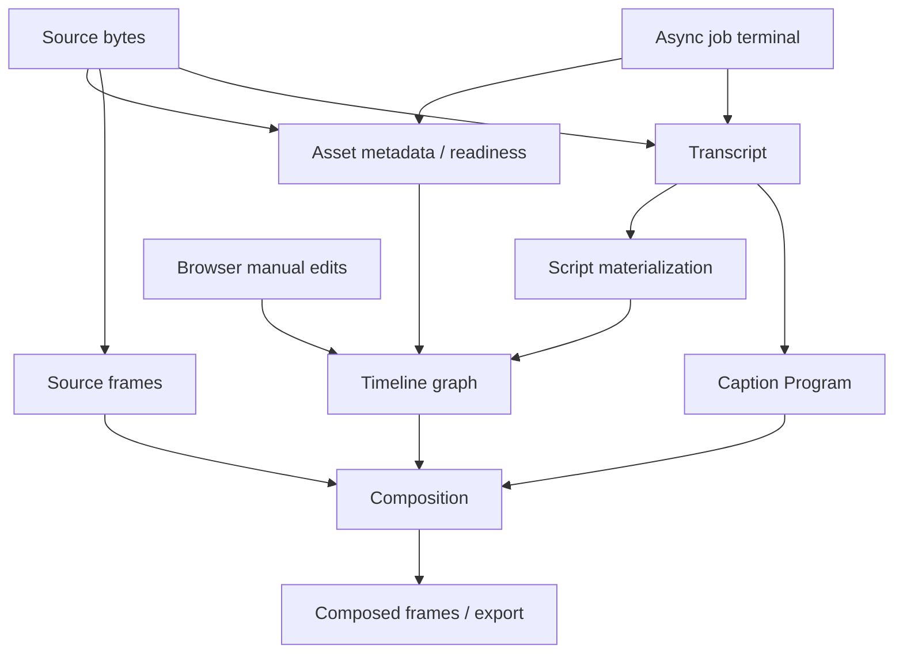
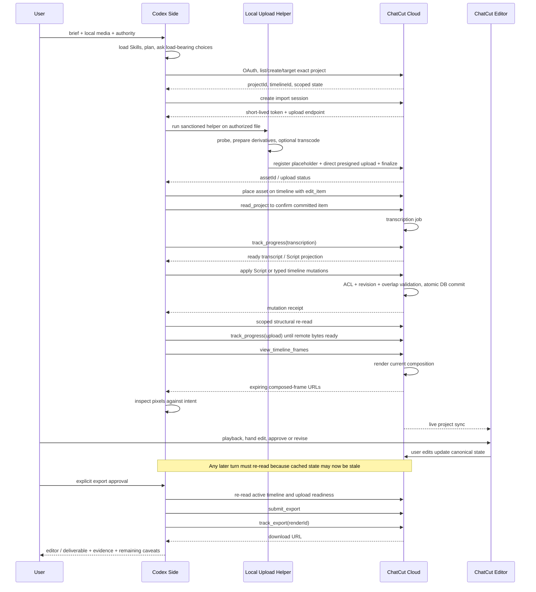

# ChatCut × Codex：真实上下文、Skills 渐进披露与多模态工程状态管理

> **一句话结论**：安装 ChatCut 后，Codex 并不会持续“记住整段视频”，也不会在每个 request 中展开 15 个 Skills 和 52 个 tool schemas。真实系统更接近 **轻量能力目录 → 按需 Skill / tool → pointer-first 项目读取 → 局部文本与像素证据**。它在项目结构读取上做出了较好的 Progressive Disclosure，但 Skill 内部仍有大单体、跨 host 污染和 contract drift；长视频的 `read_script` 全量 transcript 与缺少 temporal/audio proof，是当前多模态上下文的主要瓶颈。

**生成时间**：2026-08-10

**查询**：安装 ChatCut 后，一次真实 Codex context 可能是什么样；其 Skills 是否全面、渐进披露是否合理；已有视频工程中间产物后，多模态上下文应怎样管理。

**审计快照**：ChatCut Codex Plugin `0.2.22@aef81a744fc7dc23679ba443455fc6724fed9815`；当前 authenticated hosted MCP 为 52 tools。

**边界**：只读检查本机 Skills、当前 Codex deferred tool catalog 和 live tool schemas；没有读取用户 ChatCut 项目，没有上传、mutation、generation 或 export。

---

## 0. 直接答案

### 一次真实 context 由什么组成？

不是一个大 prompt，而是五层：

```text
Host 常驻规则与对话
→ ChatCut Skill metadata catalog
→ 本轮触发的几个 SKILL.md
→ 本轮需要的少数 tool schemas
→ 工具返回的局部 project / transcript / pixels / job state
```

通常不会进入 context 的内容：完整视频 bytes、完整项目数据库、持续播放的 editor 画面、所有 15 个 Skill 正文、所有 52 个完整 schema、所有 timeline 和所有历史帧。

### Skills 全面吗？

**能力覆盖很全面，结构质量中上，执行一致性一般。总体 6.8/10。**

- 好：覆盖 ingest、transcription、speech editing、multicam、MG、shader/effect、video generation、voice/SFX、music、verification、export、product help、error recovery；专业剪辑顺序和 editable-state 纪律强。
- 不足：缺 generic timeline editing、独立 captions、B-roll/stock、image generation、voice isolation、marker/template/workflow-skill、collaboration/versioning 等轻量路由；13/52 live tools 没有被任何 Skill 正文显式提及。
- 更严重：多个 Skill 引用了当前不存在的 tool / Skill，说明静态 Skills、Codex adapter 和动态 MCP manifest 没有发布闭包测试。

### Progressive Disclosure 合理吗？

**方向正确，只完成了一半。**

- L1 catalog 很轻；完整 Skill 按任务读取；tool schemas 在当前 Codex harness 中 deferred；project 也支持分阶段、分页、按 frame range 读取。
- 但 90% 的核心 Skill 行数集中在 6 个大 Skill。一次普通口播字幕任务会加载约 929 行 Skill；`read_script` 在 external MCP 又会返回完整 source transcripts，长视频时动态业务上下文可能比静态 prompt 更重。

### 多模态上下文该怎样管？

**不要缓存“视频”，缓存指针和局部观察。**

```text
稳定 ID / revision / frame range / readiness
+ 当前任务意图与用户约束
+ 必要 transcript window
+ 必要 source frames
+ mutation 后的新 composed frames
```

ChatCut project 是外部 durable state；LLM context 只是按需读取的 working set。每次继续编辑前，应重新确认 project / timeline / affected range，而不是相信上一轮的完整快照。

---

## 1. 一个真实 request 的上下文长什么样

假设用户说：

> “把这段 20 分钟口播去掉口癖和超过 0.8 秒的停顿，加中文字幕，保留可编辑工程，先不要导出。”

### 1.1 Context 分层

| 层 | 是否常驻 | 本例内容 | 不包含什么 |
|---|---|---|---|
| Host instructions | 是 | system / developer、工作区 `AGENTS.md`、对话历史、权限与工具使用规则 | ChatCut 项目内容 |
| Skill catalog | 是 | 15 个 ChatCut Skill 的 name、description、path | 15 个完整正文 |
| Triggered Skills | 按需 | `chatcut-plugin-basics`、`talking-head-guide`、`transcription`、`verification`；本地上传才加 `asset-import` | music、video-gen、export 等未触发 Skill |
| Tool catalog / schema | deferred / 按需 | 发现并使用 project、Script、caption、verification 工具 | 不必一次展开全部 52 个 schema |
| Dynamic project context | 工具调用后 | project/timeline IDs、asset readiness、Script、caption revision、受影响 items、关键帧 | 完整 DB、完整媒体 bytes |
| Human review surface | 外部 | ChatCut live editor | 不会自动成为模型的持续视觉流 |

[OpenAI 官方说明](https://help.openai.com/en/articles/20001256-plugins-in-codex/)把 plugin 定义为 Skills 与外部 Apps / actions 的组合；当前 ChatCut plugin 再通过 hosted MCP 暴露项目能力。[官方 plugin repo](https://github.com/ChatCut-Inc/agent-plugin)

### 1.2 当前 Codex runtime 的直接证据

本轮可观察到：

- 初始可见工具说明没有展开 52 个 `mcp__chatcut__*` declarations；
- deferred tools 存在于当前 `ALL_TOOLS` catalog；
- `ALL_TOOLS` 共 160 个条目，其中 ChatCut 52 个；
- 可以精确发现单个 tool 的描述 / declaration，再调用它；
- 因此不能把 52 个 schema 的全部字符都算作每次模型 request 的必付 token。

无法从外部确认 host 内部 router / index 的隐性成本，所以只报告模型可观察的加载行为，不推断内部实现。

### 1.3 本例的实际执行上下文


本例可能使用：

```text
list_projects / target_project
browse_assets / track_progress
read_project
read_script / clean_script / apply_script
read_captions / edit_captions
view_timeline_frames
get_editor_url
```

用户明确“不导出”，所以不加载 `export`，也不调用 `submit_export`。

### 1.4 可量化的静态成本

以下是本机 `0.2.22` 字符量；token 仅用英文内容约 4 chars/token 粗估，不是精确 tokenizer 结果：

| 内容 | 字符量 | 粗略 token 等价 | 是否每次都付 |
|---|---:|---:|---|
| 15 个 Skill description 正文 | 4,883 | ~1.2k | catalog 层通常是 |
| 加上名称、路径和格式的 Skill catalog | ~6,425 | ~1.6k | 当前会话可见 |
| 全部 15 个 `SKILL.md` | 176,026 | ~44k | 否 |
| 本例 5 个可能读取的 Skill | 96,760 | ~24k | 本地 import 时才是 5 个 |
| 全部 52 个 tool descriptions / declarations | 192,336 | ~48k | 当前 harness 否，deferred |
| 本例 12 个候选 tool descriptions | 63,873 | ~16k | 取决于 host 如何按需注入 |

最大的 Skill 是 `talking-head-guide`，63,769 bytes；最大的 tool contract 是 `edit_captions`，27,938 chars。20 分钟 transcript 又可能成为更大的动态成本。

所以真正的上下文风险排序通常是：

```text
长 transcript / Script
> monolithic task Skill
> 复杂单 tool schema
> Skill catalog metadata
```

---

## 2. Skills 设计审计

### 2.1 覆盖结构

15 个 Skills 分成四类：

| 层 | Skills | 作用 |
|---|---|---|
| Base / routing | `chatcut-plugin-basics`, `known-errors`, `verification` | 项目模型、共同边界、失败与验收 |
| Host adapters | `asset-import`, `create-motion-graphics`, `widget-forms`, `export` | Codex-specific import、MG、form、delivery |
| Editing craft | `talking-head-guide`, `multicam-sync`, `transcription` | 语音内容剪辑与同步 |
| Generation / product | `video-gen`, `voice`, `music`, `shader-gen`, `product-help` | 生成、声音、效果、UI/计费知识 |

它们覆盖了 ChatCut 当前最强 speech-led wedge 的主循环：

```text
import
→ transcript ready
→ A-roll / multicam structure
→ B-roll / MG / voice / music / captions
→ structural + visual verification
→ user review
→ explicit export
```

这个顺序比“一个万能视频 Skill”更专业，也正确地区分：

```text
generated ≠ ready ≠ placed ≠ verified ≠ approved ≠ exported
```

### 2.2 评分

| 维度 | 分数 | 说明 |
|---|---:|---|
| 能力覆盖 | 8.5/10 | speech-led 主链很完整 |
| 编辑工艺与安全 | 9.0/10 | non-destructive、依赖顺序、verify-before-done 很强 |
| 路由清晰度 | 7.0/10 | base → task adapter 主干成立 |
| Progressive Disclosure | 6.0/10 | reference 分层好，但大 Skill 抵消收益 |
| Runtime contract 一致性 | 5.0/10 | 多处工具/Skill 名漂移 |
| Host 隔离与可维护性 | 4.5/10 | Codex/Claude 规则仍混在 shared craft |
| **总体** | **6.8/10** | 领域内容强，工程发布治理拖后腿 |

### 2.3 哪些 Progressive Disclosure 做得好

当前 15 个核心 `SKILL.md` 共 2,301 行；references / examples 另有 2,029 行，即总 Markdown 的 46.9% 已被放到 on-demand 层。

正例：

- `product-help` 本身仅 38 行，并明确要求只读当前问题对应的一个 reference；
- `video-gen` 根据选定模型读取 Seedance / Kling / Omni reference；
- `voice` 只有在需要视觉同步时才读 `video-sync.md`；
- `shader-gen` 只在 property edit 时读专门 reference；
- `multicam-sync` 把确定性对齐数学放进 helper，而不是全写成 prompt；
- `read_project` 默认只给 orientation，之后才取 timelines、单 timeline、items 或 markers；
- `read_captions` 支持 Card、exact frame、frame range、pagination 和 revision；
- `inspect_asset` 先用 metadata 选 asset，再取一个 asset 的指定 source times / speech ranges。

这与 [progressive-disclosure](/wiki/concepts/progressive-disclosure/) 的 L1 metadata → L2 instruction → L3 resource 结构一致。

### 2.4 为什么只做对了一半

分布高度两极化：

- 9 个 Skill 只有 17–40 行；
- 6 个 Skill 有 216–638 行；
- 这 6 个大 Skill 占核心 Skill 行数 90%。

典型 eager cost：

| 请求 | eager Skill 组合 | 行数 |
|---|---|---:|
| 口播字幕 | basics + talking-head + transcription + verification | 929 |
| Voiceover sync | basics + voice + video-sync ref + verification | 813 |
| Seedance 2.5 | basics + video-gen + model ref | 782 |
| 简单 builtin zoom | basics + shader-gen | 472 |

主要单体问题：

- `talking-head-guide` 把 A-roll、MG timing、B-roll、multicam、ducking、music、caption 全放在 638 行里；
- `voice` 把 TTS、voice catalog、audition、visual sync、SFX、Claude widget 混在 398 行里；
- `multicam-sync` 的 optional speaker-follow 没有拆为 reference；
- `shader-gen` 让简单 zoom 也加载 LUT、GLSL generation / editing；
- `chatcut-plugin-basics` 的 browser handoff、delete/restore、connector boundary 对所有任务 eager。

最值得警惕的是 live `read_script`：

> external surface 会返回当前 `timeline.md` 和所有 source 的完整 `library/<filename>.md` transcripts。

它有 `track`、`showSilence`、`refreshCache`，但没有 asset / segment / frame-range 的局部 Script materialization。对多小时、多机位、多个 transcribed assets 的工程，这会直接破坏 progressive disclosure。

### 2.5 覆盖缺口

52 个 live tools 中，39 个被 Skills 显式提及，13 个没有：

```text
convert_motion_graphic_to_video
detach_audio
edit_project
export_motion_graphic_prores
isolate_voice
manage_markers
manage_skill
manage_template
register_converted_video
report_user_friction
request_asset_download
search_fonts
web_browser
```

真正值得补轻量 Skill 的能力：

- generic timeline editing；
- captions；
- B-roll / stock sourcing；
- `isolate_voice`；
- markers / templates；
- reusable `manage_skill` workflow；
- project / timeline / media-pool management；
- collaboration / version history；
- Codex image generation。

不需要为 telemetry 或底层两阶段 helper 都建用户 Skill，但必须在 governing adapter 中明确它们的边界。

### 2.6 Contract drift 如何破坏渐进披露

Progressive Disclosure 的前提是“按需拿到的下一层是正确的”。当前存在：

| 被披露的 symbol | 当前 live reality | 影响 |
|---|---|---|
| `render_cloud_screenshot` | `view_timeline_frames` | base 一加载就给错视觉工具名 |
| `push_asset` | Codex 应走 `import_media` + helper | shared craft 覆盖正确 host adapter |
| `multicam_sync` | external manifest 无，只有 transcript fallback | 首选路径不可执行 |
| `read_av_script` | manifest 无 | B-roll source selection 断路 |
| `voice-isolation` Skill | 不存在；live tool 是 `isolate_voice` | Skill-to-Skill 路由断路 |
| `submit_image` | manifest 无 | model reference 深层才失败 |
| `generate.ts` / `${CLAUDE_SKILL_DIR}` | Codex package 不适用 | shader 路由跨 host 污染 |
| `mcp__skill__submit_voice` 等 | 实际 namespace 是 `mcp__chatcut__*` | voice 示例不可直接执行 |
| raw `<widget>` | Codex adapter 明令禁止 | active Skill 与 host adapter 冲突 |

于是渐进披露可能从“少而准”变成“少但错”。这个问题比单纯 token 多更严重。

---

## 3. 多模态上下文不是一个容器，而是一张依赖图

### 3.1 Pointer-first 模型

正确心智模型：

```text
LLM context
  = stable pointers
  + current task intent
  + selected text windows
  + selected pixels / audio evidence
  + latest mutation receipts

Durable media/project state
  = local source files + ChatCut DB/object storage/editor
```

模型不需要持续持有视频 bytes。媒体、工程和异步任务留在外部系统；Codex 只在需要判断或验证时，把小片观察取进来。

### 3.2 状态层与失效条件

| 上下文层 | 权威来源 | 建议缓存 | 失效条件 |
|---|---|---|---|
| Source bytes | 本地原文件或上传后的 cloud asset | path、size、mtime/hash、`assetId ↔ sourcePath` | 文件变化、重新导入、asset 替换 |
| Asset metadata | `browse_assets` / `inspect_asset` | stable assetId、type；ready/transcript state 短缓存 | upload/finalize、generation、transcription、edit/delete |
| Transcript | source transcript | 当前 phrase/window、segment identity | ASR retry、fix、asset change |
| Project/timeline | `projectId + timelineId` DB state | affected tracks/items/ranges、canvas/fps | 任意 mutation、switch、duplicate、用户 UI 手调 |
| Script | `timeline.md` materialization | 一次 read/edit/apply cycle working copy | 外部 timeline edit、transcript change、apply |
| Caption Program | timeline caption state | relevant Card IDs、revision、page/range | caption edit、refresh、transcript/timeline change |
| Source frames | local bytes / `inspect_asset` | 当前选择所需 source-time pixels | source bytes/code 变化；timeline edit 不影响 |
| Composed frames | `view_timeline_frames` | 当前 claim 的 fresh pixels | timeline/caption/effect/MG/asset/canvas/readiness 变化 |
| Browser/editor | live user workbench | clean URL、明确 projectId | 用户随时可改；boot token 不持久化 |
| Async jobs | durable job row | jobId/renderId、terminal result | pending 到 check-back 时失效；完成会反向失效 asset 等 cache |

### 3.3 依赖图



任何上游变化都必须让下游观察失效。上一轮看过的 composed frame 不是下一轮的 proof。

### 3.4 三种时间坐标必须分开

| 坐标 | 例子 | 用途 | 常见错误 |
|---|---|---|---|
| Source time | `sourceTimesMs` | 原素材内画面 / 语音位置 | 当成 timeline 时间 |
| Timeline frame | `fromFrame`, `toFrame`, item start | 工程中的 placement、cut、overlay | 忽略 fps 或 active timeline |
| Rendered composition frame | `view_timeline_frames([N])` | 当前成片像素 | 用 source frame 代替 |

`inspect_asset` 明确只看原 asset；`view_timeline_frames` 才能看到 crop、caption、overlay、effect 与层叠结果。

---

## 4. 已有中间工程后，下一轮应该怎样恢复上下文

### 4.1 不要“恢复整个项目”，恢复 Working Set

建议维护一个逻辑上的 `ProjectContextRef`：

```yaml
target:
  projectId: uuid
  timelineId: uuid
  canvas: { fps: 30, width: 1080, height: 1920 }
task:
  intent: "60 秒采访精剪，字幕已完成，下一步补 B-roll"
  constraints:
    - "不改 A-roll wording"
    - "不导出"
workingSet:
  frameRanges: [[0, 450], [900, 1200]]
  assetIds: [a1, a7]
  itemIds: [i3, i8]
  captionRevision: rev-...
pending:
  jobs: [{ id: j2, kind: video-generation, state: running }]
evidence:
  - { frame: 120, observedAt: timestamp, upstreamEpoch: 7 }
openDecisions:
  - "第二个 B-roll 用 stock 还是 generation"
```

这是推荐的 context manifest，不是 ChatCut 当前已经公开实现的 durable object。当前 API 没有统一 project revision / context digest，所以它只能作为 working note，不能替代 live reread。

### 4.2 Resume algorithm

```text
1. 明确 projectId + timelineId
2. 读 orientation，不沿用旧 active target
3. 判断本轮任务需要哪一种 modality
4. 只读 affected track / item / frame range / transcript window
5. 检查 asset 和 async readiness
6. mutation 前使用可用的 stale guard / caption revision / validation
7. mutation 后重读结构
8. 对即将声称的视觉结果取 fresh composed frames
9. 让用户在 live editor 播放；除非明确要求，不 export
```

`read_project` 的 omitted collection 是 unknown，不是 empty；有 cursor 就是 partial。恢复上下文的第一原则是“只读够用，但不把没读到误判为不存在”。

### 4.3 按任务选择 modality

| 当前任务 | 首选 context | 不该加载什么 |
|---|---|---|
| 删除口癖/重排语义 | Script + relevant transcript | 全项目像素、所有 tool schemas |
| 找一句话的位置 | `find_transcript` bounded results | 完整 `read_script` |
| 选 B-roll source | asset metadata + selected source frames + nearby transcript | 整段视频连续 frames |
| 放 MG / captions | timeline range + source/composed frame + design constraints | unrelated timelines |
| 改 crop/layout/effect | affected item detail + exact composed frames | full transcript |
| 检查字幕 | caption Cards by frame/range + revision + composed frame | raw ASR 全文 |
| 跟踪生成 | jobId + one status read | 重复提交、完整旧 prompt history |
| 导出 | target timeline/range + current approval + renderId | 所有 source transcripts |

### 4.4 Cache / invalidation 策略

没有统一 native revision 的层面，可以在 Agent working state 中维护 synthetic epochs：

```text
assetEpoch[assetId]
transcriptEpoch[assetId]
timelineEpoch[timelineId]
compositionEpoch[timelineId]
```

Mutation 后：

- transcript fix / retry 完成 → transcript、Script、Caption cache 失效；
- item / track / timeline mutation → affected project slice、Script、dependent caption/B-roll/MG/music、composed frames 失效；
- asset/MG code/LUT 变化 → source preview 与所有引用它的 composed frames 失效；
- upload/generation terminal → readiness 与所有 byte-dependent observation 失效；
- 用户在 editor 手调或时间跨度较长 → timeline snapshot 直接视为 unknown；
- track reorder → 丢弃 `V1/V2` alias cache，继续以 stable track ID 重读；
- active timeline 改变 → 所有省略 timelineId 的旧假设失效。

### 4.5 最小 proof gate

```text
fresh target
→ terminal readiness
→ fresh structural read
→ concurrency / revision guard
→ mutation
→ fresh structural readback
→ exact composed pixels
→ human playback / approval
```

任何一层缺失，只能说“局部状态已写入”，不能说“中间工程或成片已经正确”。

---

## 5. 多模态管理当前真正的缺口

### 5.1 Transcript 读取仍可能全量爆炸

`read_script` 的 external surface 返回完整 `timeline.md` 和 full source transcripts。改进方向：

- `assetIds` / `sourceRangesMs` / `timelineFrameRange` selector；
-先返回 source index + outline，再按 segment 拉取；
- 让 `apply_script` 支持基于 immutable base revision 的局部 patch，而非总传完整 `timelineMd`；
- 对长项目提供 transcript summary / topic index，但 summary 不能替代原文 edit anchors。

### 5.2 静态帧不能证明时间行为

`view_timeline_frames` 一次最多返回 9 个 frame，非常适合检查：

- 黑帧、crop、safe area；
- caption / logo / overlay collision；
- MG 的几个关键时刻；
- cut boundary 前后。

但它不能充分证明：

- transition 是否顺滑；
- animation timing；
- lip-sync / audio-video sync；
- pacing；
- flicker / one-frame flash；
- audio mix。

当前 52-tool surface 没有明显的低码率 timeline segment / temporal preview verifier。最终仍需用户播放，或增加 `render_review_segment(fromFrame,toFrame,lowRes)` + machine/video inspection。

### 5.3 Audio proof 更弱

当前 connector 的强项是 transcript、track roles、waveform/loudness metadata 和 audio processing jobs；远端 asset 没有明确的 bounded audio audition / model-listen surface。`view_timeline_frames` 又没有声音。

所以：

- “已调用 smooth / isolate”只能证明操作状态；
- “听起来平滑、没有爆音、配乐不压人声”仍需真实音频播放或导出的局部试听；
- 应增加 bounded audio preview、waveform + loudness evidence、cut-boundary click detector。

### 5.4 没有统一 durable Context Manifest

当前有：

- project / timeline / item state；
- task-local transcript cache；
- Script stale guard；
- Caption revision；
- async jobs；
- user saved workflow Skills。

但没有公开：

- project-wide revision / change cursor；
- `diffSince(revision)`；
- per-run context snapshot；
- immutable visual evidence digest；
- workflow run ledger；
- user approval receipt。

`manage_skill` 保存的是方法，不是当前项目 working state。不能拿 workflow Skill 当 project memory。

### 5.5 Browser 是人类工作台，不是自动上下文

用户打开 editor 并不意味着 Codex 持续看到画面。只有显式 browser inspection、source-frame inspection 或 composed-frame call 返回的像素，才进入模型视觉上下文。

同时 external MCP 的 cloud render 只能看到 DB/S3 可读状态；browser-local blob、pending upload 或尚未同步的 UI state 可能与 cloud view 不同。这是多表面一致性风险，不应把 editor“打开着”当成同步证明。

---

## 6. 更好的 Skill / Context 架构

### 6.1 Skill 分层

```text
L1 Catalog
  name + 1–2 sentence trigger + capabilities + estimated cost

L2 Task Core
  50–120 行，只写 invariant、decision tree、proof gate

L3 References
  具体模型、工艺、host adapter、examples

L4 Live Contract
  当前 manifest 的 exact schema；不在 Skill 重复维护参数
```

建议拆分：

- `talking-head-core` + `a-roll-cleanup` + `b-roll` + `speech-mg` + `speech-music` + `captions` + `speaker-follow`；
- `voice-tts` + `voice-audition` + `voice-sync` + `sfx`；
- `shader-builtins` + `shader-generate` + `lut`；
- 新增 `generic-timeline-editing`、`captions`、`isolate-voice`、`workflow-skills`；
- host-specific namespace、path、widget、upload 只留在 Codex / Claude adapters。

### 6.2 发布门禁

每次 Skill 或 hosted MCP 发布前：

```text
extract referenced tool names
→ resolve host-specific aliases
→ compare against live manifest snapshot
→ verify referenced Skills / references / scripts exist
→ run representative route traces
→ block release on unresolved symbol
```

这比继续写“以 manifest 为准”更有效，因为错误往往恰好藏在按需加载的深层 reference 中。

### 6.3 项目 Context API

最值得新增的不是更多 editing tools，而是：

```text
get_project_context_manifest(projectId, timelineId)
get_changes_since(revision)
read_script_range(assetIds | sourceRanges | frameRange)
render_review_segment(fromFrame, toFrame, lowRes, withAudio)
record_review_evidence(digest, upstreamRevision)
record_user_approval(revision, scope)
```

这样才能把“外部项目状态”真正变成可恢复、可裁剪、可验证的 Agent context substrate。

---

## 7. 最终判断

ChatCut 的上下文架构有两个非常好的直觉：

1. **项目是外部状态，不是 prompt。**
2. **视觉需要 source / composition 两套观察面，不能用 mutation success 代替像素证据。**

它也已经把 Project、Asset、Transcript、Script、Caption、Timeline、Job、Frame 分成不同读取面，`read_project` / `read_captions` / `inspect_asset` 的范围化接口很值得学习。

但 Skills 还停留在“把一个巨大 system prompt 分成 15 个包”的中间阶段：catalog 和 references 是 progressive 的，6 个大 Skill、full-transcript Script、跨 host 指令和 contract drift 又削弱了收益。

因此最准确的裁决是：

> **ChatCut 的多模态 state retrieval 设计优于它的 Skill packaging；项目上下文是 pointer-first、局部、可刷新，但 Skill context 仍偏 eager，temporal/audio verification 仍偏弱。**

对一个已有中间工程，正确做法不是“把历史全喂回模型”，而是：

```text
重新定位目标
→ 恢复最小 Working Set
→ 按 modality 取局部证据
→ mutation 后主动失效旧 cache
→ 用 fresh composed evidence 和人类 playback 验收
```

---

## 8. ChatCut 云端与 Codex 侧如何分工

### 8.0 先修正“本地 vs 云端”这个二分

把系统画成“本地 Codex Agent + ChatCut 云端”会漏掉两个重要角色，也会错误暗示模型推理发生在用户机器上。更准确的是四方结构：

```text
User / Creative Authority
        ↓ brief、取舍、授权、批准
Codex Side
  ├─ OpenAI model：推理、规划、内容判断
  └─ Desktop host：Skills、工作区、本地工具、MCP client
        ↓ OAuth + typed tool calls
ChatCut Hosted Runtime
  ├─ MCP control plane
  ├─ canonical project graph / jobs
  ├─ media object storage
  └─ transcription / generation / render workers
        ↕ project sync / review
ChatCut Web / Desktop Editor
        ↓ 人类观看、手调、验收
User
```

因此本文用“**Codex 侧**”表示 reasoning model 与本地 host 的组合；只有文件探测、导入准备和本地 source inspection 等明确步骤发生在用户机器上。ChatCut 项目状态和主要媒体计算仍在 ChatCut 云端。

### 8.1 一句话责任模型

> **Codex 是 semantic planner / compiler front-end，ChatCut cloud 是 domain runtime / state store / media job system，Editor 是 debugger / review workbench，用户是 creative director 与最终 authority。**

| 角色 | 主要负责 | 权威状态 | 不应被误认为 |
|---|---|---|---|
| 用户 | brief、素材授权、付费/创意分叉、观看与最终批准 | 创作意图、接受标准、最终 approval | 只在失败时介入的 fallback |
| Codex model | 理解意图、拆依赖、选证据、生成 Script / JSX / prompts / typed edits | 当前 request 的工作假设，不是持久工程 truth | 视频 renderer、项目数据库、本地模型 |
| Codex Desktop host | 加载 Skills、执行本地只读检查、运行官方 upload helper、发 MCP calls、展示证据 | 本地文件与 tool receipts | ChatCut backend 或 editor automation bridge |
| ChatCut cloud | 权限、项目图、transcript/caption、任务、媒体存储、合成帧、导出 | 云端 canonical project / job / media state | 单次无状态的生成 API |
| Web / Desktop editor | 展示 live project、播放、人工细调、review | 用户眼前的当前编辑体验，但不是 immutable receipt | 上传/导出的 Agent 后门或自动 proof |

这个分工解释了为什么 ChatCut 能“在 Codex 里被用户使用”：插件没有把 NLE 搬进 Codex，而是把本地 Skills 与 hosted MCP 注册成 Codex 可路由的能力；Codex 负责调用，ChatCut 服务负责执行和持久化。

### 8.2 ChatCut 云端具体提供什么

当前 authenticated runtime 暴露 52 个工具，可以按权威状态分成 10 组：

| 云端能力 | 数量 | 代表工具 | 真正维护或执行的对象 |
|---|---:|---|---|
| 身份与目标 | 3 | `list_projects`、`target_project`、`get_editor_url` | OAuth identity、ACL、connector 当前目标 |
| 项目与持久配置 | 9 | `create_project`、`manage_timelines`、`manage_design_style` | Project、Timeline、folder、style、template、soft delete |
| 状态读取与 projection | 8 | `read_project`、`inspect_asset`、`read_script`、`track_progress` | project snapshots、Script/Caption projection、job state |
| 媒体与外部获取 | 6 | `import_media`、`browse_library`、`search_stock_media` | Asset rows、catalog/provider results、upload session |
| Transcript / Script / Caption | 4 | `manage_transcript`、`apply_script`、`edit_captions` | source ASR、实际 timeline cut、caption program 三套独立状态 |
| AI 生成 | 6 | `submit_video`、`submit_music`、`submit_voice`、`submit_shader` | provider job、生成资产、云端媒体 bytes |
| Timeline / 媒体编辑 | 8 | `edit_item`、`split_item`、`detach_audio`、`smooth_audio` | `Timeline → Track → Item → Asset` canonical graph |
| 视觉验证 | 1 | `view_timeline_frames` | 云端合成的临时 signed JPEG frames |
| 导出与转换 | 4 | `submit_export`、`track_export`、MG conversion | durable render job 与 object-storage output |
| Workflow / 交互 / telemetry | 3 | `ask_followup_questions`、`manage_skill`、`report_user_friction` | 表单答案、用户私有 workflow package、运行反馈 |

这里至少有四类云端 durable state：

1. Connector session 与当前 target；
2. DB 中的 canonical project graph；
3. Object storage 中的媒体 bytes；
4. upload / transcription / generation / render job rows。

这不是一套“调用完就消失”的 functions。特别是 Script、Caption 和 Timeline 不是同一份状态：修 ASR 不等于剪视频，剪 Script 不等于改字幕文案，字幕翻译也不应写回 source transcript。

异步任务又分两条 tracker：

```text
upload / transcription / generation
→ track_progress

video/audio export / MG render / conversion
→ track_export
```

多数 project/timeline/Script/caption mutation 是同步验证并提交 DB；`apply_script` 使用 stamp 做 stale rejection 和 atomic apply，Caption 有 revision guard，批量 item edit 也可整体校验。生成、转录和渲染则是另一个 durable job 边界。两个 tracker 都只是一次即时状态读取；即使 action 名为 `wait` 也不会在服务端阻塞到完成，Agent 应按返回的重查建议稀疏轮询，不能 busy-loop。

还必须区分两个 readiness fence：

- `transcription ready`：只证明 ASR / Script / caption 工作可继续；
- `upload ready`：证明远端 renderer 已能取得媒体 bytes，才可声称 cloud frame / render / export 可用。

### 8.3 Codex 侧具体完成什么

Codex 侧承担的是“决定做什么、把它编译成什么、如何确认真的做到了”：

1. **理解与规划**：从平台、时长、叙事、风格、素材授权形成 editing plan，并安排 A-roll、B-roll、MG、music、caption 的依赖顺序。
2. **Skill routing**：按任务加载 basics、talking-head、transcription、MG、voice、generation、verification 等 Skill；Skills 是操作政策，不是 server invariant。
3. **最小化读取**：解析明确的 `projectId/timelineId`，只读相关 assets、items、transcript window、frames 和 job status。
4. **生成领域 IR**：例如编辑 `timeline.md`、编写 Motion Graphic JSX、形成生成 prompt、提交 frame-native item/caption mutations。
5. **本地素材适配**：对用户明确授权的本地文件运行官方 `upload-media.mjs`；本地 FFmpeg 做 probe、pass-through/transcode 决策、thumbnail、waveform、loudness 与 ASR audio 准备。
6. **任务编排与恢复**：启动并稀疏轮询 async jobs，遇到 stale/overlap/recovery URL 时刷新局部状态，不盲目重跑付费任务。
7. **证据复核**：mutation 后重新读取结构，再请求 cloud-composed frames 并真正检查 pixels；把 live editor 和下载地址交回用户。

本地 helper 的作用很容易被夸大。它是一段 2,323 行的 ingest adapter，不是本地 NLE：

```text
local file
→ ffprobe / optional transcode / derivatives
→ cloud-created upload session + placeholder Asset
→ presigned direct object-storage upload
→ finalize Asset
→ cloud transcription / editing / render
```

“bytes 通过 presigned URL 不经过普通 backend”只描述网络路径，不代表“数据留在本地”。上传成功后，私有媒体仍会进入 ChatCut 使用的云存储和云端处理链。

Codex 侧的硬边界包括：

- 不直接写 ChatCut DB，不猜 hidden IDs / backend URL，不绕过 typed MCP；
- 不用手写 `curl` / presigned flow 取代官方 helper；
- 不把本地 FFmpeg 剪出的 flattened MP4 当主要 ChatCut 交付；主交付仍应是 editable project；
- 不把 browser/editor tab 当 upload、relink、export 或本地文件桥；
- 不把 source frame 或 mutation receipt 当 composition proof；
- 不把视觉验证等同于用户批准，也不因广义“编辑”请求自动触发导出；
- host policy 拒绝私有文件传输时必须停止，不能改走“本地做完再偷偷注册”的绕路。

### 8.4 四条协作平面

```text
1. Control plane
   小体积 JSON：IDs、metadata、IR、typed calls、revision、status

2. Media data plane
   本地 helper → presigned object storage → cloud-readable assets

3. Proof plane
   canonical composition → cloud still render → signed JPEG → Codex pixel inspection

4. Delivery plane
   explicit export request → cloud renderId → track_export → download URL
```

最关键的是控制面和媒体面分离：大视频不会因为安装插件就进入模型 context；它只在用户授权的 import 流程中进入对象存储。模型通常看到的是小型 metadata、transcript、timeline JSON、局部 frames 和 job receipts。

### 8.5 一次真实任务如何端到端运行



### 8.6 谁对什么拥有最终解释权

| 问题 | 应信任的 authority |
|---|---|
| 上传前本地原文件是什么 | Local filesystem + file hash / probe |
| 项目当前有哪些 Timeline / Track / Item / Asset | ChatCut cloud fresh `read_project` |
| 转录、字幕或 job 是否 ready | 对应 cloud state / tracker |
| 原素材某一时刻画面是什么 | local source bytes 或 `inspect_asset` |
| 当前构图在某一 frame 看起来怎样 | fresh cloud-composed frame |
| 节奏、音画同步、整段播放是否好 | 人类在 editor / exported preview 中 playback |
| 是否符合创作意图、能否交付 | 用户 |

由此得到一个严格的完成门：

```text
tool success
≠ DB state correct
≠ composed pixels correct
≠ temporal/audio experience correct
≠ user approved
```

### 8.7 架构优点与薄弱处

这套分工最成熟的地方是：

- reasoning 与 NLE state 分离，模型不需要背完整工程；
- project graph、media bytes、job 与 proof surface 分层；
- 本地 ingest 处理大文件，MCP 只承载控制信息；
- stale stamp、revision guard、atomic mutation 与 fresh frame proof 形成基本闭环；
- 用户始终可以回到 live editor 手调，而不是被迫接受 flattened AI output。

当前薄弱处也很具体：

1. `read_script` 会物化相关 source 的完整 transcript，external MCP 没有 asset/range pagination，长素材会反向吞噬 context。
2. `view_timeline_frames` 只有临时 still proof，没有 durable render evidence，也不能证明 motion、audio、sync 和 pacing。
3. `isolate_voice` 存在 editor bridge / 本地 DeepFilterNet + 再上传的多路径执行，没有统一 durable job ID，恢复语义弱。
4. 没有公开的 cross-tool `WorkflowRun`、global revision、multi-step transaction、immutable approval receipt。
5. Skills 只是本地 Markdown guidance；真正的权限、校验和计费边界必须由云端 live contract 实施。Skill 与 manifest 冲突时，应以当前 runtime schema 为准。

最终可以把 ChatCut 的产品价值压缩成一句话：

> **它没有让 Codex 在本地“学会剪视频”，而是让 Codex 成为 ChatCut 云端 NLE 的语义控制器；可编辑状态与媒体计算留在云端，局部文件适配和证据判断分配给 Codex，最终审美与交付权留给用户。**

---

## 数据来源

- [chatcut-project-research-2026-08-10](/output/reports/chatcut-project-research-2026-08-10/)
- [chatcut-technical-implementation-analysis-2026-08-06](/output/reports/chatcut-technical-implementation-analysis-2026-08-06/)
- [progressive-disclosure](/wiki/concepts/progressive-disclosure/)
- [context-engineering](/wiki/concepts/context-engineering/)
- [tool-routing](/wiki/concepts/tool-routing/)
- [skills-system](/wiki/concepts/skills-system/)
- [agent-runtime](/wiki/concepts/agent-runtime/)
- [creative-agent-design](/wiki/concepts/creative-agent-design/)
- [ChatCut Agent Plugin `0.2.22@aef81a7`](https://github.com/ChatCut-Inc/agent-plugin/tree/aef81a744fc7dc23679ba443455fc6724fed9815)
- [OpenAI：Plugins in Codex](https://help.openai.com/en/articles/20001256-plugins-in-codex/)

---
*由 LLM 从知识库、当前插件包和 authenticated runtime schemas 查询生成；没有把模型推断当作 ChatCut backend 源码事实。*
