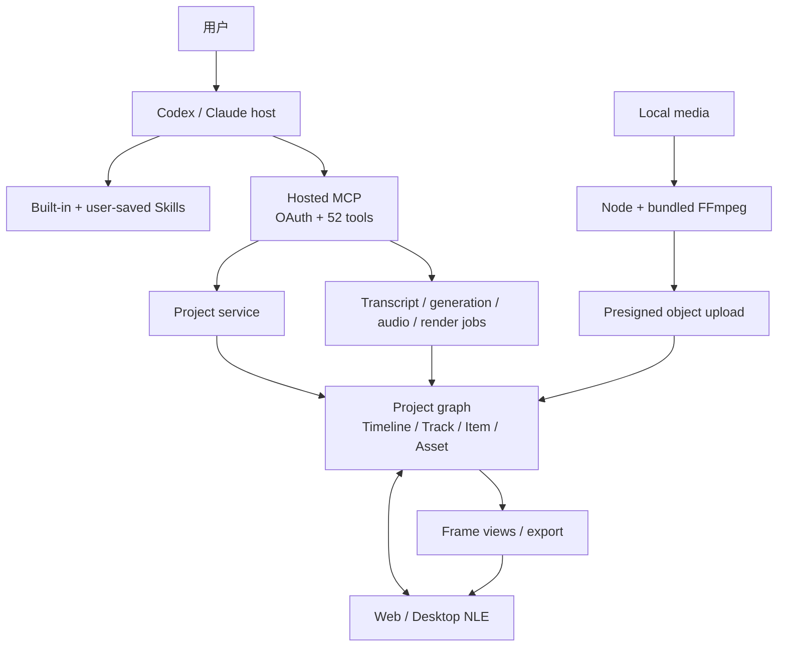

# ChatCut 项目研究：Agent-native 视频编辑器的产品真相、技术边界与护城河

> **一句话结论**：ChatCut 已经不是“给视频 API 套聊天框”，而是一个可被 Codex / Claude 操作、又能由人继续手调的云端 NLE；它当前最硬的能力是 **speech-led footage → 受约束编辑 IR → 可编辑 timeline**，而不是通用视觉理解。真正待证明的不是工具数量，而是它能否持续缩短“可接受 first cut”的时间与人工修正分钟数。

**研究日期**：2026-08-10

**当前公开插件快照**：[ChatCut-Inc/agent-plugin@aef81a7](https://github.com/ChatCut-Inc/agent-plugin/tree/aef81a744fc7dc23679ba443455fc6724fed9815)，Plugin `0.2.22`

**当前本机运行面**：插件已安装、启用并通过 OAuth 连接 hosted MCP；authenticated manifest 暴露 52 个 tools

**与前一份报告的关系**：本报告是 [chatcut-technical-implementation-analysis-2026-08-06](/output/reports/chatcut-technical-implementation-analysis-2026-08-06/) 的产品级刷新和 red-team 校正；前一份报告保留 upload helper、timeline mutation、Script / Caption / Motion Graphic IR 的源码级细节。

**操作边界**：本轮只读检查官方 repo、已安装插件、live tool schemas、官网、文档、法律文本和公开采用信息；没有读取用户 ChatCut 项目、没有 mutation、没有上传媒体、没有触发付费生成或导出。

---

## 0. 先回答三个最直接的问题

### ChatCut 是什么？

最准确的定义是：

> **Agent-addressable NLE（Agent 可寻址的非线性视频编辑系统）**。

用户给它 footage、transcript、参考素材和剪辑目标；Codex / Claude 负责理解意图、拆解任务与选择工具；ChatCut 把操作落到一个可持久化、多 timeline、多 track 的项目图，并在 Web / Desktop editor 中让人播放、撤销、继续修改或导出。

它不是：

- Codex 自带的视频编辑器；
- 单一 foundation model；
- 只输出扁平 MP4 的“一键成片”生成器；
- 已完整开源的 ChatCut 产品源码。

### 为什么用户可以在 Codex 里使用？

因为 Codex 现在支持由 Skills 和外部 Apps / MCP 能力组成的插件。ChatCut 发布了一个 Codex plugin package，其中包括：

```text
15 个剪辑 Skills
+ hosted MCP 配置
+ ChatCut OAuth 登录
+ 远端 52-tool control surface
+ 本地 FFmpeg / Node ingest helper
```

Codex 负责 reasoning；ChatCut 的 server 负责账户、项目状态、媒体、生成、渲染与导出。安装插件不等于获得数据权限，用户仍需登录 ChatCut，工作区管理员和源系统权限仍然生效。[OpenAI：Plugins in Codex](https://help.openai.com/en/articles/20001256-plugins-in-codex/)；[ChatCut 官方 plugin repo](https://github.com/ChatCut-Inc/agent-plugin)

### 它有 GitHub repo 吗？开源了什么？

有：[ChatCut-Inc/agent-plugin](https://github.com/ChatCut-Inc/agent-plugin)。

但这是 **插件发行镜像**，不是完整产品源码。当前公开内容主要是：

- Codex / Claude plugin metadata 与 hosted MCP config；
- 15 个 Markdown Skills 及 references；
- 2,323 行 `upload-media.mjs`；
- 245 行 `transcript-offset.mjs`；
- bundled FFmpeg binaries 和少量 assets。

没有公开 editor、backend、database、sync engine、renderer 或 hosted MCP server 源码。因此“插件公开”不能外推成“ChatCut 开源”。

---

## 1. Executive verdict

| 维度 | 当前判断 | 证据强度 | 关键边界 |
|---|---|---:|---|
| 产品形态 | 真正的 Agent-addressable NLE | 高 | 核心服务闭源 |
| 最强 wedge | 口播、采访、Podcast、课程、long-to-short、rough cut | 高 | 官方仍称 visual analysis coming soon |
| Domain state | 项目图和 timeline state 有真实深度 | 中高 | 未证明浏览器、Agent、renderer 强一致 |
| Agent IR | Script、Caption Cards、MG JSX / props、typed mutations | 高 | 多个版本面仍有 contract drift |
| 可恢复性 | 单阶段有 revision、soft delete、job tracking、readback | 中上 | 无公开全局 WorkflowRun / operation ledger |
| 验证 | 结构回读 + composed frames + 人类 editor review | 中 | frame URL 不是 immutable proof artifact |
| 开放性 | 插件薄开源、托管核心闭源 | 高 | repo 历史与 release provenance 很弱 |
| 安全透明度 | OAuth 和基本政策可见 | 中下 | 无公开 SOC 2、DPA、subprocessor / retention 细表 |
| 采用证据 | 注意力强，真实商业使用未证明 | 中下 | stars、Discord、Product Hunt 不是 MAU / retention |
| 护城河 | 有潜在系统组合优势，尚未被效果数据证明 | 中 | OpenChatCut 已快速复制公开范式 |

最重要的战略判断：

> ChatCut 的技术含量在“把自然语言编译为仍可回改的真实剪辑工程”，不在“集成了多少生成模型”。它能否成为平台，取决于 canonical project state、用户修正数据、workflow Skills 和 editor feedback loop 是否共同转化为更高 first-cut acceptance，而不是只形成更大的 tool surface。

---

## 2. 真正的产品闭环：输入、状态、输出

### 2.1 输入

- 上传、录制或生成的视频、音频、图片和 `.cube` LUT；
- transcript、说话者、停顿、文字时间戳；
- 用户的内容目标、时长、平台、画幅、风格、品牌约束；
- timeline 当前状态、选中的 item / asset / 时间范围；
- 图片、视频、音频等生成 reference；
- 可复用的 built-in Skill 或用户保存的 workflow Skill。

官方通用上传文档写单文件最高 5GB；rough-cut 场景另写最多 10 clips、合计 5GB，应视为不同工作流限制。[上传文档](https://chatcut.io/docs/uploading-media)；[产品定义](https://chatcut.io/docs/what-is-chatcut)

### 2.2 核心状态

```text
Project
├── shared Assets / Media Pool
├── Design Style / templates / reusable Skills（部分跨项目）
└── Timeline × N
    ├── Canvas(width, height, fps)
    ├── Video Track × N
    ├── Audio Track × N
    ├── Item × N
    ├── Captions / Transcript-derived structures
    └── Markers / effects / transitions / mix state
```

必须用“canonical **project graph**”而不是“唯一 canonical timeline”：一个项目允许多个 Timeline，每次 mutation 都必须明确目标。Asset 是可复用源，Item 是 timeline 上的 instance；同一 Asset 可以被多次裁切、摆放或覆盖而不改源文件。

### 2.3 输出

首要输出不是 chat answer，也不一定是 MP4，而是：

- 一个能继续编辑的 multi-track timeline；
- 已放置的 cut、caption、B-roll、MG、music、effect；
- 可回读的结构状态与抽样可见帧；
- 用户明确要求后再输出 MP4、WebM、MP3、SRT / TXT、FCP7 XMEML 或透明 ProRes 4444 MG。

Web 云渲染当前最高 1080p，Desktop 本地渲染增加 4K。XML 不是无损 round-trip：caption、GIF、MG、SVG、text、effects、transitions 等可能无法完整带走。[导出文档](https://chatcut.io/docs/exporting)；[Desktop 文档](https://chatcut.io/docs/desktop-app)

### 2.4 Operating loop


这条闭环的关键不是“自主完成所有创意判断”，而是 **Agent 与人围绕同一可编辑项目协作**。

---

## 3. 技术架构：薄插件，厚托管后端



### 3.1 Host / reasoning layer

Codex / Claude 负责：

- 理解用户意图与创意限制；
- 选择 Skill 和工具；
- 处理结果、异常和下一步；
- 在不可自动决定处请求用户判断。

它不拥有 ChatCut 数据库，也不直接承担媒体渲染。

### 3.2 Skill / policy layer

Skills 是专业工作流、工具路由、失败恢复和验证纪律。它们能快速更新，也能被用户保存；但本质仍是自然语言程序，不能代替服务端权限、不变量、幂等和事务。

当前新增的 `manage_skill` 允许用户把 `SKILL.md + references / examples / light scripts` 作为小于 1MB 的私有 package 持久化到 ChatCut DB。这是一个重要的产品方向：

```text
一次成功剪辑方法
→ 结构化为 Skill
→ 跨项目复用
→ 形成用户自己的 editing method layer
```

但 live schema 没有公开可见的 immutable revision、content digest、rollback 或 execution-time pinning。它既可能形成 workflow moat，也可能成为持久 prompt / tool-policy supply-chain 风险。

### 3.3 Hosted MCP control plane

插件没有在本机运行 ChatCut backend；`.mcp.json` 指向：

```text
https://api.chatcut.io/api/external-mcp/mcp
```

并通过 OAuth 登录。当前 endpoint 没有显式 schema version，本地 plugin 和 server manifest 又能独立发布，因此版本号不能唯一决定当下能力。

52 个工具覆盖：

| 面 | 代表工具 |
|---|---|
| Project / target | `create_project`, `list_projects`, `read_project`, `target_project`, `duplicate_project` |
| Timeline / item | `manage_timelines`, `edit_track`, `edit_item`, `split_item`, `detach_audio` |
| Speech / caption | `manage_transcript`, `read_script`, `clean_script`, `apply_script`, `edit_captions` |
| Asset / library | `import_media`, `inspect_asset`, `manage_media_pool`, `browse_library` |
| Generation | `submit_video`, `submit_voice`, `submit_music`, `submit_sound`, `submit_shader` |
| Async / export | `track_progress`, `submit_export`, `track_export`, `request_asset_download` |
| Verification / HITL | `view_timeline_frames`, `ask_followup_questions`, `get_editor_url` |
| Reuse / governance | `manage_skill`, `manage_template`, `manage_design_style`, `report_user_friction` |

当前 tool descriptions 合计约 192k 字符，粗略相当于 48k tokens。Host 可能 lazy-load schemas，因此不等于每次都进入上下文；但它揭示了真实 ACI 复杂度远大于“52 个按钮”。

### 3.4 Media data plane

本地 `upload-media.mjs` 已有 2,323 行，负责：

- probe、格式识别与必要转码；
- thumbnail、waveform、响度和 transcription audio 准备；
- placeholder asset 注册；
- presigned single / multipart upload；
- retry、resume、状态追踪。

媒体随后进入 ChatCut 的对象存储和项目图；transcription、generation、render / export 多为异步 cloud job。这里应始终区分：

```text
文件已 probe
≠ asset 已注册
≠ bytes 已上传
≠ processing ready
≠ asset 已放到 timeline
≠ timeline 已验证
≠ 用户已批准
≠ export 已交付
```

---

## 4. 核心技术：一份项目图，多种任务 IR

ChatCut 没有让 Agent 直接拼任意 JSON，而是为不同任务提供不同的中间表示：

| 任务 | 中间表示 / 操作面 | 编译目标 |
|---|---|---|
| Speech editing | transcript Script / `timeline.md` | source-backed frame ranges |
| Captions | Caption Cards + revision | caption program / styled items |
| Motion Graphic | JSX + props + current frame | composited timeline item |
| Physical edit | typed item / track operations | frame-native item mutation |
| Generation | provider-neutral job parameters | 新 Asset，后续再 place |
| Multicam | transcript / audio alignment result | synced master + optional speaker-follow cut |

最值得保留的产品原则是：

> **自然语言提出候选意图；受约束 IR、validator 和 compiler 决定真实 timeline mutation。**

这比 prompt 直接写数据库安全，也比生成一个不可编辑 MP4 更有产品持续性。

### Speech 是当前最成熟的语义控制面

官方仍明确写 footage analysis 是 transcription-based，最适合 talking head / interview，visual analysis coming soon。[官方产品边界](https://chatcut.io/docs/what-is-chatcut)

因此当前可以确认的是：

- 它能理解台词、时间戳、说话者、停顿与语言结构；
- 能把删词、重排、找 soundbite 编译成 source range；
- 能围绕 speech rhythm 放 captions、B-roll、MG 与 music。

不能据此确认：

- 它已经能通用理解运动、构图、表演、连续性和镜头叙事；
- 能独立完成无对白 montage、体育、MV 或复杂 narrative film；
- “understands every clip”已有公开 benchmark 支撑。

---

## 5. `0.2.22` 相比 `0.2.21` 真正变了什么

| 变化 | 事实 | 含义 |
|---|---|---|
| 版本 | `0.2.21 → 0.2.22` | 当前安装、marketplace 与官方 `aef81a7` 一致 |
| Live tools | 51 → 52 | 仅新增 `manage_skill` |
| Skill 构成 | 删除 `image-gen`，新增 `multicam-sync` | 重心向多机位 workflow 移动 |
| Video generation | 新增 Seedance 2.5 reference | 默认支持 4–30s、edit / extend、多模态 reference |
| Executable helper | 新增 245 行 transcript offset script | 多机位有确定性 fallback |
| Upload | helper 字节级未变 | ingest 主链没有因版本升级变化 |
| MG | 增加 frame runtime contract | 修复透明/读错 frame 的常见实现坑 |

### 5.1 Multicam 的实现思想

新增 helper 不是波形同步器，而是 ASR 时间戳对齐器：

1. 10 字符 shingles 对 offset 投票；
2. Dice bigram similarity `≥ 0.85` 匹配 utterance；
3. 对时间差取 median；
4. 用 MAD 和 early / late drift 拒绝不可靠结果；
5. 只把 `confident:true` 的结果用于自动 placement。

其思想很好：

> **AI 找语义锚点，确定性算法决定帧。**

但要警惕重复表达、多语言 ASR、少语音素材、非一对一匹配和 device clock drift。当前 tolerance 可能接受约 3–6 帧偏差，却尚无真实多机 ground-truth test，因此不能把“sub-frame 常态”当作已验证能力。

### 5.2 版本治理比版本号更重要

当前 `main` 仍只有一个 root commit；旧 `c97a3dd` 不是新 `aef81a7` 的祖先。审计还发现同一 `0.2.22` 版本号曾对应多个不同 commit 内容。

因此正确的复现键是：

```text
plugin version + exact commit SHA + live MCP manifest snapshot
```

而不是只记 `0.2.22`。

---

## 6. Contract drift：它目前最具体的工程风险

当前仍存在以下 static Skill / live runtime 不一致：

| Symbol | 当前情况 | 严重性 |
|---|---|---:|
| `render_cloud_screenshot` | basics 仍引用；live 正确工具为 `view_timeline_frames` | 中 |
| `read_av_script` | talking-head guide 引用；manifest 不存在 | 中 |
| `submit_image` | 顶层 image-gen Skill 已删除，但 video reference 仍引用；manifest 不存在 | 中 |
| `multicam_sync` | 新 Skill 首选调用，但 external manifest 无此 tool；有 transcript fallback | 中高 |
| `apply_zoom_tracking` | live `edit_item` description 引用；manifest 不存在 | 中 |
| `push_asset` | Codex adapter 正确要求 `import_media`，共享 craft Skills 仍多次引用旧/别 host 名称 | 中 |

根因不是团队不知道“manifest 是 contract”，而是发布链存在三个独立变化面：

```text
shared Skills
→ Codex / Claude host adapters
→ independently deployed hosted MCP manifest
```

当前没有公开证据表明发布前会做 host-aware tool-symbol closure test。一个最小 CI 应自动抽取每个 host Skill 中的 tool symbols，与对应 manifest 比对，并对已显式标注为 backend-only / other-host 的术语做 allowlist。

公开 repo 当前有动态 CodeQL workflow，但没有可见的普通功能 CI、test/spec、tag、release、changelog 或根 `LICENSE`；plugin metadata 写 `GPL-3.0-only`，GitHub API 没有检测到 repo license。这说明其 release governance 仍弱。

---

## 7. 验证、安全与一致性：需要把“可见”与“证明”分开

### 7.1 已有的安全设计

- non-destructive Asset / Item 分离；
- validation-only / batch mutation；
- Script、Caption 等部分 revision / stale guard；
- soft delete / restore / project duplicate；
- generation 产出新 Asset，不默认覆盖原素材；
- mutation 后结构回读；
- `view_timeline_frames` 检查 composed pixels；
- live editor 让用户播放、撤销、手调与批准。

### 7.2 不能说过头的地方

**“同一 project state”不等于已证明强一致。** 公开证据展示 DB、sync/pending writes、S3、browser-local blobs、异步 jobs、Script / Caption revisions、frontend / cloud render 等多个状态面；没有证据证明它们 linearizable。

**live editor 是验收工作台，不是 durable proof。** `view_timeline_frames` 返回临时 signed JPEG，没有公开 content digest、immutable evidence artifact 或 approval receipt；用户随后仍可继续改。

**稳定 `requestId` 不等于端到端 idempotency。** 在看不到 server 去重语义、计费 ledger 和重放行为时，只能确认 request correlation。

**结构正确不等于创意正确。** 没有 overlap、黑屏或字幕错位，不代表节奏、情绪、品牌表达和叙事成立。

### 7.3 新增风险面

- `manage_skill` 需要 version / digest / provenance / rollback / authority containment；
- `report_user_friction` 的 schema 允许携带 `projectId` 与用户短句，需明确 consent、retention、PII redaction 和 enterprise opt-out；
- Design Style 是跨项目共享的可变对象，不完全属于单项目 graph；
- `ask_followup_questions` 可呈现 visual / voice cards 和受限 direct-tool binding，HITL 也发生在聊天卡片，不只在 editor；
- 52-tool schema 的体积和互相引用会形成 ACI routing / context 成本。

---

## 8. 产品、定价与平台现状

### 8.1 Web / Desktop

- Web 是完整 browser NLE，官方推荐 Chrome Desktop；
- Desktop 当前支持 Apple Silicon macOS 和 Windows x64；不支持 Intel Mac、Linux；
- Desktop 本地渲染并支持 4K，Web 云渲染最高 1080p；
- Production / Beta 是独立 channel / backend；
- Desktop 可检测本机 Codex / Claude Code 并在稳定 workspace 中运行 CLI。[Desktop 文档](https://chatcut.io/docs/desktop-app)

注意：bundled product-help 仍写 Windows 不可用，已落后于 live docs；官网 `/docs/agent-plugin` 也仍描述旧 `@chatcut/skill v0.2.1`、Claude-only 流程，与当前 Git marketplace + Codex plugin 冲突。[已过时的 Agent Plugin 文档](https://chatcut.io/docs/agent-plugin)

### 8.2 Credits

当前公开口径包括：

- Free 一次性 20 credits；
- Pro 从 `$25 / 100 credits` 到 `$2,500 / 10,000 credits`；
- video generation 文档示例为 `0.6 credit / 秒`；
- AI turn、generation 和 rendering 可能计费；
- 失败、超时或 safety rejection 不扣 generation credits；
- 服务端可改费率，editor live estimate 是 source of truth。

官方文档自身有冲突：Plans 页称标准 MP4 / WebM export 免费，Credits Policy 又称 rendering 按时长和 codec 计费；不同模型在 Pricing 页的可生成秒数也不支持“所有模型统一 0.6 credit/s”的简单解释。因此预算必须以实际确认卡与 usage ledger 为准。[Plans](https://chatcut.io/docs/plans-and-credits)；[Credits Policy](https://chatcut.io/docs/credits-policy)；[Pricing](https://chatcut.io/pricing)

---

## 9. 公司、采用与安全证据

### 9.1 团队和融资

- Terms 标注主体为 Texas 注册的 ChatCut Inc.；
- LinkedIn 显示 2024 年成立、2–10 人、San Francisco + Shanghai；
- Kaiwen Li、Alima Strickland 是公开创始人，背景来自影视制作；
- Antler 与媒体报道交叉提到 2025 年 `$1.35M` seed，由 ZhenFund 领投、Antler 参与；这不是监管文件，仍应标为媒体口径。[Antler](https://www.antler.co/blog/why-we-invested-in-chatcut-professional-filmmakers-reimagining-the-future-of-video-editing)；[LinkedIn](https://www.linkedin.com/company/chatcut)

### 9.2 采用

2026-08-10 公开快照：

- 官方 plugin repo：754 stars、69 forks；
- Product Hunt：2026-07-10 launch，#1 Product of the Day、#4 of the Week、约 1.6K followers，但只有 2 reviews；
- LinkedIn：约 1.1K followers；
- 官方 Discord invite 显示约 24.9K members；
- 旧 npm `@chatcut/skill` 仍有下载，但已不是当前 Codex 主分发面。

这些证明注意力，不证明 active projects、week-4 retention、付费客户、ARR、成功 export 或 first-cut quality。厂商“100k+ creators”也没有公开可审计口径。[Product Hunt](https://www.producthunt.com/products/chatcut-ai-video-editor)；[GitHub repo](https://github.com/ChatCut-Inc/agent-plugin)

Product Hunt 公开评价与产品边界一致：rough draft 和 early-stage automation 有价值，但 subjective style、pacing、复杂 narrative、stock B-roll 重复和精细 MG 控制仍需改进。两条 review 样本太小，不能当 benchmark。

### 9.3 隐私和企业采购

已确认：

- hosted MCP 走 OAuth Authorization Code + PKCE；
- Terms 声明不使用 user media 训练 AI；
- Terms 也明确服务不按 HIPAA、FISMA 等行业规范设计；
- Privacy Policy 允许邮件申请删除账户，承诺 7 天内永久删除；
- Usage Policy 约束未授权人脸/声音、欺诈、隐私侵犯和高风险内容。[Terms](https://chatcut.io/terms/)；[Privacy](https://chatcut.io/privacy/)；[Usage Policy](https://chatcut.io/docs/usage-policy)

未公开或不清楚：

- SOC 2、DPA、subprocessor list、data residency；
- media / transcript / prompt 的分类保留期；
- at-rest / in-transit encryption 细节；
- project / tool / action 细粒度 OAuth scope；
- enterprise audit log、comment-only role、share-link expiry；
- telemetry 的 consent / opt-out。

Privacy Policy 最后更新于 2025-06-07，仍把 Service 笼统定义成 Website；Terms 也有 automated access、年龄等 boilerplate 与当前 Agent 产品不完全一致。企业采购不能只依赖“媒体不训练模型”一句承诺。

---

## 10. 竞争与可复制性：OpenChatCut 是最直接的压力测试

[0xsline/OpenChatCut](https://github.com/0xsline/OpenChatCut) 是独立第三方，不属于 ChatCut。2026-08-10 公开快照约 922 stars、122 forks、400+ commits，AGPL，公开了完整 local-first editor / Agent workspace 路径，并明确适配 ChatCut 的公开 Skills。

它已公开展示：

- React / TypeScript / Electron editor；
- immutable timeline / commands；
- local project store；
- FFmpeg、Remotion / WebGL、FCPXML / SRT；
- external MCP edit session；
- draft 中隔离编辑，review 后原子 apply 为一个 undo step；
- generation / export / deletion 等不可在 draft 中执行。

OpenChatCut 目前的 README 主张仍需独立运行测试，stars 和 commits 也不是质量证明。但它已经证明：

> ChatCut 公开的 Skills、状态模型和 Agent-NLE 交互范式具有较强可复制性。

所以 ChatCut 的商业护城河不可能只是 plugin 文本或“在 Codex 里能用”。

### 相对不同替代方案的真实位置

| 替代方案 | ChatCut 的增量 | ChatCut 的劣势 |
|---|---|---|
| Premiere / Resolve | Agent control plane、speech compiler、低学习成本、生成整合 | 专业深度、生态、offline、color/audio、长期格式 |
| Descript 类 | 外部通用 Agent、更多 timeline / generation / MG 操作 | transcript wedge 并非独有 |
| CapCut | editable Agent workflow、XML、长内容结构 | trending templates/effects、分发生态 |
| Codex + ASR + FFmpeg | 项目 DB、NLE UI、异步 jobs、可见修正面 | 本地隐私、确定性、可复现与 vendor independence |
| 纯生成器 | 输出仍可编辑，生成只是 Asset acquisition | 单模型生成体验可能不够深 |
| OpenChatCut | hosted UX、云协作、provider aggregation、品牌与产品完成度 | 开放性、local-first、可审计与 vendor lock-in |

---

## 11. 护城河：哪些可能成立，哪些尚未证明

### 11.1 候选护城河

1. **Shared editable state**：Agent 与用户在同一 project graph 中协作。
2. **Domain compiler**：speech / caption / MG intent 到 frame-native mutation。
3. **Correction data**：用户怎样修改 first cut，可能比生成 prompt 更接近专业判断数据。
4. **Workflow Skills**：把个人/团队 editing method 持久化、复用和迭代。
5. **Editor feedback loop**：结果可见、可改、可再次交给 Agent，而非一次性输出。
6. **Provider orchestration**：模型可替换，项目状态和编辑关系不随 provider 消失。
7. **Distribution**：Codex / Claude 入口降低新用户使用专业编辑器的门槛。

### 11.2 尚未证明

- first acceptable cut 时间相对人工 / Descript / incumbent 的显著优势；
- user correction minutes / exported minute；
- correction data 是否合法、结构化地回灌模型或工作流；
- visual-heavy content 的质量；
- 52-tool routing 的成功率与错误恢复；
- 多人 / 多 Agent 并发一致性；
- provider aggregation 的成本、质量或供应优势；
- active projects、retention、exports、收入、gross margin；
- enterprise security / reliability。

### 11.3 最强反命题

> ChatCut 可能只是用 Codex 分发、自然语言 Skills 和一个闭源云端 editor，给传统 NLE 状态模型做了一个更好用的入口。持久 timeline 本来就是 NLE 的基本能力；公开可审计的“智能”主要是操作手册、上传器和启发式同步脚本。如果 Adobe、Resolve 或 Descript 暴露更小、更稳定的 Agent API，ChatCut 的差异可能快速收窄。

要击破这个反命题，ChatCut 必须证明用户交给它 raw footage 后得到的不是“能打开的 rough draft”，而是 **显著更快达到可接受标准、且返工更少的 first cut**。

---

## 12. 下一步验证：五个能杀死或加强 thesis 的实验

### 12.1 Contract closure test

自动抽取 `0.2.22@aef81a7` 每个 Codex Skill 的 tool symbols，与当前 52-tool manifest 做 host-aware closure：

- 所有可执行 symbol 必须存在；
- backend-only / Claude-only 术语显式标注；
- 每次 plugin 或 server release 都阻断 drift；
- schema size、参数变化和 result shape 进入 snapshot diff。

**通过门槛**：零未解释 symbol，核心任务 E2E smoke 全通过。

### 12.2 State consistency / recovery test

浏览器用户与 Agent 并发修改同一 item、Script 和 Caption；在 response loss、session restart、pending upload 和 project / timeline 切换时检查：

- lost update；
- wrong-target mutation；
- duplicate item / generation / charge；
- unknown-state reconciliation；
- editor preview 与 cloud render drift。

**通过门槛**：零静默误写；未知状态可检测、可回读、可恢复。

### 12.3 First-cut quality A/B

同一份 30 分钟双人访谈分别交给：

1. 人类 Premiere / Resolve；
2. Descript 类产品；
3. Codex + local ASR + FFmpeg；
4. Codex + ChatCut。

统一交付 3 分钟横版 + 60 秒竖版 + 字幕 + 2 个 B-roll + lower-third + loudness target + 可编辑工程。

记录：盲评质量、总耗时、人工修正分钟、误改率、主动操作数、云成本和 XML round-trip。

**通过门槛**：ChatCut 在不降低盲评质量下，显著减少人工修正时间。

### 12.4 Visual anti-benchmark

再加入一份几乎无对白的视觉 montage、体育或产品 cinematic。它不是证明优势，而是测产品边界。

**判断门槛**：若表现接近 transcript 盲区，应保持 speech-led wedge，不应把 GTM 扩张为通用“AI director”。

### 12.5 Multicam + Skill provenance

- 用 clap / timecode 真值的 3 camera + 2 recorder 素材，加入重复台词、噪声、少语音和 clock drift；
- 创建 Skill v1 执行，升级 v2 后重放旧任务，检查 content hash、rollback、authority 和 telemetry。

**Multicam 门槛**：P95 `< 1 frame` 且 `confident:true` 零误报；达不到就必须 human checkpoint。

**Skill 门槛**：每次 run 可固定 version / digest，权限不能由 Skill 文本自行扩大，旧 run 可复现。

---

## 13. 对 Combo / Creative CoWork 最值得吸收的部分

### 应吸收

```text
natural-language intent
→ constrained domain IR
→ typed compiler / validator
→ canonical domain state
→ visible review surface
→ explicit approval / delivery
```

- Definition / instance 分离：Asset / Item 对应 CapabilityVersion / Run；
- 将 generated、ready、placed、verified、approved、exported 分开；
- 把用户成功方法保存为 Skill，但给 Skill 做 version / provenance / eval；
- Studio 同时承担工作台、纠错面和验收面；
- 尽量扩大可逆区，再提高 Agent 自治度。

### 不应照搬

- 不复制 52-tool breadth；跨垂类没有统一 frame / track ontology；
- 不让 Skill 承担支付、发布、隐私、entitlement、budget 等服务端不变量；
- 不把“可见 preview”当成 settlement evidence；
- 不把 stable request ID 当 idempotency；
- 不在没有 operation ledger / approval receipt 时宣称 durable workflow；
- 不用 GitHub attention 替代 outcome、retention 和单位经济。

---

## 14. 最终判断

ChatCut 已经跨过普通 AI wrapper 的门槛。它最有价值的系统组合是：

```text
可编辑 project graph
+ speech-first semantic compiler
+ task-specific IR
+ typed mutations
+ local/cloud media pipeline
+ async jobs
+ visible human correction surface
+ reusable workflow Skills
```

但更准确的成熟度表述是：

> **强 speech editing IR，中上 domain state，中等 mutation / verification，中下 workflow durability，低 backend openness，安全与商业效果缺独立证明。**

所以我们的初步 thesis 是：

- **产品上值得认真研究**：它把 coding-agent 的 reasoning 能力接到了真实专业状态，而不是只做内容生成；
- **近期 wedge 清楚**：talking head、采访、Podcast、课程、rough cut 与 long-to-short；
- **架构启发很强**：自然语言 → 受约束 IR → typed compiler → 可编辑 state → visible review；
- **护城河尚未成立**：OpenChatCut 表明公开范式可复制，incumbent 也能做 Agent API；
- **下一步不应继续只读文档**：应做同素材 A/B、并发恢复、多机真值和 Skill provenance 四类黑盒验证。

如果这些实验显示 first-cut acceptance 和人工修正时间没有显著改善，那么 ChatCut 更像优秀 rough-cut assistant；如果改善稳定、能沉淀为可复用 Skills，并且状态 / 权限 / recovery 可信，它才有机会成为视频工作的 Agent-native operating surface。

---

## 参考来源

### 一手产品与技术来源

- [ChatCut 官方文档：What is ChatCut](https://chatcut.io/docs/what-is-chatcut)
- [ChatCut 官方文档：Uploading Media](https://chatcut.io/docs/uploading-media)
- [ChatCut 官方文档：Transcript Editing](https://chatcut.io/docs/transcript-editing)
- [ChatCut 官方文档：Exporting](https://chatcut.io/docs/exporting)
- [ChatCut 官方文档：Desktop App](https://chatcut.io/docs/desktop-app)
- [ChatCut 官方文档：Plans & Credits](https://chatcut.io/docs/plans-and-credits)
- [ChatCut 官方文档：Credits Policy](https://chatcut.io/docs/credits-policy)
- [ChatCut Agent Plugin `0.2.22@aef81a7`](https://github.com/ChatCut-Inc/agent-plugin/tree/aef81a744fc7dc23679ba443455fc6724fed9815)
- [OpenAI：Plugins in Codex](https://help.openai.com/en/articles/20001256-plugins-in-codex/)
- [ChatCut Terms](https://chatcut.io/terms/)
- [ChatCut Privacy](https://chatcut.io/privacy/)
- [ChatCut Usage Policy](https://chatcut.io/docs/usage-policy)

### 公司、采用与反例

- [ChatCut LinkedIn](https://www.linkedin.com/company/chatcut)
- [ChatCut Product Hunt](https://www.producthunt.com/products/chatcut-ai-video-editor)
- [Antler：Why we invested in ChatCut](https://www.antler.co/blog/why-we-invested-in-chatcut-professional-filmmakers-reimagining-the-future-of-video-editing)
- [OpenChatCut](https://github.com/0xsline/OpenChatCut)

### 知识库关联

- [chatcut-technical-implementation-analysis-2026-08-06](/output/reports/chatcut-technical-implementation-analysis-2026-08-06/)
- [agent-runtime](/wiki/concepts/agent-runtime/)
- [tool-routing](/wiki/concepts/tool-routing/)
- [mcp-server-trust](/wiki/concepts/mcp-server-trust/)
- [creative-agent-design](/wiki/concepts/creative-agent-design/)
- [human-in-the-loop](/wiki/concepts/human-in-the-loop/)
- [self-verification](/wiki/concepts/self-verification/)
- [video-agent-workflow](/wiki/concepts/video-agent-workflow/)
- [claude-code-to-creative](/wiki/connections/claude-code-to-creative/)

---
*本报告由 LLM 基于公开一手来源、当前 `0.2.22` 插件与 live runtime 只读观察、三路独立审计和知识库材料生成；属于 output/query 产出，不把厂商主张或架构推断冒充 backend 源码事实。*
