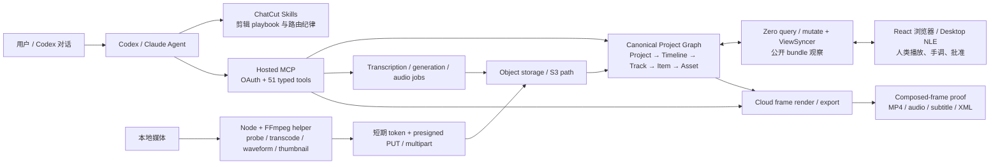

# ChatCut 技术实现深析：一个可被 Agent 编译和验证的云端 NLE

> **一句话结论**：ChatCut 不是“Codex 调几个视频生成 API”，也不是一个已经开源的 AI 剪辑器；它是一套 **Agent-addressable NLE（可被 Agent 操作的非线性编辑系统）**。Codex / Claude 负责理解意图与编排，ChatCut 用持久项目图、多个受约束的编辑 IR、异步媒体任务、可见编辑器和验证接口，把自然语言变成仍可回改的 timeline state。

**研究日期**：2026-08-06

**公开插件快照**：[ChatCut-Inc/agent-plugin](https://github.com/ChatCut-Inc/agent-plugin/tree/c97a3dd0108191882d12368cb9467cdd5a5e7e84) `c97a3dd0108191882d12368cb9467cdd5a5e7e84`

**本机运行时**：ChatCut Codex Plugin `0.2.21`，已启用；当前 authenticated MCP manifest 暴露 51 个 `mcp__chatcut__*` tools

**验证范围**：检查官方文档、官网、GitHub 快照、本机安装包、当前 MCP tool schemas、OAuth discovery metadata、公开 Web bundle，以及此前一次真实音频导入和 timeline 写入记录；未获得 ChatCut backend / database / renderer 源码，未做并发压测、付费生成 benchmark 或完整渗透测试。

---

## 0. 最重要的判断

ChatCut 的技术价值不在某个视频大模型，而在下面这条编译链：

```text
用户意图
  ↓
Codex / Claude 的规划与视频 Skill
  ↓
受约束的语义 IR / typed MCP operation
  ↓ validation / revision / atomic mutation
canonical Project → Timeline → Track → Item → Asset 状态
  ↓
浏览器 NLE、composed-frame proof、用户手调与最终 export
```

它已经跨过了普通 prompt wrapper 的门槛，因为：

1. Agent 改的是一个持久、frame-native、非破坏性的真实剪辑工程，不是临时生成一段文字或一个扁平 MP4；
2. 同一份 project state 同时服务 Agent 和人类编辑器，用户能在 UI 中看到、播放和继续修改；
3. 语音剪辑、字幕、Motion Graphic、shader、生成素材并不共用一坨自由 JSON，而是有不同的中间表示和 mutation contract；
4. 修改、异步任务、视觉验证、用户批准和导出被拆成不同状态；
5. 本地媒体预处理器已经有实际工程深度：probe、转码、缩略图、waveform、响度、占位注册、presigned multipart upload、retry 和 resume。

但不能把这些事实继续外推成：

- backend 已开源；
- Agent 已经可靠地“看懂”所有视频；
- 整条创意 workflow 是 durable / transactional；
- 多人并发、权限、安全、渲染确定性和生产 SLA 已被公开验证；
- GitHub stars 等于真实使用、留存或商业 traction。

### 技术裁决卡

| 维度 | 判断 | 为什么 |
|---|---|---|
| Domain state | **强** | Asset / Item 分离、frame-native timeline、多 timeline、明确 track 约束 |
| Agent-facing IR | **强** | transcript Script、Caption Cards、MG JSX / props、typed item operations 各司其职 |
| 单次 mutation safety | **中上** | batch atomic、`validateOnly`、部分 revision / stale guard、soft delete、duplicate |
| 端到端 workflow durability | **中下** | 任务顺序主要在 Skills；未看到公开的持久 WorkflowRun / dependency DAG / global transaction |
| Verification | **中上** | 结构回读 + composed-frame 像素检查 + live editor + user approval；尚非完整 media CI |
| Visual intelligence | **早期** | 官方文档仍写 footage analysis 以 transcription 为主，visual analysis 尚未普遍到位 |
| 开放性 | **低** | 开源的是 connector、Skills 和 upload helper；editor/backend/render core 未开源 |
| 安全透明度 | **中下** | OAuth 边界清楚，但细粒度授权、保留期、审计、subprocessor、企业证明公开不足 |

---

## 1. 它到底是什么：输入、状态、输出和 operating loop

### 1.1 真正输入

ChatCut 接收的不只是 prompt：

- 本地、附件、项目内或生成得到的视频 / 音频 / 图片 / SVG / GIF；
- 用户的剪辑目标、平台、时长、画幅、风格和内容取舍；
- transcript、caption program、design style、已有 timeline；
- Codex 当前 project / timeline target 与用户授权；
- 外部生成服务的 job 结果。

### 1.2 真正中间产物

核心 artifact 是可编辑项目，而不是 chat answer：

```text
Project
├── shared Asset Library
└── Timeline × N
    ├── Canvas(width, height, fps)
    ├── Video Track × N
    ├── Audio Track × N
    ├── Item × N
    ├── Caption Program / Cards
    └── Markers / effects / design state
```

官方插件把 ChatCut 定义为 browser-based multi-track NLE，并明确 Asset 是复用源、Item 是 timeline instance；同一个 Asset 可以被多次裁切、摆放和覆盖，而不改源内容。[公开 Skill：数据模型](https://github.com/ChatCut-Inc/agent-plugin/blob/c97a3dd0108191882d12368cb9467cdd5a5e7e84/codex/skills/chatcut-plugin-basics/SKILL.md#L43-L106)

### 1.3 真正输出

默认交付是：

- 一个可在 ChatCut 中播放、继续手调的 timeline；
- 已写入的 cut、B-roll、MG、caption、music、effect 等项目状态；
- 结构和视觉验证证据；
- 用户明确要求后才产生 MP4、audio、subtitle、XML 或其他 export。

插件甚至明确禁止把宽泛的“帮我剪视频”自动解释成 export，也禁止用一个本地 flatten 后的 MP4 冒充可编辑工程。[公开 Skill：editable timeline 是交付物](https://github.com/ChatCut-Inc/agent-plugin/blob/c97a3dd0108191882d12368cb9467cdd5a5e7e84/codex/skills/chatcut-plugin-basics/SKILL.md#L151-L171)

### 1.4 Operating loop

```text
明确创作意图
→ create / target project
→ 按需读取最新 timeline / assets / transcript
→ 选择语义编辑面或物理编辑面
→ dry-run / revision check / mutation
→ 等待必要的 upload / transcription / generation job
→ 回读结构
→ 渲染若干 composed frames 并检查像素
→ 用户在 live editor 播放与手调
→ 继续修改，或明确批准后 export
```

这说明它最准确的类别不是“AI 视频生成器”，而是：

> **带语义编译器和 Agent control plane 的云端 NLE。**

---

## 2. 证据边界：哪些是源码事实，哪些只是推断

| 证据层 | 本次看到了什么 | 能证明什么 | 不能证明什么 |
|---|---|---|---|
| 公开 repo | plugin manifest、MCP config、15 个 Skills、1 个 2,323 行 Node upload helper、bundled FFmpeg | host 集成方式、本地 ingest 逻辑、公开操作规范 | editor、DB、MCP server、renderer 的内部实现 |
| 当前 MCP schema | 51 个 live tools 的参数、结果、validation、revision、job 和 verification contract | Agent 当前实际可调用的控制面 | server 内部如何持久化、锁、扩缩容 |
| 官方文档 / 官网 | 产品边界、编辑器 UI、transcription-first、export、隐私与条款 | 厂商公开承诺 | 独立 benchmark、SLA、客户效果 |
| Web bundle 观察 | React Router / Vite 风格 bundle、Zero query/mutate URL、ViewSyncer、S3 path、Remotion / WebCodecs / Three 等 shipped identifiers | 浏览器端确实带这些调用路径或库 | 每个库由哪条生产路径使用、backend 技术栈 |
| 真实历史运行 | 官方插件登录、上传私有音频、创建 asset、写 timeline、回读验证成功 | end-to-end 主链不是纸面设计 | 大规模、并发、故障和长期可靠性 |

公开 repo 在本次快照中只有一个同步式 commit，没有 backend/server source、`package.json`/lockfile、test/spec 或 release。插件目录的本地副本与该 commit 的 `codex/` 内容逐文件一致。它在 metadata 中声明 GPL-3.0，但 GitHub license detection 当前未识别出仓库根许可证；因此不能把“插件 metadata 的 license”扩张成“ChatCut 产品开源”。[plugin manifest](https://github.com/ChatCut-Inc/agent-plugin/blob/c97a3dd0108191882d12368cb9467cdd5a5e7e84/codex/.codex-plugin/plugin.json#L1-L45)

---

## 3. 总体架构



这里至少可以分成六层。

### 3.1 Host / reasoning layer

Codex 或 Claude 负责：

- 理解目标；
- 做内容取舍和镜头规划；
- 决定调用哪个 domain tool；
- 读取结果并迭代；
- 与用户确认不可自动决定的创意选择。

它不是视频 renderer，也不直接拥有项目数据库。

### 3.2 Skill / policy layer

Skills 提供剪辑顺序、专业启发、失败恢复和何时必须确认用户等程序性知识。例如口播工作流强调：

```text
A-roll 结构
→ audio cleanup
→ MG / B-roll
→ music
→ captions
→ visual verification
→ user approval
→ export
```

Skill 的优点是容易迭代，也能按任务渐进加载；缺点是它仍是自然语言政策，不能替代服务端 invariant。

### 3.3 MCP control plane

本机 `.mcp.json` 没有启动本地 server，而是通过 OAuth 连接托管 endpoint：

```json
{
  "url": "https://api.chatcut.io/api/external-mcp/mcp",
  "oauth_resource": "https://api.chatcut.io/api/external-mcp/mcp"
}
```

并带 `x-chatcut-mcp-surface: codex` header。[公开 MCP 配置](https://github.com/ChatCut-Inc/agent-plugin/blob/c97a3dd0108191882d12368cb9467cdd5a5e7e84/codex/.mcp.json#L1-L10)

这意味着 Codex 用户之所以能使用 ChatCut，不是 Codex 内置了视频编辑器，而是：

```text
Codex plugin package
= Skills + remote MCP registration + OAuth resource
```

登录后，ChatCut server 把项目读写、生成、导出和验证能力动态暴露成 tools。

值得注意的是 endpoint URL 没有显式 API / schema version，而本地插件版本固定为 `0.2.21`。这使 ChatCut 可以独立热更新 server tool manifest，但也意味着“已安装插件版本”不唯一决定“当下工具契约”；后文发现的 Skill/runtime drift 正是这条发布结构的现实代价。

### 3.4 Canonical state layer

MCP mutation 最终作用于一个持久 project graph。公开 Skill 写明工具调用走 ChatCut Zero / DB / S3 path，并要求 Agent 不得直写数据库或猜隐藏 ID。[公开 Skill：环境与状态](https://github.com/ChatCut-Inc/agent-plugin/blob/c97a3dd0108191882d12368cb9467cdd5a5e7e84/codex/skills/chatcut-plugin-basics/SKILL.md#L43-L53)

最重要的不是具体用了什么数据库，而是项目状态有稳定 domain identity：`projectId`、`timelineId`、`trackId`、`itemId`、`assetId`、caption revision 和 job id。Agent 与 UI 因此能围绕同一事实协作。

### 3.5 Media data plane

重媒体字节不适合穿过 LLM 或 MCP response。ChatCut 将它们拆到：

- 本地 FFmpeg preparation；
- 短期 upload session；
- presigned object-storage upload；
- transcription / generation / render 等异步 job；
- 最终 signed URL 或 project asset。

### 3.6 Visible editor / proof surface

浏览器 NLE 既是工作台，也是：

- 用户对 Agent 的实时反馈面；
- 人工修正面；
- 可视化状态浏览器；
- 最终批准面。

这比“后台 Agent 返回 success”强，因为用户看到的是同一份可编辑 domain state，而非一段不可追责的文字。

---

## 4. Canonical data model：为什么它比 Codex + FFmpeg 更像产品

### 4.1 Asset / Item 分离

```text
Asset = 源媒体、文件状态、可复用内容、MG code / default props
Item  = 某个 Asset 在 timeline 上的一次实例
        startFrame / duration / sourceOffset / track / geometry / opacity / speed / fades
```

这是一套正确的 non-destructive editing model：

- 同一个素材可以在不同 timeline 或位置复用；
- 修改 placement 不污染源；
- 一个 MG asset 可以有多个 item instance 和不同 override；
- generation 先产生新 Asset，是否放入 timeline 是另一项决定。

### 4.2 Frame-native，而不是 float-second-native

核心 placement 和 duration 以 frame 为准，秒只是人类展示单位。这使：

- mutation 可以精确落点；
- 避免多次秒数换算的浮点漂移；
- timeline read / write / verify 共用同一坐标；
- export 和 composed-frame proof 能指向确切帧。

### 4.3 Track invariant

公开规则包括：

- 同一 track 的 items 不允许重叠；
- video tracks 叠层，audio tracks 并行混音；
- locked track 不应改；
- delete / trim 默认留下 gap；
- ripple 必须显式指定，并且只作用于同轨；
- B-roll、MG、caption、music 等跨轨依赖在结构变化后必须复核。

最后一条既是优点也是缺口：**跨轨依赖目前更像操作纪律，不是一等 dependency edge**。

### 4.4 多 Timeline 是版本空间，不只是文件复制

`manage_timelines` 允许 create、duplicate、switch、update、hide 和 delete，且 project 只有一个 active timeline。一个 timeline duplicate 会保留完整 tracks/items/captions，适合：

- 16:9 / 9:16 版本；
- 长版 / 短版；
- A/B cut；
- 高风险结构调整前的 project 内 safety copy。

项目级 duplicate 和 soft delete / restore 又提供更粗粒度的恢复边界。

---

## 5. 最核心设计：一个 canonical timeline，加多个 task-oriented IR

把 ChatCut 简化成“双层 IR”是有用的，但更精确的说法是：

> **一个 canonical physical timeline，外加多种面向不同任务的受约束 projection。**

### 5.1 Physical timeline IR

```text
Track + Item + frame range + source offset + geometry + effect
```

它适合确定性执行、渲染和人类 NLE 手调，却不适合 LLM 直接完成“删掉第二遍重复表达，但不要改变意思”。

### 5.2 Speech Script IR：`timeline.md`

`read_script` 将当前 cut 与素材 transcript 物化为人和模型都能理解的 Markdown，形态类似：

```markdown
## V1
### interview.mp4
[s1] 大家好，今天我们聊……
[s2] 其实我想说的是……
[silence=0.8s]
[gap 30f]
```

模型可以：

- 用删除标记去掉真实说过的词；
- 删除、移动、复制 segment；
- 压缩真实存在的 silence；
- 从 library transcript 拉回未使用内容。

`apply_script` 再把 Markdown diff 编译成 source-backed clip ranges，并原子写回 timeline。若 canonical state 已变，它会拒绝 stale apply，要求重新 materialize。

这个设计的价值是：

```text
自然语言“删掉重复表达”
→ 受约束文本 diff
→ source transcript alignment
→ exact frame / source range mutation
```

LLM 不需要凭空猜时间戳，也不能随意把原话改成不存在的录音。

### 5.3 Caption IR：Card program + revision

字幕不是 transcript 的同义词：

- transcript correction：修正 ASR 文本；
- speech selection：决定哪些真实片段播放；
- caption presentation：决定哪些字怎样显示。

`edit_captions` 使用独立的 SRT-like Card model，有 card/word timing、样式和 revision；部分破坏性操作还要求显式确认。这避免“改字幕错字”意外切掉音频，或“删口播”只隐藏字幕却保留原声。

### 5.4 Motion Graphic IR：React / JSX source + typed props

MG 是可编辑 source asset，而不是先烘焙好的视频：

```text
MG Asset: JSX/code + property schema + defaults
MG Item:  start/duration/position/size + per-instance overrides
```

需要跨传统 NLE 时，它又可以显式转换为 alpha video / ProRes。这里体现了一个好原则：**authoring representation 与 delivery representation 分离**。

### 5.5 Shader / generation / audio IR

shader、voice、music、sound、video generation 各自通过异步 job 产生或修改 Asset；它们不会自动获得 timeline placement。这样将：

```text
“素材生成成功” ≠ “剪辑使用了素材” ≠ “用户认可成片”
```

三个状态明确分开。

### 5.6 IR 的边界

Speech Script 很聪明，但并不是 universal timeline language：

- ASR segment 不一定是完整语义单元；
- silence 默认可能被隐藏；
- 它最适合 talking-head / podcast / interview 的 A-roll；
- B-roll、MG、caption、effects 仍走不同模型；
- 没有公开 benchmark 证明跨语言、密集切词、clip boundary 音质和 long-form 编译正确率。

因此官网把 transcript 称为 source of truth 适合产品表达；技术上更准确的是：**transcript 是 speech editing 的 authoritative projection，canonical timeline 才是最终可渲染状态。**

---

## 6. 公开代码中最扎实的部分：本地媒体导入器

公开 repo 唯一的大段 executable implementation 是 `upload-media.mjs`，约 2,323 行。它不是简单 `curl PUT`，而是一个本地 media ingest worker。

### 6.1 处理链

```text
local file
→ ffprobe: container / codec / dimensions / fps / bitrate / audio metadata
→ decide pass-through or transcode
→ optional thumbnail / loudness / transcription audio / waveform
→ register placeholder Asset
→ return assetId early
→ request presigned upload slots
→ PUT or multipart upload with retry
→ finalize asset / transcription state
→ retain retry plan for same assetId
```

### 6.2 可直接从代码确认的参数

| 参数 | 当前值 | 含义 |
|---|---:|---|
| 最大画面边长 | 1920 px | 超过会触发缩放/转码 |
| 直接接受源码率参考阈值 | 8 Mbps | 过高时为上传效率转码 |
| 目标视频码率 | 1.5–8 Mbps | 按分辨率缩放并 clamp |
| 视频内音频 | 320 kbps | H.264 / VP9 转码路径 |
| 独立音频 | 128 kbps Opus | 统一浏览器编辑路径 |
| transcription audio | 64 kbps Opus | 单独为 ASR 准备 |
| waveform | 100 peaks/s，最多 2h | 编辑器波形数据 |
| 并行输入 | 最多 4 个 / session | 导入批次上限 |
| upload retry | 最多 5 次 | 408/425/429/部分 5xx 与网络失败 |
| 单次 upload timeout | 120s | 每次 attempt 的上限 |

代码同时捆绑 FFmpeg 8.1 的 macOS arm64 与 Windows x64 二进制及 SHA-256；H.264 路径优先 VideoToolbox / NVENC / QSV / VAAPI / AMF，失败再到 `libx264`，最后可回退 VP9/WebM。[helper 常量与 checksum](https://github.com/ChatCut-Inc/agent-plugin/blob/c97a3dd0108191882d12368cb9467cdd5a5e7e84/codex/skills/asset-import/scripts/upload-media.mjs#L22-L75)、[codec 与转码决策](https://github.com/ChatCut-Inc/agent-plugin/blob/c97a3dd0108191882d12368cb9467cdd5a5e7e84/codex/skills/asset-import/scripts/upload-media.mjs#L420-L429)、[硬件编码器](https://github.com/ChatCut-Inc/agent-plugin/blob/c97a3dd0108191882d12368cb9467cdd5a5e7e84/codex/skills/asset-import/scripts/upload-media.mjs#L751-L789)

### 6.3 为什么先注册 placeholder

最聪明的 latency optimization 是把 logical readiness 与 byte readiness 分开：

1. helper 先生成 UUID 并注册 Asset placeholder；
2. 立即返回可用于 timeline placement 的 `assetId`；
3. 转码和重媒体上传在后续继续；
4. 只有 remote inspect、cloud frame render、export 等 byte-dependent 操作才必须等 upload ready；
5. transcript-aware 编辑通常只需等 transcription target。

代码明确返回 “Asset is registered and can be edited now; upload is still pending”。[placeholder 与 deferred upload](https://github.com/ChatCut-Inc/agent-plugin/blob/c97a3dd0108191882d12368cb9467cdd5a5e7e84/codex/skills/asset-import/scripts/upload-media.mjs#L2104-L2197)

这是一种很实用的 pending-object pattern：让 Agent 不被长转码和上传完全阻塞，同时把 readiness 作为一等状态。

### 6.4 幂等与恢复细节

- 请求 body 经过 stable JSON 后做 SHA-256，生成 deterministic helper request id；
- upload 使用 presigned single PUT 或分片并行上传；
- transient status 有指数式 backoff；
- 失败后可以用新 token + 同一 asset id resume；
- ready asset 不会被 resume 路径覆盖；
- transcription 可以单独重试。

[deterministic request id](https://github.com/ChatCut-Inc/agent-plugin/blob/c97a3dd0108191882d12368cb9467cdd5a5e7e84/codex/skills/asset-import/scripts/upload-media.mjs#L115-L131)、[multipart retry](https://github.com/ChatCut-Inc/agent-plugin/blob/c97a3dd0108191882d12368cb9467cdd5a5e7e84/codex/skills/asset-import/scripts/upload-media.mjs#L1512-L1655)、[same-asset retry plan](https://github.com/ChatCut-Inc/agent-plugin/blob/c97a3dd0108191882d12368cb9467cdd5a5e7e84/codex/skills/asset-import/scripts/upload-media.mjs#L1849-L1866)

### 6.5 这条链的技术代价

1. **源质量**：导入路径可能降到 1920 px / 8 Mbps；公开代码没有清楚展示 original + proxy + relink 的完整 mezzanine policy。
2. **本地供应链**：插件捆绑大体积 FFmpeg binaries，checksum 有帮助，但公开 repo 缺 release provenance、SBOM 和自动测试。
3. **凭证边界**：helper 通过 `--token` 命令行参数接收短期 bearer token，可能在本机进程列表中短暂可见；presigned URL 也没有客户端 origin allowlist，安全依赖 server 返回值、短 TTL 和日志脱敏。
4. **本地资源**：高分辨率长视频会消耗 CPU/GPU、磁盘和临时目录；默认临时目录没有在 helper 中显式清理，单批还可同时转码 4 个文件，公开代码未显示更细的 CPU / bandwidth backpressure。
5. **云依赖**：逻辑 Asset 可以早建，但最终 render / export 仍需要云可读 bytes。

---

## 7. 51-tool ACI：工具很多，但不是随意堆 API

当前 runtime 大致分成以下 domain surfaces：

| Surface | 代表工具 | 责任 |
|---|---|---|
| Project lifecycle | `create_project`、`list_projects`、`target_project`、`duplicate_project`、`delete_project`、`restore_project` | 项目选择、复制和软删除 |
| Discovery | `read_project`、`browse_assets`、`inspect_asset`、`browse_library`、`read_script`、`read_captions` | 渐进读取现态 |
| Timeline mutation | `edit_item`、`edit_track`、`edit_asset`、`split_item`、`manage_timelines`、`manage_markers`、`detach_audio` | frame-native 物理编辑 |
| Semantic speech | `find_transcript`、`manage_transcript`、`clean_script`、`apply_script` | ASR、脚本和 A-roll 编译 |
| Captions | `edit_captions`、`read_captions` | 独立字幕程序 |
| Media management | `import_media`、`manage_media_pool`、`request_asset_download`、`register_converted_video` | asset lifecycle |
| Creation | `submit_video`、`submit_voice`、`submit_music`、`submit_sound`、`submit_shader`、MG code tools | 生成新 asset 或 source |
| Audio processing | `smooth_audio`、`isolate_voice` | 确定性或异步处理 |
| Verification / delivery | `view_timeline_frames`、`submit_export`、`track_export`、`track_progress` | 证明和交付 |
| HITL / UX | `ask_followup_questions`、`get_editor_url`、`web_browser`、`report_user_friction` | 澄清、handoff、外部检索和反馈 |

### 7.1 好的 granularity

- read 与 write 分开；
- Asset creation 与 Item placement 分开；
- submit 与 track 分开；
- source transcript selection 与 caption presentation 分开；
- project / timeline / item / asset 保留显式 identity；
- `read_project` 默认只做 orientation，省略集合被定义为 unknown 而非 empty，并要求分页和 narrow read；
- `edit_item` 可以把相关操作放在一个 atomic batch 中；
- `validateOnly` 允许先 dry-run。

这是一套比较成熟的 ACI（Agent-Computer Interface）思路：不让模型直接操作内部 DB，也不把整个 project JSON 一次塞进 Context。

### 7.2 已进入 tool-overload 区

51 个 tools 加上部分很长的 schema，会带来三个问题：

1. tool description 本身占 Context；
2. 相邻能力容易路由错误；
3. 一个版本更新可能导致 Skill、tool schema 和 UI 三方漂移。

这正好印证 [tool-routing](/wiki/concepts/tool-routing/)：工具数量超过几十个后，应该按任务延迟发现 capability，而不是把所有 schema 永久放进模型上下文。

另外，`edit_item`、`edit_captions` 等接口承载很多 action；部分工具把复杂对象放进 JSON string，削弱 MCP schema 原生的静态约束。更理想的方向是 typed discriminated union + capability-scoped discovery。

### 7.3 已发现的 contract drift

本次 `0.2.21` 安装包中存在可复现漂移：

| Skill 文档引用 | 当前 51-tool manifest | 判断 |
|---|---|---|
| `submit_image` | 不存在 | image generation Skill 与 runtime 不一致 |
| `multicam_sync` | 不存在 | talking-head 多机位流程当前不可按文档执行 |
| `read_av_script` | 不存在 | aspect-ratio / visual selection 指引引用缺失工具 |
| `render_cloud_screenshot` | 当前是 `view_timeline_frames` | basics 中至少一处旧名称残留 |
| `push_asset` | hosted Codex surface 不存在 | talking-head 与若干 tool description 仍引用其他 surface 的传输工具 |
| `apply_zoom_tracking` / `pull_asset` | 不存在 | live tool descriptions 内部也有不可调用的交叉引用 |

插件自己的原则是“active MCP manifest 才是 runtime contract”，所以正确 fallback 是依赖当前 tool schema，而不是照抄 Skill。但 `push_asset` 等残留说明漂移不只发生在静态 Markdown，live descriptions 之间也可能互相引用不存在的 surface。这揭示出一个重要技术治理问题：

> **Skill 文本、tool schema、server implementation 和 product UI 需要 automated contract tests；否则 Agent 最先看到的是一份看似权威但已过期的 runbook。**

---

## 8. Mutation safety、并发和恢复

### 8.1 已经暴露的强机制

| 机制 | 作用 |
|---|---|
| atomic `edit_item` batch | 一项 validation 失败则整批不提交，避免半改 timeline |
| `validateOnly` | 在真实写入前检查 overlap、active timeline、frame range 等 |
| stale Script rejection | canonical timeline 变化后禁止把旧 `timeline.md` diff 强行应用 |
| caption revision | 针对 caption program 的 optimistic concurrency guard |
| active timeline guard | 防止写到非目标 sequence |
| explicit ripple | 避免一次 trim 意外推动整个项目 |
| soft delete / restore | 项目删除可恢复 |
| duplicate project / timeline | 高风险编辑前可创建安全副本 |
| async job tracking | generation、transcription、upload、export 不用伪装成同步调用 |
| provider recovery URL | provider 已成功但 asset finalize 失败时避免再次付费生成 |
| idempotent operations | 例如部分 audio smoothing / MG conversion 有专门去重或幂等语义 |

这些机制比“Agent 调 API，HTTP 200 就算完成”强得多，也符合 [agent-runtime](/wiki/concepts/agent-runtime/) 中 durable state、retry 和 indeterminate handling 的方向。

### 8.2 公开 contract 仍缺什么

检查当前 schemas 后，没有看到普遍适用于所有 mutation 的：

- `idempotencyKey`；
- `operationId` / durable receipt；
- 所有实体统一的 revision / ETag；
- 跨多次 tool call 的全局 transaction；
- Saga / compensation graph；
- 持久 `WorkflowRun` 对象；
- 显式记录“用户已批准哪一版 A-roll / design / export”的 approval ledger。

因此：

```text
单次 tool call 原子
≠ 整条视频制作 workflow 原子
≠ session 中断后可精确恢复全部创意决策
```

例如 A-roll 已获批准、随后 session 中断。新 Agent 可以重新读取 timeline，却未必能机器化知道“哪一个版本已被用户批准、接下来应做 MG 而非继续改结构”。这些信息目前主要依赖会话和 Skill 顺序。

### 8.3 便利状态也是风险

`target_project` / active timeline 降低每次传 ID 的摩擦，但 session-level target 可能在长任务、并行 Agent 或用户手动切换后变成隐式全局状态。关键 mutation 应显式携带 `projectId` / `timelineId` 和 expected revision，而不是只相信“当前项目”。

---

## 9. Verification：它做对了什么，还缺什么

ChatCut 把“完成”至少拆成四层。

### 9.1 结构证据

回读：

- asset 是否 ready；
- item 是否在正确 track / frame range；
- 是否有 gap / overlap；
- caption / MG / B-roll 是否仍对齐；
- job 是否到达 terminal state。

### 9.2 视觉证据

`view_timeline_frames` 从当前 timeline composition 渲染确切帧，返回临时图片资源。Agent 必须真的检查像素，不能只因为拿到 URL 就宣称“画面正确”。

### 9.3 人类验收

用户在 live editor 中播放、拖动、修改，决定是否继续或导出。Codex verification 明确不等于 user approval。

### 9.4 交付证据

`submit_export` / `track_export` 将最终 render 与编辑状态区分开；subtitle / XML 等可以作为不同交付物。

官方当前边界是：Web editor 使用 cloud export，Desktop 使用本地 export，并称二者共享同一渲染逻辑；4K 目前只在 Desktop。本报告分析的 Codex external MCP 路径走托管 `submit_export` / `track_export`，不能把 Desktop 的 local render 能力外推到 connector session。[Desktop App](https://chatcut.io/docs/desktop-app)、[Exporting](https://chatcut.io/docs/exporting)

### 9.5 还不是完整 media CI

当前公开 surface 没有证明以下自动化已覆盖：

- 全时间轴 black frame / flash frame / accidental gap 扫描；
- audio click / pop、true peak、响度标准和 A/V drift；
- lip-sync / subtitle drift 的全片检测；
- editor preview 与最终 export 的 pixel/audio diff；
- creative brief 与成片的独立 evaluator；
- 多画幅 safe area、caption collision 的 exhaustive check。

所以它的 verification 可以评价为：

> **已从“成功回包”提升到结构 + 抽样像素 + 人审，但尚未成为系统性的媒体测试流水线。**

这与 [self-verification](/wiki/concepts/self-verification/) 的 Computational → Inferential → Human review 分层一致。

---

## 10. 浏览器编辑器：可观察到什么，不能乱推什么

对 2026-08-06 的 unauthenticated production bundle 做只读观察，可以看到：

- React Router SSR context 与 Vite 风格 hashed bundles；
- API client 包含 `/zero/query`、`/zero/mutate` 和 `https://viewsyncer.chatcut.io/`；
- asset path 呈现 `users/{user}/projects/{project}/assets/...` 形态；
- pending project writes 有 acknowledgement map 和 timeout；
- 大 editor bundle 里 shipped 了 Remotion、WebCodecs / Mediabunny、Three.js / WebGL / OffscreenCanvas、Socket.IO 等 identifiers；
- 页面连接 `api.chatcut.io`、`viewsyncer.chatcut.io` 和 PostHog，HTTP response 走 CloudFront / AWS 路径。

合理推断是：

1. 浏览器 NLE 使用 React 系应用框架；
2. Zero query/mutate + ViewSyncer 承担 project state query / mutation / live sync 的一部分；
3. 浏览器端有真实的 media decode/composition/WebGL 能力；
4. object storage 和 AWS cloud render 是 data plane 的重要组成。

但仅凭 bundle 不能断言：

- backend 就是某种特定数据库；
- Remotion 一定承担所有 export；
- Socket.IO 一定是协作同步的唯一通道；
- client-visible library 等于 production path 已启用；
- “毫秒级实时同步”已经被独立 benchmark 验证。

这类观察应该标成 implementation clue，而不是官方 architecture fact。

---

## 11. “AI 理解视频”的真实边界

官网营销容易让人把 ChatCut 理解成“Agent 会看完整视频并像人类剪辑师一样判断”。官方文档更克制：当前 footage analysis 主要是 **transcription-based**，visual analysis 仍被列为 coming soon。[What is ChatCut](https://chatcut.io/docs/what-is-chatcut)

当前最强路径因此是：

- talking head；
- interview / podcast；
- lecture / tutorial；
- transcript-led rough cut；
- captions、语音清理和围绕 A-roll 的 B-roll / MG。

它当然能通过 source-frame inspection、composed-frame proof、外部生成和人工确认处理视觉任务，但这与“已有通用 video understanding model 自动看懂整片叙事”不是一回事。

更准确的自主性定义是：

> Agent 能在给定工具、项目模型、ASR、生成 provider 和用户反馈内完成较长操作闭环；目前没有公开 eval 证明它能持续做出专业剪辑师级的内容判断。

---

## 12. OAuth、安全与隐私边界

### 12.1 已确认的身份路径

远程 MCP endpoint 未登录返回 401，并公开 OAuth protected-resource metadata；authorization server 支持 authorization code、refresh token 与 PKCE S256。connector auth 派生 `userId`，项目访问由 server 校验。

这是正确的基础设施方向：Codex 不需要拿 ChatCut 用户密码，也不应直写 DB。

### 12.2 仍然偏粗的 authority contract

公开 OAuth scopes 主要是 `openid profile email offline_access`，不是显式的：

```text
project:read
timeline:write
asset:upload
generation:spend
export:create
project:delete
```

这不等于 server 没有项目 ACL，但对高写权限 Agent 来说，外部可审计的 delegated authority 仍不够细。插件只在 metadata 层声明 Read / Write，而 51 个工具中同时包含付费生成、内容改写、项目删除和外部 Web access。

### 12.3 主要威胁面

| 风险 | 为什么重要 | 建议控制 |
|---|---|---|
| untrusted transcript / webpage prompt injection | transcript、stock search、网页内容都可能进入 Agent Context | 将检索内容标成 data；tool choice 不由内容覆写；高风险动作审批 |
| broad write surface | 同一 connector 能改 timeline、生成付费资产、删除项目 | capability scopes、per-action approval、预算和 project allowlist |
| retry ambiguity | 断线时可能不知付费 job / mutation 是否已成功 | universal idempotency key、operation receipt、reconcile API |
| signed URL 泄露 | 临时媒体 URL 可能进入日志、chat 或 shell history | 短 TTL、域限制、日志脱敏、一次性 URL |
| local helper token | bearer token 作为进程参数/环境进入本地 helper | 避免 argv 暴露、短期 token、least privilege、redacted diagnostics |
| bundled binary supply chain | FFmpeg 体积大且直接处理不可信媒体 | signed release、SBOM、sandbox、自动 CVE / checksum pipeline |
| private media cloud processing | 用户素材上传并在美国处理 | 明确 consent、retention/deletion SLA、region、subprocessor 和 enterprise policy |
| telemetry boundary | Web UI 可观察到 PostHog | 明确媒体/项目字段是否进入 analytics，提供 opt-out / enterprise controls |

官方 Terms 表示不会用用户上传媒体训练 AI，并称服务托管及数据处理位于美国；Privacy Policy 仍较通用。[Terms](https://chatcut.io/terms/)、[Privacy](https://chatcut.io/privacy/)

本次未找到公开 SOC 2 报告、subprocessor 清单、asset-level retention / deletion 时限、region residency、细粒度 action audit 或 security whitepaper。这里应记为尽调缺口，而不是断言系统不安全。

---

## 13. 开源质量与版本治理

### 13.1 公开的是什么

```text
公开：
  plugin manifest
  remote MCP config
  15 个 Skills / references / examples
  Node upload helper
  bundled FFmpeg / ffprobe

未公开：
  browser editor source
  hosted MCP implementation
  canonical DB schema
  sync / conflict engine
  generation orchestration backend
  cloud renderer / export worker
  billing / authorization implementation
```

因此最准确的称呼是：

> **开源 Agent connector / operating manual + 托管闭源 NLE。**

### 13.2 当前工程成熟度信号

本次快照：

- repo 2026-06-25 创建；
- 只有一个公开 commit，像从内部源同步出的发行快照；
- GitHub API 当日约 732 stars / 67 forks / 1 open issue；
- 无 release；
- 无公开 tests/spec；
- 无公开 CI workflow；
- `upload-media.mjs` 通过 `node --check`，`--help` 可运行，JSON manifests 可解析；
- 未做 authenticated end-to-end regression。

stars 说明“Codex 内编辑视频”有注意力，不等于日活、留存、付费或生产质量。一个同步式 commit 也让外部审计者看不到 feature history、review discipline 和 bug-fix cadence。

### 13.3 最该补的 CI

1. Skill → live manifest symbol check；
2. tool examples against JSON schema；
3. import helper codec matrix tests；
4. golden transcript → expected timeline compiler tests；
5. concurrent mutation / stale revision tests；
6. editor preview → export visual/audio diff；
7. auth scopes / project ACL negative tests；
8. release SBOM、binary provenance 和 signed artifacts。

本次发现的 `submit_image` / `multicam_sync` / `read_av_script` / `render_cloud_screenshot` / `push_asset` 漂移，本来应该被第 1 类测试在发布前阻断。

---

## 14. 与替代方案的真正差异

| 维度 | Premiere / Resolve | 纯视频生成器 | Codex + FFmpeg | Descript 类 transcript editor | ChatCut |
|---|---|---|---|---|---|
| 核心对象 | 本地专业工程 | 单个生成 clip | command + files | transcript + project | 持久 project graph + timeline |
| 主操作者 | 人类 UI | 人 prompt | Agent / script | 人 + AI feature | 外部 Agent + 人共用 NLE |
| 可编辑性 | 很强 | 弱 | 取决于自建工程 | 强于生成器 | source/item 分离、可手调 |
| 语义剪辑 | 人判断后手切 | 弱 | 需自建 ASR mapping | 核心能力 | `timeline.md → source ranges` |
| 生成 | 插件 / 外接 | 核心 | 外接 API | 次要 | 作为 Asset acquisition |
| Agent API | 传统 UI 较弱 | API 简单但 state 薄 | CLI 对 Agent 友好 | 产品内 AI | 51-tool domain ACI + Skills |
| 恢复 | 工程/undo | job/history | 文件、脚本、checksum | 项目历史 | project/job/soft delete/部分 revision |
| 隐私 | 可本地 | 多为云 | 可完全本地 | 多为云 | 当前 external MCP 路径依赖云 |
| 可迁移性 | 行业格式丰富 | 低 | 高 | 中 | 可 export/XML，但 canonical state 仍属厂商 |

### 14.1 相对 Codex + FFmpeg 的增量

FFmpeg 当然能 cut、concat、mix、overlay、transcode。ChatCut 的增量是用户不用自己造：

- project database；
- source / instance model；
- transcript compiler；
- caption editor；
- browser NLE；
- async generation job tracker；
- project-to-render pipeline；
- visible review and correction surface。

而 FFmpeg 在本地隐私、确定性、可复现、CI、批处理和 vendor independence 上仍更强。

### 14.2 相对纯视频生成的增量

纯 T2V 通常把 prompt 变成 flat clip。ChatCut 把生成视频只当 Asset，真正产品是：

```text
生成 → 选择 → 放置 → 组合 → 验证 → 继续编辑
```

所以模型 provider 可替换；project state、编辑反馈和人机协作闭环更接近长期控制点。

### 14.3 相对知识库旧版视频 Agent SP

[video-agent-workflow](/wiki/concepts/video-agent-workflow/) 和 `raw/projects/jimeng-video-agent/视频AGENT 主SP（优化版）.md` 更像五阶段 prompt / generation pipeline：需求、故事板、短 clip 生成、配乐和人工 gate。ChatCut 多出的不是更多 prompt，而是：

- 真实 NLE state；
- 51 个 typed domain operations；
- transcript/caption/MG 等多个 IR；
- frame-accurate mutation；
- async job / recovery；
- composed output verification；
- 可被人接手的 live editor。

这正是“视频 Agent demo”与“视频 Agent product runtime”的分水岭。

---

## 15. 技术护城河在哪里，哪里还没有证明

### 15.1 可能形成护城河的部分

1. **Canonical creative state**：Agent 和人围绕同一 project graph 工作。
2. **Domain compiler**：把 transcript / caption / MG intent 编译为稳定 timeline mutation。
3. **Editing feedback data**：用户怎样修正 Agent cut，比单纯生成 prompt 更接近专业过程数据。
4. **Provider abstraction**：生成模型是可替换供应，编辑状态和质量反馈不随 provider 消失。
5. **HITL distribution**：Codex / Claude 是入口，ChatCut editor 是信任和留存界面。
6. **Recovery semantics**：upload、generation、timeline 和 export 被拆成可观察阶段。

### 15.2 尚未证明的部分

- 用户修正数据是否被合法、结构化地沉淀并反哺质量；
- transcript compiler 在真实长片上的成功率；
- 51-tool routing 是否比更小的 task API 更可靠；
- browser NLE 的专业深度能否留住 Premiere / Resolve 用户；
- 多人 / 多 Agent 并发是否正确；
- model aggregation 是否有成本、质量或供给优势；
- GitHub 注意力是否转化为 active projects、export、付费和复购；
- closed backend 的 uptime、latency、cost 和 gross margin。

因此目前可以说“架构有产品含量”，还不能说“护城河已被市场证明”。

---

## 16. 对它最强的反命题

### 反命题一：Agent-native NLE 可能只是传统 NLE 的新入口

如果用户最终仍需大量逐帧手调，Agent 只负责 rough cut 和生成素材，那么 ChatCut 的价值会被 Premiere / Resolve / Descript 的原生 AI 功能吸收。它必须证明“从 raw footage 到可接受 first cut 的时间”显著下降，而非 tool-call 很炫。

### 反命题二：当前优势高度依赖 speech-led content

transcript compiler 在口播上很强，但 narrative film、sports、music video、product cinematic、visual montage 的核心信号不在语言。官方 visual analysis 尚未成熟会限制横向扩张。

### 反命题三：Tool surface 可能比 GUI 更脆

51 个 schema、多个 revision、active target、异步 jobs 和 Skills 漂移会产生新的 ACI failure。模型能“看见工具”不等于能稳定选对、传对参数并恢复未知状态。

### 反命题四：云端闭源状态会形成新的锁定

可导出 MP4/XML 缓和了锁定，但 canonical project graph、caption program、MG source、job history 和协作状态仍在 ChatCut。专业用户会关心 original relink、color pipeline、plugin ecosystem、offline workflow 和长期项目可读性。

### 反命题五：创意正确性不能被 structural validation 替代

frame 没重叠、caption 有 revision、截图没有黑屏，只能证明“系统没有明显坏掉”；不能证明节奏、情绪、叙事和品牌表达是好的。最终仍需要更独立的 evaluator 或人类专业判断。

---

## 17. 对 Combo 最值得吸收的启示

### 17.1 学“可编译中间对象”，不要只学插件入口

ChatCut 最值得复制的是：

```text
natural-language intent
→ constrained task IR
→ validator / compiler
→ canonical domain state
→ visible proof
```

Combo 可以对应为：

```text
用户目标 / Creator method
→ typed ServicePlanVersion
→ validated Action plan
→ durable Run + side effects
→ Result / Evidence / Verdict
```

而不是继续把自由 prompt 直接送到 runtime。

这与 [claude-code-to-creative](/wiki/connections/claude-code-to-creative/) 的方向相同：Claude/Codex 是 reasoning engine，真正产品价值在垂直 Context、tool contract、状态和可见 Studio。

### 17.2 把相邻状态严格拆开

ChatCut 的好纪律：

```text
Asset generated
≠ Asset ready
≠ Asset placed
≠ timeline verified
≠ user approved
≠ export delivered
```

Combo 应保持：

```text
Revision exists
≠ Runtime Test passed
≠ Released
≠ User received result
≠ Result accepted
≠ Business outcome achieved
```

### 17.3 可逆区域越大，Agent 才能越自治

ChatCut 大多数内部操作可逆：源 Asset 不变、timeline 可回改、generation 产生新 Asset、project 可 duplicate、delete 可 restore、export 延后。

Combo 的发信、付款、退款、发布、隐私数据访问和现实服务却常常不可逆。因此必须按 side-effect class 强制：

- typed authority；
- project / customer scope；
- budget；
- idempotency；
- human approval；
- operation receipt；
- compensation / exception handling。

不能把 ChatCut 的 Skill 纪律原样当成商业 Agent 的安全保证。

### 17.4 Studio 应是 proof surface

ChatCut editor 同时是工作台、修正面和批准面。Combo 的 Provider Studio / Miniapp 也应展示：

- 运行的是哪个 immutable Capability / Surface / Contract version；
- 输入 snapshot；
- Agent 做过哪些 action；
- 中间 artifacts；
- evaluator evidence；
- 哪一步等待批准；
- 最终 Release、结果和补救状态。

这比只显示聊天消息或一个 `success=true` 更能建立信任。

### 17.5 不要复制 51-tool breadth

视频有天然统一的 frame / track / asset ontology，跨专业服务没有一个万能 timeline。Combo 应有通用的 Contract / Run / Evidence 骨架，再让各垂类提供最小 typed adapter，而不是把整个平台后台一次暴露给 Agent。

### 17.6 Skills 负责专业建议，服务端负责不变量

ChatCut 的“先 A-roll 再 captions”主要是创作建议，可以在 Skill；Combo 的 payment、permission、publication、entitlement、budget、PII 和 refund 不能只写在 Skill，必须在 runtime 强制。

---

## 18. 如果继续做技术尽调，应该怎样验证

### 18.1 黑盒正确性 suite

| 测试 | 操作 | 核心指标 |
|---|---|---|
| codec matrix | 导入 H.264/H.265/VP9/AV1、VFR、旋转、长音频、4K | 成功率、转码时间、质量变化、metadata 保真 |
| idempotency | 对 create / mutation / paid generation 制造 response loss 后重放 | 重复项目、重复计费、重复 item 率 |
| stale edit | 用户和 Agent 同时改同一 item/script/caption | stale rejection、lost update、recovery time |
| target safety | 切换 active project/timeline 后发旧请求 | 误写率、显式 ID guard |
| transcript compiler | 删除、重排、跨 segment cut、多语种、密集 filler | intent accuracy、frame drift、clip explosion、边界音质 |
| dependency alignment | A-roll 后再验证 caption/B-roll/MG/music | sync drift、人工修正时间 |
| crash recovery | 在 upload/generation/export/mutation ack 前后断线 | reconcile 成功率、重复消费、恢复步骤 |
| visual verification | 植入 1-frame flash、black gap、safe-area collision | 检出率、漏报率 |
| NLE round-trip | export XML 并在 Premiere / Resolve relink | 时间线、速度、音频、caption、MG 保真 |
| deletion/privacy | 撤销 OAuth、删除项目、等待 TTL 后访问 signed URL | 权限收敛、删除时限、残留面 |

### 18.2 应要求厂商提供的指标

- first acceptable cut 的 P50 / P95 时间；
- unintended mutation rate；
- transcript-to-timeline compile success；
- user correction minutes / exported minute；
- upload / transcription / generation / render failure rate；
- unknown-state reconciliation success；
- editor-preview vs export drift；
- active projects、week-4 retention、exports / active project；
- generation COGS、render COGS 和 gross margin；
- security audit、subprocessors、retention、region 和 incident history。

### 18.3 最小基准任务

用同一份 30 分钟双人访谈，对比：

1. 人类在 Premiere / Resolve；
2. 人类在 Descript 类 transcript editor；
3. Codex + local ASR + FFmpeg scripts；
4. Codex + ChatCut。

统一交付：3 分钟横版、60 秒竖版、准确双语字幕、2 个 B-roll、1 个 lower-third、响度达标、可继续编辑的工程。盲评内容质量，同时记录总耗时、主动操作数、错误、返工、云成本和 export round-trip。没有这类对照，所有“AI 剪辑效率”仍主要是产品叙事。

---

## 19. 最终结论

ChatCut 已经是一个真正的垂直 Agent system，而不是把视频 API 包成聊天框。它最强的技术组合是：

```text
持久 NLE domain state
+ 多个 task-specific editing IR
+ frame-native typed mutations
+ local/cloud media data plane
+ async jobs and partial recovery
+ composed output verification
+ human-visible editable surface
```

这套组合把“模型会说怎么剪”推进成了“Agent 能改真实工程、让人看到并继续接手”。

但当前公开证据也给出清晰上限：

> **强 domain state、强 speech editing IR、中上 mutation safety、中等 verification、中下 workflow durability、低 backend openness，安全与商业效果仍缺独立证据。**

对 ChatCut 自己，下一阶段最关键的不是继续堆生成模型或 tools，而是：

1. 用 manifest contract tests 消灭 Skill/runtime drift；
2. 把跨阶段依赖、批准和恢复提升为持久 WorkflowRun / operation ledger；
3. 建立全 mutation 通用 idempotency / revision / receipt；
4. 从抽样截图升级到 media CI；
5. 用真实 benchmark 证明 first-cut quality 与人类修正时间；
6. 补齐企业级权限、审计、数据治理和公开安全证据。

对 Combo，最重要的启示不是“也接进 Codex”，而是：

> **找到本垂类真正可编译、可验证、可回改的中间对象；让自然语言只提出候选意图，让 typed compiler、权限、durable Run ledger 和 Evidence 决定什么真正发生。**

---

## 参考来源

### ChatCut 一手来源

- [ChatCut 官方文档：What is ChatCut](https://chatcut.io/docs/what-is-chatcut)
- [ChatCut 官方文档：Editor Overview](https://chatcut.io/docs/editor-overview)
- [ChatCut：Text-based Editing](https://chatcut.io/features/text-based-editing)
- [ChatCut Features](https://chatcut.io/features)
- [ChatCut Codex / ChatGPT Plugin](https://chatcut.io/chatgpt-plugin)
- [ChatCut-Inc/agent-plugin 固定 commit](https://github.com/ChatCut-Inc/agent-plugin/tree/c97a3dd0108191882d12368cb9467cdd5a5e7e84)
- [ChatCut Terms](https://chatcut.io/terms/)
- [ChatCut Privacy](https://chatcut.io/privacy/)

### 知识库关联

- [agent-runtime](/wiki/concepts/agent-runtime/)
- [tool-routing](/wiki/concepts/tool-routing/)
- [mcp-server-trust](/wiki/concepts/mcp-server-trust/)
- [creative-agent-design](/wiki/concepts/creative-agent-design/)
- [human-in-the-loop](/wiki/concepts/human-in-the-loop/)
- [self-verification](/wiki/concepts/self-verification/)
- [video-agent-workflow](/wiki/concepts/video-agent-workflow/)
- [claude-code-to-creative](/wiki/connections/claude-code-to-creative/)
- `raw/projects/jimeng-video-agent/视频AGENT 主SP（优化版）.md`

---
*本报告由 LLM 基于公开一手来源、当前插件/runtime 观察、历史实操证据与知识库材料生成；属于 output/query 产出，不把推断冒充后端源码事实。*
