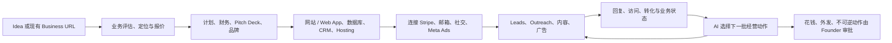

# DeNovo 产品分析：不是支付或流量基础设施，而是 AI 小生意经营工作台

> 生成时间：2026-07-30
> 查询：DeNovo Business Manager 在做什么；是否是在帮助站点接支付和获得流量
> 结论基于 2026-07-30 可访问的官网、Product Hunt、公开前端 bundle、公开 API、生成站点样本及 Terms；经营数字均为平台自报或平台口径，未经过独立审计

## 摘要

“帮站点做支付和流量”说对了一部分，但会把 DeNovo 理解窄，也会高估它在支付和流量上的控制力。

DeNovo 更准确的定义是：

> **面向个人创业者和小生意的 AI cofounder / business operating suite：把一个想法或现有网址，连续加工成商业计划、品牌、网站或 Web App，再接入 Stripe、邮件、社交与广告渠道，持续执行获客动作。**

它不是 Stripe、Paddle 或 Merchant of Record，不负责底层收单、结算、税务与拒付；“支付”主要是给它生成或管理的站点连接 Stripe。它也不是拥有自然流量的 marketplace 或媒体平台；“流量”主要是找 leads、发 cold email、发社交内容、运行 Meta 广告和投资人 outreach，广告预算与渠道风险仍由用户承担。

真正的差异不在某个单点功能，而在于试图让 `商业计划 → 产品 → 品牌 → 上线 → 获客 → 数据反馈` 共用一份长期业务 Context，并在上线后继续行动。公开证据已经能证明它在生成和部署多页站点、登录、购物车、业务流程及日常资产/任务执行方面不是纯概念；但尚不能证明它能稳定带来“首批付费客户”，公开样本也不足以验证端到端 Stripe 成交与可重复的 CAC → revenue 闭环。

## 一、用户到底提交什么，DeNovo 交付什么

| 阶段 | 用户提交的 artifact | 系统消费方式 | 主要输出 |
|---|---|---|---|
| 定义生意 | 一段 idea、行业/客户/报价，或现有 business URL | 评估市场、定位、产品和商业模式 | business plan、financial model、pricing、pitch deck |
| 生成业务载体 | 品牌偏好、服务/商品、功能需求 | 生成设计、页面、数据库、认证和后台逻辑 | logo/brand kit、网站或 Web App、hosting、custom domain |
| 接入经营渠道 | Stripe、社交、邮箱、广告等第三方账号 | 建连接、生成素材和 campaign，执行授权动作 | 支付入口、广告素材、社交内容、leads、outreach |
| 持续经营 | 转化、回复、任务、资产和客户状态 | 每日选择 GTM 动作，跟踪结果并调整 | CRM/活动记录、内容、邮件、广告动作、产品改进建议 |

[官网](https://www.denovo.dev/)把路径概括为 `idea → validated business plan → website/brand/assets wired to Stripe → ads and first customers`；[About 页面](https://www.denovo.dev/about)则把它拆成 `Create → Launch → Operate`，并强调上线后继续寻找客户、联系、投放、观察结果和改进。

因此它消费的不是一个“需要加支付按钮的站点工单”，而是一整套业务意图、资产与第三方账号。它想交付的也不是一个页面，而是一间能够持续运转的轻量数字公司。

## 二、真实 operating loop

Product Hunt 的 maker 将其描述为大约 `80% execution / 20% guided`，并称涉及花钱、外部沟通和不可逆动作时设置人工 approval gate；公司尚不代办 incorporation filing 或银行开户。这说明 DeNovo 当前更像“有持续自动化能力的经营工作台”，而不是完全替创始人承担法律责任和公司经营的自治 CEO。[Product Hunt launch](https://www.producthunt.com/products/denovo/launches/denovo)

## 三、它在“支付”上究竟做什么

### 做的

- 给生成的网站或应用加入商品、套餐、价格与购买入口；
- 帮助连接 Stripe，让站点具备收款能力；
- 将支付/客户状态放回业务 workspace，供 CRM 和后续经营使用；
- DeNovo 自己也通过订阅、usage credits 和 top-up 收费。

### 不做的

- 不是 Payment Service Provider；
- 不是 Merchant of Record；
- 不替商家完成 KYC、资金结算、税务、拒付和合规责任；
- 不等于任何已有站点都能仅靠接入 DeNovo 获得更好的支付成功率。

公开生成样本能证明它可以生成带商品、购物车、登录、订单或预约结构的多页应用，但抽查到的购买路径会先进入注册/登录，公开页面没有直接展示完整 Stripe Checkout 和成功付款。因此，“wired to Stripe”目前应视为官方宣称与产品能力入口，不能从公开样本进一步推出已有真实交易额或支付成功率。

所以，如果用户只是已有成熟站点、只缺 Stripe 集成，直接使用 Stripe 或成熟 commerce stack 通常更简单；DeNovo 的价值在于同时替用户把“卖什么、怎么呈现、站点怎么建、如何开始获客”一起做掉。

## 四、它在“流量”上究竟做什么

DeNovo 不生产一种自带用户的流量，也没有公开证据表明它拥有买家网络。它做的是**把外部渠道变成可由 AI 操作的 GTM 工具链**：

- lead finder 与邮箱 enrichment；
- cold email / outreach；
- 社交内容生成与发布；
- Meta ad creative 与 campaign；
- 投资人 matching / outreach；
- 根据结果继续生成内容和经营动作。

当前公开页面的 [Pro 计划](https://www.denovo.dev/subscription)是 `$25/月` 或 `$199/年`，含网站、hosting、计划、品牌、营销素材、社交管理、email outreach、lead finder 和 investor matching。前端 bundle 还存在一个 `$49/月` 的 Launch tier，以及以下使用上限：

- Build：每月 `$25` usage credits，最多约 30 个自动 GTM actions/day、25 封 outreach emails/day、两个社交渠道合计最多 3 posts/day；
- Launch：每月 `$49` usage credits，最多约 60 个自动 GTM actions/day、50 封 outreach emails/day、6 posts/day，并出现 verified email 与 workspace ownership transfer。

这与公开定价页的“one plan”不完全一致，说明计费/功能仍在调整；bundle 中出现的 tier 和 feature flag 也不等于所有用户已经普遍开放。

更重要的是，订阅中没有公开写明包含 Meta 广告媒体预算。因此最合理的判断是：DeNovo 提供广告编排、素材和优化动作，真正的 ad spend 仍需用户另付。它降低的是获客操作成本，不是免费创造需求。

## 五、公开证据：什么已经能确认，什么仍只是承诺

| 证据级别 | 当前能确认的事情 | 不能据此推出的结论 |
|---|---|---|
| 较强 | 官方公开 API 在 2026-07-30 显示约 1,344 个 live companies、当天 21 次 deploy、7,225 个 assets 和 7,406 个 completed tasks；feed 中可见持续生成/部署事件 | 这些不是经审计的付费客户、GMV、留存或成功企业 |
| 较强 | 多个公开样本站点具备完整视觉、多页结构、登录、购物车、订单、申请或推荐流程 | 不证明后台可靠性、真实支付成交、SEO 表现或生产级安全 |
| 中等 | 前端存在 build/evaluation/report、social、subscriptions、credits、connect、marketplace 等真实 API 模块和 GTM quota | 模块存在不等于每个功能均稳定、自动化或对所有用户开放 |
| 中等 | Maker 说明对花钱、外发和不可逆动作使用 human approval gates | 缺少公开运行日志，无法判断误操作率与审批覆盖率 |
| 较弱 | 官网称服务 `15,000+ business owners`，并承诺“不停直到客户付款” | business owners 不等于 paying users；也没有 cohort、CAC、revenue attribution 证据 |

公开 [live feed](https://www.denovo.dev/feed) 与 [pulse API](https://denovo-api.fly.dev/api/feed/pulse)说明它确有业务生成与运行活动，不只是 Landing Page。但平台计数器由 DeNovo 自己定义；“生成了资产/完成了任务/上线了公司”和“形成有效流量/获得付费客户”是三种不同证据。

## 六、最像哪些产品，差异在哪里

可以把 DeNovo 理解为下列工具的轻量组合：

- Lovable / Replit 一类 AI Web App builder；
- Durable / 10Web 一类 AI website + business setup；
- Apollo / Instantly 一类 lead finding 与 outbound；
- Buffer / Meta Ads 一类社交与广告操作；
- business plan、financial model、pitch deck 生成器；
- 一个保留统一业务状态的 AI operator。

它的差异化不是“每一个模块比专业工具更强”，而是：

1. 一个入口同时处理 product、company 与 go-to-market；
2. 所有资产、客户、财务和经营动作围绕同一个 business workspace；
3. 不是生成完网站就结束，而是宣称每天继续执行；
4. 创始人主要处理例外、审批和高价值判断。

也因此，它最关键的长期问题不是还能多生成一种资产，而是能否形成真正的闭环学习：知道哪次内容、邮件、广告和产品修改最终带来收入，并让下一次动作显著改善。如果不能，它就只是把多个生成器和渠道工具打包在一起；如果能，它才有机会成为小生意的 `business of record`。

## 七、适合谁，不适合谁

### 更适合

- 只有 idea、没有技术/设计/GTM 团队的 solo founder；
- 教练、顾问、工作室等轻服务业务；
- 想快速测试定价、页面和第一轮 outbound 的 SaaS / 电商验证；
- 接受“先生成一个够用版本，再由数据和人工修正”的创业者。

### 不太适合

- 已有成熟产品，仅需要加支付或购买流量的团队；
- 对品牌、后端、数据模型和流程有大量定制要求的公司；
- 医疗、金融等受监管或需要 HIPAA、FISMA、GLBA 处理的业务；
- 需要平台承担公司注册、银行、税务、法务、供应链、客服、退款和履约责任的创业者；
- 把 AI 自动动作误认为“获得客户”而不愿亲自核验漏斗的人。

[Terms](https://www.denovo.dev/terms)明确说明 AI 输出按现状提供、用户负责人工复核与合法使用，服务不面向 HIPAA/FISMA，不能用于违反 GLBA 的场景；第三方交易、数据备份和多数经营风险仍由用户承担，责任上限为 `$100`。条款还对公开 Contributions 与 Submissions 取得较宽的许可或权利，而官网同时强调用户保有业务与 IP；上传机密业务材料前应进一步向公司确认具体对象和适用范围。这不是法律意见，但它说明“AI cofounder”是产品交互定位，不是法律责任的转移。

## 八、购买前最值得做的 7 天验证

不要只看它能否生成漂亮站点，应该用一个真实的小业务验证完整漏斗：

1. 输入一个有明确报价和目标客户的业务，而不是泛泛 idea；
2. 检查 plan、pricing 与页面是否真正一致；
3. 用测试 Stripe 走完注册、结账、成功/失败和退款路径；
4. 让它生成 30 个 leads，人工抽查目标匹配率和邮箱有效率；
5. 发送一小批 outreach，记录送达、回复、正向意向和退订；
6. 小额运行一次广告，确认广告费是否另付、账户归属和 attribution；
7. 导出网站、客户、内容和连接信息，确认离开 DeNovo 后哪些资产仍可带走。

最终 Gate 不是“生成了多少资产”，而是：

> **一周内是否能以可接受的人工时间和完整成本，把一个明确 offer 推到真实回复、预约或付款；并且能解释是哪次动作导致了结果。**

## 九、成立性审计：作为工具可能成立，作为 AI cofounder 目前不成立

需要把“成立”拆成三个不同问题：

| 判断层次 | 当前结论 | 原因 |
|---|---|---|
| 能不能用 | 成立 | 已能生成、部署站点和业务资产，也存在真实经营动作 |
| 有没有人愿意付 `$25` 省事 | 大概率成立 | 对没有技术、设计和营销能力的用户，one-stop setup 有便利价值 |
| 能否持续把 idea 变成 paying customers，并成为独立、可复利的公司 | 当前不成立 | 需求、渠道、反馈归因、单位经济与留存均缺关键证据，且产品结构存在矛盾 |

### 1. 它自动化的是已经过剩的供给，不是最稀缺的需求

网站、Logo、Pitch Deck、广告图和冷邮件都已经能被大量 AI 工具低成本生成。小生意真正稀缺的是：

- 是否存在有人愿意付费的需求；
- Offer 与价格是否正确；
- 为什么客户相信这个商家；
- 产品或服务能否真正履约；
- 哪个渠道可以持续、低成本触达目标客户。

DeNovo 可以让一个未经验证的 idea 更快变成“看起来像一家公司的资产”，却不能仅靠生成更多资产让需求出现。如果需求假设错了，自动化只会更快地产生网站、内容、邮件和广告支出。

### 2. 它的目标用户存在结构性悖论

- 最需要“一键创业”的新手，通常最缺行业洞察、客户关系、Offer、判断力和执行资源，失败率与流失率会很高；
- 真正有业务、客户和强需求的创业者，更可能要求专业 builder、CRM、邮件、广告、支付和分析工具，也更在意代码、数据与账户所有权；
- 因而最容易被营销文案吸引的人，未必是最能产生长期收入和留存的人；最能产生收入的人，又未必愿意把整间公司交给一个宽而浅的平台。

### 3. “AI cofounder”的承诺与真实责任不匹配

产品说“直到客户付款”，但用户仍要：

- 决定业务方向与定价；
- 批准花钱、外发与不可逆动作；
- 承担 Stripe、广告账户、邮件送达和平台封禁风险；
- 审核 AI 输出、处理客户、退款、法务和履约；
- 对经营结果负最终责任。

这意味着 DeNovo 能操作许多按钮，却没有 cofounder 所需要的权利、信息、信任和责任。Terms 又把 AI 输出、第三方交易和经营风险大多留给用户。“cofounder”目前更像降低学习门槛的交互隐喻，而不是责任关系。

### 4. 它没有拥有流量，GTM 动作容易退化成 activity theater

Lead finding、cold email、社交发布和 Meta Ads 都是成熟且商品化的渠道。DeNovo 没有公开的买家网络或独占渠道，因此无法从结构上保证流量质量。若系统只优化：

- 找了多少 leads；
- 发了多少邮件和帖子；
- 生成了多少素材；
- 完成了多少 tasks；

而不能可靠地连接到 `目标客户 → 有效回复 → 预约 → 付款 → 留存`，它就会把“做了很多营销动作”误当作增长。公开 feed 的 company、asset 和 task 数字正好停在这条证据断点之前。

### 5. 产品表面积与 `$25/月` 的经济性不匹配

DeNovo 同时承诺网站与 hosting、应用生成、数据库、CRM、品牌、财务、Pitch Deck、legal docs、leads、邮件、社交、广告、投资人匹配和持续自动操作。这样宽的产品表面积意味着：

- 每个模块都要对抗成熟专业工具；
- 任何一个支付、认证、邮件、广告或部署故障都可能破坏整体信任；
- AI、hosting、lead enrichment、email verification 和持续任务都产生变动成本；
- 若 `$25` 足以覆盖，通常意味着使用量很低、质量较浅或依赖 top-up；若用户真把它当完整经营系统使用，成本和支持压力会显著上升。

而且它服务的是高失败率新业务。用户的生意没有结果，平台自身也难获得留存；这会形成“最需要平台的人最容易流失”的负向选择。

### 6. “统一 business Context”还不是壁垒

统一保存计划、网站、客户和营销动作有产品价值，但只有满足以下条件才可能形成复利：

1. 知道每个动作是否带来了真实收入；
2. 能从多个周期的结果中改善选择；
3. 数据比用户在 Stripe、广告平台、CRM 和 analytics 中已有的数据更完整；
4. 用户愿意长期把关键业务状态留在 DeNovo；
5. 改善效果能超过通用 Agent + 专业 SaaS 的组合。

当前没有公开证据证明这些条件。若用户可以轻易导出，锁定较弱；若不能导出，又会阻碍严肃商家采用。

### 7. 什么情况下它才可能真正成立

宽泛的“任何 idea → paying customers”很难成立。更可信的收敛方式是：

- 只做一个可标准化的 vertical，例如顾问、教练、家庭服务或某类本地商家；
- 承诺一个可验证的结果，例如“获得 10 次合格预约对话”，而非“生成完整公司”；
- 直接拥有 booking、payment 和 revenue attribution；
- 将渠道动作绑定到收入结果，而不是任务数；
- 必要时加入人工运营或专家审核，成为 software-enabled service；
- 用 cohort 公开验证：首个有效 lead 时间、首个付款时间、30/90 日留存、CAC、退款和贡献毛利；
- 价格与结果价值、人工支持和变动成本匹配，而不是用 `$25` 覆盖整套公司运营。

在这种收敛下，它可能成为某类小生意的 vertical operating system。若继续横向覆盖所有行业、所有公司功能和所有 GTM 渠道，更可能停留在“令人惊艳的创业资产生成器”。

## 结论

DeNovo 的产品边界可以压缩成一句话：

> **它不是替站点提供支付与流量的基础设施，而是替不会搭业务系统的创业者生成一套在线生意，并代为操作 Stripe、广告、社交和邮件等外部基础设施。**

支付和流量都是其中两个模块。支付能力依附 Stripe，流量能力依附第三方渠道和用户预算；DeNovo 自己真正想拥有的是业务 Context、经营动作与反馈记录。

**严格判断：DeNovo 当前作为 `$25/月` 的 AI launch kit 可能有便利价值；作为“从 idea 到 paying customers”的 AI cofounder 产品，目前不成立。** 它证明了能建、能上线、能持续产生活动，却没有证明最关键的需求发现、有效获客、收入归因、履约、留存和单位经济。除非收窄到一个可验证的 vertical outcome，并真正拥有从渠道到收入的闭环，否则它更像多种 AI 生成器和营销工具的打包，而不是一个有独立控制点的长期 business operating system。

## 来源

- [DeNovo 官网](https://www.denovo.dev/)
- [DeNovo About](https://www.denovo.dev/about)
- [DeNovo Pricing](https://www.denovo.dev/subscription)
- [Product Hunt 产品页](https://www.producthunt.com/products/denovo)
- [Product Hunt Launch](https://www.producthunt.com/products/denovo/launches/denovo)
- [DeNovo Live Feed](https://www.denovo.dev/feed)
- [DeNovo Public Pulse API](https://denovo-api.fly.dev/api/feed/pulse)
- [DeNovo Terms](https://www.denovo.dev/terms)
- [growth-engineering](/wiki/concepts/growth-engineering/)
- [creator-ai-service-productization](/wiki/concepts/creator-ai-service-productization/)

---
*由 LLM 从知识库查询生成*
