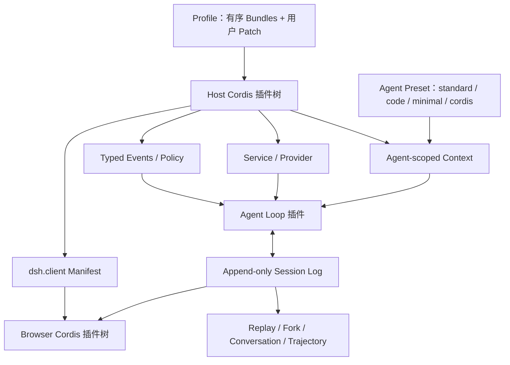

# DSH 插件架构：为什么这样设计、实现了什么、又付出了什么

> 生成时间：2026-08-14
> 查询：分析 DeepSeek Harness（dsh）的插件设计动机、收益、Feature 与实现机制
> 源码快照：`deepseek-ai/deepseek-harness@47f943859bef60e4160492346772ded9b24f765a`（远端 `master` 与上一轮研究快照一致；CLI `0.1.0-rc.5`）

## 结论先行

**dsh 的“一切皆插件”不是普通的插件市场设计，而是一套反应式 microkernel：把一个插件同时变成代码扩展单元、依赖注入单元、生命周期所有权单元、配置/HMR 单元和作用域单元。** 真正值钱的不是“任何功能都能写成 npm 包”，而是这五件事共用同一个 Cordis `Fiber`。

dsh 想解决的核心问题是 Agent Harness 的**组合爆炸**。模型、工具、sandbox、filesystem、权限、compaction、persistence、subagent、UI、Web/Headless 形态和每个 Agent 的 persona 都会独立变化；如果这些变化都写进 Agent Loop，产品会快速变成条件分支和多个 fork。dsh 的答案是把产品差异从代码分支改成运行时 composition。

但需要同时校正三句容易被宣传放大的话：

1. **“没有 core”不准确。** 它没有特权的产品组件，但有明确的 Cordis microkernel、Service/Event vocabulary、Session invariant 和配置组合规则。
2. **Replay、安全、PTC 不是插件化自动带来的。** Replay 来自 event-sourced Session；安全来自真实的 sandbox/approval enforcement；PTC 来自 Code Mode 的工具与 prompt 组合。插件化的贡献是让它们可独立安装、替换、组合和管理生命周期。
3. **架构可替换不等于生态已经成立。** 当前只有一个正式 Agent Loop；第三方插件规模、兼容性和用户采用尚未被 developer preview 证明。

一句话定义：

> dsh 保留的不是一辆固定的车，而是交通规则、插槽标准和拆装流程；发动机、仪表盘、变速箱乃至整车配置都可以替换。

## 1. 它到底把什么做成了插件

“Everything is a plugin”在 dsh 里至少有五层含义：

| 层 | 核心机制 | 被组合的对象 | 解决的问题 |
|---|---|---|---|
| 部署层 | Profile + Bundle + Patch | Web、Headless、自定义产品形态 | 不为每个 SKU fork launcher |
| 运行时层 | Cordis Context + Service + Fiber | model、loop、session、tool、sandbox 等 | 依赖满足才启动，卸载时统一 cleanup |
| 行为层 | typed events | hook、retry、compaction、permission、audit | 新行为不继续 patch Agent Loop |
| 能力层 | Definition / Provider / Consumer seam | local / sandbox / remote backend | 换后端，不改变模型可见 tool schema |
| Agent/UI 层 | scoped Context + 浏览器第二棵 Cordis tree | 单 Session preset、局部工具、UI 模块 | 多 Agent 共用 Host，又能局部定制；UI 无中央 switch |

此外，append-only Session log 是整个架构的事实底座。它本身也作为 Service 插件交付，但它的价值来自“log 就是状态”和 `model-visible ⇔ logged` 不变量，而不是“叫做 plugin”。

## 2. 为什么他要这么做

### 2.1 Harness 的变化轴太多，普通“工具插件”不够

一个 Agent 产品至少同时面对四类变化：

- **行为变化**：hook、retry、compaction、plan、approval、audit；
- **能力实现变化**：local / sandbox / remote filesystem、shell、model provider；
- **单 Agent 变化**：persona、tools、prompt、listener、policy；
- **产品形态变化**：Web、Headless、SDK、未来的 TUI 或 provider pack。

如果只开放 `registerTool()`，其余三类变化仍然会侵入 loop、launcher 和中央 UI。dsh 因此不是加几个 extension point，而是把“如何组成一个 Harness”本身变成第一等产品对象。

官方 Agent Note 对原问题的描述很直接：hooks、goal、loop、workflow、compaction、sandbox、permissions、UI、persistence、MCP、skills 都应能作为插件加入，而不修改 core。它同时否决了另造 Koa middleware stack 和显式 phase state machine，因为 Cordis 已经提供 dispatch、dispose 和 reload 语义。

### 2.2 不同部分的变化速率不同

模型看到的 `bash` 或 filesystem tool contract 应当稳定，但本地、sandbox、E2B 等 backend 会快速变化。把接口、实现和模型工具绑在一个包里，会导致换 backend 时 prompt/schema 也被拖动。

dsh 用 capability seam 把它拆成：

1. **Definition**：稳定的 `ctx.<service>` 契约和共享词汇；
2. **Provider**：具体实现；
3. **Consumer**：模型可见 tool 或其他产品组件。

这不是为了“多拆包”本身，而是为了让每个边界按自己的变化速度演进。dsh 自己也强调：只有角色确实独立变化时才拆，不要预先抽象。

### 2.3 产品形态应当是数据，不应当是 launcher 分支

旧 launcher 曾硬编码 base + web、多个特殊入口和全局 overlay。结果是第三方 TUI 或 provider pack 即便代码完整，也必须修改主仓才能进入产品。

Profile / Bundle / Patch 把这个问题改写为声明式组合：一个 profile 明确列出有序 bundle，再叠加用户 patch；同一套 patch 算法同时服务真实 boot 和 `dump-config`。因此“运行了什么”可以被检查，而不是散落在启动代码的 `if/else` 里。

### 2.4 插件生命周期本身是难题，不能让每个子系统各写一遍

依赖就绪、加载顺序、反向 teardown、listener 清理、配置更新、失败回滚和 HMR 都很难。如果工具、UI、provider、policy 各自实现，最终会出现多套不一致的生命周期。

dsh 借 Cordis 把它们统一到 `Fiber`：插件 mount 时产生 Fiber，Fiber 持有依赖、配置、effects 和 disposers；依赖出现时 activate，依赖消失或配置替换时 unload，注册项按所有权逆序撤销。

### 2.5 战略意图：把 Harness 从一个应用变成实验与生态底座

这是从代码和发行方式推导出的**系统推断**，不是官方已验证的商业结果：DeepSeek 可能希望模型能力与 Harness 形态解耦，使内部能控制变量替换 loop/provider/policy，也让外部开发者通过普通 npm 包贡献产品形态。它更像“Harness construction kit”而不只是 DeepSeek 自己的 coding agent。

这条战略是否形成生态护城河，目前没有采用率、第三方插件质量或兼容性数据支撑。

## 3. 有什么好处

### 3.1 把改代码变成改组合

Web、Headless、不同 provider、不同 Agent preset 可以复用同一批组件。新增产品形态主要增加 bundle/profile，而不是 fork Agent Loop 或 launcher。

### 3.2 Provider 可替换，模型接口保持稳定

以 Shell 为例：`ShellExecutor` 定义 `ctx.shell`；`LocalBashExecutor` 与 `SandboxBashExecutor` 提供不同实现；`tool-bash` 只依赖 `ctx.shell`。因此 backend 可以替换，tool schema 和模型使用方式不需要变化。

### 3.3 Feature 可以挂在生命周期旁边，而不是塞进 Loop

compaction、goal、hooks、plan-mode、skills、context 等插件监听 `agent/pre-step`；权限、timeout、retry、metrics 可挂在 tool/request waterfall 上。Agent Loop 只负责一个具体的 ReAct/stream/tool 执行器，不需要理解每种扩展。

### 3.4 安装、卸载和 HMR 有统一 cleanup 语义

Service、listener、tool、timer、child plugin 由创建它们的 Fiber 所有。正常情况下，插件卸载会同步撤销其 effects，而不是留下陈旧 handler 或全局变量。

### 3.5 多个 Agent 能共享基础设施，又保有局部能力

Deployment graph 可以共享 model adapter、persistence、provider registry 和 UI；注册在 `agent.ctx` 的 tool、prompt、guard、listener 只对该 Agent 可见，并随 Agent 销毁回收。这避免了“每个 Agent 启一套完整 Host”的资源浪费。

### 3.6 实际组合可审计、可复现

Profile 从空 root 按明确顺序叠加 bundle → profile patch → home patch → CLI overlay；`dump-config` 使用同一组合器。Session 的 preset 选择又进入 log，resume/fork 能恢复实际运行环境，而不是只相信当前默认设置。

### 3.7 Host 和浏览器采用同一种扩展模型

Host 扫描启用的 Loader entry 及其 `dsh.client` manifest，把模块投影到浏览器；浏览器启动第二棵 Cordis 插件树。新能力可以同时携带 backend、状态服务和 UI definition，不必修改一个中央 React router 或 renderer switch。

## 4. 它实际实现了哪些 Feature，怎么实现

| Feature | 用户看到什么 | 实现机制 | 当前边界 |
|---|---|---|---|
| Web / Headless / 自定义部署 | 同一 CLI 启动不同产品形态 | Profile 有序叠加 `base`、`web-app`、`headless` 等 bundle，再叠 patch | Patch 的 `config` 是整块替换，不是 deep merge |
| 四种 Agent 模式 | 标准、PTC Code、极简、创造模式 | 每种模式是一份 Agent Preset，挂到 agent scope；新 session 选择 composition | 它们不是四个 Profile；复制式 preset 可能 drift |
| Model / Shell / FS / Sandbox 替换 | 改 provider 而不改 tool 使用方式 | Service Definition + Provider + Consumer；`inject` 等待依赖 | 需要真实兼容契约；“可替换”不等于已有多实现充分验证 |
| Hooks / Policy / Approval / Retry | 不改 loop 增加拦截、改写、拒绝或观测 | typed event：waterfall / serial / parallel / emit | waterfall 忘记 `next()` 会吞掉后续行为 |
| Agent Loop 插件化 | Loop 可从配置替换，扩展不 import 具体 loop | `AgentLoop` 是依赖 agents/sessions/llm/tools/systemPrompt 的 Cordis Service | 当前只交付一个 concrete loop，互换性仍主要是架构承诺 |
| Session replay / resume / fork | 从历史恢复对话、派生模型上下文、复制稳定前缀 | append-only typed log；连续 seq、JSON snapshot、deep-freeze；messages 从 log projection | 是状态重建，不是重新执行历史工具，也不保证外部世界 deterministic |
| Conversation / Trajectory | Chat 与调试轨迹看同一事实 | UI 从 Session event log 投影节点和 request/tool/assistant rows | 可信度来自 event sourcing，不是 UI 插件本身 |
| Host 配置 HMR | 改 patch 后重新组合，删除 override 恢复 bundle 默认 | Loader update/unload + Fiber disposer + apply failure compensation | 不是任意 effect 的原子事务；rollback 仍可能失败 |
| UI 插件与客户端 HMR | UI 模块独立出现、移除或重载 | `dsh.client` manifest → Host module registry → Browser Loader/Fiber | client apply 失败没有完整 rollback；package-set 增删通常需重启 |
| Schedule | 可给 Agent 注入 schedule tools 和 job | 独立 Schedule Service + agent creation listener | 代码已实现，但默认 bundle 未启用，只在示例中挂载 |
| 创造模式自修改 | Agent 可 inspect/mount/unmount live runtime capability | `cordis_mount` 执行模型生成的 JS，直接向当前运行时挂插件 | 信任边界接近 shell；不是安全 sandbox |

### 四种模式的准确区分

官方文章中的四种“模式”属于 **Agent Preset plane**：

- `standard`：完整 coding agent，包含 edit、shell、search、Skills、plan、goals、subagents、workflow；
- `code`：在标准能力上增加 Programmatic Tool Calling，让模型生成 TypeScript 程序编排工具；
- `minimal`：只保留持久 Bash 与 `str_replace_editor`，固定完整 prompt，不启用 compaction；
- `cordis`：创造模式，增加 runtime inspection、插件实验和 preset authoring，能向 live runtime 执行 JS。

而 `web` / `headless` 属于 **Deployment Profile plane**。前者决定“这个 Agent 怎么工作”，后者决定“整个应用装了什么”。把两者分开，正是 dsh 支持同一 Host 内多 Agent 形态的关键。

## 5. 一次插件从配置到运行的完整链路

1. **发行**：npm package 的 manifest 声明 bundle patch，或声明 `dsh.client` 浏览器入口。
2. **组合**：Profile 从空 root 开始，按显式顺序应用 bundle、profile、home、CLI 等 patch 层。
3. **加载**：Cordis Loader 为每个 plugin entry 创建 Fiber；`inject` 表达 required/optional Service 依赖。
4. **生效**：插件通过 Context 注册 Service、typed event listener、tool、UI definition 等 effect；作用域决定谁可见。
5. **运行**：Agent Loop 从 Session log 派生请求，通过 shared Service 与 events 执行模型和工具；持久化、UI、telemetry 各自消费同一事实流。
6. **更新/卸载**：配置变化或依赖消失触发 unload；Fiber 逆序执行 disposers；新配置重新 apply，Loader在可补偿范围内回退失败更新。

这个链路解释了 dsh 的独到之处：DI、event bus、middleware、配置系统和 HMR 单独看都不新，**新的是它们被统一为同一个有作用域、有所有权、有生命周期的组合模型。**

## 6. 哪些收益不能算到插件化头上

| 能力 | 真正的来源 | 插件化的贡献 |
|---|---|---|
| Replay / Fork / Audit | append-only Session log 与 projection invariant | 让 persistence、UI、telemetry 可作为独立消费者交付 |
| `model-visible ⇔ logged` | Agent request invariant 与 event-sourced state | 让不同 feature 都遵守统一 log seam |
| Sandbox / Approval / Fail-closed | execution path 的真实 policy enforcement | 让 policy/provider 可替换和组合 |
| PTC Code Mode | Code Mode prompt、SDK 与 `run_code` 工具 | 让它作为 preset 与其他模式共存 |
| 稳定 tool schema | Definition / Provider / Consumer 边界 | 统一装配和生命周期 |
| 模型效果提升 | 模型、prompt、tool design、eval | 插件化本身不提供效果或因果增益 |

这是评价 dsh 时最重要的证据边界：不能因为某能力“由插件提供”，就把该能力的可靠性归因于插件机制。

## 7. 成本、失败模式与反方

### 7.1 复杂度没有消失，只是集中进 microkernel

Cordis/Fiber/Loader 必须正确处理 dependency epoch、reentrant disposal、serialized mutation、reload compensation 和 effect cleanup。dsh 选择 vendored Cordis，换来可审计、可打补丁和固定语义，也承担长期同步和维护成本。

### 7.2 间接控制流提高调试难度

一个行为可能来自 profile patch、Service replacement、agent-scoped registration、waterfall listener 或 Session projection。阅读单个 package 往往不足以知道最终产品行为，必须查看真实 composition graph。

### 7.3 缺依赖和错误 patch 可能表现得不够响亮

Fiber 缺 required Service 时可以合法地停在 `PENDING`；dsh 因此额外做 ACTIVE sweep 报告缺失服务。Patch target 不存在时可能只 warning 并跳过；`config` 又是 whole replacement，容易因 typo 或遗漏字段得到意外组合。

### 7.4 Waterfall 是强大但危险的 veto

监听器不调用 `next()` 就会短路。一个原本只想记录日志的插件，也可能无意中阻断 model request 或 tool execution。Typed event 能约束形状，不能替代语义纪律与真实组合测试。

### 7.5 HMR 不是完整事务

Host Loader 可以在 apply 失败时做 compensation，但任意 effect 不能被普遍 snapshot；客户端 HMR 明确没有完整 rollback。安装/卸载 npm package 改变 package set 时，通常仍需重启进程。

### 7.6 插件不是安全边界

同进程第三方插件是受信任代码。`agent.ctx` 控制可见性和 cleanup，不阻止插件直接调用它拿到的 Service；创造模式的 runtime JS 接近 shell 权限。真正的不提权需要独立 authority model、sandbox 和执行时校验。

### 7.7 真实 Loader 拓扑比单元测试更容易出错

dsh 已记录过一次 178 个测试、100% line coverage 全绿，但 default export 丢失 named `inject`，导致 ACP 真实 composition 无法创建 Session 的事故。这说明插件系统必须测试实际 manifest → Loader → topology 路径，手工 `ctx.plugin()` 不能作为产品验收。

### 7.8 什么时候会过度设计

如果产品只有单一 CLI、单一 provider、固定 pipeline，只需要增加几个工具或 hook，普通 DI + 明确 middleware 往往更简单。只有当 provider、surface、per-agent scope、runtime reload 和外部生态等多个变化轴同时存在时，dsh 的 universal plugin runtime 才开始回本。

## 8. 最终评价

dsh 最聪明的地方不是“插件数量多”，而是把**变化的所有权**做成运行时协议：

- Profile 决定整套产品装什么；
- Preset 决定单个 Agent 怎么工作；
- Context 决定能力对谁可见；
- Service 决定依赖什么；
- Fiber 决定活多久、谁负责清理；
- Event 决定如何扩展行为；
- Session log 决定什么才是可恢复的事实。

所以它最适合作为 Harness 平台、实验底座和多产品形态 runtime，而不一定是每个 coding agent 都应复制的架构。最大收益是演进速度、可替换性和可审计组合；最大成本是生命周期、配置、协议治理和真实拓扑测试的复杂度。

对 dsh 最准确的评价不是“无内核，一切皆插件”，而是：

> **没有特权的产品组件，但有一个强约束、并不轻的 microkernel。**

## 资料与源码证据

### 知识库

- [dsh-deepseek-harness-product-analysis-2026-08-13](/output/reports/dsh-deepseek-harness-product-analysis-2026-08-13/)
- [agent-harness-implementations](/wiki/maps/agent-harness-implementations/)
- [harness-engineering](/wiki/maps/harness-engineering/)
- [harness-engineering](/wiki/concepts/harness-engineering/)
- `Clippings/DeepSeek Harness 开发者预览版：一切皆插件.md`（当前 Clippings intake，未在本查询中修改或归档）

### 官方源码快照（固定到 `47f9438`）

- [Architecture](https://github.com/deepseek-ai/deepseek-harness/blob/47f943859bef60e4160492346772ded9b24f765a/docs/architecture.md#L9-L37)
- [Cordis Primer](https://github.com/deepseek-ai/deepseek-harness/blob/47f943859bef60e4160492346772ded9b24f765a/docs/cordis-primer.md#L7-L44)
- [Microkernel event taxonomy decision](https://github.com/deepseek-ai/deepseek-harness/blob/47f943859bef60e4160492346772ded9b24f765a/.agents/notes/implemented/architecture/2026-06-11-microkernel-event-taxonomy.md#L7-L31)
- [Event-sourced sessions decision](https://github.com/deepseek-ai/deepseek-harness/blob/47f943859bef60e4160492346772ded9b24f765a/.agents/notes/implemented/architecture/2026-06-11-event-sourced-sessions.md#L7-L28)
- [Capability seams decision](https://github.com/deepseek-ai/deepseek-harness/blob/47f943859bef60e4160492346772ded9b24f765a/.agents/notes/implemented/architecture/2026-06-13-capability-seams.md#L7-L38)
- [Profile / plugin bundles decision](https://github.com/deepseek-ai/deepseek-harness/blob/47f943859bef60e4160492346772ded9b24f765a/.agents/notes/implemented/architecture/2026-08-05-profile-plugin-bundles.md#L7-L33)
- [Context implementation](https://github.com/deepseek-ai/deepseek-harness/blob/47f943859bef60e4160492346772ded9b24f765a/vendor/cordis/src/context.ts#L35-L124)
- [Fiber lifecycle](https://github.com/deepseek-ai/deepseek-harness/blob/47f943859bef60e4160492346772ded9b24f765a/vendor/cordis/src/fiber.ts#L139-L203)
- [Agent Loop plugin](https://github.com/deepseek-ai/deepseek-harness/blob/47f943859bef60e4160492346772ded9b24f765a/packages/core/agent-loop/src/index.ts#L295-L350)
- [Append-only Session implementation](https://github.com/deepseek-ai/deepseek-harness/blob/47f943859bef60e4160492346772ded9b24f765a/packages/core/session/src/index.ts#L550-L655)
- [Profile boot composition order](https://github.com/deepseek-ai/deepseek-harness/blob/47f943859bef60e4160492346772ded9b24f765a/apps/cli/src/profile-boot.ts#L121-L170)
- [Browser client-module registry](https://github.com/deepseek-ai/deepseek-harness/blob/47f943859bef60e4160492346772ded9b24f765a/packages/client/modules/src/index.ts#L149-L249)
- [Agent presets](https://github.com/deepseek-ai/deepseek-harness/tree/47f943859bef60e4160492346772ded9b24f765a/apps/cli/config/agent-presets)
- [ACP composition postmortem](https://github.com/deepseek-ai/deepseek-harness/blob/47f943859bef60e4160492346772ded9b24f765a/docs/postmortem/0001-acp-default-export-drops-inject.md#L7-L98)

---
*由 LLM 从知识库与 DeepSeek Harness 官方源码快照查询生成*
