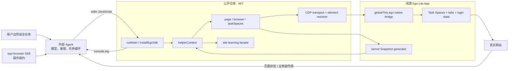

# Ego Lite 代码库第一轮源码学习：它不是 Agent，而是浏览器执行 Harness

> **结论**：`citrolabs/ego-lite` 公开仓库不是 Ego Lite 浏览器本体，也不是一个完整 Agent。它开源的是 `ego-browser`：一个让 Codex、Claude Code 等外部 Agent 通过 JavaScript 批量控制 Ego Lite 的 Node.js/CDP harness，以及配套 Skill 和静态 site learning packs。按仓库的产品 contract，登录态、Task Spaces、Snapshot 和 `globalThis.ego` 由闭源 Chromium App / native bridge 提供；这些 App-level 性质本次没有 real E2E 证据。

- 研究日期：2026-08-03（Asia/Shanghai）
- 官方仓库：[`citrolabs/ego-lite`](https://github.com/citrolabs/ego-lite)
- 实读 `main`：[`f260b21761354ca0d2781ce750418305f16f8988`](https://github.com/citrolabs/ego-lite/tree/f260b21761354ca0d2781ce750418305f16f8988)，提交时间 2026-07-27
- 最新稳定 tag：[`v1.2.5`](https://github.com/citrolabs/ego-lite/releases/tag/v1.2.5)，SHA `fd3aae7146cf6c9c52014a9752f411bf9978ae93`
- 规模：239 commits、150 tracked files；`package/ego-browser/src/` 下 32 个 TypeScript 源文件、约 9,389 行源码；23 个测试文件、约 8,307 行测试
- 本报告依据：固定 SHA 源码、本地构建与测试、仓库文档、已删除但仍在废纸篓中的本机 App bundle 只读检查；未恢复或启动 App

## 一、先把它放到正确的产品层级

| 层 | 谁负责 | 输入 | 输出 | 是否在本仓库 |
|---|---|---|---|---|
| 外部 Agent | Codex / Claude Code / Cursor 等 | 用户自然语言、页面观察结果 | 推理、生成下一段 JS、决定是否继续 | 否 |
| Skill | `skills/ego-browser/SKILL.md` | Agent 读取的操作规约 | API 用法、Task Space 协议、HITL 行为要求 | 是 |
| Browser harness | `package/ego-browser` | Agent 写出的 stdin JavaScript | 调用 helper、CDP、输出 `console.log` | 是，MIT |
| Ego Lite browser / native bridge | Chromium App、`globalThis.ego` bindings | Task Space、tab、snapshot、CDP 请求 | 登录态页面、snapshot refs、浏览器动作 | **否，闭源** |
| 网站 | Google、X 或任意 Web App | 浏览器事件/API 请求 | 页面状态与业务副作用 | 外部 |

仓库自己的 `AGENTS.md` 已明确写出：公开层是 Node.js CDP harness 与 Skill，`globalThis.ego` 由闭源 App 注入，浏览器本体不在本仓库。[源码边界](https://github.com/citrolabs/ego-lite/blob/f260b21761354ca0d2781ce750418305f16f8988/AGENTS.md#L3-L23)

所以更准确的定义是：

> **Ego Lite = 闭源共享浏览器 runtime + 开源 browser execution harness + Agent Skill。**

它没有自己的模型、planner、任务决策循环或长期记忆，因此不是完整 Agent。它是被 Agent 消费的 **Browser Capability / Harness / Runtime Adapter**。

### 实际输入、输出与消费关系

- 用户输入：自然语言任务，例如“把这 10 个线索补齐并写回 CRM”。
- Agent 中间产物：一段可组合的 JavaScript，而不是一次只点一个按钮的离散 tool call。
- Harness 输入：stdin JavaScript；helper 被注入作用域，无需 import。
- 执行输出：网站上的真实副作用，以及经 `console.log` 返回给 Agent 的结构化结果。
- 下一轮：Agent 根据结果决定重试、验证、交给用户，或完成 Task Space。

README 所谓 “code base, not CLI base” 的真实增量，就是把多个浏览器动作编译进一段 JS，减少模型与工具之间的往返次数；“最高 2.5×”仍只是仓库中的厂商 benchmark 图，没有原始任务集、运行脚本或完整统计口径，不能独立复现。[产品机制与 benchmark 声明](https://github.com/citrolabs/ego-lite/blob/f260b21761354ca0d2781ce750418305f16f8988/README.md#L77-L114)

## 二、整体架构与运行闭环



### 两条启动路径

1. **App 内嵌路径**：闭源 host 注入 `globalThis.ego` 并导入 bundle；模块 side effect 会以默认参数自动调用 `installEgoSdk()`。该函数支持调用方显式传入可选的 `{ready}` barrier，同时保持 locator factory 同步、可链式调用；但默认自动安装时 barrier 已立即 resolved，本次也没有证据证明真实 host 另行传入了 readiness signal。
2. **源码 CLI 路径**：`node dist/out/index.js` 读取 stdin，构造 `AsyncFunction`，把 helper 作为参数执行。公开源码 CLI 不接受 `nodejs` 子命令；App 内 bundled binary 才是 Skill 文档所指的 `ego-browser nodejs ...` 宿主路径。[入口与数据流](https://github.com/citrolabs/ego-lite/blob/f260b21761354ca0d2781ce750418305f16f8988/AGENTS.md#L8-L23) [stdin 执行器](https://github.com/citrolabs/ego-lite/blob/f260b21761354ca0d2781ce750418305f16f8988/package/ego-browser/src/run.ts#L61-L146)

### 正常 operating loop

```text
选择/创建 Task Space
  → 打开或复用 tab
  → 获取 semantic Snapshot
  → 用 @ref 或 locator 找元素
  → 把多个动作批进一段 JS
  → 读回结果并验证页面状态
  → complete / handOff / 等用户确认后 resume
```

按当前公开 helper API，一段最小脚本应接近：

```js
const task = await taskSpaces.useOrCreate("inspect example page")
await browser.openOrReuseTab("https://example.com", { wait: true })

console.log(await page.snapshot())
await page.getByRole("button", { name: "提交" }).click()
await page.waitForLoadState("load")
console.log(await page.info())

await taskSpaces.complete(task.id, { keep: false })
```

这段代码的消费者仍是外部 Agent：Agent 负责决定写什么代码、什么时候验证、何时结束。Ego 并不自行完成思考循环。

## 三、跟一条调用链：`getByRole(...).click()` 到真实鼠标事件

这是理解仓库最值得走通的一条链：

1. `helperContext()` 的默认内建 surface 暴露七个顶层入口：`page`、`browser`、`taskSpaces`、`site`、`fetch`、`cdp`、`help`；workspace 中若存在 `agent_helpers.js`，其非 `_` 开头 exports 还会被追加到 CLI 顶层。SDK 路径还会把多数 enumerable native `ego` methods 绑定为 globals，因此七项只是默认 facade，不是闭源 host 的完整能力面。[helper surface](https://github.com/citrolabs/ego-lite/blob/f260b21761354ca0d2781ce750418305f16f8988/package/ego-browser/src/helpers.ts#L773-L864) [native exposure](https://github.com/citrolabs/ego-lite/blob/f260b21761354ca0d2781ce750418305f16f8988/package/ego-browser/src/index.ts#L321-L342)
2. `page.getByRole("button", {name: "提交"})` 只创建 locator 描述，不立即访问页面；`.click()` 才进入 pointer driver。[locator facade](https://github.com/citrolabs/ego-lite/blob/f260b21761354ca0d2781ce750418305f16f8988/package/ego-browser/src/helpers.ts#L520-L610)
3. resolver 对 locator 做 strict resolution：0 个匹配视为可重试，多个匹配视为需要缩小范围；解析出 DOM handle、box model 与元素中心。
4. pointer driver 优先先移动，再发 `mousePressed`、`mouseReleased` 的真实 `Input.dispatchMouseEvent`；若 probe 没有观察到 trusted event，会退化补发 untrusted DOM `MouseEvent` / `click` / `dblclick`，其语义并不完全等同于真实输入。[pointer click](https://github.com/citrolabs/ego-lite/blob/f260b21761354ca0d2781ce750418305f16f8988/package/ego-browser/src/driver/pointer.ts#L57-L95) [fallback probe](https://github.com/citrolabs/ego-lite/blob/f260b21761354ca0d2781ce750418305f16f8988/package/ego-browser/src/driver/pointer.ts#L224-L301)
5. `browserCdp()` 对 page-level command 自动找到当前 tab 并 attach session；2 秒是 target-selection revalidation TTL，过期后会重读 tabs，只有 target 变化或 session 丢失才重新 attach。session lost 时，隐式 session 请求会重连并重试一次。[CDP/session](https://github.com/citrolabs/ego-lite/blob/f260b21761354ca0d2781ce750418305f16f8988/package/ego-browser/src/browser-runtime.ts#L38-L144)
6. 最终 JSON 请求由闭源的 `ego.sendCDPMessage()` 发送；native callback 再把结果路由回 promise。

这里没有 Playwright 依赖。API 只是刻意做成 Playwright-style facade；`acorn` 是 `package.json` 唯一声明的 npm dependency，主要在构建时从 JSDoc 抽取 `help()` 所需的嵌入数据。

Playwright-style 也不等于 Playwright semantics：根级 `page.getByRole()` 走 AX tree；一旦通过 `locator(...).getByRole()` 形成 scoped locator，则改走手写 DOM role / accessible-name 推断。复杂 ARIA、shadow DOM 与 iframe 场景不能直接套用 Playwright 的完整语义。

### Snapshot / ref 的真实边界

`page.snapshot()` 并不在 TypeScript 中遍历 DOM。它直接调用闭源 `ego.snapshot()`，公开层只把返回的 `refs` 写进 `RefMap`，供后续 `@21` 等引用解析。[Snapshot bridge](https://github.com/citrolabs/ego-lite/blob/f260b21761354ca0d2781ce750418305f16f8988/package/ego-browser/src/driver/observe.ts#L49-L80)

- 当前 Snapshot mapper 实际填入 `backendNodeId + role + name`；`RefMap` 数据结构虽预留 `nth`，当前 mapper 没有传值。
- 每次 Snapshot 都会重建 ref map；map 为空时使用 `@N` 会自动补拍一次 Snapshot。
- 节点失效时可回退到 role/name 重找。
- `RefMap` 数据结构支持 `frameId`，但当前 Snapshot mapper 没有把 frameId 传入，因此 README 所称深 iframe 能力仍主要属于闭源 Snapshot 实现，无法由本仓库完整核验。

因此，Snapshot 是 Ego Lite 最可能形成差异化的核心，也是最需要独立 benchmark 的闭源黑盒。

## 四、最值得学的设计：Task Space 不是普通 browser context

公开 helper contract 把 Task Space 建模为“隔离工作区 + 人机控制权”，ownership 有三种状态；隔离与持久化的真实实现位于闭源 App，本轮未 live 验证：

- `agent`
- `agentDelegatedToUser`
- `user`

`useOrCreate` 不会偷偷 claim 一个 user-owned Space；显式 `claim` 才转移所有权。`handOff` 把控制交给用户，`takeOver` 恢复 Agent 控制，`complete({keep})` 决定保留还是关闭页面。[ownership policy](https://github.com/citrolabs/ego-lite/blob/f260b21761354ca0d2781ce750418305f16f8988/package/ego-browser/src/helpers.ts#L117-L243)

最好的细节不是 API 命名，而是 **hard stop 被建模成业务语义，而不是网络错误**：

- 用户接管或任务失活时，错误被标为 hard stop。
- Agent 被明确要求不要自动 retry、不要自行夺回控制。
- output sink 暂存业务日志；一旦发生 hard stop，就丢弃噪声，只输出一次明确的用户接管提示。[hard-stop error](https://github.com/citrolabs/ego-lite/blob/f260b21761354ca0d2781ce750418305f16f8988/package/ego-browser/src/ego-errors.ts#L41-L64) [output sink](https://github.com/citrolabs/ego-lite/blob/f260b21761354ca0d2781ce750418305f16f8988/package/ego-browser/src/output-sink.ts#L1-L21)

这是典型的 [Safe Autonomy](/wiki/concepts/safe-autonomy/) 设计：人类打断不是“障碍”，而是高于任务完成率的控制信号。

但安全边界要分两层：

- 对善意 Agent，helper 与 Skill 给出了清楚的 handoff 协议。
- 对恶意代码或 prompt injection，开放层将 user-control enforcement 委托给闭源 native bridge，但本次无法用 real E2E 核验它是否完整生效；公开 JS 可直接访问 raw `ego`，`takeOverTaskSpace` 本身也没有 ownership check。因此 Skill 里的“先征得用户确认”是行为规范，不是可审计的 capability permission。

## 五、“Experience accumulation” 目前实现了什么

当前 learning 子系统是 **静态经验包的注册表、发现器、加载器与执行器**，不是自动学习闭环。

目录结构：

```text
skills/ego-browser/learnings/<site>/
├── manifest.json
├── notes/*.md
├── tools/*.js
└── browser-tools/*.js
```

截至所查 SHA，只有两个 site packs：

| Site | Notes | Node tools | Browser tools |
|---|---:|---:|---:|
| Google | 1 | 1 | 1 |
| X | 2 | 2 | 1 |
| 合计 | 3 | 3 | 2 |

工作方式：

1. `site.learnContext(url)` 按 hostname 匹配 manifest，读取 notes，并返回工具签名。
2. `site.runTool(...)` 动态 import Node tool，将完整的**内建** helper context 作为 `ctx` 传入；外层额外加载的 `agent_helpers.js` 不会转传给 site tool。
3. `site.runBrowserTool(...)` 读取源码并在当前页面的 `Runtime.evaluate` 中执行。
4. validator 检查 manifest、相对路径、文件存在和临时 Snapshot ref（如 `@21` / `ref=21`），CI 会运行它。[learning loader](https://github.com/citrolabs/ego-lite/blob/f260b21761354ca0d2781ce750418305f16f8988/package/ego-browser/src/learning/index.ts#L42-L117) [tool execution](https://github.com/citrolabs/ego-lite/blob/f260b21761354ca0d2781ce750418305f16f8988/package/ego-browser/src/learning/index.ts#L131-L195)

没有实现的部分：

- 没有成功轨迹采集；
- 没有失败反馈与 selector 稳定性统计；
- 没有从轨迹归纳 note/tool；
- 没有 runtime 内置的经验 proposal → review → version → rollout / rollback 闭环；现有 validator/CI 只检查格式、路径与可导入性；
- 普通页面导航不会自动加载或选择 site learning；
- 当前 canonical Skill 甚至不再提示 Agent 使用 `site.*` facade。

所以“越用越快”的当前真实含义只能是：**人工维护经验包后即可在本地复用，发布只负责分发**。README 也把 experience accumulation 明确标成 `coming soon`。[产品状态](https://github.com/citrolabs/ego-lite/blob/f260b21761354ca0d2781ce750418305f16f8988/README.md#L81-L86)

## 六、验证结果：开放 harness 的单测好，但产品级证据链未闭合

在临时 clone 上，以 Node `v25.6.1`、npm `11.9.0` 验证；测试会生成 `node_modules` / `dist`，但未修改 tracked 源文件，最终 Git worktree clean。CI 官方指定 Node 22：

| 检查 | 结果 | 能证明什么 | 不能证明什么 |
|---|---|---|---|
| `npm ci` / `npm audit` | 通过，0 vulnerabilities | 当前 npm 依赖审计无已知漏洞 | 闭源 App 与 CDN 二进制安全 |
| `npm test` | **299/299 通过** | helper、resolver、session、错误、FakeEgo 行为稳定 | 真实浏览器/native bridge/login state |
| `validate:site-skills` | 通过 | 现有两个 learning pack 符合 validator | tool 是安全的或真的适配当前网站 |
| `validate:agent-style` | 通过 | 31 个文件符合 Agent 代码风格检查 | Skill 与运行时 API 一致 |
| `mutation-check` | **82/92 killed，89%** | 指定四个模块的测试有一定反脆弱性 | 全仓 mutation coverage；10 个 mutation 存活，且该 gate 不进 CI |
| `npm run e2e` | **失败：0 assertions** | 证明 real E2E 硬依赖已安装并可调用的 Ego Lite | 不能据此判产品 E2E 失败，只能说本次未建立真实证据 |
| `npm run style:check` | 失败 | 脚本本身缺少检查路径 | CI 的 changed-file Prettier gate另有显式路径 |

自动 CI 还覆盖 changed-file Prettier、npm audit、typecheck、`npm test` 与 site-skill validation；但所有 workflow 都没有执行 real-browser E2E、mutation-check 或 `validate:agent-style`。[CI workflow](https://github.com/citrolabs/ego-lite/blob/f260b21761354ca0d2781ce750418305f16f8988/.github/workflows/ci.yml#L12-L27) [quality gates](https://github.com/citrolabs/ego-lite/blob/f260b21761354ca0d2781ce750418305f16f8988/.github/workflows/quality-gates.yml#L40-L74) 名为 `taskspace-e2e.test.mjs` 的测试使用 `FakeEgo`，不能替代 App-level E2E。

### 一个已经复现的主分支断裂

canonical `skills/ego-browser/SKILL.md` 的 Quick Start 仍使用 legacy globals：

```js
useOrCreateTaskSpace(...)
openOrReuseTab(...)
snapshotText()
cliLog(...)
```

但当前 `helperContext()` 只提供 namespaced facade 与 `console.log`。直接按 Quick Start 第一行执行，实测得到：

```text
ReferenceError: useOrCreateTaskSpace is not defined
```

正确接口是 `taskSpaces.useOrCreate`、`browser.openOrReuseTab`、`page.snapshot`、`console.log`。这是 **Skill/文档与 runtime main 漂移**，不是使用者写错。[当前 Skill Quick Start](https://github.com/citrolabs/ego-lite/blob/f260b21761354ca0d2781ce750418305f16f8988/skills/ego-browser/SKILL.md#L18-L56) [runtime helperContext](https://github.com/citrolabs/ego-lite/blob/f260b21761354ca0d2781ce750418305f16f8988/package/ego-browser/src/helpers.ts#L822-L849)

仓内并存四套版本号：npm package `0.1.0`、Codex plugin `1.2.5`、Claude plugin `1.2.5`、Skill metadata `1.2.6`；本机已移到废纸篓的 App bundle 是 `0.4.4.17`。它们可能是不同 artifact 的独立版本 namespace；已能确认的问题不是数值不相等，而是仓内没有正式 compatibility mapping，无法判断组合兼容性。

## 七、信任与安全边界

### 1. 这是受信任代码执行器，不是 sandbox

在公开的直接 CLI 路径中，stdin 源码被拼进 `new AsyncFunction`，运行在拥有完整 Node globals 的当前进程；安全探针确认可见 `process`，也可动态 import `node:fs`。App bundled `ego-browser nodejs --sdk-path` 如何求值 heredoc 位于闭源 host，本仓无法审计；不过仓库的 real-browser E2E contract 也按可访问 Node `process` / dynamic import 来编写，本次未能 live 验证。workspace 的 `agent_helpers.js` 与 site Node tools 同样会被动态 import；site tool 拿到完整内建 helper context。validator 为检查 callable 也会 import Node tool 并执行其顶层代码，因此 site validation 不是静态安全审计或 sandbox。至少对公开 CLI、helper 与 site pack 路径，prompt injection 或供应链污染可能同时触及本机文件、网络和已登录网站。[执行器](https://github.com/citrolabs/ego-lite/blob/f260b21761354ca0d2781ce750418305f16f8988/package/ego-browser/src/run.ts#L94-L130) [dynamic helpers](https://github.com/citrolabs/ego-lite/blob/f260b21761354ca0d2781ce750418305f16f8988/package/ego-browser/src/helpers.ts#L852-L864) [validator import](https://github.com/citrolabs/ego-lite/blob/f260b21761354ca0d2781ce750418305f16f8988/package/ego-browser/src/learning/validate-learning-format.ts#L54-L71)

manifest 的 domain 只用于发现，不是执行时 allowlist；`runTool(siteId, ...)` 不检查当前页面是否属于该 domain。Task Space 隔离 tabs，但默认继承用户登录态，因此持有的是 ambient authority。

### 2. 安装供应链是当前最明确的高风险点

安装脚本：

- 从未固定版本的 CDN URL 下载 DMG；
- 没有 SHA-256 pin、`codesign` 或 notarization / `spctl` 验证；
- 只检查 App 内存在可执行的 `ego-browser`；
- 主动移除 `com.apple.quarantine`；
- 在重新下载安装、且 `/Applications` 已有一个未被识别为有效 Ego Lite 的同名 bundle 时，可通过 `sudo rm -rf` 删除并替换它。[安装脚本](https://github.com/citrolabs/ego-lite/blob/f260b21761354ca0d2781ce750418305f16f8988/skills/ego-browser/scripts/install.sh#L147-L231)

本机 `/Users/benzema/.Trash/ego lite.app` 的 `0.4.4.17` bundle 在 2026-08-03 只读检查中通过 `codesign --verify --deep --strict`，`spctl --assess --type execute -vv` 返回 `accepted / Notarized Developer ID`，签名主体为 `CITRO LABS PTE. LIMITED (JGQLC6YQYJ)`；主可执行文件 SHA-256 为 `0e38808ea39198f98c9c1c63648b305ebb1c250ddb00aca55a50c24c10b4c52a`。这是该本地 artifact 的正向证据，不代表 CDN 当前下载物，也不能替代安装脚本每次下载后的强制完整性校验。

## 八、把它放进 Harness Engineering 全景

| Harness 支柱 | Ego Lite 当前表现 | 判断 |
|---|---|---|
| Context | 闭源 semantic Snapshot 压缩页面；无模型 Context manager | 部分实现，关键质量不可审计 |
| Tools / Execution | namespaced JS facade、locator、CDP、code batching | **强** |
| Runtime | 产品 contract 声称 Task Space 跨 heredoc 保留 tabs；单次 Node process 短命 | 设计上浏览器状态可持续但未 live 验证；workflow 状态不 durable |
| Safety | ownership、handoff、hard stop 语义优秀 | 行为层强；OS/权限/凭证边界弱且部分闭源 |
| Eval | 299 unit tests、89% 局部 mutation score | 开放层较强；real-browser gate 缺失 |
| Specs | AGENTS/JSDoc/help 结构清楚 | 强，但 canonical Skill 已漂移 |
| Memory / Learning | 静态 site packs 可复用 | 尚无自动积累闭环 |
| Trajectory | 无 capture → feedback → compile → persist | 未实现 |

它与 [Harness Engineering 全景](/wiki/maps/harness-engineering/)、[Agent Harness 实现图谱](/wiki/maps/agent-harness-implementations/) 的关系是：Ego Lite 专攻 **浏览器 action plane**，不是覆盖 model/context/memory/durable orchestration 的完整 Agent runtime。

## 九、三条最值得吸收的产品设计

1. **Code batching 替代碎片化 tool loop**：让模型写它擅长的代码，在一次执行中完成多步确定性操作，再把少量结果送回模型。
2. **把共享登录态与工作区隔离放进同一个产品 contract**：目标是用户和多个 Agent 共用一个浏览器、每个任务有独立 Space，避免抢 tab；这项 App-level 能力本轮尚未 live 验证。
3. **把用户接管做成一等控制事件**：handoff、takeover、inactive、hard stop 进入 runtime 语义，而不是只写在 prompt 里的礼貌要求。

## 十、最强反方判断与 proof gates

### Anti-thesis

如果闭源 Snapshot 没有可重复证明的显著质量优势，Ego Lite 的开放部分会退化成一个不错但可替代的 CDP wrapper；如果任意 Node 执行、共享登录态和弱安装完整性不能被 capability policy 约束，那么“无登录摩擦”带来的便利也会放大权限与数据外泄风险；如果 experience accumulation 长期停留在手工 packs，它就不是自我学习系统，而只是可复用脚本目录。

### 下一阶段必须通过的 proof gates

- 发布可复现的 Snapshot benchmark：任务、页面快照、iframe 条件、失败样例、token、latency、success rate 与运行版本。
- 将 real-browser E2E 纳入受控 CI / release gate，覆盖 App、bridge、Space、Snapshot 和真实页面动作。
- 修复 canonical Skill 与 helper API 的断裂，建立 Skill/runtime compatibility test。
- 安装器必须验证 pinned artifact digest、Developer ID 与 notarization，不能默认 strip quarantine 后直接替换。
- 为 Node/site tools 增加最小权限、域绑定、敏感动作确认、凭证/文件访问边界和可审计 event log。
- 若要宣称自动经验积累，需交付 trajectory capture → propose → validate → review → version → rollout → rollback 的完整写入闭环。

## 十一、建议的继续学习顺序

1. **先走透 action chain**：`page.getByRole().click()` → locator → resolver → pointer → CDP。
2. **再拆 Snapshot/ref**：看 open mapper 能做什么、closed generator 必须提供什么，以及 stale ref 如何恢复。
3. **再学 Task Space**：ownership 状态机、hard-stop output sink、handoff/resume。
4. **最后拆 learning packs**：Google tool 的 `ctx → open tab → locator.evaluateAll → result`，再判断如何补真正的经验写回闭环。

第一轮最值得继续深挖的是第 2 项：**Snapshot / ref 为什么能显著降低 Agent 的观察成本，以及这个优势是否真的可验证。**

## 知识库关联

- [harness-engineering](/wiki/concepts/harness-engineering/)
- [agent-runtime](/wiki/concepts/agent-runtime/)
- [safe-autonomy](/wiki/concepts/safe-autonomy/)
- [skills-system](/wiki/concepts/skills-system/)
- [agentic-trajectory-data](/wiki/concepts/agentic-trajectory-data/)
- [harness-engineering](/wiki/maps/harness-engineering/)
- [agent-harness-implementations](/wiki/maps/agent-harness-implementations/)

---
*由 LLM 从知识库与固定版本源码查询生成*
