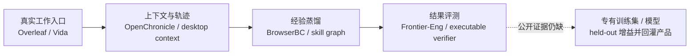

# Einsia.ai 现状、创始人社交与 AI 观

> 生成时间：2026-08-06（Asia/Shanghai）  
> 查询：Einsia.ai 目前发展到哪一步；核心创始人在公开渠道做什么、表达了怎样的 AI 观点？  
> 证据边界：使用公司官网、产品商店、公开发布清单、GitHub、arXiv、Product Hunt、创始人个人主页及公司注册记录；用户 BP 仅用于锁定待核验的人名与原始承诺。没有登录私人社交账号，也没有获得公司后台、客户合同或非公开经营数据。

## 结论

Einsia 已经从 BP 中的**专家数据飞轮假设**，推进成一家真实、高频 shipping 的早期 Agent 公司：它有嵌入 Overleaf 的科研 Agent、桌面主动式 Agent Vida、local-first memory 项目 OpenChronicle、把人类浏览器轨迹蒸馏为 skill 的 BrowserBC，以及用真实可执行 verifier 评估长程优化的 Frontier-Eng。

但公开证据只打通到“产品、轨迹基础设施、skill distillation、benchmark”这四段；尚未证明 BP 最核心的最后两段——**合法可训练的专有专家数据、由此产生的专有模型增益及产品回灌**。商业侧同样缺 MAU、留存、付费转化、ARR 和机构客户。因此最准确的阶段判断是：

> **产品与研究已从 0 到 1，shipping 和开源 traction 较强；PMF、数据权利与模型护城河仍未被证明。**

下面是对其公开体系的归纳，不是公司公布的正式系统架构：

这比把公司理解成“科研 Copilot”更准确：前台产品是工作入口，真正想积累的是可复用的专家经验、Agent harness 和评测能力。

## 现在到底发展到哪一步

### 1. 公司定位已经扩宽

[新官网](https://einsia.ai/)把目标概括为“教 AI 学会世界级专家真正如何工作”，并把业务分成 Products、Research、Open infrastructure。[About](https://einsia.ai/about)强调：模型已经能 reason、search、code，但仍欠缺专家的 judgment、taste 和长期经验；AI 最终应由可靠的真实结果，而非漂亮输出衡量。

这比 BP 中“科研工作流 → 专家数据 → vertical model”的说法更宽：Einsia 现在公开瞄准的是跨职业的 expert work，而不仅是 AI4S 或论文写作。

### 2. 两个真实产品入口

| 产品 | 真实 I/O 与状态 | 可核验信号 | 不能推出什么 |
|---|---|---|---|
| [Einsia for Overleaf](https://overleaf.einsia.ai/) | 读取 Overleaf 项目、选中文本、编译日志、数据与图片；直接编辑 `.tex`，生成图表、公式、引用并修复 LaTeX | [Chrome Web Store](https://chromewebstore.google.com/detail/einsia-ai-research-agent/innpfpppbpcjdgidokoodlgdmbbbohpa?hl=en) 显示 8,000 users、6 个评分、5.0 分、v0.1.10；[定价](https://overleaf.einsia.ai/pricing)为 Free / $20 / $60 每月 | 商店 users 不是 MAU、留存、付费用户或机构采用；官网演示论文与夸张结果是合成 demo，不能当研究成果 |
| [Vida](https://vida.app/) | macOS / Windows 桌面 proactive agent，利用授权桌面上下文、文件和工作历史来完成回复、简历、工作区整理、日结等任务 | [下载页](https://vida.app/download/)支持 macOS 13+、Windows 10/11；官方 [`versions.json`](https://download.einsia.com/vida-dmg/versions.json)有 289 条构建记录，最早可见 0.3.0 为 2026-05-24，最新 stable 0.6.3 为 2026-07-30，2026-08-05 仍有 commit build；[Product Hunt](https://www.producthunt.com/products/vida-5)为 2026-07-04 Product of the Day #1、726 followers、462 points | 289 builds 证明开发活跃，不证明稳定性或采用；[Pro 和充值](https://vida.app/pricing/)仍 unavailable，商业化很早 |

Vida 的“100 个 SOTA use cases”目前[公开 10 个](https://vida.app/sotacases/)，其中 5 个标为 achieved、5 个 under conquest。这里的 SOTA 是公司自己定义的“某个具体工作中持续优于其他 AI 的结果”，并非外部 benchmark 或独立测评。

### 3. 研究与开源比营销更有含金量

- [OpenChronicle](https://github.com/Einsia/OpenChronicle)：约 2.8k stars、219 forks，MIT，v0.1.0 early alpha、macOS only。它从 AX / 屏幕上下文构建可检查的本地 Markdown 与 SQLite 记忆，并通过 MCP 提供给任意 tool-capable Agent。外部兴趣很强，但仓库 2026-05-09 后公开更新较少，stars 不能替代持续使用。
- [BrowserBC](https://arxiv.org/abs/2606.32014) / [代码](https://github.com/Einsia/Browser-BC)：把人类浏览器轨迹抽象成可检索、复用、组合的自然语言 skills，再组织成 skill graph。作者自报 WebArena-Hard 60.5→81.4、ClawBench 32.9→68.4、平均工具调用 31.2→22.7；截至查询日约 486 stars。它是 BP 中“人类工作轨迹变成 Agent 能力”最直接的兑现，但当前更接近 skill distillation + retrieval，不等于已经训练出专有基础模型。
- [Frontier-Eng](https://lab.einsia.ai/frontier-eng/) / [论文](https://arxiv.org/abs/2604.12290) / [代码](https://github.com/EinsiaLab/Frontier-Engineering)：47 个真实工程优化任务、5 类环境，在固定预算下反复 `propose → execute → evaluate`；用冻结的可执行 verifier 返回连续反馈，评分环路不依赖 judge model。它较实质地兑现了 BP 的 benchmark 承诺。

两篇研究目前都是作者团队发布的 arXiv 预印本；未找到同行评审或外部独立复现，论文数字应标作 author-reported。

### 4. 公司组织也在快速搭建

公开记录显示北京主体“北京熠世科技有限公司”于 2026-01 成立，Chrome 商店也以该主体登记；香港公司注册处[官方周报](https://www.cr.gov.hk/docs/wrpt/RNC063_2026.03.23-2026.03.29.pdf)显示 Einsia AI Technology (HK) Limited 于 2026-03-27 注册；[Vida Terms](https://vida.app/terms/)与页面页脚使用新加坡主体 Einsia AI Technology (SG) PTE. LTD.。北京主体的第三方工商记录中可见蓝驰、华控前沿等机构股东，能支持“已有机构天使资本”，但公开渠道没有可靠确认具体融资金额或估值。

## 创始人、社交媒体与他们真正在做什么

### Hanxi Xiao / Calvin Xiao（BP：CEO、Founder）

**身份置信度：中高。** BP 使用 Hanxi Xiao，Overleaf 首页由 “Calvin X” 署名 Founder，[Product Hunt](https://www.producthunt.com/@calvin_xiao)则明确写 “Founder @Einsia; Builder of Vida”。这些信号基本可以把 Hanxi 与 Calvin 锁为同一人，但清华、字节 Seed、连续创业等履历目前主要仍是公司自述，不应当成独立背调结论。

**公开渠道：** [Product Hunt](https://www.producthunt.com/@calvin_xiao)、高概率个人 X [@Einsia_AI](https://x.com/Einsia_AI)、Overleaf 创始人署名。没有找到可可靠确认的个人 LinkedIn、Google Scholar、长篇博客或中文社交账号；公开发言非常稀疏。

**在做什么：** 产品侧主导 Einsia / Vida；同时署名 [BrowserBC](https://arxiv.org/abs/2606.32014) 与 [Frontier-Eng](https://arxiv.org/abs/2604.12290)。Frontier-Eng 的贡献信息把他放在 Team Management，而不是项目 lead，因此能证明组织和参与，不能据此说他是主要算法作者。

**可直接归于本人的 AI 观点：** Product Hunt 自我简介把 Vida 定义为理解 context、预判 intent、交付 production-grade outcomes 的 proactive agent，并公开挑战 100 个 use cases。Overleaf 创始人信强调 AI 应嵌入专家已有工作流、消除工具摩擦，让研究者保持 flow。

**较稳妥的路线归纳（中等置信，不是本人系统长文）：** Calvin 押注的不是“更好聊天”，而是 `上下文/记忆 → 主动行动 → 可依赖结果`；同时以真实人类轨迹蒸馏技能、以 executable verifier 评估 Agent。该判断来自他负责的产品与共同署名研究，不能冒充他的逐字个人哲学。

### Xinqi Cai / Eren Cai（BP：CPO、Co-Founder）

**身份置信度：中等偏高，但未闭环。** BP 使用 Xinqi Cai；[Vida makers](https://www.producthunt.com/products/vida-5/makers)列 Eren Cai 为 Co-founder，[Frontier-Eng](https://arxiv.org/abs/2604.12290)把 Eren 列入 Team Management，[BrowserBC](https://arxiv.org/abs/2606.32014)也有其署名。结合 Calvin 的英文名映射，Eren 很可能是 Xinqi 的工作名，但没有姓名并列、本人主页或邮箱做最终确认。

**公开渠道：** [Product Hunt](https://www.producthunt.com/@eren_cai)几乎为空；未找到能安全归属的个人 X、长文、采访或技术主页。早期职业证据中，[New York Festivals 官方获奖页](https://www.nyfadvertising.com/Winners/WinnerDetailsNew/2f884c52-4b4d-4c2b-91e1-a0a26a271776)把 Xinqi Cai 列为腾讯项目 `THE BLACK SPHERE` 的 Associate Producer，更能证明创意生产与项目协调能力，而非算法研究。

**在做什么：** 如果 Xinqi/Eren 映射成立，她目前更像 Vida 产品联合创始人、研究项目管理与产品/叙事负责人；两篇论文能证明参与，但不能把核心技术原创都归给她。

**AI 观点：** 没有找到可安全归于她本人的明确观点。最多只能说，她参与的团队项目共同体现两条路线：Agent 应在真实环境中持续优化，而不只是一次性答题；人类行为轨迹可以被压缩成可复用 skill。它们属于共同署名的研究立场，不是个人原话。

### Huan-ang Gao / 高焕昂（BP：CTO、Co-Founder）

**能力身份置信度：高；Einsia 职位置信度：仅公司自述。** [个人主页](https://c7w.tech/)与[GitHub](https://github.com/c7w)明确确认其为清华 CS / AIR 博士生，导师张亚勤，本科 GPA 3.98、院系 #1/204，并列出多篇 CVPR / ICLR / ECCV 工作。GitHub 公开 78 个仓库、513 followers；另有 [Google Scholar](https://scholar.google.com/citations?user=WvbKfLgAAAAJ)与 [Hugging Face](https://huggingface.co/c7w)。

**最大的身份空白：** 个人主页更新于 2026-07-16，晚于 BP，却没有出现 Einsia、CTO 或 Einsia Co-Founder，反而列出 Co-Founder @ Lumina-Embodied.AI；近期工作主要属于 Tsinghua AIR / ByteDance Seed。它不等于否认其 Einsia 角色，也可能是兼职、顾问或未公开，但当前最严谨的说法只能是：**BP 声称他是 CTO；技术能力已独立验证，本人未公开确认该职位及投入比例。**

**公开渠道：** [个人主页](https://c7w.tech/)、[GitHub](https://github.com/c7w)、[Scholar](https://scholar.google.com/citations?user=WvbKfLgAAAAJ)、[Hugging Face](https://huggingface.co/c7w)；高概率 X 为 [@c7wc7w](https://x.com/c7wc7w)，但个人主页未直接挂出，仍留一档不确定性。

**现在最有含金量的工作：** [Direct-OPD](https://bytedtsinghua-sia.github.io/Direct-OPD/)（equal contribution + project lead）研究弱模型经 RL 产生的 policy shift，如何在强模型自己的 on-policy 状态上转成 dense supervision。这项工作直接触及 weak-to-strong、RL、可验证反馈和 self-improvement，并公开了 artifact；但所属单位是清华 AIR / ByteDance Seed，不能默认 IP 属于 Einsia。

**本人的 AI 观点（一手、最清晰）：** [个人主页](https://c7w.tech/)明确写出：

- 相信 Bitter Lesson：能随计算扩展的通用学习方法，长期会胜过依赖手工知识的路线。
- reasoning 与 agentic coding 应继续通过 exploration、interaction、verifiable feedback 扩展学习。
- Autonomous research 会沿两维前进：`depth` 是在开放问题上做更长、更深的探索；`breadth` 是进入真实 R&D workflow。
- 理想 AI researcher 接到 objective、KR、baseline 后，应持续试验并改善目标，同时避免 reward hacking。
- 两个核心难题是长程 sparse feedback / credit assignment，以及把人的 judgment 与 taste 编码进训练信号，让系统不仅会优化可测目标，还知道哪些想法“有前景、重要、值得做”。

三人之中，高焕昂是唯一公开给出完整个人 AI 研究议程的人；他的观点也与 Einsia 官网“专家 judgment / taste + 长程真实工作”的叙事最一致。

## 哪些公开内容最有含金量

按“能否证明能力与机制”而非传播热度排序：

1. **高焕昂的个人研究议程与 Direct-OPD**：一手表达明确，并有方法、论文、模型/代码 artifact；同时要保留“非 Einsia 归属”的边界。
2. **BrowserBC**：真正展示了 `human trace → evidence abstraction → natural-language skill → skill graph → retrieval/execution` 的技术链，最接近 BP 的数据飞轮核心。
3. **Frontier-Eng**：给出可执行、可重复的真实工程评测环境，避免只用 LLM judge 或二元 pass/fail；这是团队目前最像“基础设施”的成果。
4. **OpenChronicle**：把 local-first、inspectable memory 做成开源 artifact，并取得团队最强的开发者关注。
5. **Vida 的 Product Hunt Q&A**：公司 partner Giddens 对 outcome、trust curve、local-first memory 和 autonomy 的回答信息密度高；但他不是 BP 中的三位创始人，因此只能作为公司产品立场，不能署名给 Calvin、Eren 或 Huan。

Calvin / Eren 的个人社交账号本身反而信息量很低；真正值得读的是他们参与或管理的研究、产品和开源项目，而不是 follower 数或发布口号。

## 团队整体对 AI 的观点与愿景

把官网、产品和研究放在一起，Einsia 的共同路线可以归纳为五条：

1. **从 output 转向 outcome**：AI 的价值不是偶尔生成惊艳答案，而是持续完成可依赖的现实结果。
2. **从被动 prompt 转向 context-aware proactivity**：Agent 需要理解工作历史、项目和偏好，在低风险场景中提前推进，但更高自治应建立在可检查、可确认的信任曲线上。
3. **Memory 是 Agent 基础设施**：记忆应 local-first、model-agnostic、可检查、可暂停和可编辑，而不是不透明的云端画像。
4. **人类轨迹是可扩展的技能来源**：浏览器中已经存在大量专家决策先验；关键不是模仿每次点击，而是蒸馏成可检索、可组合的 skill。
5. **真实 verifier 比漂亮 demo 更重要**：开放式工程任务应在固定预算下通过可执行反馈反复优化，而不是只看一次 pass/fail 或让另一个 LLM 主观评分。

愿景的最终形态是：真实产品持续接触专家工作，提炼判断与技能，再用更好的 eval / learning 改善 Agent。但最后这个闭环目前仍是目标，不是已公开证明的事实。

## 最关键的风险与反证

### 隐私口径与数据飞轮之间存在硬张力

Vida 的 Product Hunt maker 回复称 interaction history 在本地、原始语音/屏幕“zero cloud retention”、数据不用于训练；但 [Vida Privacy Policy](https://vida.app/privacy/)允许把必要信息发送给第三方大模型，错误日志可含当时命令、任务上下文与历史数据，command / interaction data 可为历史、任务连续性、支持、安全和产品改进保留“合理期间”。政策还允许在用户明确同意，或依法匿名/去标识后用于相关改进。

两者未必必然冲突——“原始屏幕不留存”与“衍生 command / task record 留存”可以同时成立——但营销口径明显比法律政策窄。公司需要给出 device → Einsia server → third-party model provider 的字段级数据流、保留期、删除机制与 opt-in 训练边界。

这还会反向约束 BP：如果生产数据默认 local-first、never used for training，那么它不会自动成为专有训练 moat。公司必须证明另有明确授权的专家 cohort、研究数据计划或隐私保护学习路径。

### 仍缺四类决定性证据

- 商业：MAU / WAU、4/8 周留存、付费转化、ARR、机构合同与真实客户案例。
- 数据：专家 cohort 数、trajectory 数、opt-in 与机构授权率、过滤后真正可训练/可许可的比例。
- 模型：专有 model / model card，以及生产轨迹相对公开数据、合成数据和通用日志的 held-out uplift。
- 独立性：BrowserBC / Frontier-Eng 的第三方复现，以及 Vida “SOTA cases”的外部对照。

## 对 BP 的更新判断

| BP 承诺 | 2026-08-06 状态 |
|---|---|
| 以 Overleaf / Vida 进入真实工作流 | **部分兑现**：两款产品可用，Overleaf 有 8k 商店 users，Vida 高频发布 |
| 获取长程工作 context / trace | **基础设施已出现**：Vida desktop context、OpenChronicle、BrowserBC；规模与授权未知 |
| 建立 benchmark | **实质兑现**：Frontier-Eng 与 BrowserBC eval 已公开；仍是团队自报、缺独立复现 |
| 形成专有训练数据 | **未证明** |
| 训练 vertical SOTA model / World Model | **未证明** |
| 数据 / 模型回灌并提升产品 | **未证明** |
| 建立商业闭环 | **未证明**：Overleaf 有价格，Vida 仍早期，收入与留存未公开 |

因此，相比 [BP 初读](/output/reports/einsia-ai-bp-product-mechanism-analysis-2026-08-06/)，结论应从“只有 thesis”上调为：**方向已经被一组互相咬合的产品、研究与开源 artifact 部分验证；但最值钱的 data/model flywheel 和 PMF 仍接近待证。**

## 建议下一轮直接向团队索取

1. Overleaf 与 Vida 的周活、4/8 周 cohort 留存、付费转化和重复高价值任务占比。
2. 一张字段级数据流图：本地、Einsia server、第三方模型分别看到什么、保留多久、谁能删除。
3. 可用于训练的专家 trajectories 数量、来源、授权方式和结果标签覆盖率。
4. 同一基础模型下，加入 Einsia trajectory / skill 前后的 held-out 用户任务盲测；同时与公开 trace、合成数据做对照。
5. Huan-ang Gao 的正式职位、全职比例、IP assignment；Xinqi Cai 与 Eren Cai 的姓名/履历闭环。
6. Frontier-Eng / BrowserBC 的外部提交、独立复现和 production transfer，而不只是论文自报分数。

---
*由 LLM 基于用户提供的 BP 与 2026-08-06 live public evidence 查询生成；未把网页或 PDF 复制进 raw/*
