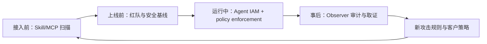

# 方寸跃迁：VC 被 Pitch 框架与尽调问题

> 生成时间：2026-07-21
> 查询：从 VC 视角，如何看方寸跃迁，pitch meeting 可以聊哪些问题？

## 摘要

**这是一个“问题真实、团队稀缺、方向顺风，但商业证明远落后于技术叙事”的项目。** 最值得投资的版本，不是“清华 AI Safety 专家提供红队评测”，而是成为中国企业 Agent 的独立 control plane：上线前做供应链扫描和安全验证，运行中做身份、权限、行为观测与确定性拦截，事后形成可审计证据。这个版本有机会获得高粘性、跨模型、跨 Agent 平台的基础设施位置。

但 pitch 目前最大的跃迁也恰恰发生在这里：从“政策参与 + 学术成果 + 完整产品矩阵”直接跳到了“企业智能体上线前必经环节”。VC 应重点验证客户是否真的为持续运行时安全付费，而非只为一次性评测、备案辅助或科研合作付费；产品是否能进入生产数据面并保持独立性；以及公司能否把研究优势沉淀为可复制的软件、数据飞轮和标准，而不是创始团队的人力服务。

## 一句话投资命题

> 如果 Agent 从“生成内容”走向“操作资金、数据和生产系统”，企业需要一个独立于模型厂商和 Agent 平台的安全控制层；方寸跃迁试图成为中国市场的 Agent Security control plane。

这句话包含四个需要分别证明的命题：

1. **风险预算形成**：Agent 安全会从模型团队的研发预算，升级成企业 CISO / CIO 的持续采购预算。
2. **第三方位置成立**：客户愿意让独立厂商接触最敏感的 prompt、tool call、权限和运行轨迹。
3. **软件产品成立**：收入由重复使用的产品带来，而非专家评测、合规报告和定制项目。
4. **平台边界成立**：模型厂商、云厂商、传统安全厂商或 Agent 平台不会轻易把这一层内建并挤压掉。

## 应该怎样听这场 Pitch

### 第一层：先承认确定的优势

- **团队稀缺**：徐崴的研究方向覆盖 AI Security、隐私计算与高性能系统；董胤蓬公开履历显示其长期研究对抗攻击、鲁棒防御和模型安全评测，相关方法被 Google、OpenAI 等平台采用。团队具备把攻防研究转为产品的技术可信度。
- **时点正确**：风险对象正在从“模型输出一句坏话”转向 Agent 越权调用工具、泄露数据、执行错误交易、引入恶意 Skill/MCP，以及 Physical AI 造成现实副作用。
- **独立第三方有理论价值**：模型厂商既是被评估者又是安全结论提供者，存在利益冲突；跨模型、跨云、跨 Agent 框架的客户也需要统一审计口径。
- **产品拼图方向合理**：官网展示的 Guard、Observer、Agent IAM、Skill/MCP Scanner、Steward Agent 与 RedTeam，覆盖上线前、运行中和事后审计，至少在架构上比单一内容审核或一次性红队更接近完整控制面。

### 第二层：不要被三类“正确但不等于公司”的证据带走

| Pitch 证据 | 能证明什么 | 不能证明什么 |
|---|---|---|
| 顶尖教授、论文、引用数 | 研究能力、人才吸引力、品牌信用 | CEO 销售能力、产品交付、组织全职投入 |
| 参与治理共识和规则建设 | 政策敏感度、标准入口、政府关系 | 商业标准必然由公司主导、客户一定付费 |
| 产品矩阵与 benchmark | 技术覆盖、原型成熟度、单点性能 | 生产部署、误报漏报、客户 ROI、续费和扩张 |

真正的分水岭不是“能不能做出检测器”，而是：**能否成为生产动作执行链上的稳定控制点，并用事故减少、上线提速或审计成本下降证明价值。**

## 六个核心投资角度

### 1. 市场：这是不是独立的大预算品类？

先按采购场景拆市场，而不是接受笼统的“AI Safety 万亿市场”：

| 场景 | 付费人 | 预算来源 | 采购频率 | 商业质量 |
|---|---|---|---|---|
| 模型安全评测 / 红队 | 模型厂、监管相关部门 | 研发、合规、项目预算 | 上线/版本节点 | 需求真，但易项目制 |
| 内容 Guardrails | AI 应用、内容平台 | 内容安全、模型调用预算 | 持续调用 | SaaS/API 化强，但竞争激烈、易被云厂商捆绑 |
| Agent Runtime Security | CISO、CIO、Agent 平台负责人 | 网络安全、身份权限、生产运维 | 持续 | 最有基础设施价值，但集成和信任门槛最高 |
| Skill/MCP 供应链安全 | 开发平台、企业 Agent 团队 | AppSec、供应链安全 | 每次接入/更新 | 新增量明确，标准和分发入口决定赢家 |
| Physical AI 安全 | 机器人、汽车、工业企业 | 功能安全、产品安全 | 长验证周期 | 天花板高，但认证、责任和销售周期完全不同 |

VC 要问：未来 24 个月真正贡献收入的是哪一格？如果公司同时讲五格，资源是否被摊薄？

### 2. 产品：是控制点，还是检测工具集合？

最有价值的产品形态是形成闭环：



需要判断各模块是共享一个身份、策略、事件和证据模型，还是把多个 demo 放在同一张产品图上。真正的平台应当让一个模块产生的数据提升其他模块，并让客户越用越难替换。

同时要区分概率检测与确定性控制。低延迟 prompt-injection classifier 可以提供风险信号，但资金转账、数据外发、删除、权限提升不能只交给另一个模型判断；真正的授权层需要 tenant、identity、resource、scope、金额、频率与审批规则等确定性约束。这与知识库中的 [safe-autonomy](/wiki/concepts/safe-autonomy/)、[agent-runtime](/wiki/concepts/agent-runtime/) 判断一致。

### 3. 商业：收入是软件，还是“披着产品外衣的专家服务”？

要求公司按收入逐笔拆分：

- License / API usage / endpoint 或 Agent 数量收费占比；
- 一次性红队、合规评估、课题、咨询和定制开发占比；
- PoC 到付费生产的转化率与中位周期；
- ARR、ACV、gross margin、NRR、续费与模块扩张；
- 前五大客户集中度，以及来自股东、清华、政府/国企关系的收入占比。

健康信号是：客户先用评测进入，再因运行时拦截与审计形成持续 ARR，随后扩展到更多 Agent、工具和业务单元。危险信号是：每个客户都要教授或核心研究员深度参与，交付结束即收入结束。

### 4. 护城河：清华品牌之外，什么会随部署增长？

可能成立的护城河有四类：

1. **攻击与行为数据**：真实 Agent、行业流程、工具链的失败轨迹是否形成难复制的数据资产；数据能否合法留存和跨客户学习。
2. **生产集成**：SDK、gateway、sidecar、IAM、SIEM/SOC、Agent framework、云和终端的深度集成是否形成迁移成本。
3. **策略与证据标准**：能否定义 Agent identity、permission manifest、event schema、finding taxonomy 和审计证据格式，并被行业采用。
4. **可信中立网络**：能否同时被模型厂、Agent 平台、监管者和企业接受，而不因服务某一方失去其他方信任。

论文和 benchmark 会扩散，单个检测模型会被复现。长期价值更可能来自数据、工作流嵌入、标准和信任网络。

### 5. 竞争：谁会把它做成免费功能？

竞争不能只列中国 AI Safety 创业公司，还要按替代者看：

- 模型厂商自带 safety API、moderation、eval 与 policy；
- 云厂商把 Guardrails、IAM、observability 和合规打包进云合同；
- 传统安全厂商把 Agent 风险纳入 SAST/DAST、IAM/PAM、DLP、SIEM、EDR 和供应链产品；
- Agent 平台在 runtime 内原生实现 tracing、approval、sandbox 和 tool permission；
- 企业内部安全团队用开源模型、规则引擎和现有安全栈自建。

方寸跃迁必须回答：为什么“独立 + 跨栈 + AI-native”的收益，大于客户多引入一家位于数据面上的安全供应商所增加的成本和风险？

### 6. 组织与战略：是学术产业化团队，还是能打企业市场的公司？

重点看 CEO 是否有清晰的 wedge、销售节奏和取舍能力，而不只是能够讲完整愿景。还需要核实：教授与公司之间的时间投入、IP 归属、学生参与边界、关联实验室交易、人才竞业，以及安全事件发生后的责任主体。

“Physical AI”应该被当作远期 option，而不是当前估值的主要依据。机器人/汽车/工业安全需要实时性、功能安全认证、硬件在环验证、责任分配与长期行业销售，不能自然由 LLM Guardrails 外推得到。

## 这次碰面的真正任务：关闭七个关键不确定性

这次会议的目标不是把所有问题问完，也不是听懂所有技术。目标是让七个投资判断从“故事”变成“有证据的初步结论”。会后至少应该能够填写下面这张表；任何一栏仍只能复述创始人的形容词，都说明信息没有拿到。

| 关键判断 | 会后必须能回答 | 最关键证据 | 本次优先级 |
|---|---|---|---|
| 1. 客户为什么现在买 | 是事故、上线卡点、监管、审计还是品牌需求？ | 一个生产客户的购买触发与预算来源 | P0 |
| 2. 公司到底卖什么 | 真正成交的是哪一个产品，不是官网有哪些产品 | 产品级收入、客户数、生产部署数 | P0 |
| 3. 产品有没有进入关键路径 | 是出报告，还是每次 Agent 动作都经过它 | 生产架构图、调用量、阻断与故障机制 | P0 |
| 4. 收入是否可复制 | 增长是否依赖教授、定制交付和政府项目 | 收入结构、部署人天、毛利、续费扩张 | P0 |
| 5. 为什么它能赢 | 相对云厂商、模型厂、传统安全厂商有什么结构优势 | win/loss、替换对象、客户选择理由 | P1 |
| 6. 团队能否公司化 | 谁全职经营，IP 和责任是否清晰 | 时间投入、劳动关系、IP 协议、组织分工 | P0 |
| 7. 这一轮融资买来什么 | 下一轮前要把哪个核心假设证明到什么程度 | 资金用途、18 个月里程碑、runway | P1 |

### 信息优先级：什么必须现场拿到，什么不要浪费首次会面

**P0：没有这些信息，不能形成下一步判断。**

- 一个可复述的生产客户完整案例；
- 当前唯一主 wedge，以及各产品的真实成熟度；
- 收入、客户、PoC、生产、续费的数量级；
- 标准产品和项目制收入的拆分；
- 核心成员的全职投入和公司/清华 IP 边界；
- 当前融资额、估值预期、runway 和本轮里程碑。

**P1：现场形成方向，随后用材料验证。**

- benchmark protocol、误报漏报、延迟和失效行为；
- 客户 win/loss、竞品替换和定价；
- 部署方式、数据驻留、权限范围和自身安全；
- cohort、毛利、销售漏斗和 land-and-expand；
- cap table、股东权利、技术转让和关联交易。

**P2：初次碰面不必陷入细节。**

- 每篇论文的算法细节；
- 所有监管条款的逐条解释；
- Physical AI 的宏大 TAM；
- 尚未产品化的远期模块；
- 不能与商业结果连接的奖项、会议和引用数。

## 信息获取主线一：用一个客户案例穿透全部叙事

最有效的方法不是先问 30 个散点问题，而是要求创始人选择一个最成熟客户，沿同一案例一直追到底。建议直接这样开口：

> “先不展开全产品矩阵。请选一个目前最能代表公司未来形态、已经进入生产并产生回款的客户，从它为什么找你们开始，一直讲到部署、效果、续费。涉及保密可以隐去名称，但行业、规模、时间、金额区间和关键指标希望尽量具体。”

然后沿九个节点追问：

| 节点 | 要获取的信息 | 追问方式 | 有效答案长什么样 |
|---|---|---|---|
| 触发 | 客户为什么必须解决 | “发生了什么，导致预算在那个季度被批准？” | 具体事故、上线 gate、审计要求或人力成本 |
| 买家 | 谁拥有预算和责任 | “谁第一次找你们、谁签字、谁每天使用？” | CISO/CIO/模型平台负责人角色清楚 |
| 原方案 | 替代了什么 | “在你们之前靠什么解决？为什么不够？” | 人工红队、自研规则、云产品或传统安全产品 |
| 选择 | 为什么赢 | “客户还看了谁？最终哪三个因素让你们赢？” | 可核验竞品、评分标准和差异，而非只说团队强 |
| 接入 | 产品进入哪里 | “画一下数据和控制流。哪个动作必须经过你们？” | SDK/gateway/sidecar/IAM/SIEM 的具体位置 |
| 交付 | 需要多少人天 | “从签约到生产花了多久？双方各投入多少人？” | 时间、人力、定制比例、上线阻力清楚 |
| 效果 | 带来什么经济价值 | “上线前后哪个数字改变了？” | 上线时间、人工成本、风险事件、修复率等 |
| 付费 | 如何计价与回款 | “首单和续费分别买了什么，金额区间是多少？” | 明确产品、期限、计量方式与回款 |
| 扩张 | 是否形成粘性 | “第二次为什么多买？如果拆掉会发生什么？” | 新 Agent/模块/业务线扩展，有切换成本 |

一个强案例应该让你看到：**明确风险触发 → 明确预算 owner → 标准化接入 → 可量化效果 → 持续付费 → 扩模块/扩 Agent。**

如果回答不断退回“联合研究”“共建实验室”“头部客户认可”“暂时保密”，就追问数量级和过程。保密可以隐藏客户名，但不能同时隐藏行业、时间、合同形态、金额区间、部署状态和验收指标。

## 信息获取主线二：识别真正的 Beachhead，而不是接受全栈故事

方寸跃迁目前同时讲模型评测、内容 Guard、Agent Runtime、IAM、Skill/MCP、Multi-Agent 和 Physical AI。它们共用“AI Safety”标签，但买家、产品、交付和竞争完全不同。需要现场强制团队做选择。

请让创始人现场填一张产品经营表：

| 产品 | 当前状态 | 付费客户 | 生产客户 | 过去 12 月收入占比 | 毛利 | 核心买家 | 未来 18 月优先级 |
|---|---|---:|---:|---:|---:|---|---|
| RedTeam / 模型评测 |  |  |  |  |  |  |  |
| Fangcun Guard |  |  |  |  |  |  |  |
| Observer / Runtime |  |  |  |  |  |  |  |
| Agent IAM |  |  |  |  |  |  |  |
| SkillWard |  |  |  |  |  |  |  |
| Steward / Multi-Agent |  |  |  |  |  |  |  |
| Physical AI |  |  |  |  |  |  |  |

必须追问的不是“这些产品是否都有价值”，而是：

1. **哪一个产品是获取客户的 wedge？**
2. **哪一个产品贡献最大当期收入？**
3. **哪一个产品贡献未来最大 ARR？**
4. **哪一个产品最难被云厂商免费替代？**
5. **哪一个产品即使团队资源减半也不会放弃？**

如果五个答案不是同一个产品，要理解产品迁移路径。例如：“用红队评测低摩擦进入客户，但 Observer/Agent IAM 才是持续收入和控制点。”这是可以成立的；但必须有 cohort 证明客户确实从前者迁移到了后者。

## 信息获取主线三：判断它是安全软件，还是高端评测服务

用下面的收入瀑布要求对方拆分，而不是只听一个总收入或签约额：

```text
总签约额
├── 已回款
│   ├── 经常性软件收入：License / API / subscription
│   ├── 一次性产品收入：扫描 / 评测包
│   ├── 专家服务：红队、咨询、认证辅助
│   ├── 定制开发与私有化适配
│   └── 政府课题、补贴、联合实验室
└── 未回款 / 框架协议 / 意向订单
```

必须拿到的数，不必精确到元，但至少要有可信区间：

- 过去 12 个月确认收入、签约额、回款额；
- 软件经常性收入占比；
- 付费客户数、生产客户数、PoC 数；
- PoC → 付费、付费 → 生产、生产 → 续费的转化率；
- ACV 中位数与范围，销售周期中位数；
- 部署周期、每客户交付人天、标准代码与定制代码比例；
- 毛利率，以及扣除研究员/交付人员真实成本后的贡献毛利；
- 前五大客户收入占比、关联方客户占比、国企/政府客户占比；
- 到期客户数、续费数、扩张数；若成立不足一年，就看使用量和合同扩容。

三个容易产生误判的口径要当场校正：

- **“服务客户”不等于付费客户**：联合研究、免费 PoC、竞赛合作要剔除。
- **“签约”不等于收入或回款**：框架合同和意向金额要单列。
- **“部署”不等于生产关键路径**：测试环境、旁路观察、低流量灰度要区分。

## 信息获取主线四：验证产品是否真的承担生产安全责任

让团队现场画一张客户架构图，至少标出：

- user、Agent、model、memory/RAG、tool/MCP、data、external API；
- 方寸组件部署位置；
- 哪些数据会经过方寸；
- 哪些动作方寸可以 block；
- policy 在哪里定义、谁批准、如何版本化；
- 日志在哪里存、谁能访问、如何审计；
- 方寸不可用时系统如何处理。

然后只围绕一个高风险动作，例如“Agent 向外部账户转账”或“读取并外发客户数据”，做 failure walkthrough：

1. 用户身份如何绑定到 Agent task？
2. Agent 得到什么 credential，scope 和有效期是什么？
3. prompt injection 如何被发现？
4. 即使没有发现 injection，权限和额度如何确定性阻断？
5. 检测器误报时如何恢复业务？
6. 方寸服务超时或断网时 fail-open 还是 fail-closed？
7. 攻击者篡改、跳过或截断事件时如何发现？
8. 最后能向审计员提供什么证据？

需要拿到四类指标：

| 指标 | 关键问题 | 不能接受的替代口径 |
|---|---|---|
| 安全有效性 | 未见攻击上的 precision、recall、attack success reduction | 只讲自建 benchmark 总 F1 |
| 业务影响 | benign traffic 误拦率、人工复核率、申诉恢复时间 | 只讲检测准确率 |
| 系统性能 | p50/p95/p99 latency、throughput、availability | 只给实验室最好延迟 |
| 失效安全 | 超时、断网、模型漂移、event omission、绕过后的行为 | 只说“高可用”或“多层防护” |

核心判断是：它有没有把安全从“模型认为危险”变成**身份、权限、策略、执行与证据**的工程闭环。

## 信息获取主线五：区分监管红利与真实商业拉力

监管可以创造最低采购线，但不自动创造高毛利平台。需要把客户付费原因拆成三层：

1. **Must-have compliance**：没有报告、备案、安全评估就不能上线。
2. **Must-have risk control**：即使没有新规，客户也担心资金、数据、生产事故。
3. **Nice-to-have trust signal**：为了品牌、展示或内部创新项目购买。

建议问两个反事实：

> “如果监管不再增加任何新要求，现有客户中有多少仍会续费？他们续费的是哪个产品？”

> “如果监管提供免费的统一评测工具，你们哪部分收入不受影响？”

健康答案应当同时存在合规入口和运营价值：监管帮助打开门，但持续收入来自运行时保护、上线提速、人工成本降低和可审计性。若价值完全依赖某个评测资质或政策窗口，需要进一步判断资质壁垒、招投标周期、地方关系和价格上限。

## 信息获取主线六：验证护城河是否在公司，而不是在教授履历里

要求团队说明过去一年究竟积累了哪些不可公开复制的资产：

| 资产 | 应获取的信息 | 判断标准 |
|---|---|---|
| 攻击数据 | 独有 attack traces 数量、来源、新颖性、更新速度 | 不是公开 jailbreak 的简单改写 |
| 客户行为数据 | 是否可留存、脱敏、跨客户训练 | 合同和数据权利允许形成飞轮 |
| 集成 | 已支持的 Agent runtime、IAM、SIEM、云和终端 | 真实生产集成，不只是接口列表 |
| Policy / taxonomy | 客户策略模板、风险分类和证据 schema | 能缩短新客户部署并形成标准 |
| 分发 | 与云、模型、Agent 平台、监管或安全渠道的入口 | 有重复获客机制，不靠创始人逐单销售 |
| 品牌信任 | 漏洞披露、独立评测、责任与利益冲突制度 | 独立性有制度保障，而非口号 |

现场最好问一个动态问题：

> “假设明天一个同等优秀的清华团队拿到你们全部论文和开源信息，它需要多久才能复制产品？最难复制的三样东西是什么？请分别给出数字或客户证据。”

## 信息获取主线七：确认团队是否能从科研组织变成商业组织

这类项目最常见的风险不是技术不强，而是组织中没有人真正承担“缩窄产品、卖进企业、稳定交付、处理事故”的责任。

现场要画组织图并获取：

- 三位核心成员的正式身份、每周投入、股权、vesting 和决策权；
- CEO 过去一年亲自完成的客户发现、销售、招聘和产品取舍；
- CTO/首席科学家与工程负责人的边界；
- 全职人数，按 research、engineering、product、sales、delivery 分布；
- 过去 12 个月新增和流失的关键人员；
- 谁负责 on-call、客户事故、漏洞披露和赔偿谈判；
- 清华/T-Star Lab 的代码、专利、数据、设备、学生和品牌如何授权给公司；
- 是否存在同业课题组、关联公司、未完成技术转让或兼职审批问题。

强信号不是教授站台更豪华，而是 CEO 能明确说出：哪些研究不做、哪些客户不接、哪些定制拒绝，以及如何把学术优势转换为版本节奏、销售材料和可维护产品。

## 信息获取主线八：理解融资轮本身，而不只理解公司

最后必须问清楚本轮交易：

- 计划融资金额、pre-money/post-money 预期；
- 已承诺金额、lead 情况、close 时间；
- 当前现金、月度 burn、实际 runway；
- 历史各轮金额、估值、股份和特殊权利；
- ESOP 规模、核心成员持股、未来稀释；
- 本轮资金在研发、销售、交付、合规和算力上的分配；
- 18 个月后的三个可验证里程碑；
- 下一轮融资需要达到的 ARR、客户、产品或认证条件。

一个合格的融资计划应该是“用本轮资金关闭某个核心商业风险”，而不是简单扩大产品矩阵。理想表述类似：在 18 个月内，把 Runtime Security 从 3 个设计伙伴推进到 20 个生产客户，证明标准部署周期、某个毛利水平和跨 Agent 扩张；而不是“继续投入全栈 AI Safety 和 Physical AI”。

## 建议的一小时会谈脚本

### 0–5 分钟：让对方定义公司

只问两句：

1. “如果不用 AI Safety、基础设施、全链路这几个词，你们具体替谁解决什么问题？”
2. “今天收入和未来最大价值分别来自哪个产品？”

目的是观察创始人能否缩窄，而不是马上纠正他。

### 5–20 分钟：单一客户穿透

用前述九节点，把购买触发、买家、竞争、部署、效果、付费和扩张完整走一遍。这里不要被产品介绍打断。

### 20–32 分钟：产品架构与 Failure Walkthrough

要求画生产架构，只选一个高风险动作，追踪身份、权限、检测、阻断、故障和审计证据。最好现场看真实 console、trace 和 policy，而不是录制 demo。

### 32–42 分钟：经营数据

拿产品经营表和收入瀑布。至少拿到数量级；如果因融资保密无法给精确数，可以给区间，但不能只给同比增速。

### 42–50 分钟：竞争与护城河

重点问最近三次赢单、三次输单，以及云厂商免费提供 70% 功能时为什么仍会存在。

### 50–56 分钟：团队与 IP

确认全职投入、组织分工、清华/T-Star Lab 的权利边界，以及谁承担安全事故责任。

### 56–60 分钟：融资与下一步

问清 round、runway、18 个月里程碑；当场约定 follow-up materials 和客户 reference，而不是泛泛说保持联系。

## 现场追问方法：从形容词走向证据

创始人回答以下词语时，应立刻进入第二层追问：

| 听到的词 | 立即追问 |
|---|---|
| “头部客户” | 哪个行业、多少员工/Agent、合同金额区间、是否生产、是否回款？ |
| “深度合作” | 免费还是付费？谁投入多少人？交付物是什么？是否续签？ |
| “行业领先” | 对哪个 baseline、什么测试集、谁独立验证、输在哪里？ |
| “全链路” | 哪些环节已有生产客户？共享什么数据和 policy？ |
| “独立第三方” | 谁付费、谁能挑战结论、利益冲突如何治理？ |
| “参与标准” | 是牵头、起草、参会还是提供意见？标准如何带来收入？ |
| “几十家客户” | 付费几家、生产几家、续费几家、关联方几家？ |
| “高毛利” | 是否扣除研究、现场交付、私有化维护和售前 PoC？ |
| “数据飞轮” | 哪类数据、多少条、是否有权跨客户使用、带来什么提升？ |
| “Physical AI 布局” | 已有客户、产品、认证和收入，还是研究 roadmap？ |

## 会后立即填写的投资 Memo

### 事实记录

- 当前主产品：
- 最成熟生产客户：
- 购买触发 / budget owner：
- 过去 12 月签约 / 收入 / 回款：
- 付费 / 生产 / 续费客户数：
- 软件收入占比：
- ACV / 销售周期 / 部署周期：
- 毛利 / 每客户交付人天：
- 核心成员全职情况：
- 本轮金额 / 估值 / runway：

### 七项判断，每项只允许选一档

| 维度 | 3 分 | 2 分 | 1 分 | 0 分 |
|---|---|---|---|---|
| 客户痛点 | 发生预算迁移的刚需 | 强需求但预算未稳定 | 创新项目 | 主要靠叙事 |
| 产品控制点 | 位于生产执行关键路径 | 旁路持续观测 | 上线前工具 | 一次性报告 |
| 商业复制 | 标准软件、续费扩张 | 产品+有限服务 | 重交付 | 课题/咨询为主 |
| 技术效果 | 客户 holdout + 业务指标 | 完整内部评测 | 只有自建 benchmark | 只有论文/演示 |
| 护城河 | 数据+集成+标准飞轮 | 有一项强资产 | 主要靠人才品牌 | 易被捆绑替代 |
| 团队公司化 | 全职互补、IP 清晰 | 有少量缺口 | 教授/CEO 依赖明显 | 责任和权属不清 |
| 融资效率 | 资金对应可证伪里程碑 | 计划基本清楚 | 泛化扩张 | 主要支撑宏大叙事 |

总分只是强迫统一口径，不应机械决定投资：

- **17–21**：值得快速进入客户 reference、技术和财务尽调；
- **11–16**：项目有亮点，但要先关闭 1–2 个核心不确定性；
- **6–10**：更像主题机会，暂不支持当前公司赔率；
- **0–5**：核心商业命题尚未成立。

### 会后只能形成四种结论之一

1. **进入正式 DD**：关键事实足够强，马上索取材料和客户访谈。
2. **带里程碑跟踪**：明确告诉团队缺哪两个证据、何时再看。
3. **战略关系维护**：团队重要但当前公司/轮次不匹配。
4. **Pass**：说明是市场、产品、商业、团队还是价格问题，避免用“还早”模糊处理。

## 本次会面最关键的十项信息

如果会议时间被压缩，只拿这十项：

1. **一个已回款、已生产客户的完整案例。**
2. **各产品的付费客户数、生产客户数和收入占比。**
3. **过去 12 个月签约额、确认收入、回款额的区别。**
4. **经常性软件收入与评测/咨询/课题/定制收入的拆分。**
5. **PoC → 付费 → 生产 → 续费/扩张漏斗。**
6. **产品位于生产链路的哪里，什么动作它能真正阻断。**
7. **误报、漏报、延迟、不可用和绕过时如何处理。**
8. **为什么客户不选云厂商、模型厂或传统安全厂商。**
9. **核心成员是否全职，以及清华/T-Star Lab 与公司的 IP 边界。**
10. **本轮融资条款、runway，以及 18 个月后要证明的三个指标。**

## 补充问题库

### A. 从客户事实开场

1. 请选一个已经进入生产的客户，从 Agent 的业务、权限、风险、接入方式、拦截动作讲到续费，不要匿名到无法验证。
2. 最近 12 个月有多少 PoC、多少转生产、多少续费？失败的 PoC 为什么失败？
3. 客户为什么现在买？是监管要求、发生过事故、上线被 CISO 卡住，还是为了品牌背书？
4. 谁签合同、谁使用、谁因误报承担业务损失？销售周期和部署周期分别多久？
5. 客户使用后，Agent 上线更快了多少、人工审核减少多少、真实高危动作拦截多少？

### B. 追问产品的真实成熟度

6. 官网六类能力中，哪些已 GA、哪些 beta、哪些仍是 roadmap？各自有多少生产客户？
7. Guard 的 F1 91.1、p99 8ms：测试集、类别分布、语言、攻击新鲜度、baseline、硬件和误报率是什么？是否有客户 holdout 与独立复现？
8. Observer 看到完整行为轨迹需要什么权限？能覆盖 browser、shell、API、MCP、multi-agent 和自定义工具中的哪些事件？缺失事件如何发现？
9. Agent IAM 的身份主体是什么——用户、Agent、任务、session 还是 tool call？如何与企业现有 IAM/PAM、OAuth、KMS 和审批系统对接？
10. 哪些阻断由确定性 policy 执行，哪些由模型分类器执行？超时、服务不可用和冲突时 fail-open 还是 fail-closed？
11. SkillWard 能否发现恶意代码、依赖投毒、隐藏 prompt、权限过宽和运行时下载？动态分析与静态分析的覆盖分别是什么？
12. 各模块是否共享统一 policy/event/evidence schema？关掉其中一个模块后，其余模块的价值损失多少？

### C. 验证商业模型与单位经济

13. 当前收入按产品订阅、API、红队项目、咨询、政府课题拆分是多少？下一轮融资前目标结构是什么？
14. 报价按什么计量：Agent、seat、tool call、token、endpoint、扫描次数还是风险资产？价格是否随客户价值扩张？
15. 毛利里是否完整计入红队专家、现场部署、私有化适配和客户成功人力？
16. 私有化占比多少？离线/国产化环境会不会让每次升级都变成版本碎片和项目交付？
17. 从第一个模块进入后，第二模块的 attach rate 是多少？有没有 land-and-expand 的真实 cohort？

### D. 判断护城河与独立性

18. 每服务一个客户，哪一项能力会变得更强？哪些数据能跨客户学习，授权和脱敏机制是什么？
19. 如果阿里云、华为云、火山引擎或奇安信免费提供 70% 功能，客户为什么仍选择你们？
20. 是否有模型厂商因为你们披露漏洞而限制接口或合作？如何保持“被评估者付费”下的结论独立？
21. 公司希望主导或参与哪三个标准？标准成为公共品后，公司如何仍然捕获商业价值？
22. 客户是否允许方寸产品本身成为最高权限控制点？方寸若被攻破，blast radius 多大？

### E. 核实团队、融资与治理

23. 三位核心成员分别每周投入多少时间？谁对产品、销售、交付和安全事故负最终责任？
24. T-Star Lab、清华与公司的专利、代码、数据、品牌授权边界是什么？是否存在未完成的技术转让或利益冲突？
25. 历史融资金额、每轮估值、当前 cap table、股东特殊权利、下一轮用途和 runway 是什么？
26. 下一阶段最缺的是研究员、平台工程、企业销售还是行业交付？为什么现有团队没有解决？

### F. 最后用反事实逼出战略选择

27. 如果未来两年没有新的强制监管，公司仍能靠什么获得 10 倍收入增长？
28. 如果内容 Guardrails 被 commoditize，公司的唯一核心产品是什么？
29. 如果只能保留 RedTeam、Runtime Security、Skill/MCP Security 三条中的一条，会选哪条，为什么？
30. 什么证据会让团队承认“独立第三方 Agent 安全平台”这个命题不成立并转向？

## 建议 VC 索取的 Data Room 证据

- 客户清单、合同、发票与回款；按产品和客户类型拆分的 ARR/收入；
- PoC pipeline、转化漏斗、销售周期、续费 cohort 与 expansion；
- 三个生产 deployment architecture，以及客户书面验收指标；
- benchmark 完整 protocol、原始结果、误报/漏报、p50/p95/p99 latency 和 drift；
- 过去 6–12 个月真实 finding：去重后高危数、复现率、修复率、30/90 天回归率；
- SOC/等保/渗透测试、数据驻留、retention、subprocessor、incident response 与安全责任条款；
- 产品 roadmap 对应的代码仓库、发布节奏、工程团队分布与 on-call 机制；
- IP 权属、清华/实验室授权、核心成员劳动关系与时间投入；
- cap table、历史投资协议、关联交易和政府补贴/课题收入。

## 初步投资判断与里程碑

### 当前判断

| 维度 | 初步判断 | 置信度 |
|---|---|---|
| 问题重要性 | 高，Agent 接入真实系统后安全预算必然上升 | 高 |
| 团队技术能力 | 强，且与 AI 攻防高度匹配 | 高 |
| 产品方向 | 完整且合理，但存在铺得过宽风险 | 中 |
| 商业牵引 | 公开证据不足 | 低 |
| 软件可复制性 | 尚待收入结构、部署成本和毛利证明 | 低 |
| 护城河 | 有潜力，尚未看到数据/标准/集成飞轮证据 | 低至中 |
| 独立大公司可能性 | 存在，但取决于 Runtime Security 能否成为主 wedge | 中低 |

### 可投版本

可以考虑投资的版本至少满足：

- 有 3–5 个可核验生产客户，不只是联合实验、测评或 PoC；
- 至少一个运行时产品形成持续 ARR，且客户在 6–12 个月内扩 Agent/模块；
- 高危动作主要由可审计、确定性的权限与策略系统兜底，模型检测不是唯一授权者；
- benchmark 有 customer holdout，能同时披露攻击发现率、误报、延迟和失效行为；
- 核心团队全职投入、IP 清晰，交付不依赖教授和少数研究员亲自下场；
- 能清晰选择一个 wedge，并把其他能力变成增强闭环，而不是同时经营五条业务线。

### 暂缓版本

- 收入主要来自一次性评测、政策课题、咨询和定制私有化；
- 客户与高校/股东/政府关系高度重合，缺少市场化复购；
- 用论文引用、攻击 benchmark 或“参与标准”代替生产防御效果；
- 产品矩阵宽，但每个模块都只有 demo 或单一设计伙伴；
- 不愿披露误报、漏报、fail-open/fail-closed 和自身供应链风险；
- Physical AI 主要承担扩大 TAM 与估值的叙事功能。

## 最终结论

**值得见，而且值得认真尽调；但现在不应因为“清华最强团队 + AI Safety 国家战略”直接形成投资结论。** 这个项目真正的 upside 是成为 Agent 时代的独立 IAM + runtime policy + observability 层，类似新计算范式中的安全控制面；真正的 downside 是落成一家技术很强、关系很好、项目很多，却难以形成标准软件收入和独占分发入口的评测服务商。

因此，VC 最关键的判断不是“AI Safety 会不会重要”，而是：**方寸跃迁已经占住了哪个不可替代的生产控制点？这个控制点是否被客户持续付费验证，并能随 Agent 数量和权限扩大而自然增长？**

## 事实边界与数据来源

用户提供的创始团队头衔、Google Scholar 引用数、融资金额和历史股东，本报告均视为 pitch 声明，尚未逐项完成工商、协议与数据库核验。公开来源目前可以确认团队研究方向、董胤蓬的清华任职和部分研究应用，以及公司官网展示的产品矩阵；未检索到足以确认收入、生产客户、续费和部署规模的公开一手证据。

- [方寸跃迁官网：产品矩阵与公开指标](https://www.fangcunleap.com/)
- [清华大学人工智能学院：董胤蓬履历与代表性工作](https://collegeai.tsinghua.edu.cn/rydw/qzpi/dongyinpeng.htm)
- [清华大学人工智能国际治理研究院：徐崴研究方向](https://aiig.tsinghua.edu.cn/en/info/1014/1642.htm)
- [国家网信办：《生成式人工智能服务管理暂行办法》](https://www.cac.gov.cn/2023-07/13/c_1690898327029107.htm)
- [国家网信办：《人工智能安全治理框架》2.0 版](https://www.cac.gov.cn/2025-09/15/c_1759653448369123.htm)
- [全国网安标委：《生成式人工智能服务安全基本要求》](https://www.tc260.org.cn/upload/2024-03-01/1709282398070082466.pdf)
- [fabraix-ai-security-solution-assessment-2026-07-21](/output/reports/fabraix-ai-security-solution-assessment-2026-07-21/)
- [safe-autonomy](/wiki/concepts/safe-autonomy/)
- [agent-runtime](/wiki/concepts/agent-runtime/)

---
*由 LLM 从知识库查询生成*
