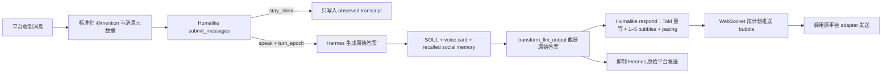

# Humalike / Hermes 插件实现分析：humanlike 对话通常怎么做，巧思在哪里

> 查询：[`Humalike/hermes-humalike-plugin`](https://github.com/Humalike/hermes-humalike-plugin) 现在如何实现 humanlike 对话？行业通常怎么做？这个项目有哪些真正的巧思与边界？
>
> 核查日期：2026-07-23  
> 代码快照：[`368666f9b4d01a1dcdc90df746edee3574a7cdc7`](https://github.com/Humalike/hermes-humalike-plugin/tree/368666f9b4d01a1dcdc90df746edee3574a7cdc7)

## 结论

Humalike 不是训练出一个“更像人的 Hermes 基座模型”，而是在 Hermes 外面增加一套 **conversation behavior harness**：

1. 先判断这轮是否该开口；
2. 让 Hermes 按正常能力生成任务答案；
3. 再按听者视角重写答案；
4. 将答案拆成 1–5 个聊天气泡；
5. 按阅读、思考、输入节奏调度发送；
6. 在后台持续提取语气、关系与社会记忆。

它最值得借鉴的不是某一句 prompt，而是把 **“什么时候说、说什么、以什么节奏送达”拆成三个不同的控制问题**。这是很好的产品与 harness 设计。公开代码能证明的主要是编排和工程巧思；Humalike 服务内部使用什么模型、prompt、训练数据和评测集并未开源，所以无法据此确认算法创新。

我的判断：

| 维度 | 判断 |
|---|---|
| 产品问题选择 | 强：抓住群聊 Agent “不知何时闭嘴”和普通回答“像工单回复”两个真实问题 |
| Harness 设计 | 中上：turn gate、draft rewrite、bubble pacing、memory/style 分层组合合理 |
| 算法创新 | 无法独立判断：核心 API 服务闭源 |
| 当前工程成熟度 | 早期：有测试和真实适配，但存在回复丢失、连接恢复、状态持久化、测试漂移等缺口 |

## 现在的 humanlike 对话一般怎么实现

公开系统通常不是靠一种技术，而是七层组合：

| 层 | 常见实现 | 解决的问题 |
|---|---|---|
| Persona | system prompt、角色卡、few-shot 示例 | “我是谁、倾向怎么表达” |
| Context | 当前对话、关系、场景、平台元数据 | “这句话在什么处境下说” |
| Memory | 用户事实、事件、关系、长期偏好检索 | “我记得什么” |
| Style adaptation | 从近期对话提取 voice/style card，低频更新、每轮注入 | “我在这个圈子里通常怎么说” |
| Turn-taking | `speak / stay_silent / wait` 分类器或策略模型 | “现在该不该插话” |
| Deliberation | 先生成任务答案，再 critique、ToM rewrite 或候选 rerank | “这句话对对方会产生什么感受和理解” |
| Delivery | 拆短消息、typing indicator、阅读/输入延迟、打断与取消 | “它在聊天界面里如何出现” |

高阶系统会再用 SFT、DPO 或 RL 专门训练 persona consistency、turn-taking、同理心与拒答边界，但产品层仍需要状态、路由、取消、重试和发送节奏。换句话说，**model capability 只决定它会不会说，conversation harness 决定它像不像一个在场的人**。

研究也支持这种拆分：Generative Agents 将 observation、memory、reflection、planning 作为可信行为的组合；Persona DPO 用偏好优化增强角色一致性；“Speak or Stay Silent”和 When2Speak 则把开口时机视为独立、可训练且不能假设从通用对话能力中自然涌现的策略问题。

## Humalike 插件的实际调用链

### 1. 入站：先决定是否说话

插件打开或复用 Humalike thread，将新消息提交给 `submit_messages`。服务返回：

- `speak`：附带 `turn_epoch`，允许 Hermes 开始生成；
- `stay_silent`：不触发正常生成，只把本轮作为 `observed: true` 写入 Hermes transcript；
- 服务失败：普通私聊/消息路径倾向 fail-open，让 Hermes 继续回答；Telegram 等被动观察的群聊路径倾向 fail-closed，避免服务宕机后机器人突然回复所有消息。

这一步把“内容生成”之前增加了一个 **participation policy**。它比在 system prompt 里写“不要每次都回复”可靠，因为沉默是运行时分支，不依赖主模型生成空字符串。

### 2. 中间：Hermes 仍负责把事情做对

进入 Hermes 后，插件向系统上下文注入：

- `SOUL.md` 中的长期人格；
- 后台抽取并缓存的 voice card；
- Humalike social memory 的 recall 结果。

Hermes 的工具、知识和任务执行能力仍然负责生成原始答案。这里遵循了一个合理分工：**task model 负责 correctness，behavior layer 负责 social fit**。

### 3. 出站：先截获草稿，再变成聊天行为

`transform_llm_output` hook 获取 Hermes 的原始答案，用对应消息的 `turn_epoch` 调用 `respond`。Humalike 对草稿做 Theory of Mind 风格的重写，返回 1–5 个短消息及发送计划；WebSocket 再把每个 bubble 推回插件，插件调用原平台 adapter 发送。

与此同时，插件把原始答案放进精确文本 suppression set：它仍保留在 Hermes 历史里，但不直接发到平台，避免用户同时收到“正式长答案”和“自然短气泡”两套内容。

### 4. 后台：两种不同速度的学习

social learning 采用明显的 **two clocks**：

- 快路径：每轮只读取缓存 voice card，避免增加主回复延迟；
- 慢路径：约每 5 轮从最近 100 条 human/user 消息中抽取 style card，原子写入本地缓存。

插件还主动从 Hermes 原生 memory capture 中移除 `STYLE` 和 `NORMS`，只让 native memory 继续保存持久事实，避免同一份表达偏好在两个记忆系统中重复学习、相互污染。

## 真正有巧思的地方

### 1. 将“发言权”和“生成权”分开

群聊里最不像人的 Agent，往往不是回答差，而是每条都抢答。Humalike 把 turn-taking 放到生成前，并为每轮分配 `turn_epoch`。这既能沉默，也给后续取消过时回复提供了身份锚点。

### 2. `turn_epoch` + 原始 `message_id` 贯穿异步链路

Hermes 内部会合并连续消息、跨线程执行生成，普通 session ID 不足以判断答案对应哪一次发言机会。插件：

- 按平台 `message_id` 保存 epoch；
- 用 `ContextVar` 把 raw message ID 绑定到 worker；
- 在快速追发消息被 merge 时，将 pending event 更新到最新 message ID；
- 最终 `respond` 仍带回准确 epoch。

这不是表面上的 prompt 技巧，而是在解决真实 race condition：用户连续发两句时，第一轮已经过时的答案不能晚到。

### 3. 抑制采用“精确文本”，不是粗暴全局静音

插件只拦截与 Hermes 最终草稿完全相同的 outbound text；工具进度、系统通知等并发消息不会被误吞。这比“Humalike 工作期间禁止所有 send”更适合 Agent runtime。

### 4. 人格、社会语气和事实记忆各自有生命周期

- `SOUL.md`：长期身份；
- voice card：缓慢更新的表达习惯；
- social memory：按人检索的关系/事件；
- transcript：当前对话事实；
- `turn_epoch`：一次性的发言资格。

这符合 [agent-memory](/wiki/concepts/agent-memory/) 中“事件、可检索记忆、行为策略不是同一种状态”的区分，也符合 [context-engineering](/wiki/concepts/context-engineering/) 的上下文装配思路。

### 5. 通过消除 machine tells 提升自然感

自动配置不仅增加能力，还关闭 streaming、工具进度、busy ack、memory notification、Telegram draft streaming、编号澄清菜单和 Slack thread-only reply 等典型机器人痕迹。这里有一个很实用的产品洞察：**humanlike 有一半来自生成什么，另一半来自不暴露什么**。

### 6. fail-open / fail-closed 按场景区分

私聊增强服务失败时，继续发原始答案通常优于完全不答；群聊“旁听模式”失败时，保持沉默通常优于突然接管群聊。插件已在部分路径体现这种风险不对称，而不是统一 fallback。

## 目前最重要的边界与风险

### P0：`respond` 或 WebSocket 失败时可能直接丢回复

输出 hook 会先把 Hermes 草稿加入 suppression set，再异步调用 Humalike `respond`。如果 decide 已成功、但 respond 请求失败、epoch 被判过时或 WebSocket 未送达，当前代码没有恢复原始发送，也没有 delivery acknowledgment 后再 suppress 的两阶段提交。

这与 Humalike 文档建议的“增强调用失败时回退原始草稿”并不一致。生产实现应改成：

1. 原始草稿进入 pending；
2. `respond` 被接受并收到首个 bubble 或明确 delivery ack；
3. 才最终取消原始发送；
4. 超时则回退 raw draft。

### P0：WebSocket 明确没有 reconnect，路由状态也只在内存

接收循环断开后直接结束，不自动重连；`thread_id → platform route` 和 session map 都是进程内状态。进程重启或 socket 抖动后，即使服务端已排好 bubbles，本地也可能因找不到 route 而丢弃。

需要持久化 thread/route，按相同 `thread_id` 重连，并对 bubble 使用幂等 delivery ID、ack 和补拉机制。

### P1：默认 style card 与 memory scope 容易串场

- voice card 默认使用全局 `__global__`，不是每个群或每个用户一张卡；“最后一次刷新”可能改变所有 session 的语气，除非显式打开 `social_learning.per_session_card: true`。
- social memory 的默认 bank 以 agent name 命名，跨所有 channel 共享。
- ingest 的 speaker 主要使用平台 display name，而非 `platform + stable_user_id` 的限定身份。

因此，同名用户、工作群与私人群、Slack 与 Telegram 之间存在事实混淆和风格串场风险。person-centric memory 必须先解决 identity resolution 与 scope/consent，而不只是向量检索。

### P1：插件与 Hermes 内部实现高度耦合

README 已明确说明它会 monkeypatch Hermes internals。仓库复制/改写了内部 reply、merge、adapter send 等路径，但没有公开依赖锁定或兼容矩阵；Hermes 更新后，turn-taking 可能静默脱钩。这类实现需要启动时 capability probe、版本 pin 和端到端 canary，不能只靠单元测试。

### P2：代码、manifest、测试和文档已经出现漂移

- `plugin.yaml` 仍写着 “v1 joins the messages into one bubble (no pacing)”，实际代码已支持 1–5 bubbles 和 WebSocket pacing；
- 仓库没有 release、CI workflow 或显式 Python dependency manifest；
- 在可导入的 package 路径下运行全部公开测试，结果为 **76 passed、7 failed**；7 个失败都来自 `test_to_messages.py` 仍调用已经迁移掉的 `_to_messages`；
- 仓库目录名包含连字符，直接从 checkout 运行 pytest 还会触发相对导入 collection 问题。

这更像活跃开发中的 reference integration，而不是可以无条件嵌入关键消息链路的稳定 SDK。

### P2：公开集成还没有利用完整社会信号

当前插件没有启用或上报 typing、edit、reaction 等 `social_signals`，也没有发送更丰富的 client timestamp；媒体内容在 decide 阶段主要是 placeholder，并可因 `has_media` 直接触发 speak。它模拟了发送节奏，但尚未真正理解所有实时互动信号。

### P2：数据边界需要显式告知用户

配置 API key 后，消息 transcript、Hermes 草稿、system prompt、voice extraction 样本和 memory 内容会发送给外部 Humalike 服务。官方 Social Memory 文档当前没有 clear/delete endpoint，重置建议是换 scope。若用于私人群、公司群或跨渠道记忆，需要单独设计 consent、retention、delete 和 tenant isolation。

### 待核实：`system_prompt` 长度契约不一致

当前官方 `submit_messages` 文档写的上限是 8,000 字符，而插件内部截断常量是 100,000，并会拼接 SOUL 与 voice card。可能是服务端契约或文档已经变更，也可能导致长 persona 在 decide 阶段返回 422；在官方补充版本化 schema 前，应增加契约测试。

## 如果自己实现，最小可行架构

不要一开始就做“全人格模型”。一个可验证的 MVP 是：

1. 一个明确场景：例如 5–20 人工作群里的助手；
2. 独立的 `speak / silent / wait` 策略；
3. 主模型生成完整草稿；
4. 小模型或同模型第二次调用做 listener-aware rewrite；
5. 确定性的 bubble splitter 与 pacing scheduler；
6. `turn_id + version + cancel token + delivery ack`；
7. 事实 memory 与 style profile 分库存储；
8. 原始草稿可靠 fallback；
9. 先评测再学习。

建议至少测：

| 指标 | 含义 |
|---|---|
| False interruption rate | 不该插话却插话的比例 |
| Missed intervention rate | 明显该答却沉默的比例 |
| Stale reply rate | 用户已追问/改口，旧答案仍到达 |
| Task correctness delta | 重写后是否损害事实与任务完成度 |
| Persona contradiction rate | 长期身份或立场是否前后冲突 |
| Cross-scope leakage | 不同用户、群、平台的记忆是否串场 |
| Reply loss / duplicate rate | 调度层是否丢消息或重复发送 |
| P50/P95 added latency | humanlike 层增加的真实等待成本 |

## 证据

### 项目与代码

- [仓库首页与 README](https://github.com/Humalike/hermes-humalike-plugin)
- [插件注册：pre-LLM hooks、patches、output transform](https://github.com/Humalike/hermes-humalike-plugin/blob/368666f9b4d01a1dcdc90df746edee3574a7cdc7/__init__.py#L273-L318)
- [turn decision、observed transcript 与 fail-open](https://github.com/Humalike/hermes-humalike-plugin/blob/368666f9b4d01a1dcdc90df746edee3574a7cdc7/turn_taking/core.py#L113-L238)
- [最终草稿截获、suppression 与异步 respond](https://github.com/Humalike/hermes-humalike-plugin/blob/368666f9b4d01a1dcdc90df746edee3574a7cdc7/turn_taking/hooks.py#L70-L105)
- [turn-taking API client、memory bank、pacing、WebSocket](https://github.com/Humalike/hermes-humalike-plugin/blob/368666f9b4d01a1dcdc90df746edee3574a7cdc7/turn_taking/service.py#L60-L295)
- [mention normalization、精确发送抑制、群聊 fallback、message ID 传递与 merge 修复](https://github.com/Humalike/hermes-humalike-plugin/blob/368666f9b4d01a1dcdc90df746edee3574a7cdc7/turn_taking/patching.py#L26-L600)
- [epoch、route、session 与 pending answer 状态](https://github.com/Humalike/hermes-humalike-plugin/blob/368666f9b4d01a1dcdc90df746edee3574a7cdc7/turn_taking/state.py#L48-L101)
- [social learning 的缓存、全局/每 session scope 与后台抽取](https://github.com/Humalike/hermes-humalike-plugin/blob/368666f9b4d01a1dcdc90df746edee3574a7cdc7/social_learning/__init__.py#L1-L369)
- [从 native memory 中剥离 STYLE/NORMS](https://github.com/Humalike/hermes-humalike-plugin/blob/368666f9b4d01a1dcdc90df746edee3574a7cdc7/social_learning/native_memory.py#L1-L119)
- [关闭 machine tells 的自动配置](https://github.com/Humalike/hermes-humalike-plugin/blob/368666f9b4d01a1dcdc90df746edee3574a7cdc7/autoconfig.py#L1-L34)

### Humalike 官方 API

- [API Overview](https://docs.humalike.com/)
- [Calling Patterns](https://docs.humalike.com/calling-patterns)
- [Turn-taking Overview](https://docs.humalike.com/api-reference/turn-taking/overview)
- [`submit_messages`](https://docs.humalike.com/api-reference/turn-taking/submit-messages)
- [`respond`](https://docs.humalike.com/api-reference/turn-taking/respond)
- [`extract`](https://docs.humalike.com/api-reference/extract)
- [Social Memory Overview](https://docs.humalike.com/api-reference/social-memory/overview)

### 相关研究

- [Generative Agents: Interactive Simulacra of Human Behavior](https://arxiv.org/abs/2304.03442)
- [Enhancing Role-Playing Systems through Persona DPO](https://aclanthology.org/2025.coling-main.369/)
- [SimOAP: Improve Coherence and Consistency in Persona-based Dialogue Generation via Over-sampling and Post-evaluation](https://aclanthology.org/2023.acl-long.553/)
- [Speak or Stay Silent: A Large-Scale Benchmark for Proactive Turn-Taking](https://arxiv.org/abs/2603.11409)
- [When2Speak: Towards Socially Intelligent Language Models with Proactive Turn-Taking](https://arxiv.org/abs/2605.05626)
- [ToMBench: Benchmarking Theory of Mind in Large Language Models](https://aclanthology.org/2024.acl-long.847/)

### 知识库关联

- [agent-memory](/wiki/concepts/agent-memory/)
- [context-engineering](/wiki/concepts/context-engineering/)
- [agent-runtime](/wiki/concepts/agent-runtime/)
- [harness-engineering](/wiki/concepts/harness-engineering/)

---
*由 LLM 从知识库查询生成*
