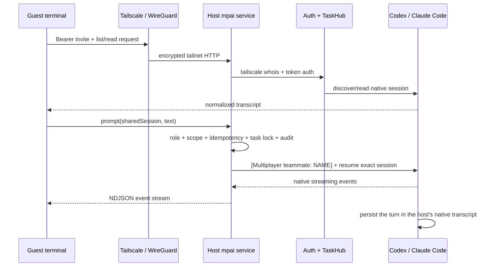

# MPAI 实现拆解：给现有 Codex / Claude Code 会话加一层多人协议

> 生成时间：2026-08-04
> 查询：`https://www.producthunt.com/products/mpai` 这种项目是怎么实现的
> 证据边界：结论基于 Product Hunt 页面、官方 GitHub 仓库 `v0.4.19` / commit `7c84e2311adf9934ad594bd037f06c52308f75fd`、公开源码与文档，以及 Codex、Claude Code、Tailscale 官方文档。源码在本地临时目录完成 `npm ci` 与 `npm run verify`；未进行真实双 Mac / Tailscale 互联测试，也未把项目自报 dogfood 当成独立用户证据。

## 摘要

MPAI 不是新的模型、Agent 框架、共享终端或云端 IDE。它更准确的定义是：

> **一个运行在宿主 Mac 上的 local-first session gateway：读取本机已有的 Codex / Claude Code 会话，用统一协议暴露经过授权的会话列表和 transcript，并把队友的远程输入恢复到同一个原生 session 中继续执行。**

它成立的关键不是“让两个 AI 互相对话”，而是复用三个已经存在的底座：

1. Codex / Claude Code 已经把 session 和 transcript 持久化到本地；
2. 两者都存在可恢复原会话并继续一轮的 native seam；
3. Tailscale 已经解决设备互联、加密和网络身份。

MPAI 自己补的是中间那层：`会话发现 → 会话级授权 → 统一 transcript → 署名 prompt → provider event stream → presence / audit / cancel`。公开源码约 5,848 行 JavaScript 业务代码、2,948 行测试，运行时只有 `ws` 一个第三方依赖；当前 61 个测试全部通过。因此它是一个真实可运行的窄产品，不是 Landing Page 概念；但截至本次检查仍主要是创始人双 Mac dogfood 的 public alpha，外部重复使用和市场成立性尚未证明。

### 交互式消息关系图

[打开 MPAI 消息关系 HTML 图](/output/reports/mpai-message-relationship-visualization-2026-08-04.html)

图中把关系拆成三层：`taskId` 决定哪一个 provider-native session，`requestId` 关联一次远程提交、幂等与 audit，`turnId / itemId` 描述 provider 执行。最终 UI transcript 仍是按原生顺序投影出的扁平 `{id, role, author, text, at}` 数组，没有 `parentId / replyTo`，MPAI 也没有保存从 `requestId / turnId` 精确 join 到最终 `message.id` 的外键。不同 Codex / Claude sessions 之间没有消息边。

## 一、用户输入什么，系统交付什么

| 角色 | 输入 | MPAI 消费方式 | 输出 |
|---|---|---|---|
| Host | 本机已有 Codex / Claude Code session、显示名、要分享的一个 session、队友名 | 扫描原生 session store；创建 session-scoped invite；启动常驻本地服务 | 一条带 secret token 的 `npx ... join 'mpai://...'` 邀请命令 |
| Guest | 邀请 URL、Tailscale 身份、在 room 中输入的消息 | Bearer token + Tailscale user identity 双重认证；调用 host 上的 session gateway | 获得被分享会话的历史、presence、流式 Agent 回复；当前无需自己的 provider 登录 |
| Provider | 被恢复的 native session ID、带人名的 prompt | Claude CLI resume 或 Codex App Server `thread/resume → turn/start` | 同一个原生 transcript 中新增一轮，并继续使用 host 的 workspace、账号和权限策略 |

因此，“multiplayer”发生在 **AI session 层**：

- 不同步两个人的文件系统；实际执行仍发生在 Host Mac 的 workspace；
- 不把整台终端暴露给 Guest；没有任意 shell endpoint；
- 不复制一个新的 Agent；恢复的是 Host 已存在的那条原生 session；
- 不把人名变成 provider-native principal；当前署名是写入 user message 的文本前缀。

远程轮次使用 Host 已登录的 Codex / Claude Code 账号、workspace 和额度。因而“Guest 不需要 provider 账号”是源码可推得的产品便利；Host 承担的 usage / seat / provider Terms 边界则没有公开的独立合规结论。

## 二、完整 operating loop



Host 的一键路径实际做了这些事：

1. 在 `~/.multiplayer-ai/` 建身份、配置和本地 audit；
2. 找到 Tailscale IPv4 地址，在 macOS 安装 LaunchAgent 常驻服务；
3. 同时初始化 Codex 与 Claude provider adapter；
4. 展示最近的原生 sessions，让 Host 明确选择一个；
5. 生成 32-byte random token，只在 Host 保存 SHA-256 hash；
6. invite 默认只授权所选 session，并赋予 `viewer` 或 `participant` role；
7. 打印版本锁定的 `npx` 命令给 Guest。

Guest 首次连接后：

1. 自定义 `mpai://` URL 被转换为 `http://100.x.y.z:7337`；
2. Host 用请求源 IP 调 `tailscale whois --json`，得到 Tailscale user/device identity；
3. invite 在首次成功使用时绑定该 Tailscale `userId`；
4. Guest credential 写入 macOS Keychain；Keychain 不可用时回退到 mode `0600` 文件；
5. 终端 room 每 2 秒读取 transcript 增量，每 15 秒刷新 presence；
6. 输入普通文本即触发远程 prompt，provider 输出以 NDJSON 流式返回。

## 三、四个真正关键的实现接缝

### 1. Provider-neutral TaskHub

`src/hub.js` 定义了最小 provider contract：

```js
{
  id,
  name,
  start(),
  listTasks({ limit, cwd, search }),
  readTask(nativeId),
  prompt({ nativeId, text, actor, requestId, onEvent, signal }),
  close()
}
```

Codex 与 Claude 的原生 ID 被包装成 `codex:<id>` / `claude:<id>`，共同输出 `{ title, cwd, status, canPrompt, messages }`。终端 UI、远程 HTTP 协议和权限层因此不需要理解 provider 差异。

这与 [tool-routing](/wiki/concepts/tool-routing/) 有一点相似，但它不是让模型选择工具；它是由确定性 adapter 根据 task ID 路由到正确的本地 Agent provider。

### 2. Claude Code：直接读 JSONL，写入走官方 resume CLI

Claude adapter 扫描 `~/.claude/projects/*/*.jsonl`：

- list 时只读文件头 64 KiB + 尾 192 KiB，提取 session ID、title、cwd 和时间；
- read 时解析完整 transcript，只保留 user / assistant 文本，跳过 sidechain；
- prompt 时 spawn：

```bash
claude -p "[Multiplayer teammate: Alex]\n..." \
  --resume SESSION_ID \
  --output-format stream-json \
  --verbose --include-partial-messages \
  --permission-mode dontAsk
```

也就是说，它**没有修改 Claude JSONL 来伪造一轮**。JSONL 只作为发现和只读投影；真正写入由 Claude Code 自己的 `--resume` 路径完成。stdout 的 stream-json 再被归一化为 `agent.delta / agent.message / turn.completed`。

Guest 断线时，MPAI 会终止这一个 `claude` child process；两分钟无 stdout / stderr 进展也会判定 stalled，避免永远占住 room。

### 3. Codex：读 transcript 有快路径，写入走 App Server

Codex adapter 有两条 transport：

- `proxy`：通过 Unix socket 的 WebSocket 连接正在运行的 managed Codex app-server daemon；
- `standalone`：spawn `codex app-server --listen stdio://`，只安全地用于 list/read，默认禁止远程 prompt。

写入流程使用 Codex 官方 App Server 的 JSON-RPC 生命周期：

```text
initialize
→ thread/list / thread/read
→ thread/resume(threadId)
→ turn/start(threadId, attributedText)
→ item/*、turn/* streaming notifications
→ turn/completed
```

Guest 断线时调用 `turn/interrupt`。如果 Codex 发出 command/file-change approval、permissions approval 或 MCP elicitation，MPAI 一律 decline；因此 Guest 不能通过远端弹窗扩大权限。

为避免读取超大 Codex history 时把完整 tool/internal records 经 App Server 传出去，`src/codex-rollout.js` 直接从 `~/.codex/sessions/` 尾读 JSONL：起始 256 KiB，不足时指数扩大，最多 32 MiB，只投影可见 user / assistant messages，并去掉 Codex internal context 与 app/browser ambient context。读不到时再回退 `thread/read`。

### 4. 自己实现一个很薄的协作协议

Host 是 Node 内建 `http.createServer()`，Guest 是内建 `fetch()`：

- `GET /v1/whoami`
- `GET /v1/tasks`
- `GET /v1/tasks/:id`
- `POST /v1/tasks/:id/prompt`
- `GET/POST /v1/presence`
- `GET /v1/audit`

普通请求是 JSON；prompt response 是 `application/x-ndjson`。这不是 WebSocket chat server：room 用轮询获取 transcript 更新，只有 MPAI 到 managed Codex daemon 的本地连接使用 `ws`。

Server 负责的不是 AI reasoning，而是普通分布式系统纪律：

- bearer token 格式和长度限制；
- role 与 session scope；
- idempotency key；
- 设计目标是每个 task 同时最多一个 **remote** prompt；
- disconnect cancellation；
- 45 秒 presence TTL；
- append-only `audit.jsonl`。

## 四、安全模型：做对了什么，仍然不等于什么

### 已实现的安全边界

- 服务默认绑定 Tailscale 地址，不监听公网所有 interface；
- Tailscale / WireGuard 提供设备间加密，`tailscale whois` 提供网络用户身份；
- invite token 与 Tailscale `userId` 同时成立才通过；
- 新 invite 默认 `selected`，不是 all sessions；
- session list、title、transcript、presence、audit、prompt route 都按分享范围过滤；
- Host 只保存 token hash；Guest token 优先保存进 Keychain；
- viewer 不能 prompt，participant 也不能批准新的 shell/file 权限；
- 没有 raw shell、delete、archive 或 remote approval API。

这里的“没有中央 transcript relay”只表示 MPAI 自己不运营云端中继或 transcript warehouse；Tailscale 底层在无法直连时仍可能使用只转发加密 WireGuard packets 的 DERP relay，AI provider 与 GitHub 也继续按各自服务边界参与。

MPAI peer URL 本身是 `http://100.x.y.z:7337`，没有额外的应用层 HTTPS；传输机密性与完整性完全依赖 Tailscale / WireGuard。首次 claim 的绑定粒度是 Tailscale `UserProfile.ID`，device name 只被记录而不参与 `claimedBy` 比较，因此它是 user-bound invite，不是 device-bound invite。

### 四个容易误解的地方

1. **“Host keeps control”不等于 Guest 没有副作用能力。** Participant 可以让 Host 的 Agent 执行 Host 当前策略已经允许的命令或文件修改；MPAI 只是拒绝新的远程 approval，不会把 Agent 变成 read-only。
2. **署名不是强身份 provenance。** `[Multiplayer teammate: Alex]` 是普通 prompt 文本。人类输入在 transcript 和 audit 中有署名锚点，但后续 20 个 tool calls 仍是 provider output，没有逐 tool-call 的 Alex 身份签名。
3. **“无云端 transcript copy”不等于“不复制内容”。** Guest 会收到获准 transcript；Host 的 `audit.jsonl` 在 `prompt.received` 事件中还会保存 prompt 原文。`GET /v1/audit` 没有 participant role gate，因此 viewer 也能通过 API 读到其获准 task 的完整 audit record，尽管默认终端格式未突出打印 `text`。撤销 invite 不能追回 Guest 已经看过或复制的内容。
4. **并发锁不覆盖 Host 原生客户端。** MPAI 只尝试锁同一个 task 的远程 prompt。Claude 官方文档明确提示，同一 session 同时在两个 terminal resume 会让消息交错；因此 Host 与 Guest 同时发言仍需要操作纪律，当前不是 CRDT 或强一致协同编辑。
5. **远程锁自身还有一个源码级 TOCTOU 窗口。** `server.js` 先检查 `activePrompts`，再 `await` audit 查询与写入，之后才 `activePrompts.set(taskId)`；两个使用不同 request ID、真正同时抵达的请求理论上可能都越过检查。现有 concurrency test 是等第一轮进入 provider 后再发第二轮，没有覆盖这个窗口。因此“同一 task 只能有一个 remote turn”应视为设计意图和常规路径行为，尚不是严格原子保证。

另外，当前 invite 没有自动 expiry 字段，只能显式 revoke；invite secret 又会出现在聊天消息与一次性 shell command 中，泄露风险需要靠可信传递渠道、首次 Tailscale 身份绑定和及时撤销共同控制。

## 五、如果自己做，一个 MVP 的最短路径

不要从“多人 Agent 平台”开始，先只做一个 provider、一个可信队友、一个显式 session：

### Phase 1：只读 session viewer

1. 选 Claude Code，扫描本地 JSONL；
2. 定义统一 `Task` / `Message` schema；
3. 写一个只绑定 tailnet 地址的 Host HTTP server；
4. 做 32-byte invite token、hash 存储和 selected-session ACL；
5. Guest terminal 能 list / read / poll 一个 session。

做到这里已经能验证“同事真的需要进入完整上下文，还是 summary / screen share 足够”。

### Phase 2：安全写入

1. 只允许 `participant` 触发 prompt；
2. 用 provider 官方 resume surface，不直接 append transcript；
3. 给 prompt 加 idempotency key 与 per-session remote lock；
4. 输出以 NDJSON / SSE stream 返回；
5. 断线 cancel provider turn；
6. 所有新 approval fail closed。

### Phase 3：从 demo 到 alpha

1. Keychain / protected credential store；
2. LaunchAgent 与 sleep/wake / upgrade recovery；
3. transcript tail window，避免 100 MB history 阻塞；
4. invite revoke、viewer/participant、presence、audit；
5. 多 provider adapter；
6. 真双机、断网、重复提交、并发和 provider restart 测试。

以当前仓库规模判断：熟悉 Node CLI 和两家 provider seam 的工程师，做出可演示的 Claude-only 版本可能只需数天；做到 MPAI 当前这种可信 alpha，需要更多时间花在权限、断线、安装、升级和真实双机验证上，而不是模型调用本身。这是工程量推断，不是项目公开工时。

## 六、这项目真正的新东西与可替代部分

| 层 | 是否 MPAI 自己创造 | 判断 |
|---|---|---|
| 模型和 Agent loop | 否 | 完全复用 Codex / Claude Code |
| Session memory | 否 | 复用两家本地持久 transcript |
| 远程恢复 session | 否 | 复用 `--resume` / App Server |
| 私网、加密、网络身份 | 否 | 复用 Tailscale / WireGuard |
| 多 provider task schema | 是 | 很薄，但为跨工具 UI 提供稳定接口 |
| session-scoped sharing / roles | 是 | 是产品成立的核心安全增量 |
| named human turn + audit | 是 | 当前是文本署名 + 本地日志，不是密码学 provenance |
| terminal room / presence / stream | 是 | 体验层；实现并不重，可靠性细节重要 |

所以它的优秀之处是**找到并组合正确 seam**，而不是发明复杂协议。知识库里最接近 [agent-native-im](/wiki/concepts/agent-native-im/) 的 `local daemon + 人和 Agent 同一协作 surface`，但 MPAI 更窄：它不建立新的 IM 或 Agent workspace，只给 native session 加一个临时 room。它也不是 [agent-communication](/wiki/concepts/agent-communication/) 意义上的 Agent-to-Agent 协议，而是 Human B → Host-owned Agent Session 的授权控制面。

## 七、成立性判断

### 技术上：成立

- 代码路径与官方 provider seam 对得上；
- 依赖面很小；
- 本地 `npm run verify` 通过，61/61 tests；
- 读取、写入、断线 cancel、scope filtering、revocation 和 concurrency 都有行为测试。

这足以证明它不是 prompt wrapper 或演示视频伪产品。

### 产品上：有明确 wedge，但尚未证明高频

它解决的是一个真实但可能低频的问题：某人已在一个 session 深入 40 轮，另一个人需要完整进入并继续，而不是获得总结或 PR。最适合：

- 两三人 AI-native 创业团队；
- incident / debugging 专家临时加入；
- shift handoff、架构 review、结对 steering；
- 顾问在客户自有 Mac / tailnet 内进入明确授权 session。

不适合：

- 成员只并行负责各自模块，不需要进入彼此 session；
- 不愿安装 Tailscale 或让同事看到完整 transcript；
- 需要多人共同编辑文件、terminal 或 preview；
- 需要 SSO/SCIM、设备策略、企业审计和合规认证。

### 公司层面：当前不能成立为平台结论

代码并不是主要壁垒：约 6K 行业务 JavaScript 已把核心闭环做出，模型厂商又可能原生加入 cross-user sharing。长期控制点必须升级为：

- 跨 provider 的人员 / 设备 / 项目 / session directory；
- 组织级 RBAC、SSO/SCIM、retention、audit export 和 device posture；
- 可验证的人类授权与 tool-call provenance；
- Slack / Linear / GitHub / incident flow 中的高频入口；
- 跨 session handoff 的真实时间节省和周留存。

Product Hunt launch、GitHub stars 或创始人双机 dogfood 都不能证明这些。官方 issue #7 在本次查询时十个 non-founder cohort checkbox 仍全部未勾，readiness 文档也写明尚无外部 cohort / return 证据。下一步真正 Gate 是：非创始人的 10 个双人团队能否在 5 分钟内进入首个 room，并在下一周因为真实 handoff 再次使用；如果只在偶发 debug 时出现，它可能是有用的开源工具或 provider feature，而不是独立协作平台。

## 结论

一句话复刻其实现思想：

> **不要重建 Agent；在 Host 机器上做一个受限 session gateway，把 provider 的本地 transcript 与 resume API 统一起来，再用 Tailscale 身份、session ACL、署名、stream、cancel 和 audit 把它变成可协作的 room。**

它的产品启发也很干净：AI 时代很多新工具不需要新模型，价值可能来自把原本单用户的持久 Agent state，变成有身份、有授权、有边界、可进入和可退出的团队资源。

## 数据来源

- [MPAI Product Hunt 页面](https://www.producthunt.com/products/mpai)
- [MPAI 官方 GitHub 仓库](https://github.com/godfaddaai/multiplayer-ai)
- [固定源码快照 `7c84e23`](https://github.com/godfaddaai/multiplayer-ai/tree/7c84e2311adf9934ad594bd037f06c52308f75fd)
- [Provider adapter contract](https://github.com/godfaddaai/multiplayer-ai/blob/7c84e2311adf9934ad594bd037f06c52308f75fd/docs/PROVIDERS.md)
- [MPAI security boundary](https://github.com/godfaddaai/multiplayer-ai/blob/7c84e2311adf9934ad594bd037f06c52308f75fd/SECURITY.md)
- [First 10-team cohort issue](https://github.com/godfaddaai/multiplayer-ai/issues/7)
- [OpenAI Codex App Server README](https://github.com/openai/codex/blob/main/codex-rs/app-server/README.md)
- [Claude Code session 管理与本地 JSONL](https://code.claude.com/docs/en/sessions)
- [Claude Code headless / stream-json](https://code.claude.com/docs/en/headless)
- [Tailscale identity](https://tailscale.com/docs/concepts/tailscale-identity)
- [Tailscale CLI `whois`](https://tailscale.com/docs/reference/tailscale-cli)
- [agent-native-im](/wiki/concepts/agent-native-im/)
- [agent-runtime](/wiki/concepts/agent-runtime/)
- [agent-communication](/wiki/concepts/agent-communication/)

---
*由 LLM 从知识库查询生成*
