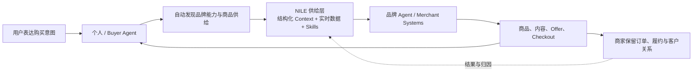

# NILE Deck：它在讨论什么，以及押注的未来

> 生成时间：2026-08-11
> 查询：`NILE-deck-en.html` 在讨论什么，押注的未来是什么样的？
> 证据边界：本文解释 Deck 的产品对象、叙事因果链与未来假设；没有对 Deck 的团队、客户、GMV、转化率或市场数字做外部核验。
> 源文件：`/Users/benzema/Library/Containers/com.tencent.xinWeChat/Data/Documents/xwechat_files/wxid_9d5ud57p4t4h22_b623/msg/file/2026-08/NILE-deck-en.html`（14 页，41,081,628 bytes，SHA-256 `dcd2c8e56d607c64b92bd5fea4887cf6c0449f735d819cf6834723f83afa12a0`）

## 摘要

NILE 不是在卖一个普通的 GEO 工具、商品 Feed 插件或 AI 导购。它在讲一个更大的类别故事：**当个人 Agent 取代网页、搜索框和 App 成为消费者的购买入口，品牌需要一套站在商家一侧的 Agentic Commerce 供给基础设施；NILE 想控制品牌如何被 Agent 读取、比较、选择、成交和归因。**

Deck 真正押注的不是“AI 会辅助购物”这么温和，而是：

1. 未来的流量入口从 Web / Mobile 迁移到 Agent；
2. 分发规则从 SEO 和 App 下载量，迁移到机器可消费的供给质量、上下文和实时数据；
3. 每个品牌会从一个网站或 App，变成一个具有身份、权限、数据、Skills 和交易端点的“品牌 Agent”；
4. 聚合这些品牌 Agent 的平台，会进一步成为 Agent-native 的广告网络、品牌工作室和零售交易所。

用一句不那么 marketing 的话概括：**NILE 想成为 AI Shopping 时代的 merchant-side commerce control plane + supply network，而不是再做一个给人点按钮的 SaaS。**

证据阅读上要降一档：s3 的趋势图在页脚明确标为 `Illustrative curve`；s9 的 Nile Pro 终端是 HTML 中写死命令与结果的 typing animation，不是一次连接真实后端的运行证据；s10 的数据墙也没有给 cohort、口径或外部脚注。因此这首先是一份 **category / future thesis Deck**，不能直接当作产品与规模证明。

## 1. 这份 Deck 实际在讨论什么

### 1.1 它把市场变化定义成“流量操作系统迁移”

Deck 的前三个趋势页不是简单说 AI 搜索增长，而是连续完成三次替换：

| 旧世界 | 新世界 | Deck 的结论 | 页码 |
|---|---|---|---|
| Keyword search | Agent 搜索、比较并代购 | Agent 成为新的 buyer | s3 |
| Ads / IM / Checkout / Chat / Commerce App / Answer Engine | 各入口被接上 Agent rails | Agentic Commerce 不再局限于聊天框 | s4 |
| Web → Mobile | Agent phone / personal Agent | Agent 自己就是流量入口，并渲染前端 | s5 |

这里最关键的一句话不是“Agent 帮你买东西”，而是 **“the agent is the traffic”**。这意味着品牌过去争夺网页排名和 App 安装，未来要争夺的是：自己的商品、内容和能力能否被 Agent 发现、理解和推荐。

### 1.2 它把缺口定义成“需求侧已 Agent 化，供给侧仍为人设计”

问题页（s6）把现有 Commerce SaaS 描述为给人看的 Dashboard、页面和插件；这些系统即使很多，也不能自动组成一个可被 Agent 读取和调用的品牌。商家因此需要一个新的 Agentic Commerce channel，同时又不想把 Store、Checkout 和 Customer Relationship 交给流量平台。

所以 NILE 选择的不是 buyer-side AI shopping assistant，而是 **merchant-side supply plane**：把原本散落在商品库、库存、价格、政策、内容、身份和权限中的状态，编译成 Agent 可消费、可比较、可交易的供给。

## 2. 三层产品：入口、控制面、网络终局

| 层 | Deck 中的产品 | 实际产品对象 | 商业作用 |
|---|---|---|---|
| 供给入口 | **Nile Lite**（s8） | 10 分钟接入、实时价格库存、Agent Shelf、CPS | 用“商家几乎不用做事”和按成交付费，快速聚合大量 Agent-native 商品供给 |
| 商家控制面 | **Nile Pro**（s9） | 品牌 Context、数据清洗/对齐、Identity、Permissions、Management、任意模型/Harness、Skills | 成为品牌在 Agent channel 的工作台和 system of record，把品牌编译成 headless commerce capability |
| 网络终局 | **Nile Network**（s11–s13） | 自动发现端点、生成式内容/商品表达、供给分发、广告、零售交换 | 把供给密度转成推荐权、成交权和网络收入 |

这也解释了 Deck 为什么反复说“Not SaaS”：它不是说 NILE 不提供软件，而是拒绝被估值成一个单点 Dashboard。它希望市场把 Nile Lite 理解为供给冷启动、Nile Pro 理解为商家绑定层，而把真正的终局看成网络型基础设施。

## 3. “Brand is Agent” 到底是什么意思

Deck 的标题叫 `Brand is Agent`，但它指的不是给每个品牌放一个聊天机器人。更准确的结构是：

- **Context**：产品、品牌知识、政策、内容和经营上下文；
- **Identity & Permissions**：谁可以读取、生成、报价、付款或修改；
- **System of Record**：Agent channel 里哪个状态是权威状态；
- **Skills / Capability Endpoints**：搜索、内容生成、支付、SEO/GEO 等能力可以被自动发现和调用；
- **Transaction Surface**：实时价格、库存、推荐、下单与归因可以由 Agent 完成；
- **Generated Front-end**：消费者不一定再访问品牌页面，由自己的 Agent 按意图即时渲染结果。

未来的一次购买，在 Deck 的想象中大致是：

因此，品牌在这个世界里不再主要是一个等待人访问的页面，而是一个**可被其他 Agent 查询、组合和交易的经营实体**。

## 4. 它真正押注的未来是什么样的

### 4.1 界面未来：前端从固定页面变成按意图生成

用户不再先决定打开哪个 App，再在里面搜索。用户只表达意图，个人 Agent 自己找供给、比较、协商、下单，并即时渲染界面。品牌网站和 App 仍可能存在，但不再是唯一或主要的分发入口。（s3–s5）

### 4.2 分发未来：机器可消费的供给，成为新的 SEO

Deck 把 Web 时代的搜索排名、Mobile 时代的 App 下载量，替换为 Agent 时代的 “Supply & data decide who gets recommended”。NILE 因而押注：**最稀缺的不是再造一个 Buyer Agent，而是高质量、实时、结构化、带权限且可成交的 merchant supply。**（s5–s8）

### 4.3 商家未来：每个品牌都要有自己的 Agent control plane

品牌需要把多个后台里的商品、政策、内容和能力对齐为一个 Agent 可调用的 headless representation；同时保留自己的 Checkout、客户关系和经营权。Nile Pro 想成为这一层的工作台与权威状态。（s6–s9）

### 4.4 市场未来：供给平台从工具长成交易网络

当 NILE 聚合足够多品牌和商品后，它希望从“被 Agent 调用的供给目录”继续长成：

- the first headless commerce platform；
- one-step generation company；
- agent-native ad network；
- autonomous brand studio；
- agentic retail exchange。（s11–s12）

这里的复利逻辑是：`更多品牌与商品 → 更完整的意图覆盖和实时数据 → Buyer Agent 更愿意调用 → 更多成交与反馈 → 更多商家加入`。如果闭环成立，NILE 捕获的就不只是软件费，而是 CPS、广告、分发和交易网络收入。

### 4.5 创意未来：内容、广告和商品表达按意图“一步生成”

Deck 把图像生成的 one-step scaling law 外推到内容和产品，认为 NILE 的供给数据可以被即时编译成 Agent 时代的 “consumable content”。最合理的理解是：同一商品不再只有固定详情页，而会针对用户意图生成不同的解释、组合、创意和 Offer。

但“products 也 one-step generation”在 Deck 中没有被定义清楚。它究竟指商品表达、数字商品、组合包，还是实体商品设计与生产，仍是一个待澄清的叙事跳跃。

## 5. 这个未来必须同时成立的七个条件

1. **Buyer Agent 必须愿意自动发现并调用外部 supply endpoints。** 如果 ChatGPT、Google、Amazon 等入口只使用自有或直接合作 Catalog，独立供给层没有自然分发权。
2. **供给密度必须能转化为推荐与成交，而不只是更多 Listing。** “更多品牌”不等于 Buyer Agent 会选 NILE；需要可审计的调用、排名、转化和增量 GMV 证据。
3. **NILE 的数据必须比普通 Feed / UCP adapter 更完整、更实时、更可信。** 否则 machine-readable catalog 会成为 Shopify、Amazon 或开放协议的标准功能。
4. **Nile Pro 必须定义清楚自己的权威边界。** 如果商品、订单、退款和客户关系仍以 Shopify / Amazon 为准，NILE 更像 Agent channel 的 projection / adapter，而不是整个品牌的 system of record。
5. **商家联盟与网络控制必须能共存。** Deck 一面承诺“不抽走流量、不劫持客户关系”，一面要 “own agentic traffic”、做广告网络和零售交换；平台权力变大后，利益冲突必须有治理答案。
6. **CPS 与归因要能够跨 Agent、入口和 Checkout 闭合。** 没有稳定 join key、退款口径和对照实验，last-click GMV 不能证明 NILE 带来的增量价值。
7. **One-step generation 必须改善选择、转化或经营效率。** 如果它只是批量生成内容，能力会被模型和 Commerce SaaS 快速商品化。

## 6. 最强 Bull 与最强 Bear

### 最强 Bull

如果个人 Agent 真的成为消费入口，而大模型入口又保持对外部供给的开放发现，那么商家侧会出现一个类似新 SEO、商品 Feed、Headless Commerce 和分发网络叠加的基础层。NILE 通过 Nile Lite 快速取得供给，用 Nile Pro 绑定品牌的 Context / Identity / Skills，再用成交反馈形成更好的选择与归因，最终可能成为 Buyer Agents 默认调用的高质量 merchant supply network。

### 最强 Bear

**NILE 不拥有消费者意图，也不拥有最终排名。** Buyer Agent、搜索入口和 Commerce incumbents 完全可能直接连接 Shopify、Amazon 和品牌自己的 UCP/Catalog endpoint；协议会把基础的 machine-readable supply 商品化。若 NILE 无法证明独有的 demand-side distribution、数据优势或增量转化，它就会退化为商品 Feed adapter、affiliate channel 或人工较重的 merchant service，而不是基础设施。

Deck 最大的未证步骤正是：

> `聚合供给` 并不会自然推出 `拥有流量`。

Deck 自己的数字也暴露了这条鸿沟：s10 同时写 `US$3.8B GMV under management` 与 `US$2.6M annualized GMV run-rate, last-click attributed`，却没有给出 cohort、时间窗和两种 GMV 的关系。两者不能直接比较，但至少说明“管理的供给规模”不能自动作为“已产生的 Agent demand”证据。

## 7. 我的最终判断

这份 Deck 的核心不是“一个更好的电商 Agent”，而是**争夺 Agent 时代品牌供给的表示层与分发层**。它所描述的未来很大：个人 Agent 成为消费者的默认界面，品牌成为可调用的 Agent，NILE 成为品牌侧的 control plane 和供给网络，随后扩张到广告、生成式品牌运营和零售交换。

这个故事最有价值的地方，是它抓住了一个真实的结构问题：需求侧的 Agent 越强，商家越需要机器可读、实时、可授权、可交易的供给。最危险的地方，是它把“商家需要新适配层”直接推演成“NILE 能拥有 Agent 流量”。**真正决定这个项目是否成立的，不是再多接入多少商家，而是 Buyer Agents 是否持续、可归因地选择 NILE，以及 NILE 是否拥有超过标准 Catalog adapter 的权威数据与网络效应。**

## 数据来源

- `NILE-deck-en.html`，slides s1–s14（本地源文件，SHA-256 见文首）
- [agent-communication](/wiki/concepts/agent-communication/)：UCP 等 Agentic Commerce 协议层的位置
- [agent-communication](/wiki/maps/agent-communication/)：Agent communication / commerce protocol 分层
- [cartai-project-business-analysis-2026-07-22](/output/reports/cartai-project-business-analysis-2026-07-22/)：buyer-side execution layer 对照
- [alignment-ai-project-investment-analysis-2026-08-03](/output/reports/alignment-ai-project-investment-analysis-2026-08-03/)：GEO / monitoring / attribution layer 对照

---
*由 LLM 从本地 Deck 与知识库查询生成*
