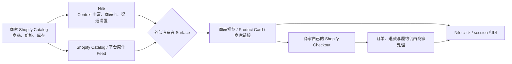

# Nile 的消费者触点与订单闭环：商品究竟出现在哪里

> 核验时间：2026-08-12（Asia/Shanghai）  
> 查询：用户在哪些 Agent 里能够获取 Nile 商家的商品信息？Nile 没有 C 端产品，商家如何得到增量订单？  
> 结论：**Nile 不是消费者购物目的地，而是商家侧的商品 Context、分发编排和点击归因层。消费者留在 ChatGPT、Google AI Mode / Gemini、Perplexity 等外部入口，或广告 / 商品卡片 Surface 中发现商品，再回到商家自己的 Checkout 成交。但目前公开证据只能确认这些平台有购物能力，以及 Nile 声称覆盖它们；不能确认 Nile 已被这些平台正式列为数据源，也不能把现有商家订单证明为因果增量。**

## 一、用户究竟在哪里看到商品

需要把三个命题分开：

1. **该平台有 C 端购物能力**；
2. **Nile 声称可以把商品编译或分发到该平台**；
3. **平台方确认 Nile 是其数据源或集成伙伴**。

截至本次核验，第一个命题在多个平台上成立，第二个命题有 Nile 官网材料支持，第三个命题尚未找到公开证据。

| 消费者 Surface | 平台购物能力 | 平台公开的数据入口 | Nile 的公开状态 | 应如何表述 |
|---|---|---|---|---|
| **ChatGPT** | 已确认：商品推荐、Product Cards 与购物流程 | Shopify Catalog、商家 Feed / ACP；OpenAI 明确 Shopify 商品可自动进入 ChatGPT | Nile 官网点名 ChatGPT，并声称支持 ACP、Context 与 Brand Agent | 用户可以在 ChatGPT 获取商品信息；**不能确认某个商品是由 Nile 独家或直接送入** |
| **Google AI Mode / Gemini** | 已确认：Shopping Graph、商品比较与 UCP 购物流程 | Google Merchant Center、Shopping Graph、UCP | Nile 声称把 SKU 编译为 UCP | 平台购物面已确认；**Nile 到 Google 的正式直连未被 Google 公开确认** |
| **Perplexity** | 已确认：Product Cards、Shop Like a Pro / Instant Buy | Perplexity Merchant Program、Shopify 等平台集成 | Nile 官网点名 Perplexity | 平台购物面已确认；**Perplexity 未公开把 Nile 列为数据源** |
| **Microsoft Copilot** | Shopify 官方把 Copilot 列为 Agentic Storefronts 可达入口 | Shopify Catalog / Agentic Storefronts | Nile 宣传素材出现过 Copilot | 可说 Shopify 商品能进入 Copilot；**不能说 Nile-Copilot 集成已被证明** |
| **品牌官网内 Agent / ChatGPT App** | 取决于品牌自己的部署 | 品牌自有网站、App 或 Agent | Nile Pro / Brand Agent 宣称支持，但当前需 waitlist / 联系销售 | 更像 Enterprise / Pro 交付，不是已开放的 Nile 公共购物 App |
| **Meta、TikTok、Reddit、Pinterest、Snapchat 等** | 有广告、推荐或商品卡片 Surface，但不都应称为购物 Agent | 各平台广告 / Commerce Feed / 商品卡 | Nile 当前或旧版材料把它们列为 paid / contextual distribution Surface | 应理解为可能的广告或商品卡分发，**不能等同于已验证的原生 Agent 集成** |

[OpenAI 的官方说明](https://openai.com/index/powering-product-discovery-in-chatgpt/)尤其重要：Shopify 商品已经通过 Shopify Catalog 接入 ChatGPT，商家不需要为基础上架逐一做额外工作。OpenAI 列出的其他 delivery path 是 Salesforce、Stripe 等，没有点名 Nile。[Shopify](https://www.shopify.com/news/agentic-commerce-momentum)也把 ChatGPT、Microsoft Copilot、Google AI Mode 和 Gemini 描述为 Agentic Storefronts 的消费入口。

Google 的官方路径是 [Merchant Center、Shopping Graph 与 UCP](https://support.google.com/merchants/answer/16837055?hl=en)；Perplexity 的公开路径是其 [Merchant Program / Shopify integration](https://www.perplexity.ai/hub/blog/shop-like-a-pro)。这些资料证明消费者 Surface 真实存在，但都没有公开确认 Nile 是集成伙伴。

因此，对 Nile 最准确的状态标注是：

```text
外部平台的购物能力：verified
Nile 对这些平台的覆盖主张：vendor-claimed
Nile 被平台方确认的正式数据源 / 伙伴身份：not publicly verified
```

当前唯一能强验证的 live integration 是**商家侧 Shopify App**。Nile 没有公开可复现的 ChatGPT App 直链、Claude / Codex Skill 安装物、MCP Endpoint 或 UCP Endpoint；这些能力目前仍是官网产品主张或 Pro / Enterprise 交付描述，而不是公开 C 端产品证据。

## 二、没有 Nile C 端，为什么仍然可能产生订单

因为 Nile 不需要自己拥有消费者 App；它试图占据的是商家供给进入外部消费入口之前的中间层。它更接近“跨平台 Merchant Center + Feed / Context optimizer + Affiliate attribution”，而不是另一个 Amazon。



可能的闭环是：

1. 商家把 Shopify Store 接入 Nile；
2. Nile 读取 Catalog、价格、库存和品牌信息，补充 use case、购买意图、比较维度等机器可读 Context；
3. 商品通过平台原生 Catalog，或 Nile 编排的 AI Search、Chatbot、Product Card、Paid Channel / Brand Agent Surface 被消费者看到；
4. 消费者点击商品或商家链接，回到商家自己的 Shopify Checkout；
5. Nile 通过 referrer、click / session、Web Pixel 与订单权限，把点击和订单关联；
6. 商家继续作为 Merchant of Record 处理支付、履约、退款和客服，Nile 对归因完成的订单收佣金。

这与 [Nile Shopify listing](https://apps.shopify.com/nile) 的公开描述一致：它同时管理 organic AI distribution、AI Search / Chatbot / Product Card 和 paid traffic，并读取会话、订单、退货、Web Pixel 与报告数据。[Nile Pricing](https://nile.app/pricing) 则把计费订单定义为“从 Nile-powered surface 点击进入，并在商家 Checkout 完成”的销售；zero-click exposure 和 assisted view 不收费。[Terms](https://nile.app/terms) 也明确商家保留自己的 Checkout 和 Merchant-of-Record 责任。

所以，**没有 C 端 App 完全不妨碍产生归因订单**。消费者只需在原本使用的 ChatGPT、Google、Perplexity、社交平台或品牌网站中看到商品并点击，Nile 可以作为用户看不见的后台中间层存在。

从需求来源看，当前产品叙事实际混合三条路径：

- **Organic / Enhanced**：平台本来就有 Shopify 商品供给，Nile 尝试通过更好的 Context 提高被理解和被选择的概率；
- **Owned / Direct**：品牌官网内的对话式 Storefront 或品牌 Agent 承接已有站内访客，提高发现与转化；
- **Paid**：Nile 公开 listing 明确包含 paid product ads / paid traffic，以商品卡或广告购买、编排流量。

这三条路径都能产生 Nile-attributed order，但商业含义不同：Organic 才接近“Agent 自然发现”，Owned 可能主要提升转化而非新增流量，Paid 则是买来的流量，不能笼统称为零获客成本。

## 三、但这些订单是否真是 Nile 带来的“增量”

这里必须再拆三层：

```text
点击后成交（attributed）
≠ 订单来源确由 Nile 独立创造（sourced）
≠ 没有 Nile 就不会发生的订单（incremental）
```

公开资料目前只能支持第一层和少量商家自述：

- [Shopify 评论](https://apps.shopify.com/nile/reviews)中，CHESONA 自述 8 单、超过 $500；Backfire Scooters 自述第六天首单；Botslab 自述一个月 10+ 单；
- 这些评论没有披露具体来自 ChatGPT、Google、Perplexity、品牌 Agent 还是 paid product card；
- Nile App 自己把 organic AI 和 paid traffic 混在同一产品中，公开案例也大多只写 aggregate `AI-sourced` 或 `organic AI`；
- Shopify 本来就会把合格商品同步到多个 Agentic Storefronts，因此商家不安装 Nile 也可能获得 AI referral。

Shopify 甚至公开提供 [Global Catalog MCP](https://shopify.dev/docs/agents/catalog/global-catalog)，让兼容 Agent 跨 Shopify 商家搜索商品并获取 seller checkout link。这进一步说明“基础机器可发现性”并不必然来自 Nile。

由此存在三种解释，公开材料尚不能区分：

1. Nile 的 Context 丰富确实提高了商品在 Agent 中被理解、比较和选中的概率，产生真实新增发现；
2. Nile 通过 paid / contextual product cards 买到或编排了新流量；
3. 订单原本会由 Shopify Catalog、品牌需求或其他渠道发生，只是最后一个可见点击被 Nile 归因。

因此目前可以说“商家获得了 Nile-attributed orders”，不能严谨地说“这些都是某个 Agent 经 Nile 带来的增量订单”。

## 四、Nile 当前最可能真正提供的价值

如果把“独家进入 ChatGPT / Gemini / Perplexity”拿掉，Nile 仍可能有四层价值：

1. **Context enrichment**：把普通 SKU Feed 变成适合意图匹配、比较和推荐的商品描述；
2. **Channel compilation**：把一套 Catalog / Policy / Brand Context 转成不同平台可接受的结构；
3. **Ranking 与 Query 测试**：观察哪些意图、商品和表达更容易获得点击与成交；
4. **跨 Surface 归因和 CPS 商业模式**：让商家以结果付费管理 organic 与 paid AI traffic。

真正的战略问题不是“消费者为什么不去 Nile”，而是：

> **在 Shopify 和各大平台已经拥有原生 Catalog 通路时，Nile 是否能证明自己的 Context、Ranking 和分发编排，比基础同步多创造了可测量的净新增订单？**

## 五、最高信息量的验证材料

向 Nile 索要 20–50 条脱敏的行级订单链路：

```text
agent_surface / referrer
→ query / intent
→ impression / product_card
→ Nile click_id / session_id
→ Shopify order_id
→ first_touch / last_touch
→ new_or_returning_customer
→ organic_or_paid
→ settled / refunded
→ Nile fee
```

然后对未启用 Nile 的 SKU、店铺或时间窗口做 holdout。`click_id → order_id` 只能证明点击归因；只有 holdout 中“无 Nile 时净订单 / 净贡献利润显著下降”，才能证明增量性。

## 最终结论

用户最可能在 **ChatGPT、Google AI Mode / Gemini、Perplexity、Microsoft Copilot，以及部分品牌自有 Agent 或商品卡 / 广告 Surface** 中看到相关商品，而不是在 Nile 里购物。

但要加上两个限制：

1. 这些平台的购物能力是真实的，**Nile 到它们的正式供数 / 分发关系尚未获得平台方公开确认**；
2. Nile 的商家评论证明已有归因订单信号，**没有披露订单来自哪个 Agent，也没有 holdout 证明它们是增量订单**。

所以当前最稳妥的产品定位不是“跨所有 Agent 的已验证分发网络”，而是：**位于商家 Catalog 与外部消费入口之间的 Context 优化、渠道编排和点击归因层；其增量分发能力仍是下一阶段需要证明的核心命题。**

## 来源

- [Nile homepage](https://nile.app/)
- [Nile Protocol](https://nile.app/protocol)
- [Nile Shopify App Store listing](https://apps.shopify.com/nile)
- [Nile Pricing](https://nile.app/pricing)
- [Nile Terms](https://nile.app/terms)
- [OpenAI：Powering product discovery in ChatGPT](https://openai.com/index/powering-product-discovery-in-chatgpt/)
- [Agentic Commerce Protocol](https://www.agenticcommerce.dev/)
- [Shopify：Agentic commerce momentum](https://www.shopify.com/news/agentic-commerce-momentum)
- [Shopify：Global Catalog MCP](https://shopify.dev/docs/agents/catalog/global-catalog)
- [Google Merchant Center：AI checkout and UCP](https://support.google.com/merchants/answer/16837055?hl=en)
- [Universal Commerce Protocol](https://ucp.dev/)
- [Perplexity：Shop Like a Pro](https://www.perplexity.ai/hub/blog/shop-like-a-pro)
- [Nile Shopify merchant reviews](https://apps.shopify.com/nile/reviews)
- [nile-current-merchant-value-evidence-2026-08-12](/output/reports/nile-current-merchant-value-evidence-2026-08-12/)
- [nile-agentic-commerce-future-thesis-2026-08-11](/output/reports/nile-agentic-commerce-future-thesis-2026-08-11/)

---
*由 LLM 基于知识库既有研究与 2026-08-12 公开网页核验生成*
