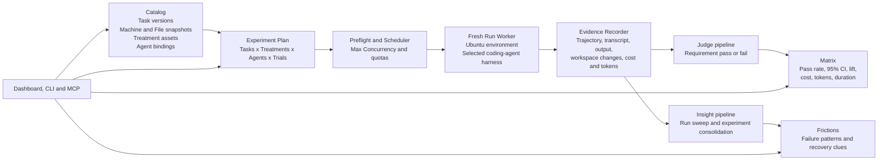

# Oqoqo eval 平台实现原理与证据边界

> 生成时间：2026-08-11
> 查询：[Oqoqo](https://docs.oqoqo.ai/introduction) 说自己可以快速搭建 evals，它实际上是如何实现的？

## 摘要

Oqoqo 不是一个新的评分算法，也不只是“让 LLM 生成 rubric”的 eval authoring 工具。它更准确的定位是：**面向 coding agents 的托管实验控制平面**。

它把一次评测编译为：

```text
Task（任务、rubric、文件、机器）
× Treatment（baseline 或挂载 Skill / MCP / CLI / SDK）
× Agent（harness、model、effort）
× Trials（同条件重复次数）
→ fresh cloud Runs
→ trajectory / output / workspace changes / metrics
→ judge-based Evals + trace-based Insights
→ pass rate / lift / Frictions
```

“快速搭建”是真实的，但快的主要是 **实验基础设施**：版本化对象、环境快照、真实 Agent adapter、笛卡尔积展开、并发调度、轨迹采集、异步评分、结果聚合和 Dashboard / CLI / MCP 操作面。它并没有自动解决 rubric 是否正确、LLM judge 是否与人一致、样本量是否充分、底层隔离是否可信等问题。

截至 2026-08-11，公开证据可以证明产品协议和客户端实现，但不能证明核心后端：唯一非 fork 的官方公开仓库是生成的 Agent Plugin；其发行验证脚本明确把 `Oqoqo-Inc/oqo-bench` 称为 private source repository。底层 runner、scheduler、storage 和 judge prompt 均不可审计。因此最准确的判断是：**实验编排机制成立，evaluator 可信度与基础设施安全仍待验证。**

## 一、它真正解决的问题

普通团队自己搭 coding-agent eval，至少要搭七块东西：

1. 任务集与验收标准；
2. 可复现的 repo、依赖、服务和 secrets 环境；
3. Codex、Claude Code、Cursor 等不同 Agent harness 的启动 adapter；
4. 多任务、多 Treatment、多模型、多次重复的调度；
5. tool calls、commands、文件变化、tokens 和最终输出的采集；
6. grader、失败分析、统计聚合；
7. 结果保存、比较、复跑和自动化接口。

知识库对 benchmark 的定义是“任务集 + 运行协议 + grader + metric”；Agent eval 测的也不是裸模型，而是 `模型 × harness × tools × context × budget × environment × grader`。参见 [llm-benchmark-landscape-and-model-card-guide-2026-07-23](/output/reports/llm-benchmark-landscape-and-model-card-guide-2026-07-23/)。Oqoqo 的产品价值就是把这套 harness 托管掉，而不是发明一类新 benchmark。

## 二、最核心的对象模型

Oqoqo 最有价值的设计不是 UI，而是把评测变量分进不同对象，避免实验时混在一起。

| 对象 | 实际含义 | 为什么这样拆 |
|---|---|---|
| Project | tasks、files、machines、treatments、assets、agents、experiments 的工作区 | 多个实验共享版本化 catalog |
| Task | instructions + rubric + files + machine | 固定“要做什么”和起始环境 |
| Treatment | raw-agent baseline，或附加 Skill / MCP / CLI / SDK 的条件 | 只改变被测接口，测 treatment lift |
| Agent | 具体 coding harness + model + effort | 把 Agent / 模型作为独立实验维度 |
| Experiment | 已启动的 Task × Treatment × Agent × Trials 比较 | 把配置编译成批量 Runs |
| Trial / Run | 同一组合的一次独立尝试 | 用重复运行对抗 Agent 非确定性 |
| Eval | judge 对 rubric requirement 的逐条 pass / fail | 回答“结果是否达标” |
| Insight | 对 trajectory / output 的失败分析 | 回答“Agent 卡在哪里” |
| Matrix | pass rate、lift、cost、tokens、duration | 比较质量与成本 |
| Friction | retry、错误、绕路、缺 context、token waste 等阻塞点 | 把 trace 压缩成可修复问题 |

官方最重要的 attachment rule 是：

- Files、Machine 属于 Task；
- Skills、MCP servers、CLIs、SDKs 属于 Treatment；
- Agent 在 launch 时选择；
- 同一 Task 的不同 Treatment 共用同一份起始文件和机器快照。

这实际上是一个受控实验设计：**固定 task/environment，只改变 treatment**。它比把 prompt、工具、repo 和模型一起改完再比总分更可信。[Core concepts](https://docs.oqoqo.ai/core-concepts)、[Treatments](https://docs.oqoqo.ai/experiments/treatments)

## 三、一次 Experiment 如何执行

### 3.1 Authoring：把真实工作编译成 Task

用户先定义：

- instructions：一个有能力但不熟悉产品的工程师应完成什么；
- rubric：若干可二元判断的 requirement；
- files：repo、fixture、样例数据；
- machine：Ubuntu 环境中的 packages、services、variables。

Rubric 可以让 Oqoqo AI 生成草稿，但官方明确要求人工 review 后接受；这一步只是 authoring assistance，不是自动得到 ground truth。[Tasks and rubrics](https://docs.oqoqo.ai/experiments/defining-experiments)

文件可上传，也可从公开 GitHub URL 导入；GitHub 内容按解析出的 commit 做 snapshot。Task / rubric 和 Skills 等 assets 有版本，past experiment 继续指向启动时的版本。

### 3.2 Treatment：把“要验证的改动”独立出来

典型实验至少有两组：

```text
Baseline  = raw Agent
Treatment = same Agent + Skill / MCP / CLI / SDK
```

例如测试一个 Stripe MCP 是否真的比 CLI 更容易被 Agent 使用，不应给两组不同 repo 或机器；应让它们在同一 Task snapshot 上，只切换 interface asset。这也是 Oqoqo 特别适合“Agent 能否正确使用我的 headless 产品接口”而非任意通用 eval 的原因。[Skills, MCP servers, CLIs, and SDKs](https://docs.oqoqo.ai/experiments/assets)

### 3.3 Planning：展开实验笛卡尔积

Launch 时选择 tasks、treatments、agents、trials：

```text
run_count = tasks × treatments × agents × trials
```

`Max Concurrency` 控制同时活跃的 Agent sessions；Eval 和 Insight 后处理有独立的系统并发限制。CLI 提供 `preflight → launch → watch/status → cancel`，说明服务端把 launch plan、capacity check 与 durable execution lifecycle 分离。[Launch options](https://docs.oqoqo.ai/experiments/launch-options)、[CLI](https://docs.oqoqo.ai/operate/cli)

公开 CLI contract 还给出了几个真实工程约束：单个 plan 最多选择 100 个 Task versions、100 个 Treatments、100 个 Agent bindings，`trialCount` 最大为 20；`launchAttemptId` 让完全相同的重试收敛，而同一 attempt ID 下修改 plan 会产生 conflict。这说明 launch 不是一次无状态 HTTP 调用，而是有显式幂等键和版本 revision 的服务端 operation。

### 3.4 Runner：每次从 fresh environment 开始

启动时，Oqoqo 固化所选 Task 的 machine 和 files。每个 Run 获得一份 fresh Ubuntu machine，Run 之间不继承状态；随后注入 Treatment assets，并启动选定的 Codex、Claude Code、Cursor、GitHub Copilot、OpenCode、OpenClaw、Pi 或 Hermes harness。

官方 [Methodology](https://oqoqo.ai/methodology) 将其称为 fresh isolated sandbox，并给出 `provision from container image → inject test credentials → install Skill → connect MCP → Agent session → capture artifacts → destroy sandbox` 的生命周期。不过该图明确标记为 `Illustrative`；因此可以确认产品承诺的 isolation / clean-state / teardown 语义，不能确认实际 provider、container / VM 边界、egress policy、tenant isolation 或 snapshot implementation。下图中的 `Run Worker / Scheduler` 仍是基于公开 contract 的高置信架构还原，不是已开源源码事实。[Machines and files](https://docs.oqoqo.ai/experiments/machines-and-files)、[Supported agents](https://docs.oqoqo.ai/setup/agents)

### 3.5 Recorder：把运行变成可重放证据

每个 Run 保存：

- tool calls 与结果；
- shell commands；
- 读取和修改的文件；
- final assistant message；
- recorded workspace changes；
- step、tool-call、token、cost、duration；
- 可导出的 `.jsonl` / `.json` / `.txt` transcript。

这一步很关键：执行记录一旦完成就被冻结，之后可以不重跑 Agent、只重新执行 Eval 或 Insight。执行与评分解耦，避免 grader 改动强迫重新消耗一次昂贵 Agent run。[Traces and output](https://docs.oqoqo.ai/evaluation/traces)

### 3.6 Post-processing：Judge 与 Friction 分成两条管线

Oqoqo 将完成后的 Run 交给两套独立 AI role：

1. **Run Evals**：judge model 对每条 rubric requirement 输出 pass / fail 和理由；
2. **Run Insights**：分析单个 Run 的 trace / output，找 retry、卡点、错误、长绕路、token waste；
3. **Experiment Insights**：再把各 Run findings 合成 experiment-level Frictions。

公开 CLI `2026.08.10.2` 的静态 schema 进一步暴露了内部 role key：`judge`、`sweep`、`consolidation`，与官方文档里的 Run evals、Run insights、Experiment insights 一一对应。这支持如下后处理结构：

```text
Recorded Run ── judge ──────────────→ requirement verdicts
             └─ sweep ──────────────→ per-run frictions
All run frictions ─ consolidation ──→ experiment frictions
```

但这只证明 orchestration contract，不公开 judge prompt、长轨迹 evidence packing、structured-output recovery 或模型失败重试策略。[Oqoqo AI features](https://docs.oqoqo.ai/setup/oqoqo-ai)、[Evals and Insights](https://docs.oqoqo.ai/evaluation/evals-and-insights)

Methodology 补充了评分协议：evaluator 读取 trajectory 中的 steps、tool calls、outputs 以及 changed files，为每条 requirement 生成 verdict、reason 和引用到 Run 的 citation；只有全部 requirements 通过，整个 Task Run 才算 pass。这个 all-pass 聚合规则是明确的，但长轨迹如何裁剪、evidence 如何打包、citation 如何校验仍未公开。

## 四、完整架构还原



### 哪些是明确事实，哪些是推断

| 层 | 证据状态 |
|---|---|
| Task / Treatment / Agent / Trial 对象与 attachment rule | 官方文档明确 |
| task、rubric、asset versioning 与 launch snapshot | 官方文档明确 |
| fresh isolated sandbox、每 Run clean state、结束后销毁 | 官方方法页明确；container lifecycle 图为 illustrative |
| 真实 coding-agent execution 与完整 trajectory / workspace output | 官方文档明确 |
| judge、run insight、experiment insight 三个 AI roles | 官方文档明确；CLI role key 静态证据补强 |
| MCP / CLI / Dashboard 共用产品能力；secrets 留在 Web | 官方文档和公开 plugin manifest 明确 |
| 版本化 catalog → planner → scheduler → worker → async post-processing | 从公开 contract 做的高置信架构推断 |
| VM / container 类型、队列、数据库、对象存储、重试、租户隔离 | 未披露，不能确认 |

## 五、“快速搭建”究竟快在哪里

| 加速点 | Oqoqo 做了什么 | 用户仍必须负责什么 |
|---|---|---|
| Eval authoring | template + AI rubric draft | 定义真实任务和可判定标准 |
| Fixture | 文件、Git commit、机器和依赖快照 | 准备无泄漏、可合法上传的数据 |
| Agent matrix | 统一多种 coding-agent harness 和 model / effort | 决定公平的 budget 和版本 |
| Treatment A/B | baseline 与 Skill / MCP / CLI / SDK 分离 | 保证一次只改变目标变量 |
| Scale | 自动展开 runs、并发执行、watch/cancel | 选择足够 trials，控制 provider rate limits |
| Observability | 自动记录 trajectory、workspace changes、tokens 和成本 | 判断哪些证据真正对应业务 outcome |
| Scoring | 自然语言 judge 逐条 pass/fail | 校准 judge，补 deterministic checks / human labels |
| Diagnosis | 从 traces 生成 Frictions | 人工确认它是不是因果，而非表面相关 |
| Repeatability | 版本与 snapshot，clone/relaunch，re-trigger grader | 防数据污染、版本漂移和 hindsight rubric |
| Automation | Dashboard + JSON CLI + OAuth MCP | 自己接 CI；当前无一等 CI gate / Schedule |

因此，Oqoqo 的真实技术壁垒候选不是 rubric generation，而是：

1. 不同 coding-agent harness 的统一运行 adapter；
2. 可复现的 machine / file / asset snapshot；
3. 高并发、可取消、可追踪的托管 experiment lifecycle；
4. 全轨迹 evidence model；
5. 从 interface treatment 到 pass-rate lift / friction 的闭环。

这些都属于 Harness Engineering，不属于新的 evaluator 算法。

## 六、评分与统计到底有多可信

### 做对了什么

1. **Generator 与 evaluator 分开**：实际执行 Agent 和 judge model 是不同角色，符合 [self-verification](/wiki/concepts/self-verification/) 的基本原则。
2. **逐 requirement 判定**：避免只给一个模糊总分，至少能定位失败标准。
3. **重复运行**：承认 Agent 非确定性，用 Trials 估计 pass rate。
4. **展示 95% confidence interval**：比单点 pass rate 更诚实。
5. **记录 lift、成本、tokens、duration**：不只比较“过没过”，也比较代价。
6. **执行与重新评分解耦**：可以固定原始证据，更换 rubric / judge 后复评。

### 当前最硬的缺口

1. **官方明确说 Eval 是 judge-based，不是 deterministic checker。** 没有公开的 unit test、exit-code、state assertion、schema validator、visual diff 等 grader 层。
2. **没有公开 human calibration。** 未披露人工 gold labels、judge-human agreement、混淆矩阵或 drift monitoring。相比 [latitude-llm-source-analysis-2026-06](/output/reports/latitude-llm-source-analysis-2026-06/) 的 human-aligned eval，Oqoqo 公开层只证明 judge orchestration。
3. **All-pass 很清晰，但很刚性。** 一个 requirement 失败即整个 Task 失败；当前没有公开 requirement weighting、partial credit 或分层 severity 协议。
4. **统计方法未披露。** 有 95% CI 和 raw lift，但未说明 Wilson / Clopper-Pearson / bootstrap、paired design、significance test 或 multiple-comparison correction。
5. **两次 Trial 只是 smoke signal。** 官方 Quickstart 倾向从两次开始，但这不足以支撑强产品结论；样本量必须按 base rate、目标 lift 和成本另算。
6. **Friction 不是因果。** LLM 看到 retry 或绕路只能提出 failure hypothesis；没有 replay、canary、rollback 和 outcome comparison，不能证明改动解决了根因。参见 [agnost-ai-product-analysis-2026-07-17](/output/reports/agnost-ai-product-analysis-2026-07-17/)。
7. **评分证据仍不可完全审计。** 官方说 judge 读取 trajectory 与 changed files，但没有披露长 context 的裁剪、evidence packing、temperature、parser / retry 和 citation validation。

官方 Methodology 自己也承认 evaluator 是 model、可能判错；reason 和 citation 只是让人工复核更容易，不会消除风险。[Methodology — Limitations](https://oqoqo.ai/methodology#limitations)

所以在可信度上，应把它看成：

```text
实验执行与记录：较强
自然语言 outcome review：可用，但需校准
确定性 correctness verification：公开层缺失
高风险 benchmark / release gate：尚不足
```

## 七、公开源码审计：核心实现并未开源

### 7.1 唯一公开产品仓库是生成的 plugin 壳

截至本次核验，`Oqoqo-Inc` 的官方 GitHub 组织有多个第三方项目 fork，唯一非 fork 的 Oqoqo 产品仓是 [agent-plugin](https://github.com/Oqoqo-Inc/agent-plugin)。当前 main：

- commit：[`40872ae`](https://github.com/Oqoqo-Inc/agent-plugin/commit/40872aeecf0e0c40a05c2e81eafb77ce97076949)
- plugin version：`1.1.2`
- release commit：`2026-08-10T03:35:10Z`
- commit provenance：`Oqoqo-Inc/oqo-bench@782f4c78f22933afeccbd74fbcd1b116b139f83f`

仓库只有 plugin manifests、logo 和 release validator；`.mcp.json` 把宿主连接到：

- workspace MCP：`https://mcp.oqoqo.ai/mcp`
- docs MCP：`https://docs.oqoqo.ai/mcp`

它不包含 web app、API、experiment planner、runner、database 或 evaluator 源码。[Plugin README](https://github.com/Oqoqo-Inc/agent-plugin/blob/40872aeecf0e0c40a05c2e81eafb77ce97076949/README.md)、[MCP manifest](https://github.com/Oqoqo-Inc/agent-plugin/blob/40872aeecf0e0c40a05c2e81eafb77ce97076949/plugins/oqoqo/mcp.json)

### 7.2 官方 validator 明确承认 private source repository

公开仓自己的发行检查器会扫描发布物，禁止其中出现 `Oqoqo-Inc/oqo-bench`，错误信息就是 `exposes the private source repository`。[validate-release.mjs L151-L169](https://github.com/Oqoqo-Inc/agent-plugin/blob/40872aeecf0e0c40a05c2e81eafb77ce97076949/scripts/validate-release.mjs#L151-L169)

这给出了比“没有搜到 repo”更强的证据：核心仓不是暂时遗漏，而是有意保持私有。

### 7.3 CLI 能证明客户端 contract，不能证明服务端栈

官方 installer 当前指向 stable CLI `2026.08.10.2`：

- releasedAt：`2026-08-10T15:34:48.988Z`
- darwin-arm64 size：`58,751,856` bytes
- sha256：`774b4eb89f5aa877548e43ed7aef6f409131ac589f513a8211a3db911a296455`
- 静态识别：Bun `1.3.7` compiled JavaScript / TypeScript client，Zod contract，WorkOS device OAuth

CLI 暴露版本化 resource IDs、launch plan、run trajectory、eval / insight artifacts 和 `judge / sweep / consolidation` model-role bindings，说明其客户端 contract 相当完整。但 Bun、Zod、WorkOS 只属于 CLI / auth surface，不能被外推为后端 runner 的技术栈。[Installer](https://oqoqo.ai/install)、[CLI release manifest](https://storage.googleapis.com/oqoqo-core-production-cli-releases/latest.json)

其 schema 还证明 Run evidence 不只是总分：结果绑定 `taskVersionId`、treatment、agent / model / effort、trial ordinal、token / cost / tool-call metrics，并带 isolation 的 `mode / reasons / cleanup / contaminated / adapterVersions`；trajectory 按 ordinal 分页，transcript 以 byte range 返回并附 `sha256`。这是一个相当认真、可归因的 evidence contract，但仍是客户端与 API 的数据契约，不是后端实现证明。

Installer 还直接打印 `Private preview`，说明当前仍处快速开发期；这与 custom agents、Plugins、Schedules、first-class CI gate 尚未上线相符。

## 八、产品边界与适用场景

### 很适合

- 比较一个 Skill、MCP、CLI、SDK 是否让 Agent 更容易完成真实开发任务；
- 同任务下比较 Codex / Claude Code / Cursor 或不同模型与 effort；
- 固定 task set 做 interface regression；
- 观察质量、tokens、成本、时长和失败轨迹的 trade-off；
- 用 CLI / MCP 让 coding agent 直接创建和分析实验。

### 不应直接当成完整答案

- 需要确定性 correctness 的 release gate；
- 法律、金融、安全等高风险 grader；
- 需要人工盲评 / pairwise preference 的体验 eval；
- 需要 production traffic 自动挖 unknown failures 的 observability；
- 需要自托管、可审计 tenant isolation / egress / deletion 的企业内网场景；
- 任意自定义 Agent harness——官方 custom agent 当前仍是 coming soon。

### 最稳妥的组合方式

对于严肃产品，应将 Oqoqo 放在外层做 experiment orchestration，再补三层 evaluator：

```text
Layer 1: deterministic checks
         tests / exit code / state assertion / schema / visual diff
Layer 2: objective measurements
         latency / cost / tokens / retries / human edits / task outcome
Layer 3: model or human judgment
         rubric judge / blind pairwise / expert review
```

自然语言 rubric 可以覆盖难以形式化的产品质量，但不能取代可执行 verifier。知识库 [self-verification](/wiki/concepts/self-verification/) 同样建议先跑确定性 tests，再叠加 LLM 高层审查。

## 九、最终判断

### 产品机制

**成立，而且比“eval prompt builder”更扎实。** 它把最麻烦的真实 Agent eval 工程——环境、harness、实验矩阵、重复运行、全轨迹、复评和可视化——包装成统一平台。

### 技术创新

- **工程产品化：中高。** Task / Treatment / Agent 的变量拆分、snapshot 和 execution / grading 解耦是正确设计。
- **算法创新：低或未证明。** 公开层的 evaluator 是普通 LLM judge + trace insight，没有公开 human alignment、deterministic verifier 或新评分算法。
- **基础设施壁垒：可能存在，但无法审计。** 如果它能稳定地运行多种 coding-agent harness、低成本创建 fresh machines 并完整捕获 workspace evidence，这会有工程价值；私有 backend 使可靠性、隔离和成本优势尚无法确认。

### 一句话结论

> Oqoqo 的“快速搭 eval”本质是把 **Agent 任务定义、受控 Treatment、托管 fresh-run 执行、全轨迹记录和 LLM 后评估** 编译成一条 SaaS 实验流水线；它加速的是 eval harness，不是自动制造可信 ground truth。

## 数据来源

### Oqoqo 官方

- [What is Oqoqo](https://docs.oqoqo.ai/introduction)
- [Methodology](https://oqoqo.ai/methodology)
- [Core concepts](https://docs.oqoqo.ai/core-concepts)
- [Tasks and rubrics](https://docs.oqoqo.ai/experiments/defining-experiments)
- [Machines and files](https://docs.oqoqo.ai/experiments/machines-and-files)
- [Treatments](https://docs.oqoqo.ai/experiments/treatments)
- [Launch options](https://docs.oqoqo.ai/experiments/launch-options)
- [Reading results](https://docs.oqoqo.ai/evaluation/runs-and-trials)
- [Evals and Insights](https://docs.oqoqo.ai/evaluation/evals-and-insights)
- [Traces and output](https://docs.oqoqo.ai/evaluation/traces)
- [Oqoqo AI features](https://docs.oqoqo.ai/setup/oqoqo-ai)
- [CLI](https://docs.oqoqo.ai/operate/cli)
- [MCP](https://docs.oqoqo.ai/operate/mcp)
- [Oqoqo-Inc/agent-plugin](https://github.com/Oqoqo-Inc/agent-plugin/tree/40872aeecf0e0c40a05c2e81eafb77ce97076949)
- [CLI installer](https://oqoqo.ai/install)
- [CLI release manifest](https://storage.googleapis.com/oqoqo-core-production-cli-releases/latest.json)

### 知识库对照

- [llm-benchmark-landscape-and-model-card-guide-2026-07-23](/output/reports/llm-benchmark-landscape-and-model-card-guide-2026-07-23/)
- [self-verification](/wiki/concepts/self-verification/)
- [latitude-llm-source-analysis-2026-06](/output/reports/latitude-llm-source-analysis-2026-06/)
- [agnost-ai-product-analysis-2026-07-17](/output/reports/agnost-ai-product-analysis-2026-07-17/)
- [agentic-trajectory-data](/wiki/concepts/agentic-trajectory-data/)
- [agent-test-sets](/raw/articles/learning-notes/agent-test-sets/)

---
*由 LLM 从知识库查询生成*
