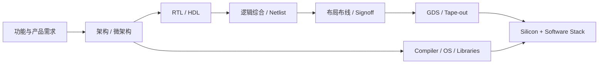

<!--
date: 2026-08-03
type: query
status: complete
tags: [qimeng, chip-design, eda, risc-v, llm, agent, hardware-software-codesign]
-->

# QIMENG 全自动处理器芯片设计论文学习与证据审计

> 生成时间：2026-08-03
> 查询：和用户一起学习 arXiv:2506.05007《QiMeng: Fully Automated Hardware and Software Design for Processor Chip》
> 论文版本：arXiv v1，2025-06-05 提交，cs.AR / cs.LG
> 来源边界：正文判断以该 v1 论文为准；官方项目站的后续组件只用于核验 artifact，不反向改写论文提交时的完成状态。

## 摘要

QIMENG 不是一颗名叫“启蒙”的芯片，也不是一套已经完整跑通的统一 Agent。它更准确地说是：**把处理器前端、HDL、OS、编译器、tensor transcompiler 和高性能算子纳入同一三层架构的研究纲领与建设路线图**。

论文最值得学习的机制，是把自动芯片设计写成两个嵌套闭环：

- 内环用 simulator、testbench、SMT、formal/functional verification 做 `generate → verify → repair`，约束功能正确性；
- 外环用真实 PPA 或软件性能测量做 `decompose/search → measure → prune → optimize`，寻找更优方案。

最重要的证据边界也由论文自己给出：当前仍处于三阶段路线的第一阶段；QiMeng-CPU-v1/v2 当时都未使用 LPCM；完整 LPCM、Hardware/Software Design Agent、bottom-up 重构和自演化循环仍是 future work。因此，标题中的 “Fully Automated” 应理解为**目标系统与研究方向**，不能理解为已经完成了“自然语言需求 → 可流片芯片 → OS/编译器/算子库”的统一端到端验收。

## 1. 先消除一个名称误解

“QiMeng / 启蒙”指的是一套系统框架和项目族，不是单一芯片产品。

| 层 | 目标输入 | 目标输出 | 核心机制 | 论文时状态 |
|---|---|---|---|---|
| LPCM | 文本需求、规格图、AST/DFG/CFG 等 | 软硬件代码、架构/电路/layout 图 | text-graph 多模态、跨阶段训练、反馈式推理 | 完整模型未给出实证 |
| Hardware Design Agent | 高层功能规格 | 模块、HDL、netlist/layout 等硬件设计 | 性能驱动模块分解外环 + 验证修复内环 | 已有组件，未完成统一 Agent |
| Software Design Agent | 原始代码仓库、目标 ISA/硬件 | 已适配且优化的软件仓库 | LLM-guided performance search + neural-symbolic repair | 已有组件，未完成统一 Agent |
| 顶层应用 | 具体任务 | CPU 前端、RTL、kernel config、backend、tensor code、算子 | 调用上述局部能力 | 六类应用已有实验 |

论文 Figure 1 的“底层 → 中层 → 顶层”描述的是理想运行依赖；现实建设顺序恰好相反：先用通用模型和专用工具做应用，积累数据和 Agent 组件，再训练 LPCM、重构 Agent，最后形成自演化循环（Sec. II，PDF pp.3–4）。

## 2. 它想解决什么问题

传统处理器设计大致经历：



QIMENG 认为现有 EDA/自动化有三类结构性边界：只能接受精确形式化输入；只自动化局部步骤；硬件与基础软件的跨阶段协同不足。把 LLM/Agent 引入后，又出现四个专门难题：

| 难题 | QIMENG 的回答 |
|---|---|
| 图结构知识与顺序文本存在 representation gap | LPCM 同时处理 text 与 graph embedding |
| 芯片领域尤其是跨阶段对齐数据稀缺 | 先训练单阶段模型，再级联合成跨阶段数据 |
| 概率模型不能提供芯片所需的正确性 | 把验证器、模拟器和符号求解器放入推理内环 |
| CPU/软件优化空间巨大 | 层次分解、MCTS/tree search、真实性能反馈与剪枝 |

这里最重要的思想不是“让 LLM 记住更多 Verilog”，而是：**模型只负责提出候选与搜索先验，外部工具负责给出可执行反馈与验收证据。** 这和知识库中的 [agent-loop](/wiki/concepts/agent-loop/)、[tool-routing](/wiki/concepts/tool-routing/)、[agentic-trajectory-data](/wiki/concepts/agentic-trajectory-data/) 是同一种 Harness 逻辑。

## 3. 三个核心机制

### 3.1 LPCM：Text–Graph 多模态只是目标设计，尚非已验收模型

LPCM（Large Processor Chip Model）计划同时处理：

- 文本：自然语言需求、软件代码、HDL；
- 图：AST、数据流/控制流、状态迁移、电路图与 layout。

图输入可以被序列化为文本，但会损失拓扑邻近关系；论文因此提出用 GNN 编码 graph embedding，再用 contrastive learning 对齐 text embedding。图输出则可先生成 embedding，再交给专门的 graph generator，或在电路场景使用 BDD/BSD 表示（Sec. III-A，pp.5–6）。

训练设想是：分别收集高性能库、OS kernel、compiler tool-chain、逻辑、电路和物理设计等单阶段数据；训练单阶段模型并级联生成跨阶段对齐轨迹；把轨迹组成 `(input, CoT, output)`，结合 distribution alignment、curriculum learning、unit-test reward 和 RL 训练 LPCM（Sec. III-B，p.6）。

但这一节大量使用 `can / should / once constructed / will`。论文没有给出完整 LPCM 的 base model、参数量、graph encoder、训练数据规模、训练成本、checkpoint、统一 benchmark 或消融。对应的独立 LPCM 论文也只实证了 Level 1 的 3D Gaussian Splatting 案例，把 Agent-Orchestrated / Model-Governed 留作路线图。

### 3.2 Hardware Design Agent：性能分解外环 + 功能验证内环

外环从未分解设计开始，让 LPCM 提出不同模块分解方案，测量性能并剪掉低 PPA 分支；叶节点代表完整分解方案，评估结果再回写知识库。

内环根据模块规格生成 HDL，再转换为 BSD，使用 truth-table 抽样、simulator、错误定位与 Shannon expansion 反复修复。该机制能让已观测样本上的正确性单调提高，并对未知输入建立概率界，但不等于对完整 CPU 状态空间、所有 ISA 行为和所有物理 signoff 项提供普遍形式证明（Sec. IV-A，pp.7–8）。

### 3.3 Software Design Agent：性能搜索外环 + neural-symbolic 修复内环

外环以原始代码为根，用 LLM 的领域先验引导 MCTS，结合真实运行性能做 `observe → prune → optimize → evaluate`。

内环让 LLM 采样 program sketch，用 unit tests 与 execution trace 定位最小错误片段，再用 Z3/SMT/program synthesis 修复，形成 `generate → verify → repair`。分工是：LLM 负责灵活的高层骨架，符号方法负责局部精确性（Sec. IV-B，pp.9–10）。

这说明完整 Agent 不是 LPCM 本身，而是：

```text
领域模型 + 任务状态 + 搜索策略 + 工具路由 + verifier/oracle + 性能测量 + 失败恢复
```

## 4. 已完成应用：逐项看输入、输出和证据

### 4.1 QiMeng-CPU-v1 / v2：最硬的硬件证据，但不是 LPCM 成果

| 项目 | 已提交的具体 artifact | 论文结果 | 关键边界 |
|---|---|---|---|
| CPU-v1 / Enlightenment-1 | 从 RISC-V 输入输出样本学习出的 BSD CPU core，转 Verilog 后进入传统后端 | 约 4M gates；生成约 5 小时；65nm、300MHz 流片；运行 Linux 5.15、SPEC CINT2000、Dhrystone；Dhrystone 点位约等于 80486SX | 生成使用 68 台双 Xeon 服务器；5 小时不等于完整 spec、验证、physical design、fab 周期；商业 EDA 和传统后端仍存在；未使用 LPCM |
| CPU-v2 | State-BSD 自动学习 data-dependency/value predictor，将单周期 CPU 扩展为 superscalar 风格 | 约 17M gates；FPGA/仿真验证；主论文报告 6.29M Dhrystone/s、约为 v1 的 380×，称接近 Cortex-A53 | 主 QIMENG 论文未报告完成流片；比较未统一工艺、频率、compiler、cache/memory、面积与功耗；未使用 LPCM |

CPU-v1 是论文组合中最强的 empirical evidence：它确实流片并跑起 Linux。但机器自动生成的是 CPU core 前端 Boolean logic；BSD 转 Verilog 后仍使用商业 EDA、65nm 物理设计和制造流程，外设、oracle、测试、约束和系统集成也不能从“5 小时”里自动推导为零人工。

CPU-v2 的真正增量是自动生成高精度依赖预测器，而不是从自然语言重新发明一颗完整现代乱序 CPU。单一 Dhrystone 点位“接近 A53”也不能推导出同工艺 PPA、生态或工业可替代性。

### 4.2 CodeV / CodeV-R1：模块级 HDL 生成

CodeV 用现有 HDL 逐层摘要，合成约 180k 组自然语言—代码样本；CodeV-All 扩展到 Verilog/Chisel、Chat/FIM；CodeV-R1 再加入 testbench、round-trip synthesis 和 RL。

主论文 Table II 的代表结果包括：CodeV-Verilog-QC 在 VerilogEval-Machine 上 pass@1 为 80.1%；CodeV-R1 在旧 RTLLM 表上的 Func 为 86.1%。Table III 的新版任务中，CodeV-R1 pass@1 为 68.8%（Specification-to-RTL）、69.9%（Code Completion）和 68.0%（RTLLM v2）。它只在 RTLLM v2 的该口径超过 DeepSeek-R1-671B，在两个 VerilogEval v2 任务上仍落后。

这证明 7B 领域模型在模块级 HDL benchmark 上有效，不证明从自然语言到复杂 SoC、EDA signoff 或流片的端到端正确性。正文还称新版结果为 68.6% / 72.9%，与 Table III 不一致。

### 4.3 AutoOS：自动搜索 kernel config，不是生成操作系统

AutoOS 输入现有 OS、目标机器和约 15,000 个 kernel options，输出性能更好的 kernel configuration。Table IV 在三个 UnixBench 场景报告：

- PolyOS / SiFive Unmatched：相对 default `+8.4%`；
- Fedora / SiFive Unmatched：`+25.6%`；
- Ubuntu / PC：`+9.0%`。

这是任务级自动闭环，不是自动写出 OS。正文称超过 manual expert optimization，但表中可见基线是 `Default`，没有单列 hand-tuned expert；也没有方差、重复次数、搜索 token/测量成本和 boot failure 分布。

### 4.4 Compiler tool-chain：两个 prototype，不是完整优化编译器

- ComBack + VEGA：针对 LLVM backend 生成目标处理器代码，正文给出 `>70%` accuracy，并用 confidence 标出仍需人工修订的区域；
- neural compiler：以 C → assembly 为例，在 ExeBench 给出 `>99%` translation accuracy，并称可编译 AnsiBench/CoreMark。

论文没有展开 denominator、完整语言语义、ABI、链接、debug info 和优化质量。正文也把同时完成 translation 与 optimization 的 end-to-end compiler 明确写成长期目标。

### 4.5 QiMeng-Xpiler：最清楚的 neural-symbolic 软件闭环

Xpiler 在 CUDA C、BANG C、HIP、C with VNNI 间转换 tensor program：LLM 生成 transformation sketch，symbolic synthesis 修复低层代码，MCTS 搜索 pass 顺序和参数。

Table V 的 12 个方向中，Compilation Accuracy 为 99.4%–100%；真正执行结果正确的 Computation Accuracy 为 86.9%–100%，平均约 95.4%。这比把“能编译”当“正确”严谨，但也直接说明当前 repair loop 尚未普遍保证语义等价。

### 4.6 GEMM / TensorOp / Attention：有强点位，但不能概括成普遍超过人工库

| 组件 | 强结果 | 表中反例 / 边界 |
|---|---|---|
| QiMeng-GEMM | C910 为 OpenBLAS 的 1.97–2.11×；RTX 4070 为 cuBLAS 的 1.04–1.11× | A100 三个尺寸只有 cuBLAS 的 0.77–0.96× |
| QiMeng-TensorOp | K1 GEMM 为 OpenBLAS 的 2.31–2.47×；部分 A76 Conv 为 1.18–2.22× | A100 GEMM 有 0.98×，Conv 有 0.92×；并非稳定超过 cuBLAS/cuDNN |
| QiMeng-Attention | T4、RTX8000 的固定配置优于表内实现 | A100 三个 case 均低于 FlashAttention-v2；3.04–8.06× 的显著倍率是相对较慢的 DeepSeek-V3 PyTorch implementation，不是最强 baseline |

正文中的 `251% / 115% / 124%` 等 “up to” 数值不能全部从展示表格直接复核。表中 shape 很少，也未给 error bars、生成成功率、搜索预算、数值精度或完整模型 workload。

## 5. 实现状态分层

| 证据层 | 当前可接受的结论 | 不能外推的结论 |
|---|---|---|
| A：Silicon / 真实运行 | CPU-v1 的 BSD 前端确有 65nm 流片，并运行 Linux/benchmark | 完整 QIMENG 或 LPCM 已经流片；同节点 PPA 超过人工 CPU |
| B：组件 benchmark | CodeV、AutoOS、Xpiler、GEMM/TensorOp/Attention 在各自任务有有效结果 | 同一系统已完成跨阶段硬软协同 |
| C：Agent 组件 | 若干项目实现 correctness/performance feedback loop | 完整 Hardware/Software Design Agent 已集成 |
| D：系统路线图 | 三层架构、top-down → bottom-up → iteration 是清晰研究计划 | LPCM 已训练、统一端到端闭环或 self-evolution 已成立 |

论文在 p.11 明确写明 CPU-v1/v2 当时都 `operate without utilizing LPCM`；pp.17–18 又把完整 Hardware Agent、从 functional specification 到 transistor-level implementation 写成 future work。这两处是判断成熟度最关键的证据。

## 6. 真正的新意与已有工作的关系

### 真正新意

1. **系统议程**：第一次把处理器硬件和基础软件的多类自动化项目放到共同三层架构中。
2. **双环抽象**：功能正确性与性能最优不是同一个 reward，必须使用内外两个反馈环。
3. **Neural-symbolic 分工**：LLM 负责语义、分解与搜索先验；formal/simulation/SMT/real measurement 负责硬约束。
4. **数据 bootstrap 路线**：先由应用产生跨阶段数据，再训练领域模型、重建 Agent。

### 不是它首创的部分

- LLM 生成 HDL、把 compiler/simulator error 放回修复环，已有 DAVE、VeriGen、ChipNeMo、RTLCoder、AutoChip、RTLFixer 等工作；
- LLM 调用 EDA 工具完成 RTL-to-GDSII orchestration，ChatEDA 已探索；
- 以 cost model / search / real measurement 自动调优 tensor program，AutoTVM、Ansor、TLM 已建立主线；
- QIMENG 的差异化承诺，是把这些局部方法扩展成跨模块、跨阶段、跨软硬件的共同模型和 Agent，但该承诺尚未被统一实验验证。

## 7. 反方审计：为什么不能直接接受标题

### 7.1 没有 QIMENG 级端到端实验

六类应用来自不同原论文，任务、硬件、预算和指标不一致；没有同一自然语言规格同时驱动 CPU、compiler、OS 与 kernel，并给出共同 PPA/正确性结果。

### 7.2 没有完整 LPCM artifact

主论文没有统一 QIMENG repo、LPCM checkpoint、cross-stage dataset、Agent orchestration、锁定环境或 artifact manifest。官方项目站提供多个独立组件入口，不等于这些组件已能由一个统一系统相互调用。

截至 2026-08-03，对官方项目页显式链接的 artifact 快照如下：

| 对象 | 当前可核验 artifact |
|---|---|
| 统一 QIMENG | 项目索引页与架构论文；未发现包含 LPCM + 两个 Agent + 六类应用的总仓库或统一 demo |
| LPCM | 独立论文；未发现统一 checkpoint、graph encoder 或 cross-stage dataset |
| CPU-v1 | [非空 GitHub 仓库](https://github.com/QiMeng-IPRC/QiMeng-cpu-v1)，含 code/design |
| CPU-v2 | 论文公开；官方页没有可用代码入口，HTML 注释中的仓库为空 |
| CodeV / CodeV-R1 | GitHub + Hugging Face 模型/数据，属于 HDL 子模型，不是 LPCM |
| AutoOS、Xpiler、GEMM、TensorOp、Attention | 各自有分散项目代码或论文；没有共同 orchestrator |
| VEGA / ComBack / MuPa / BabelTower | 部分有 model/dataset/reproduction artifacts，仍是独立 compiler/transcompiler 子项目 |

因此可复现性应写成“**多个组件部分可复现，统一系统不可复现**”，而不是简单的“开源/不开源”二分。

### 7.3 “正确性”存在多种不可混用的 contract

- BSD：对已观测样本可保证，未知输入依赖概率界和大规模测试；
- SMT：往往只检查被修复的局部片段或 predictor；
- CodeV：pass@1 明显低于 100%；
- Xpiler：平均 computation accuracy 约 95%；
- tape-out 后跑 Linux：是强经验验证，但不是对全状态、全 PVT 和 signoff 项的证明。

完整工业芯片还需要 CDC/RDC、STA/PVT、DFT、formal equivalence、UPF、DRC/LVS、IR drop/EM、热、memory/analog IP、安全与 side-channel 等机器可检验证书；论文没有给出统一闭环。

### 7.4 性能口径缺少公平控制

“接近 A53”来自 Dhrystone 点位，而不是相同工艺、频率、compiler、cache/memory、面积和功耗下的对照。算子则以少量 shape 和最大倍率概括，且在 A100 上存在多个落后 vendor library 的点。

### 7.5 自动化成本与人工边界不完整

CPU-v1 的 5 小时使用 68 台双 Xeon 服务器，且不含完整需求、oracle、test generation、商业 EDA、physical design、fabrication 与 debug 成本。其他组件也缺 token/API、编译测量次数、wall-clock、失败样本和人工介入日志。

### 7.6 文献与表格存在可追溯性问题

- Reference [12] 把 Large Processor Chip Model 写成 arXiv:2505.06302；该编号实际是 QiMeng-TensorOp，LPCM 的正确编号是 arXiv:2506.02929；
- Intel Pentium 4 的验证精度在正文引用 [9]，但 [9] 是 AlphaCode 论文；
- CodeV-R1 正文数值与 Table III 冲突；
- Attention 表头出现重复的 MQA 标签，正文若干 “up to” 数值不能由展示表直接复核。

这些问题不推翻组件成果，但降低 umbrella paper 本身作为精确技术验收文档的可信度。

## 8. 我们应该从这篇论文真正带走什么

### 8.1 模型不是 Agent，生成不是设计完成

LPCM 只是领域模型；只有当它和状态、工具、verifier、性能环境、重试/回滚和证据记录组成闭环，才是完整 Agent。顶层 CodeV、AutoOS 等又只是具体任务应用。QIMENG 很适合用来区分 Capability / Model / Prompt-App / Agent / System。

### 8.2 芯片设计的核心瓶颈会从“写代码”迁移到“定义可验证规格”

当 HDL、配置和 kernel 候选越来越便宜，稀缺性转向：golden oracle、测试覆盖、PPA budget、signoff contract、失败归因和责任。这也是 [human-in-the-loop](/wiki/concepts/human-in-the-loop/) 不会消失、而会从执行者转向规格与验收者的原因。

### 8.3 QIMENG 最强的研究假设是 verifier-driven self-improvement

芯片领域的特殊优势是存在大量可执行反馈：编译器、模拟器、形式工具、benchmark、EDA 与 silicon measurement。只要这些反馈能被统一成可信 trajectory，模型就可能从“会写 Verilog”演化为“会根据失败证据改设计”。真正的长期资产不是一次生成结果，而是：

```text
specification → proposal → tool calls → verifier evidence → performance → repair → accepted artifact
```

### 8.4 当前最稳妥的总判断

**Bull case**：CPU-v1 的真实流片、Xpiler 的 neural-symbolic translation、CodeV 和 kernel search 说明“生成器 + verifier + performance feedback”在多个局部任务已成立；把它们统一起来具有巨大研究价值。

**Bear case**：最强硬件结果不是 LLM/LPCM 产生，软件结果彼此独立；完整 LPCM、两个 Agent、跨阶段共同优化与工业 signoff 尚无统一 artifact。QIMENG 可能长期只是一个项目品牌和研究 taxonomy，而非可独立运行的系统。

**当前裁决**：研究方向高度重要，组件证据真实但不均匀；完整系统成熟度应标记为 `roadmap / phase 1 components`，而不是 `end-to-end system complete`。

## 9. 下一轮值得逐项追问的问题

1. 完整 QIMENG 的 concrete artifact 是什么？能否提供一条自然语言规格到 silicon/software 的全量 trace？
2. LPCM 是否已经训练完成？base model、参数量、graph encoder、数据、许可证、checkpoint 和独立 benchmark 在哪里？
3. 每层 correctness contract 是 test pass、概率界、SMT 局部等价、formal equivalence，还是 silicon empirical validation？
4. CPU-v1/v2 中 ISA/oracle、微架构、RTL、约束、floorplan、clock、DFT、firmware、compiler 各有多少人工介入？
5. 能否在相同工艺、频率、compiler、memory 和面积/功耗预算下比较 CPU，并在相同搜索预算下比较 AutoTVM/Ansor/TLM？
6. v1 的 yield、errata、ISA compliance、PVT 和 silicon test report 在哪里？v2 是否完成 28nm 流片？
7. 统一 Agent 如何把 STA、CDC、DFT、formal equivalence、DRC/LVS、IR/EM 等 signoff 结果变成 machine-checkable certificate？
8. 如何记录失败样本、人工介入、搜索成本和 accepted artifact，形成可训练、可审计的跨阶段 trajectory？

## 数据来源

- [QIMENG arXiv 页面](https://arxiv.org/abs/2506.05007)
- [QIMENG PDF](https://arxiv.org/pdf/2506.05007)
- [QIMENG 官方项目站](https://qimeng-ict.github.io/)
- [Large Processor Chip Model：正确 arXiv 记录](https://arxiv.org/abs/2506.02929)
- [QiMeng-CPU-v1：Automated CPU Design by Learning from Input-Output Examples](https://arxiv.org/abs/2306.12456)
- [QiMeng-CPU-v2：Automated Superscalar Processor Design](https://arxiv.org/abs/2505.03195)
- [CodeV](https://arxiv.org/abs/2407.10424)
- [AutoOS 官方 GitHub](https://github.com/xuewuyinhe/AutoOS)
- [QiMeng-Xpiler：OSDI 2025](https://www.usenix.org/conference/osdi25/presentation/dong)
- [QiMeng-TensorOp](https://arxiv.org/abs/2505.06302)
- [QiMeng-Attention](https://arxiv.org/abs/2506.12355)
- [agent-loop](/wiki/concepts/agent-loop/)
- [tool-routing](/wiki/concepts/tool-routing/)
- [agentic-trajectory-data](/wiki/concepts/agentic-trajectory-data/)
- [human-in-the-loop](/wiki/concepts/human-in-the-loop/)

---
*由 LLM 从知识库查询与一手论文证据生成*
