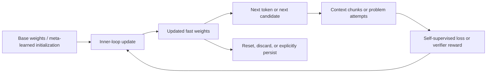

# SSI × TTT 归属核验与学习指南

> 生成时间：2026-08-14
> 查询：Ilya 的公司 SSI 最近发布了 TTT 模型，帮我找一些资料，我想学习一下

## 摘要

截至 2026-08-14，**没有公开一手证据表明 Ilya Sutskever 的 Safe Superintelligence Inc.（SSI）发布过名为 TTT 的模型、论文、代码或 checkpoint**。SSI 最新官方更新是与 NVIDIA 的长期算力合作；联合公告反而称其研究仍是 `closely guarded research`。Ilya 公开强调过 continual learning 和“从 deployment 中学习”的重要性，但没有披露 SSI 的具体技术机制，因此不能把这条研究取向等同于 TTT。

这次误传最可能来自两类混淆：

1. **TTT-E2E**：2025 年底由 Astera、NVIDIA、Stanford、UC Berkeley、UCSD 团队发布，随后开放 125M / 1B / 3B checkpoint；作者和机构中没有 SSI。
2. **Modular TTT**：2026-08-07 刚发布，机构包含 Shanghai Innovation Institute（缩写 **SII**）与 ByteDance Seed；`SII` 很容易被看成 `SSI`，但两者不是一家公司。

正确的学习对象不是一个叫“TTT”的单一模型，而是一组 **Test-Time Training（测试时训练）机制**：模型在处理当前序列或当前问题时，不只增加推理 token，而是利用上下文、自监督目标或 verifier reward，临时更新一小部分 `fast weights`。

## 一、先做归属核验

| 命题 | 结论 | 一手证据与边界 |
|---|---|---|
| SSI 最近发布 TTT 模型 | **未证实，当前公开记录不支持** | [SSI Updates](https://ssi.inc/updates) 只有 NVIDIA 合作、管理层和融资更新；没有 TTT、paper、model card、code 或 checkpoint |
| SSI 已公开其核心研究 | **不支持** | [SSI × NVIDIA 联合公告](https://www.globenewswire.com/news-release/2026/07/27/3333561/0/en/ilya-sutskever-s-safe-superintelligence-inc-and-nvidia-announce-long-term-strategic-partnership.html) 称 NVIDIA 获得了对 SSI 保密研究的罕见访问，没有披露技术细节 |
| Ilya 重视 continual learning | **已公开表达** | [Dwarkesh 对 Ilya 的访谈](https://www.dwarkesh.com/p/ilya-sutskever-2) 中，他把 continual learning、从 deployment / trial-and-error 中学习视为重要方向，但明确没有公开具体 ML ideas |
| TTT-E2E 属于 SSI | **错误** | [TTT-E2E 论文](https://arxiv.org/abs/2512.23675) 的作者机构为 Astera、NVIDIA、Stanford、UC Berkeley、UCSD；[代码与权重](https://github.com/test-time-training/e2e) 也由 `test-time-training` 团队发布 |
| Modular TTT 属于 SSI | **错误** | [Modular TTT 论文](https://arxiv.org/abs/2608.07110) 和[代码](https://github.com/ByteDance-Seed/Modular-TTT) 来自 SJTU、Shanghai Innovation Institute（SII）与 ByteDance Seed |

因此，**可以研究“Ilya 为什么可能会关心类似 TTT 的 continual learning 问题”，但不能写成“SSI 已发布 TTT”**。前者是机制关联推断，后者需要官方发布才能成立。

## 二、用一个类比理解 TTT

把普通长上下文模型想成一名参加开卷考试的学生：

- **Full Attention**：把整本资料摊在桌上，每答一题都重新查所有页面；精确查找强，但桌面和查找成本随资料变长。
- **RNN / linear attention**：一边读一边把内容压成固定大小的手写摘要；速度稳定，但细节可能丢失。
- **TTT**：不只写摘要，而是在考试过程中，用刚读过的内容做几道“自测题”，临时训练一个小型记忆模型；之后再用更新后的参数答题。
- **RAG / external memory**：把资料放进外部档案库，需要时检索；它改变输入，不改变模型参数。
- **Test-time compute / Chain-of-Thought**：学生多想几遍或尝试更多解法，但脑内参数不更新。

TTT 的关键不是“测试时做更多计算”，而是：**测试时发生了参数更新**。

这也解释了它的主要取舍：参数化压缩可能比完整 attention 更省长上下文成本，却不擅长保留一个看起来无关、后来突然被询问的精确细节。这个边界与 [agent-memory](/wiki/concepts/agent-memory/)、[memory-to-context](/wiki/connections/memory-to-context/) 中的三层区分一致：context / retrieval memory 不等于 policy / weight learning。

## 三、TTT 的基本机制

### 3.1 Inner loop：在测试序列上更新 fast weights

设 `W` 是允许在测试时变化的 fast weights，`x_t` 是当前 token 或 chunk。TTT layer 先把 token 投影成训练输入、训练目标和查询三种视图：

```text
k_t = θ_K x_t                  # inner-loop training input
v_t = θ_V x_t                  # self-supervised target
q_t = θ_Q x_t                  # query
ℓ_t(W) = ||f(k_t; W) - v_t||²
W_t = W_(t-1) - η_t · ∇_W ℓ_t(W_(t-1))
z_t = f(q_t; W_t)
```

其中：

- `ℓ` 是测试时可构造的目标，例如 reconstruction、next-token prediction 或 verifier reward；
- `η` 是 inner-loop learning rate；
- `W_t` 是随当前序列变化的 fast state；
- 其余 base weights 通常冻结，或只有很小的 LoRA / MLP 子集参与更新。

### 3.2 Outer loop：训练一个“善于在测试时学习”的初始化

如果只是拿普通预训练模型在输入上随意做梯度下降，更新很容易破坏已有能力。TTT layers 与 TTT-E2E 的关键是 meta-learning：训练阶段优化的不是静态初始模型，而是“完成若干 inner updates 后”的损失。

```text
W_0* = argmin_(W_0) Σ_t  CE(f(x_t; W_t(W_0)), x_(t+1))
```

直观上，outer loop 学的是一颗“适合快速学习的脑”，inner loop 才是它在当前文档或问题上的临时学习。

### 3.3 最小流程

```text
W = meta_learned_initialization

for chunk in context:
    target = build_self_supervised_target(chunk)
    loss = objective(model(chunk, W), target)
    W = W - learning_rate * grad(loss, W)

answer = model(query, W)
reset W at the sequence/document boundary
```



## 四、TTT 不是一篇论文：六条容易混淆的路线

| 时间 / 工作 | 测试时更新什么 | 学习信号 | 主要目的 | 最重要边界 |
|---|---|---|---|---|
| [2020 Test-Time Training](https://proceedings.mlr.press/v119/sun20b.html) | 视觉模型的一部分参数 | 单个无标签测试样本上的 self-supervised task | 抵抗 distribution shift | 这是术语源头之一，不是长上下文语言模型 |
| [2024 TTT layers](https://arxiv.org/abs/2407.04620) | 作为 RNN hidden state 的 Linear / MLP learner | 重构式 self-supervised loss | 用高容量 fast weights 取代固定维度 recurrent state | TTT-MLP 的 memory I/O 与 wall-clock 仍是限制 |
| [2025 TTT-E2E](https://arxiv.org/abs/2512.23675) | Sliding-window Transformer 后 1/4 blocks 的部分 MLP | next-token prediction | 一边读 context，一边把它压进参数 | 精确 recall 弱于 full attention；训练需 gradient-through-gradient |
| [2026 TTT-Discover](https://arxiv.org/abs/2601.16175) | `gpt-oss-120b` 上的 LoRA policy | 连续、可验证 reward | 在一个 discovery problem 上持续 RL 搜索 | 不是新 base model；不适用于无 verifier 的开放任务 |
| [2026 In-Place TTT](https://arxiv.org/abs/2604.06169) | 现有 gated MLP 的 final projection `W_down` | LM-aligned next-token objective | 不替换 attention layer，把现有权重复用为 fast memory | `drop-in` 不等于零训练；document boundary 会 reset |
| [2026 Modular TTT](https://arxiv.org/abs/2608.07110) | 可组合的 fast-weight learner DAG | 可配置 loss / LR / decay / normalization | 把 TTT 设计空间模块化并自动派生更新规则 | 当前只验证 autoregressive LM 与有限规模，精确长上下文检索仍弱 |

### 4.1 TTT layers：把 hidden state 变成一个模型

[Learning to (Learn at Test Time): RNNs with Expressive Hidden States](https://arxiv.org/abs/2407.04620) 的思想转折是：传统 RNN 的 hidden state 是一个向量，TTT layer 的 hidden state 则是一个小模型 `f(·; W)`。每读到新 token，模型先基于自监督任务更新 `W`，再用更新后的 `W` 产生输出。

论文实现了：

- `TTT-Linear`：fast-weight learner 是一层 linear model；
- `TTT-MLP`：fast-weight learner 是两层 MLP，表达力更强但硬件成本更高；
- mini-batch / dual form：减少逐 token 梯度更新的串行瓶颈。

这是理解后续工作的最佳起点，因为它把 `state = parameters of a learner` 说得最清楚。

### 4.2 TTT-E2E：让标准 Transformer 学会“读的时候训练”

[End-to-End Test-Time Training for Long Context](https://arxiv.org/abs/2512.23675) 更接近可运行的语言模型系统：

1. base architecture 仍是 sliding-window Transformer；
2. prefill context 时，用 next-token loss 更新部分 MLP 权重；
3. 只更新最后约四分之一 blocks 的 MLP，并保留一条静态 MLP 路径保护预训练知识；
4. outer training 对更新过程反向传播，使初始化适合随上下文快速改变；
5. query / generation 使用已经吸收 context 的 fast weights。

论文报告的研究规模与结果：

- 最大模型为 3B，训练约 164B tokens，最长实验到 128K；
- 在长上下文 language-modeling loss 上，扩展趋势接近 full attention；
- 128K prefill 在其 H100 设置下比 full attention 快约 `2.7×`；
- 已公开 [125M / 1B / 3B checkpoints 与代码](https://github.com/test-time-training/e2e)。

但不要只看速度数字：

- S-NIAH 一类精确召回任务上，full attention 明显更强；
- 长生成评估规模有限，模型也没有 instruction tuning / RL；
- 二阶梯度缺少成熟 FlashAttention 支持，论文的 8K training latency 约为 full attention 的 `3.4×`；
- 这些是 3B 以内 research-scale base model 结果，不能外推成 SSI 级 frontier model。

### 4.3 TTT-Discover：测试时学习一个问题，不是学习一段 context

[Learning to Discover at Test Time](https://arxiv.org/abs/2601.16175) 把 TTT 用到了另一层：给定一个有连续 verifier reward 的单一难题，让模型在测试时做 RL。

其公开配置大致是：

- base：`gpt-oss-120b`；
- adaptation：LoRA rank 32；
- 50 个训练 step，每步 512 rollouts，共 25,600 次；
- 用 PUCT 从历史高价值 state 分配新的探索；
- 用偏向最佳样本而非平均样本的 entropic objective 更新；
- 论文估算约 `US$500 / problem`。

它在数学、GPU kernel、AtCoder 与生物问题上报告了多项最佳结果，但这是**可验证 discovery**的路径，不是“模型上线后自然持续学习”的通用方案。当前方法依赖连续 reward；稀疏、二元或不可验证任务仍是开放问题。

### 4.4 In-Place 与 Modular：2026 年的工程化方向

Vault 已有原始论文 [In-Place Test-Time Training.pdf](/raw/papers/context-engineering/In-Place%20Test-Time%20Training.pdf)。In-Place TTT 不新增专用 TTT layer，而是把普通 LLM MLP block 的 `W_down` 当作 fast weights，保持 `W_up` / `W_gate` 冻结，并用 chunk-wise update、prefix scan 和 context parallelism 提升并行性。

它最值得记住的三个边界：

- fast weights 在 document boundary 恢复到 pretrained state，所以是 per-sequence adaptive memory，不是永久知识写入；
- `drop-in` 表示架构兼容，不表示拿现成 checkpoint 零训练即可使用；
- 论文 RULER 增益证明的是特定 long-context benchmark，不等于通用 continual learning。

刚发布的 Modular TTT 则把 fast-weight network、loss、learning rate、weight decay、normalization 等拆成可组合模块，用 DAG 自动派生 train-view forward / backward 与 query-view 规则。论文的 410M / 1.45B 模型在 100B tokens 上与 Gated DeltaNet 相当，并报告若干训练吞吐改进；但它仍不是 SSI 发布，也不是已验证的 frontier-scale model。

## 五、它为什么值得研究

### Motivation

1. **长上下文成本**：full attention 能精确访问历史，但 prefill 和 memory 随 context 增长。
2. **固定容量状态**：传统 RNN / linear attention 有稳定成本，却容易把历史过早压缩。
3. **静态模型**：普通 inference 只在 activation / KV cache 中适应输入，无法将当前规律写进参数状态。
4. **测试时搜索的边界**：Best-of-N、CoT、tree search 可以多试，但重复失败不会自动变成下一轮的 policy update。

### Benefits

- 用 fast weights 提供比固定向量更高容量的 recurrent state；
- 把 context prefill 从“保存全部 token 关系”改造成“学习一个当前文档模型”；
- 让 test-time compute 同时承担探索与 learning，而不只是采样更多答案；
- 可通过 reset 把适应限制在一个 document / task，降低永久污染风险。

### Features

- fast / slow weights 分离；
- self-supervised 或 verifier-based inner objective；
- meta-learned initialization；
- chunk / mini-batch 更新以提高并行度；
- 局部 MLP、LoRA 或既有 projection 的参数高效更新；
- sequence boundary reset、static path 和 normalization 等稳定机制。

### Implementation proof gates

读任何 TTT 宣传时，至少追问：

1. **更新谁？** 全模型、LoRA、MLP、projection，还是只是 KV / activation？
2. **学习信号是什么？** reconstruction、next-token loss、人工反馈还是可执行 verifier？
3. **更新何时发生？** 每 token、每 chunk、每 rollout batch，还是离线训练？
4. **outer loop 是否训练过？** 没有 meta-training 的临时梯度更新可能只是在破坏模型。
5. **状态何时 reset / persist？** per-sequence fast memory 与跨用户永久学习是完全不同的安全问题。
6. **和谁公平比较？** full attention、sliding window、linear attention、Gated DeltaNet 必须在 matched params / tokens / hardware 下比较。
7. **精确 recall 怎么样？** 平均 LM loss 好不代表能找回任意细节。

## 六、TTT 的关键风险与反命题

1. **压缩不是免费午餐**：模型只会写入当前 loss 看起来重要的信息，未来问题可能正好询问当时被舍弃的细节。
2. **训练成本可能从 inference 端转移到 outer training**：gradient-through-gradient、optimizer state 和 kernel 支持都可能很贵。
3. **临时学习会放大污染**：prompt injection、恶意 context 或错误 verifier 不再只影响一轮输出，还可能直接改变 fast weights。
4. **安全行为可能遗忘**：[Test-Time Training Undermines Safety Guardrails](https://arxiv.org/abs/2605.22984) 在其特定攻击设置中报告很高的 attack success rate；这不是“所有 TTT 都不安全”的证明，但说明 guardrails 必须覆盖更新后的模型状态，而非只验 base model。
5. **continual learning 尚未闭环**：per-document reset 的 TTT 解决的是 adaptive memory；跨 deployment 持久学习还需处理数据归属、回滚、灾难性遗忘、用户隔离、审计和安全更新。
6. **“会学习”不等于“会正确地学习”**：优化器只追逐给定 objective。错误 reward 或短期 proxy 会把模型稳定地训练向错误方向。

## 七、推荐学习路线

### 90 分钟入门版

1. **10 分钟：术语校准**  
   先看 [TTT 项目主页](https://test-time-training.github.io/) 的论文时间线，再读 [2020 TTT 摘要](https://proceedings.mlr.press/v119/sun20b.html)，记住最初问题是无标签测试样本上的 distribution shift adaptation。
2. **30 分钟：建立核心心智模型**  
   读 [TTT layers](https://arxiv.org/abs/2407.04620) 的 Introduction、Figure 1 / Figure 3、§2.1–2.3。只回答三件事：hidden state 是什么、self-supervised target 是什么、为什么需要 outer loop。
3. **35 分钟：看语言模型版本**  
   读 [TTT-E2E](https://arxiv.org/abs/2512.23675) 的 Introduction、§2.1–2.3、long-context scaling、S-NIAH 与 training efficiency 部分。
4. **15 分钟：读限制，不读宣传**  
   对比 loss scaling、prefill speed、精确 recall 和 training latency，写下“它在哪种任务胜、在哪种任务输”。

### 半天实践版

1. 跑 [TTT-E2E 官方仓](https://github.com/test-time-training/e2e) 的最小 checkpoint / inference 路径；先用 125M 或 1B，不要从 3B 开始。
2. 记录三组对照：`no TTT`、`TTT + reset`、`TTT without proper reset`。
3. 构造两类 synthetic context：
   - 可由重复统计规律压缩的问题；
   - 只出现一次、位置随机的 UUID / password exact-recall 问题。
4. 测量 accuracy、prefill latency、峰值显存、update latency、不同 chunk size 与 inner LR。
5. 检查跨 document 是否 reset，验证上一位“用户”的数据会不会污染下一位。

### 根据兴趣选分支

- **想学长上下文架构**：TTT layers → TTT-E2E → [In-Place Test-Time Training.pdf](/raw/papers/context-engineering/In-Place%20Test-Time%20Training.pdf) → [Modular TTT](https://arxiv.org/abs/2608.07110)。
- **想学模型自我改进 / test-time RL**：TTT-Discover → verifier design → PUCT / entropic objective；同时对照 [prime-agent-core-mechanism-analysis-2026-08-11](/output/reports/prime-agent-core-mechanism-analysis-2026-08-11/)，不要把 Harness refinement 当作神经网络训练。
- **想研究 SSI / superintelligence 路线**：读 Ilya 访谈中的 continual learning / generalization 部分，但把所有具体架构保持为“未知”；等待 SSI 的 paper、model card、code、checkpoint 或正式技术公告。
- **想做产品判断**：重点研究 state persistence、用户隔离、poisoning、rollback、审计与 serving economics，而不是只看 benchmark 峰值。

## 八、读完后应能回答的五个问题

1. 为什么 `more test-time compute` 不等于 `test-time training`？
2. TTT layer 为什么可以被描述成“hidden state 是一个模型”？
3. TTT-E2E 为什么要对 inner updates 反向传播，而不能只在现成模型上随意微调？
4. 为什么 long-context language-modeling loss 改善，不保证精确 needle recall？
5. 为什么 In-Place TTT 的 document reset 既是安全特性，也说明它还不是完整 continual learning？

如果这五题都能用自己的话回答，就已经掌握 TTT 主干，不容易再被“自我学习模型”“无限上下文”“SSI 新模型”等营销描述带偏。

## 数据来源

### SSI 与 Ilya

- [Safe Superintelligence Inc. 官网](https://ssi.inc/)
- [SSI Updates](https://ssi.inc/updates)
- [SSI × NVIDIA 联合公告](https://www.globenewswire.com/news-release/2026/07/27/3333561/0/en/ilya-sutskever-s-safe-superintelligence-inc-and-nvidia-announce-long-term-strategic-partnership.html)
- [Dwarkesh Patel：Ilya Sutskever — We’re moving from the age of scaling to the age of research](https://www.dwarkesh.com/p/ilya-sutskever-2)

### TTT 一手论文与代码

- [Test-Time Training with Self-Supervision for Generalization under Distribution Shifts（ICML 2020）](https://proceedings.mlr.press/v119/sun20b.html)
- [Learning to (Learn at Test Time): RNNs with Expressive Hidden States](https://arxiv.org/abs/2407.04620)
- [TTT layers PyTorch code](https://github.com/test-time-training/ttt-lm-pytorch)
- [End-to-End Test-Time Training for Long Context](https://arxiv.org/abs/2512.23675)
- [TTT-E2E code and checkpoints](https://github.com/test-time-training/e2e)
- [Learning to Discover at Test Time](https://arxiv.org/abs/2601.16175)
- [TTT-Discover code](https://github.com/test-time-training/discover)
- [In-Place Test-Time Training.pdf](/raw/papers/context-engineering/In-Place%20Test-Time%20Training.pdf) / [arXiv](https://arxiv.org/abs/2604.06169) / [code](https://github.com/ByteDance-Seed/In-Place-TTT)
- [Modular TTT](https://arxiv.org/abs/2608.07110) / [code](https://github.com/ByteDance-Seed/Modular-TTT)
- [Test-Time Training Undermines Safety Guardrails](https://arxiv.org/abs/2605.22984)

### Vault 中的概念边界

- [agent-memory](/wiki/concepts/agent-memory/)
- [context-engineering](/wiki/concepts/context-engineering/)
- [memory-to-context](/wiki/connections/memory-to-context/)
- [0702-scaling-test-time-compute](/raw/articles/learning-notes/scaling-test-time-compute/)
- [prime-agent-core-mechanism-analysis-2026-08-11](/output/reports/prime-agent-core-mechanism-analysis-2026-08-11/)

---
*由 LLM 从知识库与公开一手资料查询生成*
