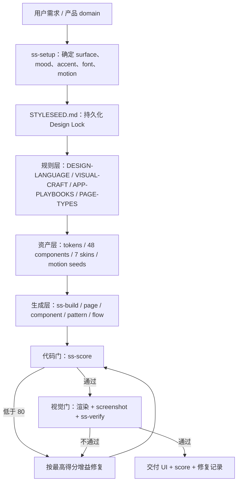

# bitjaru/styleseed 项目分析

> 生成时间：2026-07-17  
> 查询：研究一下 `bitjaru/styleseed` 这个项目  
> 核验快照：`main@7af957e3c041f219b60449d79b06c66cae3acffd`，StyleSeed `2.11.1`

## 摘要

StyleSeed 不是新的 UI framework，也不是一个真正的“自动设计模型”。它是一套给 Claude Code、Codex、Cursor 等 coding agent 使用的 **Design Judgment Harness**：把设计判断写成规则，把项目级视觉决策写进 `STYLESEED.md`，把 tokens / components / skins / motion 作为可执行资产，再用一组 agent Skills 强制执行“先锁定风格 → 生成 → 代码评分 → 截图复核 → 修复重跑”的闭环。

它最有价值的不是 74 条设计规则或 48 个 React 组件，而是把“审美”从一次性 prompt 变成了四种可持续对象：

1. **可持久化的约束**：`STYLESEED.md` 作为项目 Design Lock；
2. **可调用的工作流**：19 个 `ss-*` Skills；
3. **可复用的实现资产**：semantic tokens、components、skins、motion seeds；
4. **可执行的质量门**：`ss-score` + `ss-verify` 的生成—批评—修复循环。

但需要准确理解它的边界：Quality Gate 目前主要是 **Agent 按 rubric 自评**，不是确定性的 linter、视觉模型或经标注数据校准的 evaluator；仓库没有自动化测试文件，规则本身近期仍在快速修正冲突。因此它是一个很好的设计 harness / 方法论产品，尚不是可重复、可比较、可审计的“设计质量基础设施”。

## 一、它解决的真实问题

普通 AI coding 的 UI 失败通常不是“不知道 Tailwind 或 shadcn”，而是缺少跨轮次稳定的判断：

- 每轮重新选择颜色、圆角、阴影和字体，结果发生视觉漂移；
- 有组件但不知道何时用、怎样组合，页面变成同权卡片网格；
- 会完成 happy path，却漏掉 empty / loading / error / focus / reduced-motion；
- 生成完即交付，没有视觉检查与修复回路；
- 用“高级、现代、简洁”这类 mood words，无法约束数十个具体 token 与组件决策。

StyleSeed 的核心 thesis 是：**design data 是颜料，design judgment 是决定颜料放在哪里。** 它试图补的是 coding agent 的判断层，而不是再提供一套组件库。

这也解释了它和 shadcn/ui、Tailwind UI、Figma 参考库的差异：后者提供 primitives、templates 或 reference data；StyleSeed 提供的是 rules + persistent lock + agent workflow + review gate。

## 二、产品结构：六层 Design Judgment Harness



### 1. Agent 入口层

同一套规则通过三种入口接入 coding agents：

- `engine/CLAUDE.md`：Claude Code；
- `engine/AGENTS.md`：Codex / Gemini CLI 等；
- `engine/.cursorrules`：Cursor；
- `.agents/skills` bridge：让 Codex 发现 canonical `engine/.claude/skills` 下的 Skills。

这是一种低成本分发策略：不开发 IDE extension，也不绑定单一 agent runtime，直接利用各工具已经支持的 instruction / skill discovery contract。

### 2. Design Lock 层

`STYLESEED.md` 是项目级 source of truth，锁定：

- domain 与 surface；
- preset / mood；
- font；
- radius personality；
- palette mode 与 accent；
- light / dark elevation language；
- density；
- motion seed。

它的意义比 preset 更大：**将隐含、易漂移的视觉偏好编译成可读、可 diff、可版本控制的 contract。** 后续所有生成与评分先读取该 lock，并按 lock-relative 而非单一 house style 判断。

### 3. 判断知识层

核心不是一份短 prompt，而是一个约 4,400 行的判断语料层：

- `DESIGN-LANGUAGE.md`：2,861 行，74 条规则；
- `CLAUDE.md`：898 行，执行入口与 Golden Rules；
- `VISUAL-CRAFT.md`：391 行，coherence 与 anti-AI-tells；
- `METHODOLOGY.md`：304 行；
- 另有 `APP-PLAYBOOKS.md`、`PAGE-TYPES.md`、`UX-WRITING.md`。

规则不只覆盖颜色与间距，也包含信息密度、页面节奏、组件变化、状态、a11y、motion、domain / surface bias，以及“icon chip、同权卡片、默认 indigo、模板 hero”等 AI UI tells。

### 4. 实现资产层

仓库提供：

- 48 个 React / Radix / Tailwind 组件与 pattern；
- 6 组 JSON tokens（color、motion、radii、shadow、spacing、typography）；
- 7 个 skins（Toss、Stripe、Linear、Vercel、Notion、Raycast、Arc）；
- 5 个 named motion seeds 和 20+ motion moves；
- Vite scaffold 与 Next.js demo / gallery。

这里形成了 `judgment → semantic token → component implementation` 的桥，而不是只让 Agent 读一份审美文章。

### 5. Workflow Skills 层

当前源码实际有 19 个 Skills，覆盖：

- **初始化与全流程**：`ss-setup`、`ss-build`、`ss-update`；
- **生成**：`ss-component`、`ss-page`、`ss-pattern`、`ss-flow`；
- **系统修改**：`ss-tokens`、`ss-dial`、`ss-restyle`、`ss-motion`；
- **质量**：`ss-lint`、`ss-review`、`ss-score`、`ss-verify`、`ss-a11y`、`ss-audit`；
- **体验与内容**：`ss-feedback`、`ss-copy`。

其中最关键的是 `ss-build`：它不是“生成页面”的另一个 prompt，而是把正确顺序变成 workflow——没有 lock 就不写 UI，生成后必须评分、修复、重评，最终再截图验证。

### 6. Quality Gate 层

`ss-score` 将 UI 按八个维度计 100 分：

| 维度 | 权重 |
|---|---:|
| Color discipline | 16 |
| Hierarchy & typography | 16 |
| Layout & rhythm | 12 |
| Cards & elevation | 10 |
| States & a11y | 18 |
| Motion & interaction | 6 |
| Coherence | 12 |
| Distinctiveness | 10 |

Agent 读取真实代码、引用行号、从满分扣除违规项，低于 80 则按“得分增益最高”的顺序修复，最多循环约三轮。`ss-verify` 再启动页面、截取真实渲染图，检查代码中看不出的死区、视觉焦点、字体加载、实际色彩竞争、光学对齐与状态画面。

## 三、真实使用路径

适合的工作流不是“安装后自动变好”，而是：

1. 在一个 React / Next / Vite 项目中安装 StyleSeed Skills；
2. 先运行 setup / build，和用户确定 domain、surface、accent、font、radius、density、motion；
3. 将结果写入 repo 根目录的 `STYLESEED.md`；
4. Agent 读取完整规则、page type 和 domain playbook；
5. 从现有 components / patterns 生成屏幕；
6. 用 `ss-score` 做 code gate，修复到 ≥80；
7. 可渲染时用 `ss-verify` 截图做 visual gate；
8. 将 lock、score 和修复内容与代码一起版本化。

最适合：vibe-coded SaaS、dashboard、内部工具、marketing site，以及没有专职设计师但愿意接受强约束的早期团队。

不适合：已有成熟 design system 且规则冲突的组织、非 React 技术栈的直接组件复用、需要确定性审计分数的 release gate、追求高度艺术化且不愿预先锁定视觉语言的项目。

## 四、项目真正做对的地方

### 1. 把“风格”做成状态，而不是 prompt

`STYLESEED.md` 是全项目最强的产品机制。很多 design skill 只在当前轮注入一组规则；StyleSeed 把选择写入可版本控制文件，使下一轮、另一个 Agent、另一个页面都能恢复同一套判断。

这与 [context-engineering](/wiki/concepts/context-engineering/) 的核心一致：不要希望模型“记住”，而要把关键决策外部化为可检索、可更新的状态。

### 2. 从生成能力转向验证能力

组件生成已高度商品化，StyleSeed 把差异化押在“生成后如何判断与修复”。其最强机制不是 `ss-page`，而是：

`lock → generate → score → fix → re-score → render → inspect`

这与 [self-verification](/wiki/concepts/self-verification/) 的 generator / evaluator 分离，以及 [harness-engineering](/wiki/concepts/harness-engineering/) 的观点一致：最终质量更多来自 harness，而非单次模型输出。

### 3. 评分相对于 intent，而非统一审美

2.11 版本的重要修正是 lock-relative scoring。Brutalist、editorial、OLED black、multi-color brand system 不再因为偏离 Toss-flavored 默认值而天然扣分。

这是一个通用 evaluator 设计原则：**先保存 intent，再评估 execution 是否忠于 intent。** 没有 intent contract 的审美评分，很容易把偏好误当质量。

### 4. 同时提供规则与可落地资产

只有规则会变成“模型读过但没执行”；只有组件会变成“拼得整齐但没有判断”。StyleSeed 把 rules、tokens、components、skins、motion、skills 放在同一 repo，缩短了从判断到代码的距离。

### 5. 清楚区分 code gate 与 visual gate

`ss-score` 承认源码无法判断实际像素效果，`ss-verify` 明确要求真实渲染、截图并“看见”图片，且不能在未截图时声称视觉验证通过。这种证据纪律比“自称 UI 已优化”可靠得多。

## 五、关键边界与风险

### 1. Quality Gate 仍是 Agent 自评，不是客观评分器

`ss-score` 的 `allowed-tools` 只有 Read / Grep / Glob / Bash；它没有独立 parser、静态分析规则引擎、视觉 embedding 模型或标注 benchmark。扣分由当前 Agent 阅读 rubric 后执行，因此：

- 不同模型、不同上下文可能给出不同分数；
- 同一模型可能漏检或“为了过 80”宽松解释；
- 行号证据增强了可解释性，但不等于评分已校准；
- ≥80 是 workflow floor，不是统计意义上的质量阈值。

因此目前的 score 更像 **structured design review checklist**，而不是能跨项目比较的 metric。

### 2. 规则量大，存在上下文成本与内在冲突

项目自己在 2.11 changelog 中承认，早期 scorer 对所有项目套同一 Toss 风格，甚至会惩罚官方 preset；修复后又发现 Claude 之外的入口与 canonical rules 不同步。这说明 74 条规则不是静态真理，而是一个需要持续 regression 的 policy system。

更长的规则集也会带来：加载成本、优先级冲突、模型选择性忽略，以及 skill / mirror 文档漂移。

### 3. “Brand-agnostic” 仍有明显 house taste

虽然 lock-relative 已允许更多风格，默认规则仍偏向：single accent、克制 shadow、现代 SaaS、Radix/shadcn、结构化卡片与 dashboard craft。它能避免一类 generic AI UI，但不等于覆盖所有文化语境、内容型产品、游戏、儿童、奢侈品或强表达性品牌。

7 个品牌 skins 主要是视觉近似与 token preset，不是这些品牌官方 design systems，也不能自动获得对应品牌的交互原则和内容策略。

### 4. 技术资产复用面较窄

组件层基于 React、TypeScript、Tailwind、Radix、CVA。规则层可以跨栈，components / scaffold 不能直接迁移到 SwiftUI、Flutter、Vue 或原生 App。非 React 团队需要把 StyleSeed 当 policy source，而非 drop-in design system。

### 5. 工程验证弱于产品叙事

本次源码核验：

- 仓库没有匹配到自动化 `test/spec` 文件；
- demo production build 成功，Next.js 生成 114 个静态页面；
- `npm audit` 在锁定依赖上报 1 个 high、1 个 moderate vulnerability，均可通过将 Next.js 从 `16.2.3` 升级到修复版本处理；
- README 仍有“15 AI-Powered Skills”标题，但源码、生成 registry 与其他正文均为 19，说明文档仍有轻微 drift。

这不是说项目不可用，而是应把“demo 可构建”与“规则/Skills 经过稳定 regression”分开。

### 6. 它不是 GENUI runtime

StyleSeed 在 build time / coding time 约束 Agent 生成 UI；它不负责运行时根据用户状态发出 typed UI intent，不提供 AG-UI / A2UI / MCP Apps renderer，也不管理 in-app component resolution。

因此它与 [genui](/wiki/concepts/genui/) 的关系是：**StyleSeed 可以成为 GenUI 的 style policy / evaluator layer，但不是 GenUI 的 runtime / protocol / renderer。**

## 六、对 BENZEMA / Combo / GenUI 的借鉴

### 1. 需要的不是复制 74 条规则，而是复制四对象模型

对我们的长期价值是这四种对象：

| StyleSeed 对象 | 我们可以抽象成 |
|---|---|
| `STYLESEED.md` | 每个项目的 Design Intent Contract |
| rules / playbooks | 可检索的 Taste Policy Pack |
| tokens / registry / components | 可被 Agent 选择的可信 UI capability space |
| score / verify loop | 生成结果的 evidence-producing evaluator |

重点是让设计偏好可以保存、组合、执行、验证，而不是让 Agent 每次重新“有审美”。

### 2. 与 Fudge 形成完整的 Design Context Pipeline

结合 [fudge-design-reference-competitors-2026-07](/output/reports/fudge-design-reference-competitors-2026-07/)，一条更完整的链路是：

```text
真实产品参考 / measured evidence
→ 提取品牌与页面约束
→ Design Intent Contract
→ component registry + tokens
→ Agent 生成
→ code gate + visual gate
→ 将失败模式回写为新规则 / canonical test
```

Fudge 更像 evidence / reference retrieval，StyleSeed 更像 policy / execution / review。二者之间的空白是 **把 reference evidence 编译成项目级可执行 design contract**。

### 3. GenUI 应先锁定“可生成空间”，再生成页面

对 [genui](/wiki/concepts/genui/) 而言，StyleSeed 提醒我们：高质量 GenUI 不能只给模型一个无限 HTML sandbox。更稳的结构是：

- Design Lock 决定视觉语言；
- typed component registry 决定可用组件；
- schema 决定组件 props 与状态；
- Agent 只生成 structured UI intent；
- renderer 输出可信组件；
- visual evaluator 校验成品。

这比“prompt → 任意 React”更容易保持 taste、可访问性和跨次一致性。

### 4. Evaluator 必须从自然语言 rubric 继续走向混合验证

如果把这套机制产品化，不能停在 LLM 自评。建议拆成三层：

1. **确定性检查**：token 使用、颜色数量、radius variance、focus、aria、state coverage、touch target；
2. **视觉测量**：contrast、alignment、spacing variance、font load、overflow、screenshot diff；
3. **模型判断**：focal point、coherence、distinctiveness、domain fit。

每次评分应保存 evaluator version、输入截图、规则版本、扣分证据与修复 diff，才可能成为真正的 design evaluation ledger。

### 5. Skill 商品的价值来自闭环，不来自文档长度

StyleSeed 也印证了 [skills-system](/wiki/concepts/skills-system/) 的一个重要判断：高价值 Skill 不是“更多说明”，而是改变执行顺序并强制验证的 workflow contract。`ss-build` 的价值高于单独 74 条规则，因为它控制 lock、build、score、fix、verify 的顺序。

对能力市场而言，未来可交易对象应包含：

- instruction / policy；
- assets / components；
- setup schema；
- evaluator；
- canonical test cases；
- version 与 compatibility；
- run evidence。

这比出售一个 `SKILL.md` 更接近“可验证能力包”。

## 七、建议：值得试，但应以 A/B 实验而非全局接管

建议把 StyleSeed 当作 **设计工作流实验**，不要立即设为所有项目的全局规则：

1. 选 3 个真实页面：dashboard、内容/管理页、marketing landing；
2. 固定同一 brief、同一模型与同一代码基座；
3. A 组使用现有 frontend skill，B 组使用 StyleSeed lock + build + score + verify；
4. 保存每组耗时、token、首次可用率、人工修改次数、a11y 问题、视觉盲评；
5. 专门记录 `ss-score` 与人工设计评审的不一致；
6. 最后只吸收真正提高结果的规则、lock schema 和 gate，而不是整包照搬。

验收指标建议：

- 同一项目跨三轮修改是否发生视觉漂移；
- empty / loading / error / focus / reduced-motion 覆盖率；
- 人工设计师盲评偏好；
- 首次产出到可交付的修改轮数；
- 不同 Agent 对同一页面评分方差；
- StyleSeed ≥80 是否真的对应人工“可交付”。

## 八、当前成熟度快照

| 项目 | 2026-07-17 核验结果 |
|---|---|
| 创建时间 | 2026-04-07 |
| License | MIT |
| GitHub | 779 stars / 65 forks |
| 当前版本 | v2.11.1（2026-07-16） |
| main HEAD | `7af957e3`（2026-07-16） |
| 规则 / assets | 74 rules / 48 components / 7 skins / 19 Skills |
| 本地验证 | `npm ci` 成功；`npm run build` 成功；114 static pages |
| 自动化测试 | 未发现 test/spec 文件 |
| 依赖审计 | 1 high + 1 moderate，来自锁定的 Next.js/PostCSS 依赖，可升级修复 |

综合判断：**创意和产品机制强，工程规模仍小，迭代速度很快。** 它已经是一个值得拆解和试用的 design harness，但不能把 80/100 当成客观设计质量证明，也不应把 7 个 skins 误解为成熟的多品牌 design system。

## 数据来源

- [bitjaru/styleseed GitHub](https://github.com/bitjaru/styleseed)
- [README](https://github.com/bitjaru/styleseed/blob/main/README.md)
- [DESIGN-LANGUAGE.md](https://github.com/bitjaru/styleseed/blob/main/engine/DESIGN-LANGUAGE.md)
- [VISUAL-CRAFT.md](https://github.com/bitjaru/styleseed/blob/main/engine/VISUAL-CRAFT.md)
- [ss-score Skill](https://github.com/bitjaru/styleseed/blob/main/engine/.claude/skills/ss-score/SKILL.md)
- [ss-verify Skill](https://github.com/bitjaru/styleseed/blob/main/engine/.claude/skills/ss-verify/SKILL.md)
- [CHANGELOG](https://github.com/bitjaru/styleseed/blob/main/CHANGELOG.md)
- [v2.11.1 release](https://github.com/bitjaru/styleseed/releases/tag/v2.11.1)
- [核验 commit](https://github.com/bitjaru/styleseed/commit/7af957e3c041f219b60449d79b06c66cae3acffd)
- [genui](/wiki/concepts/genui/)
- [harness-engineering](/wiki/concepts/harness-engineering/)
- [self-verification](/wiki/concepts/self-verification/)
- [context-engineering](/wiki/concepts/context-engineering/)
- [skills-system](/wiki/concepts/skills-system/)
- [fudge-design-reference-competitors-2026-07](/output/reports/fudge-design-reference-competitors-2026-07/)
- [generative-ui-landscape-2026-05](/output/reports/generative-ui-landscape-2026-05/)

---
*由 LLM 从知识库查询与项目源码核验生成*
