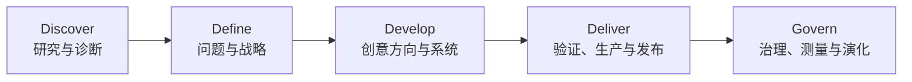

# 传统设计工作与品牌工作的专业流程

> 生成时间：2026-07-17  
> 查询：完成一个好的设计工作和品牌工作，传统流程是怎么样的？

## 摘要

传统专业流程的核心不是“先出几版好看的”，而是：

> **发散理解问题 → 收敛形成战略 → 发散探索创意 → 收敛形成系统 → 在真实触点验证并持续治理。**

经典的 Double Diamond 将设计过程概括为 Discover、Define、Develop、Deliver；真正成熟的品牌项目会把它展开成“项目定义—诊断—战略—语言—创意方向—识别系统—触点验证—发布治理—效果复盘”。品牌工作先决定“希望在别人心里成为什么”，具体设计工作再决定“如何在某个触点被看见、理解和使用”。

这是一套综合行业框架，不是某一家公司的固定 SOP。它综合了 [Design Council Double Diamond](https://www.designcouncil.org.uk/resources/the-double-diamond/)、[AIGA Design Process](https://www.aiga.org/sites/default/files/2021-03/3A_DesignProcess_Introduction.pdf)、[Landor 的 Consulting → Design → Experience 分层](https://landor.com/en/) 与 [Interbrand Banamex 案例](https://interbrand.com/articles/banamex-brand-strategy-identity/)，并结合本知识库关于 Brief、发散/收敛、质量验证和品牌资产沉淀的材料。

## 一、先分清：品牌工作不等于设计工作

| 维度 | 品牌工作 | 单一设计工作 |
|---|---|---|
| 核心问题 | 我们是谁、为谁存在、代表什么、为何值得被选择 | 在一个具体场景中，怎样更有效地沟通或使用 |
| 工作层级 | 商业、组织与长期心智层 | 产品、传播或体验执行层 |
| 时间尺度 | 通常面向数年并跨多个触点 | 通常面向一次发布或一个产品周期 |
| 主要产出 | 定位、叙事、识别系统、体验原则、治理机制 | 网站、界面、包装、海报、活动或空间 |
| 成功标准 | 差异化、相关性、一致性、可识别性、长期资产积累 | 清晰度、可用性、转化、传播效果、生产质量 |
| 二者关系 | 定义所有触点共同遵循的原则 | 在具体触点中实现并检验品牌原则 |

**Logo 只是品牌识别系统中的一个部件。** 如果商业定位、产品价值或组织共识没有解决，只换 Logo 通常不会解决根问题。

## 二、经典模型：两次发散、两次收敛

- **第一次发散**：不要急着接受客户最初描述的问题；广泛理解业务、用户、文化、竞争和历史资产。
- **第一次收敛**：把信息变成少数关键判断，形成清晰的品牌战略或 Creative Brief。
- **第二次发散**：根据同一战略探索真正不同的创意方向，而不是只换颜色和字体。
- **第二次收敛**：选择一个方向，深化成可跨媒介运行的完整系统，并在真实环境中验证。

Design Council 也强调 Double Diamond 不是严格直线：研究、原型和测试会让团队返回上一步。传统流程的价值不是让项目变成瀑布，而是让团队知道**现在正在回答哪一层问题、谁有权做决定、什么证据才能进入下一阶段**。

## 三、完整品牌项目的传统流程

### 0. 项目定义与组织（Project Framing）

**要回答的问题**

- 这是新品牌、品牌升级、品牌重塑，还是单纯的视觉更新？
- 真正的商业问题是什么？为什么现在做？
- 范围、预算、时间、关键触点和不可改变的约束是什么？
- 谁提供意见，谁整合意见，谁拥有最终决策权？
- 上线后用什么指标判断有效？

**典型产出**：Project Brief、Scope、里程碑、团队与 RACI、成功指标、风险与依赖清单。  
**决策门 G0**：问题、范围、决策人和验收方式是否明确。  
**常见失败**：把“销量下降”直接翻译成“Logo 不好看”；多人都能否决，却无人最终拍板。

### 1. 研究与品牌诊断（Discovery & Audit）

**关键活动**

- 创始人、管理层、员工、销售与客服访谈；
- 用户或客户研究：需求、选择理由、认知、语言和使用场景；
- 市场、品类、竞争品牌与文化语境审计；
- 现有名称、Logo、内容、产品、空间和传播资产盘点；
- 各触点一致性、识别度与使用成本诊断。

**典型产出**：Brand Audit、用户洞察、竞争地图、文化机会、现有资产清单、核心矛盾。  
**决策门 G1**：团队是否对真正的问题、核心受众和竞争环境形成共同认知。  
**常见失败**：只看竞品官网；只听创始人、不听用户；收集了很多图，却没有形成判断。

### 2. 品牌战略（Brand Strategy）

这一阶段把“我们知道了什么”转成“我们选择成为什么”。

**关键内容**

- 受众优先级与核心使用/购买场景；
- 品类定义与竞争参照系；
- 定位、价值主张、差异化和品牌承诺；
- 品牌核心观念、人格、原则与行为边界；
- 多产品、多业务或母子品牌关系，即 Brand Architecture。

**典型产出**：Brand Platform、Positioning Statement、Value Proposition、Audience Priorities、Brand Architecture、Strategic Principles。  
**决策门 G2**：能否用一句话说清“为谁、解决什么、为什么是我们”，并明确不做什么。  
**常见失败**：用“创新、专业、温暖、可信”这类任何品牌都能使用的词；没有取舍，也没有竞争性。

### 3. 语言识别与叙事（Verbal Identity）

品牌不是只被“看见”，也会被“说出来”。语言通常应与视觉并行，而不是最后填文案。

**关键活动**

- 命名与商标初筛；
- 品牌故事、核心信息和信息层级；
- Tagline / Slogan；
- Tone of Voice、词汇偏好与禁用表达；
- 面向用户、员工、合作伙伴、媒体等不同对象的表达模板。

**典型产出**：Messaging Framework、Narrative、Tagline、Tone of Voice、Message Examples。  
**常见失败**：让一句 Slogan 承担全部品牌战略；视觉已经定稿，文字只能勉强塞入版式。

### 4. 创意方向探索（Creative Territories）

这是把战略转译为感知世界的阶段。专业团队通常先提出少量但真正不同的创意方向，而不是让客户在几十个 Logo 草图中投票。

**每个方向应包含**

- 一个能与战略对应的核心概念或 Big Idea；
- 符号、色彩、字体、图像、版式、动态、声音或空间的初步语言；
- Moodboard 与关键触点示意；
- 为什么适合、可能有什么风险、与其他方向的本质差异。

**典型产出**：2–3 个 Creative Territories、概念叙事、Moodboard、Hero Applications。  
**决策门 G3**：选择的是哪套“创意逻辑”，而不是哪个视觉细节最讨喜。  
**常见失败**：不同方向只是换配色；用个人审美投票取代对战略、受众和使用场景的评估。

知识库的 [创意 Agent 设计](/wiki/concepts/creative-agent-design/) 与 [Claude Code → Creative CoWork](/wiki/connections/claude-code-to-creative/) 也将创意工作概括为“先发散多个可能，再按质量标准收敛”，与传统创意开发逻辑一致。

### 5. 识别系统深化（Identity Development）

选定方向后，团队不是只“精修 Logo”，而是建立一套能持续生成不同作品的规则系统。

**系统可能包括**

- Logo / 标志与响应式版本；
- 字体、色彩、网格、版式和信息层级；
- 图像、摄影、插画、图标、数据可视化；
- Motion、Sonic、3D、空间和材质原则；
- 联名、子品牌、不同语言和无障碍规则；
- 组件、模板与可复用资产。

**关键检验**：是否能在小尺寸与大尺寸、数字与印刷、低预算与高预算、简单与高密度内容中稳定运行。  
**典型产出**：Visual / Verbal Identity System、Motion Principles、Master Assets。  
**决策门 G4**：系统是否可识别、可扩展、可生产，而不只是展示稿漂亮。  
**常见失败**：只做一张理想海报；每个应用都要原设计师重新创作，说明系统没有真正成立。

### 6. 关键触点应用与验证（Application & Validation）

真实触点是系统的压力测试。应优先选择最影响业务和认知的场景，而不是平均分配时间。

**可能的关键触点**：官网或产品、包装、门店、社交媒体、销售材料、招聘、活动、制服、环境导视。  
**验证方式**：用户测试、可用性测试、印刷/材料打样、跨设备检查、无障碍、法务和商标检查、供应链与成本验证。  
**典型产出**：高优先级触点成品、原型、模板、试产样和问题清单。  
**常见失败**：Mockup 很高级，真实内容一放就崩；忽略运营团队日常高频、低成本的使用情境。

知识库的 [Harness Engineering → Creative CoWork](/wiki/connections/harness-to-creative/) 强调把质量标准写入 Brief，并把可计算检查与审美判断结合；[Self-Verification](/wiki/concepts/self-verification/) 则强调生成与评价应尽量分离。映射到传统项目，就是设计团队负责提出方案，创意总监、客户、用户测试和生产 QA 分别从不同角度检验，不能只由创作者自证。

### 7. 生产、发布与迁移（Production & Rollout）

**关键活动**

- 最终文件、模板、组件和资产库整理；
- 网站、产品、包装、空间等生产落地；
- 旧品牌资产迁移与分阶段切换；
- 内部发布、外部发布、员工与合作方培训；
- 上线前内容、技术、法务与视觉 QA。

**典型产出**：Production Files、Launch Plan、Migration Plan、Training Materials、QA Checklist。  
**决策门 G5**：关键资产是否就绪，组织和供应商是否知道如何使用，发布风险是否可接受。  
**常见失败**：把“发布会”当作终点；设计团队交完文件后，业务团队无法持续使用。

### 8. 品牌治理（Governance）

品牌工作的交付不是一本厚 PDF，而是一套能让组织稳定执行的机制。

**典型治理资产**

- Brand Guidelines 与可搜索资产库；
- Figma / PPT / 社交媒体 / 销售材料模板；
- 谁可以创建、谁必须审核、什么可以例外；
- 供应商 onboarding、培训、答疑与 Brand Clinic；
- 新业务、新市场、新媒介出现时的扩展流程。

知识库的 [Harness Engineering → Creative CoWork](/wiki/connections/harness-to-creative/) 把品牌资产、风格偏好、品牌规范和历史方向视为跨任务持久资产；这正是传统品牌治理从“一次项目”升级为“长期能力”的关键。

### 9. 测量与演化（Measurement & Evolution）

**可测内容**

- 外部：认知、联想、差异化、偏好、信任、转化和触点体验；
- 内部：理解度、采用率、模板使用率、制作效率和一致性；
- 系统：哪些规则常被误用、哪些触点缺组件、哪些资产已经过时。

不能只用短期销量证明品牌改造成功；销量还受产品、渠道、价格、投放和市场环境共同影响。更可靠的做法是把品牌指标、业务指标和组织采用指标分开追踪，再观察它们的长期关系。

## 四、单一设计项目的传统流程

如果任务只是一个网站、App 页面、包装、海报、活动视觉、出版物或空间，流程会缩短，但逻辑相同：

| 阶段 | 核心问题 | 典型产出 |
|---|---|---|
| 1. Brief | 为谁做、要促成什么行为、有哪些约束、怎样验收 | Design Brief、范围与成功标准 |
| 2. Research | 用户、内容、竞品、媒介和生产条件是什么 | 洞察、内容清单、参考与约束 |
| 3. Define | 真正要解决的问题和信息优先级是什么 | Problem Statement、信息架构 |
| 4. Explore | 有哪些本质不同的概念或机制 | 草图、Moodboard、Concept Routes |
| 5. Develop | 如何把选定方向变成完整设计 | Wireframe、版式、视觉与交互稿 |
| 6. Prototype & Test | 在真实内容、设备、材料和用户面前是否成立 | Prototype、打样、测试报告 |
| 7. Production | 如何正确开发、印刷、施工或发布 | 生产文件、规格、组件、标注 |
| 8. QA & Review | 成品是否达标，真实反馈要求怎样迭代 | QA 清单、上线复盘、优化项 |

四个最重要的评审问题是：

1. **问题对不对？**
2. **方向对不对？**
3. **系统成不成立？**
4. **成品达不达标？**

## 五、一个好流程真正保护的东西

好的流程不是为了增加会议，而是保护四件事：

1. **问题质量**：在设计错误答案前，先确认问题没有被错误定义。
2. **决策质量**：把事实、战略判断、创意判断和个人偏好分开。
3. **探索空间**：在过早收敛前，确保真正不同的方案被探索过。
4. **落地质量**：让概念经得起真实内容、媒介、生产、组织和时间的压力。

可以把最终质量理解为：

> **品牌质量 = 战略清晰度 × 创意区分度 × 系统耐久度 × 组织采用度**

其中任何一项接近零，项目整体都很难成功。

## 六、传统项目最关键的协作规则

- **一个最终决策人**：利益相关者可以很多，最终拍板者必须明确。
- **按 Brief 反馈，不按喜好投票**：反馈应说明哪个目标、受众或场景没有被满足。
- **客户先整合反馈**：避免设计团队同时接收互相矛盾的个人意见。
- **阶段签字**：战略、创意方向、系统和成品分别确认；没有新证据或正式变更，不随意推翻已关闭阶段。
- **展示真实场景**：不只展示 Logo 白底稿或漂亮 Mockup，要用真实文案、真实尺寸和最难触点测试。
- **把评价标准前置**：知识库的 [Harness → Creative](/wiki/connections/harness-to-creative/) 将其表达为“创意想法 → 结构化 Brief → 执行方案”，并在 Brief 中预设质量标准和风格要求。

## 七、传统流程在 AI 时代发生了什么变化

高层逻辑没有消失：理解问题、做判断、发散、收敛、验证仍然存在；被压缩的是交接、制稿和等待时间。

[Jenny Wen 关于 AI 时代设计流程的材料](/raw/Inbox/%E8%AE%BE%E8%AE%A1%E6%B5%81%E7%A8%8B%E5%B7%B2%E6%AD%BB-Jenny-Wen-AI%E8%AE%BE%E8%AE%A1%E5%8F%98%E9%9D%A9/) 指出，传统 Double Diamond 不再适合被当作僵硬的长周期门禁：原型更快、工程与设计并行，设计师需要更早接触真实实现和真实用户。但同一材料也强调，好的设计仍需一次探索多个方向、并排比较和做精细判断。换言之：

> **AI 可以压缩制作周期，但没有消除战略取舍、创意判断、责任归属和真实验证。**

## 数据来源

### 知识库

- [creative-agent-design](/wiki/concepts/creative-agent-design/)
- [claude-code-to-creative](/wiki/connections/claude-code-to-creative/)
- [harness-to-creative](/wiki/connections/harness-to-creative/)
- [self-verification](/wiki/concepts/self-verification/)
- [human-in-the-loop](/wiki/concepts/human-in-the-loop/)
- [0327-creative-module](/raw/articles/learning-notes/creative-module/)
- [弦的形象设计：从零到9.5的完整过程](/raw/projects/xian-home/%E5%BC%A6%E7%9A%84%E5%BD%A2%E8%B1%A1%E8%AE%BE%E8%AE%A1%EF%BC%9A%E4%BB%8E%E9%9B%B6%E5%88%B09.5%E7%9A%84%E5%AE%8C%E6%95%B4%E8%BF%87%E7%A8%8B/)
- [设计流程已死-Jenny-Wen-AI设计变革](/raw/Inbox/%E8%AE%BE%E8%AE%A1%E6%B5%81%E7%A8%8B%E5%B7%B2%E6%AD%BB-Jenny-Wen-AI%E8%AE%BE%E8%AE%A1%E5%8F%98%E9%9D%A9/)
- [ai-era-product-research-iteration-2026-05-31](/output/reports/ai-era-product-research-iteration-2026-05-31/)

### 外部行业来源

- [Design Council — The Double Diamond](https://www.designcouncil.org.uk/resources/the-double-diamond/)
- [Design Council — History of the Double Diamond](https://www.designcouncil.org.uk/resources/the-double-diamond/history-of-the-double-diamond/)
- [AIGA — Design Process Introduction](https://www.aiga.org/sites/default/files/2021-03/3A_DesignProcess_Introduction.pdf)
- [Landor — Consulting, Design, Experience](https://landor.com/en/)
- [Interbrand — Banamex brand strategy and identity case](https://interbrand.com/articles/banamex-brand-strategy-identity/)

---
*由 LLM 从知识库查询生成*
