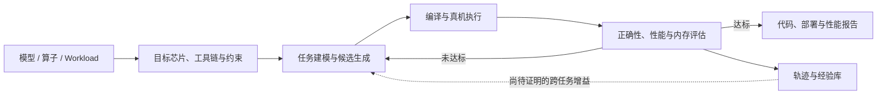

# 智子芯元（KernelCAT）BP：项目机制、证据审计与投资判断

> 生成时间：2026-08-06  
> 查询：看看智子芯元这个项目  
> 源材料：`智子芯元BP_谨呈蔚来资本.pdf`，16 页；封面口径 2026.06  
> 文件校验：SHA-256 `e85350593b2b299e42bad4aff726be59b7c40c176c4b82fca99e8a16087a7b5b`  
> 评分更新：2026-08-07，使用《AI 应用项目投资判断框架 V1》，SHA-256 `aa367e27a3eeb9ae96f05ac7a0f330b888e398c2b4ab2404dcc2f1a4322beb4e`  
> 证据边界：逐页审阅 BP，并核验公司官网、产品文档、CANN 官方仓、论文、机构/政府页面与融资公告。BP 自述、外部事实、系统推断和缺失证据分别标注。本报告不等于投资建议。

## 0. Framework V1 锁定评分

> **暂评分 55/100，基础分 56.1；合理区间 30–80；S0 探索期；证据覆盖率 51%，置信度低；五项门槛为 0 通过、2 有条件通过、3 待验证、0 否决。当前建议：继续尽调 / 等待关键里程碑。**

`55` 是项目相对 S0 同阶段公司的质量暂评分，不是投资成功概率，也不是估值判断。两个 CANN 官方代码 artifact 使它明显强于纯 BP 项目；但非关联付费、续费、完整单位经济、跨客户数据权利和可复现 benchmark 仍未成立，因此不能进入“条件性投资推进”。

### 0.1 项目定位卡

| 字段 | 当前判断 | 证据边界 |
|---|---|---|
| 客户类型 | Mid-market / Enterprise、Government / Institution、Embedded / OEM | 芯片厂、云/AIDC、模型厂、集成商与企业基础设施团队是合理买家；实际付费结构未核 |
| 实际使用者 | 算子、模型部署、性能和芯片软件栈工程师 | Kerminal 产品与公开代码支持 |
| 受益者 | 芯片厂缩短生态建设周期；企业降低适配和性能工程成本 | 有公开适配产物，客户 ROI 未复算 |
| 购买决策者 / 预算拥有者 | 芯片生态负责人、CTO、AI Infra 或算力运营负责人 | 系统推断；BP 没有采购与预算明细 |
| 最终付款者 | 芯片厂、AIDC/云、模型/企业客户 | BP 描述项目、私有化和结果分成，现金证据缺失 |
| AI 出错责任 | 当前应由交付工程师与客户验收人承担 | 没有错误分级、SLA、回滚和责任协议 |
| 应用范围 | 计算研发 Functional Vertical，并受芯片行业深度约束 | 不是通用办公 Agent，也不是芯片设计 |
| 核心价值 | 效率提升、人力/外包替代、算力成本与上市时间改善 | 算子级收益有实例，端到端 ROI 未证明 |
| 自主程度 | `Copilot → Agent`；真机 verifier 闭环，仍有人类验收 | BP p.11 自报人工介入 1 次，不是完全无人值守 AI Worker |
| 工作流位置 | 多步骤性能工程工作流 / 早期 System of Action | 可读写、编译、执行和 profile；尚非客户核心 System of Record |
| 商业模式 | AI 服务化交付 + 私有化；未来按用量/license/结果收费 | 当前更像项目收入，标准软件收入未证 |
| 实际阶段 | **S0 探索期（技术侧 S0+）** | 有真实产品与官方代码产物，但无可核付费试点、生产客户、续费或 cohort；不能升 S1 |

### 0.2 十维评分表

按 S0 固定权重计算；3 分代表达到探索期合理标准。完全缺失项以 `U=2.5` 中性占位，不把未知偷换为通过或失败。

| 维度 | S0 权重 | 质量分 0–5 | 证据 | 加权贡献 | 判断 |
|---|---:|---:|---:|---:|---|
| 客户需求与价值真实性 | 20 | 2.5 | E2 | 10.0 | 国产异构芯片性能工程痛点和任务真实，官方仓采用证明结果有使用价值；但无非关联付费、预算、痛点成本和复购 |
| 市场空间与行业结构 | 12 | 3.0 | E2 | 7.2 | 软件生态缺口和采购窗口真实；但 `1.8 万亿 × 5%–20%` 不是可服务软件 TAM，原厂既是渠道也是替代者 |
| 产品与工作流嵌入 | 10 | 3.5 | E3 | 7.0 | Kerminal 可见，CANN 官方仓存在 KernelCAT 生成/适配代码，真机闭环超过普通 S0 原型；客户日常渗透未知 |
| AI 效果与可托付性 | 12 | 2.5 | E2 | 6.0 | 有正确代码与局部性能结果；但 benchmark 有数学/口径异常、基线偏弱，无隐藏盲测、失败分布和生产 SLA |
| 留存、PMF 与扩张 | 4 | 2.5（U） | E0 | 2.0 | 无活跃 cohort、第二 workload、续费或扩容数据 |
| GTM 可复制性 | 4 | 2.5 | E1 | 2.0 | 研究院、CANN 与芯片厂关系提供冷启动；无非创始人漏斗、销售周期和 POC→回款转化 |
| 收入质量与单位经济 | 4 | 2.5（U） | E0 | 2.0 | 无售价、现金收入拆分、工程人时、模型/硬件成本、返工、支持和贡献毛利 |
| 标准化与规模复制 | 3 | 2.5（U） | E1 | 1.5 | CLI/Skills 有标准化形态；项目是否仍靠核心专家逐单交付未知 |
| 护城河与外部依赖 | 11 | 2.0 | E2 | 4.4 | 真机 testbed、OR 与轨迹有潜力；原厂工具、通用 Agent、外部模型、数据授权和 IP 归属压制当前壁垒 |
| 团队与组织执行力 | 20 | 3.5 | E2 | 14.0 | 论文、优化能力、融资和官方代码落点较强；全职、商业组织、履历口径、顾问投入与公司 IP 待核 |
| **合计** | **100** |  |  | **56.1 → 展示为 55/100** | **好坏混合，核心商业与平台假设尚未成立** |

计算：

```text
基础分 = 20 × Σ（S0 权重 × 单项质量分）÷ 100
       = 56.1
展示分 = 最接近的 5 分档
       = 55/100
```

### 0.3 证据覆盖率与合理区间

本次各维度证据为：产品 E3；需求、市场、AI 效果、护城河、团队 E2；GTM 与标准化 E1；留存和单位经济 E0。

```text
证据覆盖率
= 10%×80%
 + (20%+12%+12%+11%+20%)×55%
 + (4%+3%)×25%
 + (4%+4%)×0%
= 51.0%
```

覆盖率低于 55%，且需求付费、单位经济和数据权利 Gate 只有 E0/E1，所以置信度为**低**。按 V1 的 `E3 ±0.5 / E2 ±1 / E1 ±1.5 / E0 取 0–5` 汇总，原始区间为 `34.0–78.2`；向外取整至 5 分档后为 **30–80**。区间宽表示几份高信息量材料就可能显著改变结论，不表示真实项目会随机落在两端。

### 0.4 五项核心门槛

| 核心门槛 | 状态 | 证据 | 当前裁决 | 升级条件 |
|---|---|---:|---|---|
| 需求与付费真实性 | **待验证** | E1 | 行业痛点和公开任务真实，但“规模营收”、客户与订单仍是 BP 口径 | 三家非关联客户合同、发票、到账、验收；至少一家自然续费或第二 workload |
| 核心技术与生产可托付性 | **有条件通过** | 单点 E3；通用性 E1–E2 | CANN 官方代码证明能完成具体任务；泛化、严重错误、人工介入和 SLA 未证 | 两芯片、三类未见任务冻结盲测；hidden correctness ≥95%、零 silent corruption，并披露全部失败 |
| 完整单位经济 | **待验证** | E0 | 无每任务/客户完整成本、定价、贡献毛利和 cohort 改善 | 最近 20 次交付逐单重建收入、工程人时、模型/硬件、返工、支持与毛利 |
| 合法运营、IP、数据权利与责任 | **待验证** | E1 | 公司主体真实；论文/前职/合作代码、客户源码和 200 万轨迹的商业权利未穿透 | assignment/license、开源合规、客户训练授权、隔离/删除、on-prem 审计闭环 |
| 诚信与数据真实性 | **有条件通过，偏红** | E2 | AM/GM、CANN-Bench、XXT、mHC、AceGPT 和部分履历口径存在异常；尚无故意造假证据 | 交付 raw benchmark、统计脚本、完整 roster、顾问协议、融资交割与 cap table，并书面解释差异 |

门槛统计：**0 通过 / 2 有条件通过 / 3 待验证 / 0 否决。** 因关键门槛存在 E0/E1，Framework 的决策上限是“继续尽调 / 等待验证”，不能被 55 分或融资机构翻转。

### 0.5 一票否决审计

当前没有已确认的一票否决。以下任一被 E3/E4 文件级证据坐实，应停止推进：

1. benchmark、客户、收入、核心履历或生产日志存在故意伪造；
2. 核心代码、论文成果或轨迹数据无法取得可商业化授权，且不可替代；
3. 200 万条轨迹含客户机密却无训练权、隔离和删除路径；
4. 达到客户最低质量后，完整交付成本仍长期高于可接受价格，且人工无法下降。

### 0.6 上调、下调与情景

| 情景 | 会看到什么 | 项目形态 | 评分/动作 |
|---|---|---|---|
| 谨慎 | benchmark 无法复现；付费是关联/免费合作；人时随收入线性增长；IP/数据不可用 | Agent 增强的性能工程外包 | 下调至约 35–45；若确认造假或无合法路径则否决 |
| 基准 | 公开 artifact 真实，但通用性、客户和经济性仍未知 | 有技术资产的 S0 性能工程工具/服务 | **当前 55；继续尽调 / 等待里程碑** |
| 乐观 | 盲测胜出，三家现金客户、一次续费，后续 cohort 人时下降且毛利为正，数据/IP 完整 | 标准化跨芯片性能工程基础设施 | 升至 S1 后按 S1 权重重算，可能进入 65–75 与条件性推进 |

最强上调触发器：

1. 同预算对比资深工程师、通用 Agent 和原厂工具，端到端收益 ≥10% 或工程人时下降 ≥50%，同时 hidden correctness ≥95%、零 silent corruption；
2. 三家非关联客户完成现金回款与验收，其中至少一家自然续费/采购第二 workload，且后续项目贡献毛利改善；
3. 完成核心 IP/轨迹授权，并用冻结模型消融证明专有轨迹或 OR 模块能提高未见任务成功率或降低总成本。

最强下调触发器：

1. raw code、commit、环境和统一预算无法复现 BP benchmark，或隐藏测试出现严重错误；
2. 同预算通用 Agent/原厂工具达到相近结果，核心专家仍深度参与超过 20%的生产任务；
3. 客户实为免费/关联合作、无第二 workload，或核心 IP/轨迹不能归属并跨客户合法使用。

### 0.7 交易吸引力

**当前不评分。** BP 没有本轮估值、融资额、持股、清算权、现金、burn、runway 和退出假设。55 分只说明项目质量值得花资源继续核验；若交易价格已经资本化“通用计算平台、200 万轨迹、1T 模型与千亿 TAM”，交易可能仍不吸引。现阶段只能按“软件增强的性能工程服务”承销，平台与数据飞轮期权先按零计。

## 结论先行

**值得继续 DD，但当前只能给“黄灯偏绿”，不适合仅凭 BP 做投资决策。**

这个项目不是芯片设计公司，也不是已经成熟的通用 AI 编程平台。它真正做的是：用 KernelCAT / Kerminal 把**国产及异构芯片上的算子开发、模型迁移和性能优化**做成一个带真实硬件反馈的 AI Agent 闭环。

项目比普通概念型 BP 强，原因是：

1. 痛点真实。芯片“能运行”到“性能可用”之间，确实有大量算子、框架、编译、调度和 profiling 工作。
2. 团队的运筹优化、LLM、kernel 和工程背景有可核验的论文积累。
3. CANN 官方仓确有由 KernelCAT 自动生成的 mHC 算子，以及由它完成的 DeepSeek-OCR-2 适配记录，说明系统至少真实产出过可合入代码，而不只是 demo。

但当前材料还不能证明三件决定投资价值的事：

1. **benchmark 可复现**：BP 的 KernelBench 表存在算术均值低于几何均值的口径异常，CANN-Bench 的“综合正确率”也无法由失败数直接复算。
2. **客户与商业成立**：BP 没有客户合同、收入、回款、ACV、毛利、复购、销售周期或交付人天；目前更像“使用内部 Agent 提效的高端性能工程服务”。
3. **平台与数据壁垒成立**：1,000+ 用户、200 万条轨迹、跨芯片泛化和“自进化飞轮”均缺 schema、授权、消融和 held-out uplift。

因此，最准确的阶段判断是：**已有真实技术 PoC 与早期 design-partner 交付，尚未证明标准化软件产品和规模化商业模式。**

## 一、它实际在卖什么

### 一句话产品本质

> 把性能工程师针对特定模型、算子和芯片的“写代码—编译—真机运行—profiling—修正”循环，部分自动化成可持续搜索的 Agent。

### 真实输入、处理和输出

| 环节 | 实际内容 | 当前证据边界 |
|---|---|---|
| 用户输入 | 模型/算子/workload、目标芯片与工具链、已有代码和文档、正确性/时延/吞吐/显存等约束 | BP 与公开产品均支持这一定位 |
| 任务建模 | 规划任务，表示算法/调度搜索空间，选择 evolution、RL、MILP、非凸或 Bayesian optimization 等方法 | BP 架构完整，但各模块是否已产品化未知 |
| 候选生成 | 生成 kernel、算子、框架迁移或配置候选 | CANN 官方仓存在真实生成代码 |
| 验证反馈 | 编译、在目标硬件运行、检查正确性、profile 性能，再反馈迭代 | 这是项目相对普通 coding agent 最有价值的机制 |
| 交付物 | kernel/算子代码、模型/框架适配、构建与调优配置、性能/正确性报告 | 已有公开代码案例；标准化交付格式和 SLA 未披露 |
| 经验沉淀 | 保存任务、代码、运行、性能和修正轨迹，声称用于后续自进化 | 只有 200 万条自报数量，无数据定义、权利与 uplift |



### 谁使用、谁付钱

- 使用者：算子工程师、模型部署/性能工程师、芯片软件栈工程师。
- 经济买家：芯片厂生态负责人、云/AIDC CTO、模型厂商、集成商和企业 AI 基础设施负责人。
- BP 当前可辨认的收入形态：项目制适配与调优、企业私有化/一体机、AIDC 结果分成。
- BP 没有证明的收入形态：标准 SaaS、按 seat/芯片/任务计费的 license、可重复的自助平台收入。

[Kerminal 官方文档](https://docs.kerminal.cn/quick-start/product-overview)把产品描述为可在本地读取、修改、运行和测试代码的 CLI 编程助手，并支持 Skills、`AGENTS.md` 与 MCP。公开产品面还包含 [KerWork](https://kerwork.cn/) 通用桌面助手；BP 未解释 Kerminal 与 KerWork 的团队、预算、客户和数据是否共享，因此存在焦点分散风险。

## 二、哪些能力已经被外部证据支持

### 1. 真实公司与融资：基本坐实，但交易细节未证

[首程控股 2026-06-22 港交所公告](https://www1.hkexnews.hk/listedco/listconews/sehk/2026/0622/2026062200064_c.pdf)明确写到投资“智子芯元（深圳）科技有限责任公司”，并将其定位为 AI、运筹优化与算子自动发现方向。公开报道也支持公司自 2025-11 至 2026-06 完成种子、天使和天使+三轮融资的时间线。[投资界报道](https://news.pedaily.cn/202606/565451.shtml)

这只能证明融资事件和机构关系，不能证明 BP 未披露的金额、估值、到账、cap table、清算权或当前 runway。

### 2. CANN mHC 算子：这是目前最硬的公司技术证据

[CANN 官方 `ops-transformer` 仓库的 mHC experimental 目录](https://gitcode.com/cann/ops-transformer/tree/3f90a9f308bfa3aa4cef9772e7183acfb75dc583/experimental/mhc)明确注明相关 AscendC 算子由智子芯元 KernelCAT 生成，并披露 CANN 8.3/8.5、Ascend 910B2 等测试环境及相对 `torch.einsum` 的速度数据。

这证明 KernelCAT 能产出通过官方仓审核的代码；但边界也很清楚：

- 任务是边界明确的静态 tensor contraction，不等于任意模型/算子都能自动优化。
- 基线是 `torch.einsum`，2–52 倍的峰值不能直接等同于相对手写 SOTA kernel 或端到端模型收益。
- 当前生产目录已有后续芯片支持和原厂工程改进，不能把现行完整实现都归为智子芯元独占成果。

### 3. DeepSeek-OCR-2 适配：证明可交付，尚不证明通用 SOTA

[CANN 官方 `cann-recipes-infer` README](https://gitcode.com/cann/cann-recipes-infer/blob/master/integration/vllm/deepseek-ocr-2/README.md)写明该适配任务由 KernelCAT 智能体自动化完成，并给出环境、代码修改与推理方式。[深圳市发改委转载的案例](https://fgw.sz.gov.cn/ztzl/qtztzl/szscjmyjjfzzhfwpt/mqfc/myqyfzdt/content/post_12691408.html)进一步提到 38 分钟完成适配和推理验证。

但官方仓没有提供与人工、通用 coding agent 或原厂工具的冻结对照；公开实现主要复用现有 vLLM-Ascend 能力。因此它证明“能自动完成一次真实适配”，不证明“普遍比专家更快、更好”。BP p.11 还写了人工介入 1 次，与“全自主”口号应区分。

### 4. 合作机构效果：有增量证据，但仍不是独立客户证据

[深圳河套学院文章](https://www.slai.edu.cn/article/401)披露了与智子芯元、昇腾等合作的模型适配/调优结果：500+ 模型适配，并在 7 个代表性模型上报告平均 P50 latency 降低 18.4%、吞吐提升 23.3%、最大提升 64.6%。

这比 BP 单页案例更接近实际效果，但仍是合作方联合叙事，不是非关联付费客户的盲测或验收。它也提示典型端到端收益可能更接近 18%–23%，而非 BP 标题中的 35x/60x 峰值。

### 5. 团队研究能力：部分真实，必须与公司 IP 分开

- [Adam-mini](https://arxiv.org/abs/2406.16793)支持减少约 50% optimizer memory、个别场景吞吐提升 49.6%的论文结果，并包含丁天等作者。
- [ReMax](https://arxiv.org/abs/2310.10505)包含林志航，且公开 [verl 实现](https://github.com/volcengine/verl/blob/main/verl/trainer/ppo/core_algos.py)包含 ReMax 相关算法。
- [RXTX / XXT 论文](https://arxiv.org/abs/2505.09814)包含罗智泉等作者，支持相对既有最优算法约 5%的算术操作减少。

这些证明团队成员过去做过相关工作，不自动证明论文代码、专利、训练数据或商业权利已完整归属公司。

团队页还存在需要穿透核验的履历口径。BP 将林志航写作西湖心辰 CTO/合伙人，并关联 AceGPT 100B、2,000 张 910A 与 HuatuoGPT；但[港中大（深圳）2023 年活动页](https://sds.cuhk.edu.cn/en/event/963)写的是“算法总监、合伙人”，[SRIBD 的 AceGPT 页面](https://www.sribd.cn/article/1242)列出的公开版本为 7B/13B/32B/70B，[AceGPT](https://arxiv.org/abs/2309.12053)与[HuatuoGPT](https://arxiv.org/abs/2305.15075)论文作者表也没有林志航。这不排除未署名的工程贡献，但 BP 中的负责人、模型规模和职级需要前雇主/项目材料证明。“近半研发为 IMO/ICPC 金牌”同样需要完整 roster、年份与官方获奖记录。

## 三、BP 关键主张的证据矩阵

| BP 主张 | 当前判断 | 证据与缺口 |
|---|---|---|
| KernelCAT 能自动产出国产芯片代码 | **外部支持** | CANN 官方 mHC 与 DeepSeek-OCR-2 仓库记录；边界是少量公开案例 |
| 10 个月完成 3 轮融资 | **基本支持** | 最新轮有港交所公告；轮次时间线可查，金额、估值、到账未披露 |
| 团队具备 LLM、OR、kernel 研究能力 | **部分支持** | Adam-mini、ReMax、XXT 等论文可核；公司 IP/full-time 状态未知 |
| 30 分钟完成 mHC 算子 | **部分支持** | CANN 仓证明代码，BP/政府页面提供时间；缺冻结录像、日志与对照 |
| KernelBench SOTA、正确率 100% | **未独立验证且口径异常** | 无 commit、完整协议、raw results；官方仓不为自报结果背书 |
| CANN-Bench 综合正确率 88.8% | **不可复算** | 53 项失败 1 项并不直接等于 88.8%；公式未披露，公开榜也未提供可核记录 |
| 1,000+ 用户、200 万条国产芯片轨迹 | **公司自述** | 无任务/step 定义、活跃与付费、去重、授权、标签、训练消融 |
| 多芯片验证 | **部分支持** | 有公开昇腾代码；其他 logo 不等于客户、认证或成功部署 |
| 35x/60x/2x、内存 -70%、速度 +50% | **不可比较** | 缺绝对数、硬件/软件版本、shape/batch、基线、端到端范围和失败样本 |
| 已形成规模化营收 | **未证明** | BP 无合同、收入、回款、毛利、续约、销售周期或交付人天 |
| 软件价值市场为千亿级 | **假设** | `1.8 万亿元 × 5%–20% = 900亿–3,600亿元`；5%–20% 无依据，低端不足 1,000 亿元 |
| XXT 复杂度降低 10%、击败 DeepMind | **表述压缩/失真** | 论文整体结果约 5%；4×4 个例约 10%。[港中大（深圳）说明](https://sds.cuhk.edu.cn/article/2180)还明确指出 DeepMind 没有报告 XXT 结果 |
| 罗智泉为首席技术顾问及联合研发资源 | **待文件核验** | 需顾问协议、投入时间、引用授权、SOW 与成果/IP 分配 |

## 四、benchmark 与数字审计

### 1. KernelBench 表存在硬数学问题

BP p.13 对 KernelCAT 给出：正确率 100%、平均速度 211.9%、几何平均速度 288.5%；EvoKernel 给出 131.4% 与 234.9%。

若两列对同一组正 speedup ratio 计算，算术平均值必然不低于几何平均值。表中关系相反，至少意味着：

- 两列不是同一任务集/分母；或
- 一个字段并非“平均速度”；或
- 计算、标签或抄录有误。

[KernelBench 官方仓](https://github.com/ScalingIntelligence/KernelBench)的 canonical 指标是 `fast_p` 等，且明确不验证或背书第三方自报结果。公司必须提供 commit、任务清单、每题 raw result、失败/超时规则、统计脚本和环境，才能恢复可信度。

### 2. CANN-Bench “综合正确率”与失败数无法直接对齐

BP p.13 写 53 项、KernelCAT 失败 1 项。如果只是 task pass rate，应为 `52/53 = 98.1%`，而不是 88.8%。其他方法同样不匹配。可能原因是 88.8% 实际为编译、功能和性能的加权综合分，但 BP 将它标成了“综合正确率”。

[CANN-Bench 论文](https://arxiv.org/abs/2607.20518)在 2026-07 才公开 53 个算子、1,060 个测试案例及 public/hidden split，并称公开 leaderboard 后续推出；这晚于 BP 的 2026.06 口径。公司可能使用了早期内部版本，但投资人当前无法通过公开榜独立复核 BP 排名。

### 3. 多个 headline 使用弱或不完整基线

- mHC 的 24–52x 等峰值主要相对 `torch.einsum`，不是相对最优手写 kernel。
- 38 分钟适配没有人工、通用 Agent 和原厂工具的同任务对照。
- 35x、60x、20 万倍等数字缺问题规模和同硬件基线，可能混合算子级、端到端、CPU→GPU 或弱 baseline。
- “2020 到 2030 算力同比增长 4,000 倍”实为约 4,114 倍的十年预测，不是同比。

### 4. “系统性验证”尚未达到可投资证据标准

BP 有架构图、终端截图、汇总表和 logo，但没有：

- 冻结版本与可重复环境；
- 预注册任务和 hidden tests；
- 完整正确性覆盖、失败样本和回滚记录；
- 总 wall-clock、模型/API/Koin、硬件与人工成本；
- 相对专家、通用 coding agent、原厂工具的公平对照。

## 五、技术价值、护城河与战略边界

### 真正成立的技术价值

1. **硬件在环 verifier**：kernel/适配任务可编译、运行、测正确性和性能，比纯文本 Agent 更容易形成客观反馈。
2. **OR + search 的合理组合**：这类问题不是只靠一次 LLM 生成；结构搜索、参数寻优和约束建模有实际价值。
3. **国产异构生态的短期窗口**：工具链碎片、CUDA 迁移和生态补齐创造真实预算。
4. **跨项目经验若可合法复用，可能形成数据资产**：前提是轨迹带有任务、代码、硬件、profile、正确性和最终结果，并能证明跨任务 uplift。

### 可能形成护城河的条件

护城河不应表述为“1T 模型”或“200 万条日志”，而应被证明为：

`跨芯片硬件接入 + 高质量验证环境 + 可授权结果轨迹 + held-out 泛化 + 低人工标准交付 + 芯片厂/客户分发`

任何一环缺失，数据量都可能只是不可复用的项目日志。

### 最强反命题

> 智子芯元最终可能不是一家高毛利软件平台，而是一支稀缺专家团队，借内部 Agent 把性能优化服务做得更快。

这个反命题成立的路径包括：

- 每个新芯片/客户仍需大量手工接入、补 verifier、处理私有工具链和边缘 case；收入随工程师线性增长。
- 芯片原厂掌握文档、编译器、硬件与客户分发，可能把相邻能力内建进自有工具链。
- Triton、TileLang、TVM/Ansor、TorchInductor、通用 coding agent 和开源 kernel agent 持续吸收相邻能力。
- 客户代码与轨迹因 IP/保密条款不能跨租户训练，数据飞轮被切断。
- 为证明能力而持续向官方仓开源，又会削弱独占 IP；不开源则更难建立可信 benchmark。
- Kerminal 与泛用 KerWork 同时扩张，稀释芯片性能工程这一稀缺 wedge。

### 竞争不是另一家同名创业公司，而是四类替代

| 替代类型 | 代表 | 对智子芯元的压力 |
|---|---|---|
| 芯片厂内建工具 | CANN、摩尔线程 MUSA | 原厂掌握编译器、硬件计数器、私有文档、客户与版本路线；摩尔线程已公开 [MusaCoder](https://www.mthreads.com/news/318) 等相邻能力 |
| 开源 Kernel Agent | [PyTorch KernelAgent](https://pytorch.org/blog/kernelagent-hardware-guided-gpu-kernel-optimization-via-multi-agent-orchestration/) 等 | 已公开 generation—compile—profile 闭环和可复现基线，削弱“Agent 自动写 kernel”本身的独占性 |
| 编译器/autotuning | Triton、TileLang、TVM/Ansor、TorchInductor | 免费且生态内置，客户会先用它们解决标准任务；KernelCAT 必须证明非标准算子和跨芯片的增量 |
| 人工性能团队 | 芯片厂、云厂、模型厂与集成商 | 若 KernelCAT 仍依赖专家选方向、修复和验收，商业形态会回落为 Agent 增强的工程服务 |

独立平台成立的关键，不是“会不会生成代码”，而是能否比原厂/开源工具更快接入新芯片，并在不泄露客户 IP 的前提下把经验跨任务复用。

### “1T+ / 200B 模型”不是已证壁垒

BP p.10 写规划模型 1T+、代码执行模型约 200B，p.14 又称“自训练混合模型”。在公司成立约 10 个月的背景下，更合理的待核问题是：它是否在编排外部/开源基础模型，以及自训练究竟指 full training、fine-tuning、router 还是 trajectory selection。

需要披露基础模型、权重/API 所有权、license、每任务 token/Koin/硬件成本，以及上游模型变化时性能是否稳定。否则模型规模可能是成本和供应依赖，不是资产。

## 六、商业判断

### 当前更像什么

`芯片/企业的性能优化项目 → 工程师使用 KernelCAT 提效 → 交付代码与性能结果 → 收项目费或私有化费`

这条路径本身可以成为好生意，但与 BP 暗示的“可规模复制、自进化平台”不是同一估值逻辑。

### BP 缺失的最重要经营数据

- 客户总数、付费客户数、合同额、回款与收入确认；
- 项目/软件/一体机/结果分成的收入拆分；
- ACV、销售周期、POC→合同转化、复购/第二 workload；
- 每个项目的工程师人天、模型/API/Koin、硬件占用与总毛利；
- 新客户、新芯片 onboarding 时间是否随 cohort 下降；
- 当前现金、monthly burn、runway、本轮融资金额/估值/用途。

### 面向蔚来资本还缺一层场景证明

BP 是“谨呈蔚来资本”，但没有展示汽车/车端专属能力。若要形成产业协同，至少需要：

- 蔚来真实模型与车/边缘芯片上的窄场景 pilot；
- hard real-time、deterministic latency、功耗/热约束和长周期支持；
- 编译器/算子变更的安全验证、回归、rollback 与 traceability；
- ASPICE、ISO 26262、供应链和量产维护责任边界。

## 七、90 天高信息量验证方案

| 门槛 | 最小验证动作 | 通过标准 | 失败意味着什么 |
|---|---|---|---|
| 盲测复现 | 投资人预先冻结 3 个未见 workload、2 类芯片；对比资深工程师、通用 coding agent、原厂工具与 KernelCAT | hidden shape/dtype 全正确；披露首个正确解时间、最终端到端性能、总人工/模型/硬件成本；至少 2/3 任务有统计显著优势 | headline benchmark 不可信或优势只在已见任务 |
| 客户真值 | 抽查 3 家非关联付费客户的合同、发票、银行回款、验收与使用日志；至少一份续约/第二 workload | 每个 logo 的关系清晰，客户能独立说明基线、结果和继续采购原因 | 仍是合作/免费 POC/生态 logo，不是需求证据 |
| 单位经济 | 按项目披露工程师工时、模型/API/Koin、硬件、交付周期、总毛利 | 后续 cohort 的交付人天下降，软件/复用贡献上升，毛利不是靠隐藏人力 | 本质是线性专家服务 |
| 数据飞轮 | 冻结模型，在未见芯片/任务上做 `0 / 10 / 100` 条相似轨迹消融 | 随合规轨迹增加，成功率或成本稳定改善，并通过 contamination 检查 | 200 万条只是日志数量，不是可复用资产 |
| IP/数据权利 | 核个人、大学、前雇主、河套/华为、客户的 assignment/license；核训练同意、隔离、删除 | 核心代码/模型/数据可商业化且跨项目使用边界清楚 | 关键资产不在公司或飞轮不能合法运转 |
| 产品聚焦 | 分拆 Kerminal/KernelCAT 与 KerWork 的团队、P&L、数据和 roadmap | 首个 ICP、核心交付物和未来 12 个月里程碑唯一且可量化 | 多产品并行耗散小团队资源 |

### 盲测必须记录的指标

1. 首个完整正确解的 wall-clock；
2. hidden shapes/dtypes/边界值的 correctness；
3. 端到端 latency、throughput、memory、energy，而不只是单 kernel；
4. 人工介入次数、工程师分钟数、失败与回滚；
5. LLM/API/Koin、编译、硬件占用和总成本；
6. 相对强基线而非 `torch.einsum` 等弱基线的收益；
7. 未见任务、新芯片和版本升级后的稳定性。

## 八、投资人最该追问的 12 个问题

1. 请解释 BP p.13 KernelBench 算术/几何均值关系，并交付 raw results 与统计脚本。
2. CANN-Bench 88.8% 的精确公式是什么？53 项失败 1 项如何得到该数？使用的版本早于公开论文还是内部 fork？
3. 三家非关联付费客户分别买了什么？合同、回款、验收、复购和当前生产使用如何？
4. 当前收入在项目服务、软件许可、私有化、一体机、结果分成之间如何拆分？
5. 每次交付的工程师人天、模型/API/Koin、硬件成本和 gross margin 是多少？
6. 200 万条数据中的“一条”是什么？多少来自生产，是否去重，多少有结果标签和训练授权？
7. 轨迹对未见芯片/未见 workload 的成功率或成本提升是多少？请给冻结模型消融。
8. Adam-mini、ReMax、XXT、AscendBridge、CANN 代码和合作项目的 IP/商业权利分别归谁？
9. Kerminal 的自研模型到底是什么？哪些是自有权重，哪些依赖外部 API/开源模型？单任务真实成本多少？
10. 每个芯片/伙伴 logo 是客户、投资人、兼容验证、联合研发、免费 POC 还是付费生产？
11. 新芯片 onboarding 需要多少工程师天？若原厂升级编译器/驱动，谁负责回归和长期支持？
12. Kerminal 与 KerWork 为什么同时做？二者是否共享同一 ICP、数据闭环和分发，否则为何不聚焦？

## 九、最终判断

### Thesis

国内异构芯片生态长期需要一层中立的 AI 性能工程系统。若 KernelCAT 能在真实硬件上闭合生成—执行—验证—优化循环，并把合规轨迹变成跨芯片、跨任务的可复用能力，它可能成为芯片软件生态中有价值的中间层。

### Anti-thesis

当前可见的真实证据也同样支持另一种解释：这是一个优秀团队用 Agent 提高交付效率，承接芯片/模型适配和性能优化项目；壁垒在少数专家和原厂关系，而不是可规模复制的软件、模型或数据飞轮。

### 当前动作

**继续技术与客户 DD，不按 BP headline 定价，也不在盲测、付费客户、IP/数据权利和单位经济四个门槛通过前进入投资决策。**

## 主要来源

- 用户提供的 `智子芯元BP_谨呈蔚来资本.pdf`，16 页；源文件保持原路径只读，未写入 `raw/`。
- [AutoKernel / KernelCAT 官方网站](https://autokernel.cn/)
- [Kerminal 官方网站](https://kerminal.cn/)与[产品文档](https://docs.kerminal.cn/quick-start/product-overview)
- [CANN mHC 官方代码目录](https://gitcode.com/cann/ops-transformer/tree/3f90a9f308bfa3aa4cef9772e7183acfb75dc583/experimental/mhc)
- [CANN DeepSeek-OCR-2 适配目录](https://gitcode.com/cann/cann-recipes-infer/blob/master/integration/vllm/deepseek-ocr-2/README.md)
- [CANN-Bench 论文](https://arxiv.org/abs/2607.20518)与[项目页](https://cannbench.com/)
- [首程控股港交所公告](https://www1.hkexnews.hk/listedco/listconews/sehk/2026/0622/2026062200064_c.pdf)
- [深圳河套学院合作文章](https://www.slai.edu.cn/article/401)
- [RXTX / XXT 论文](https://arxiv.org/abs/2505.09814)与[港中大（深圳）说明](https://sds.cuhk.edu.cn/article/2180)
- [Adam-mini](https://arxiv.org/abs/2406.16793)、[ReMax](https://arxiv.org/abs/2310.10505)

---
*由 LLM 基于用户提供的 BP 与公开资料查询生成；该源文件未收录进 raw/*
